# <a name="quickstart-create-an-azure-stream-analytics-cloud-job-in-visual-studio-code-preview"></a>Guida introduttiva: Creare un processo cloud di Analisi di flusso di Azure in Visual Studio Code (Anteprima)

Questo argomento di avvio rapido descrive come creare ed eseguire un processo di analisi di flusso usando l'estensione di Analisi di flusso di Azure per Visual Studio Code. Il processo di esempio legge i dati in streaming da un dispositivo hub IoT. Viene definito un processo che calcola la temperatura media quando supera i 27° e scrive gli eventi di output risultanti in un nuovo file nell'archiviazione BLOB.

## <a name="before-you-begin"></a>Prima di iniziare

* Se non si ha una sottoscrizione di Azure, creare un [account gratuito](https://azure.microsoft.com/free/).

* Accedere al [portale di Azure](https://portal.azure.com/).

* Installare [Visual Studio Code](https://code.visualstudio.com/).

## <a name="install-the-azure-stream-analytics-extension"></a>Installare l'estensione di Analisi di flusso di Azure

1. Aprire Visual Studio Code.

2. In **Estensioni** nel riquadro a sinistra cercare **Analisi di flusso** e selezionare **Installa** per l'estensione **Analisi di flusso di Azure**.

3. Dopo aver installato l'estensione, verificare che **Strumenti Analisi di flusso di Azure** sia visibile nelle **estensioni abilitate**.

   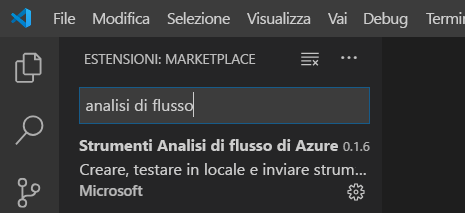

## <a name="activate-the-azure-stream-analytics-extension"></a>Attivare l'estensione di Analisi di flusso di Azure

1. Selezionare l'icona di **Azure** nella barra delle attività di VS Code. **Analisi di flusso** sarà visibile nella barra laterale. In **Analisi di flusso** selezionare **Accedi ad Azure**. 

   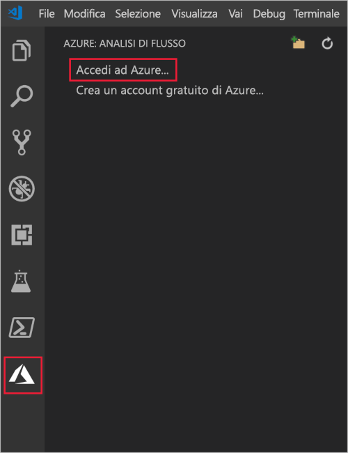

2. Quando si esegue l'accesso, viene visualizzato il nome dell'account Azure sulla barra di stato nell'angolo inferiore sinistro della finestra di Visual Studio Code.

> [!NOTE]
> Se non viene eseguita la disconnessione, la volta successiva gli strumenti di Analisi di flusso di Azure eseguiranno automaticamente l'accesso. Se l'account prevede l'autenticazione a due fattori, è consigliabile usare l'autenticazione tramite telefono anziché un PIN.
> Questo metodo risulta generalmente utile in caso di problemi relativi alla creazione di elenchi delle risorse, alla disconnessione e alla riconnessione. Per disconnettersi, immettere il comando `Azure: Sign Out`.

## <a name="prepare-the-input-data"></a>Preparare i dati di input

Prima di definire il processo di Analisi di flusso, è necessario preparare i dati, che saranno poi configurati come input per il processo. Per preparare i dati di input richiesti dal processo, completare questa procedura:

1. Accedere al [portale di Azure](https://portal.azure.com/).

2. Selezionare **Crea una risorsa** > **Internet delle cose** > **Hub IoT**.

3. Nel riquadro **Hub IoT** immettere le informazioni seguenti:
   
   |**Impostazione**  |**Valore consigliato**  |**Descrizione**  |
   |---------|---------|---------|
   |Subscription  | \<Sottoscrizione in uso\> |  Selezionare la sottoscrizione di Azure da usare. |
   |Resource group   |   asaquickstart-resourcegroup  |   Selezionare **Crea nuovo** e immettere il nome di un nuovo gruppo di risorse per l'account. |
   |Region  |  \<Selezionare l'area più vicina agli utenti\> | Selezionare la posizione geografica in cui è possibile ospitare l'hub IoT. Usare la località più vicina agli utenti. |
   |Nome hub IoT  | MyASAIoTHub  |   Scegliere un nome per l'hub IoT.   |

   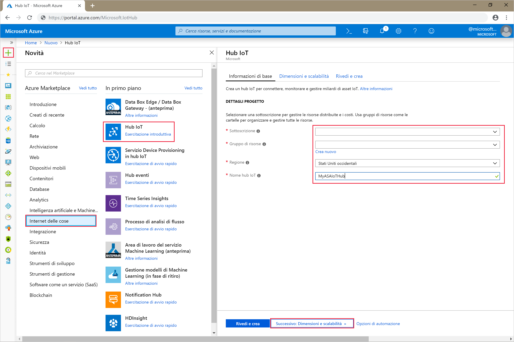

4. Selezionare **Avanti: Dimensioni e piano**.

5. Scegliere un valore per **Piano tariffario e livello di scalabilità**. Per questa guida introduttiva, selezionare il livello **F1 - Gratuito** se ancora disponibile nella sottoscrizione. Se il livello gratuito non è disponibile, scegliere il livello più basso disponibile. Per altre informazioni, vedere i [prezzi dell'hub IoT](https://azure.microsoft.com/pricing/details/iot-hub/).

   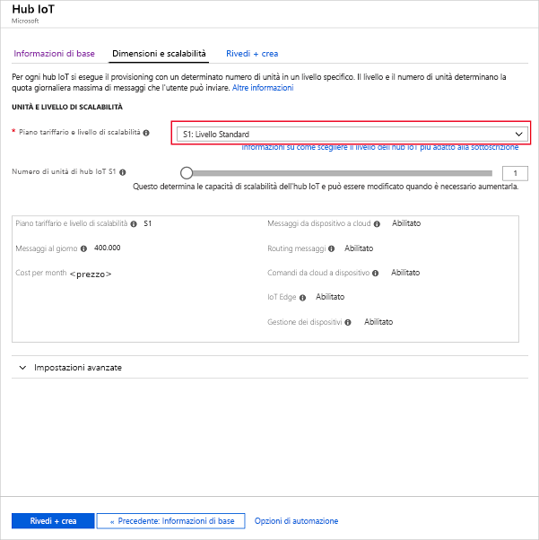

6. Selezionare **Rivedi e crea**. Esaminare le informazioni sull'hub IoT e fare clic su **Crea**. La creazione dell'hub IoT può richiedere alcuni minuti. È possibile monitorare lo stato di avanzamento nel riquadro **Notifiche**.

7. Nel menu di spostamento dell'hub IoT, fare clic su **Aggiungi** in **Dispositivi IoT**. Aggiungere un **ID dispositivo** e fare clic su **Salva**.

   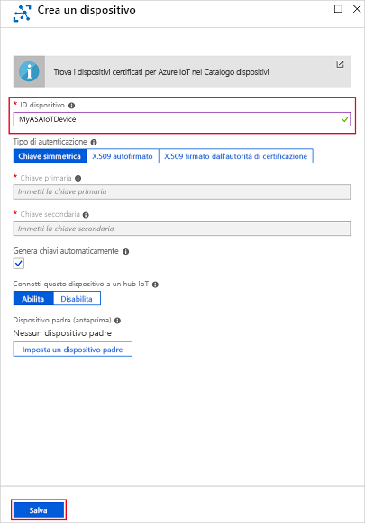

8. Dopo la creazione del dispositivo, aprirlo dall'elenco **Dispositivi IoT**. Copiare il valore di **Stringa di connessione -- Chiave primaria** e salvarlo in un Blocco note per usarlo in seguito.

   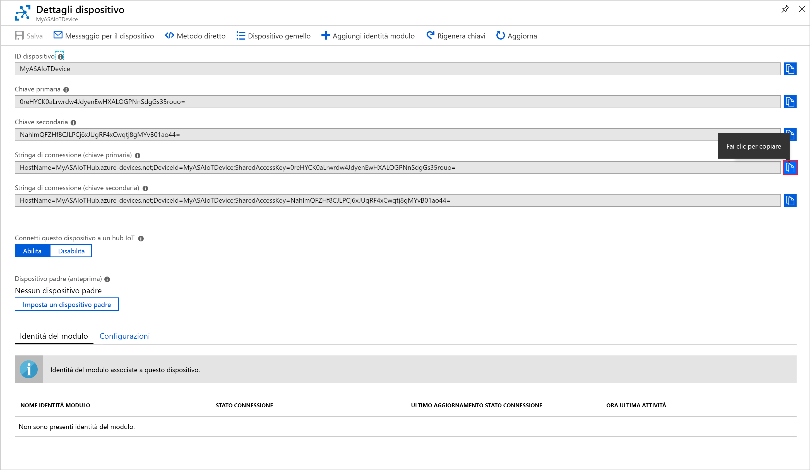

## <a name="create-blob-storage"></a>Creare l'archiviazione BLOB

1. Nell'angolo superiore sinistro del portale di Azure selezionare **Crea risorsa** > **Archiviazione** > **Account di archiviazione**.

2. Nel riquadro **Crea account di archiviazione** immettere un nome, una posizione e un gruppo di risorse per l'account di archiviazione. Scegliere la stessa posizione e lo stesso gruppo di risorse dell'hub IoT creato. Quindi fare clic su **Rivedi e crea**. per creare l'account.

   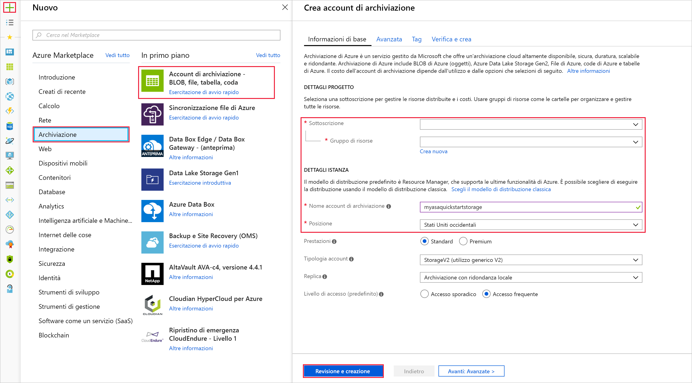

3. Dopo aver creato l'account di archiviazione, selezionare il riquadro **BLOB** nella sezione **Panoramica**.

   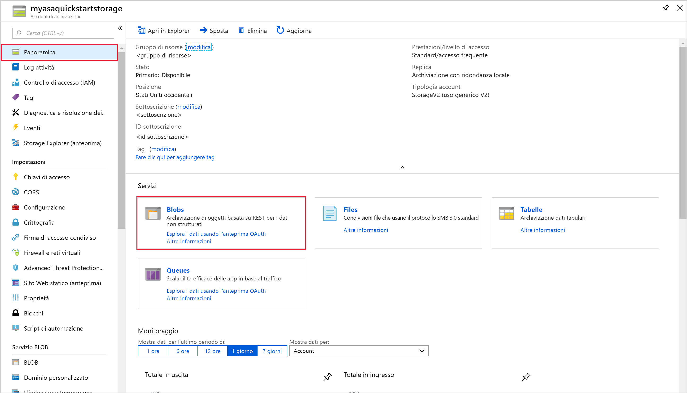

4. Nella pagina **Servizio BLOB** selezionare **Contenitore** e specificare un nome per il contenitore, ad esempio *container1*. Lasciare il **Livello di accesso pubblico** come **Privato (accesso anonimo non consentito)** e selezionare **OK**.

   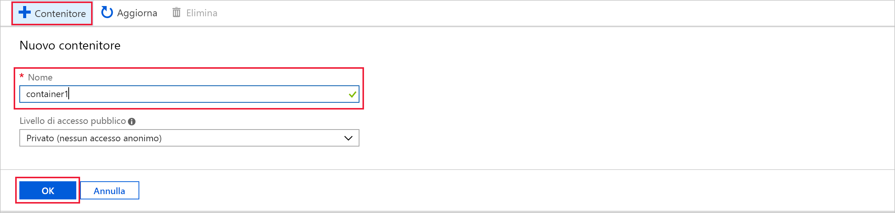

## <a name="create-a-stream-analytics-project"></a>Creare un progetto di Analisi di flusso

1. In Visual Studio Code premere **CTRL+MAIUSC+P** per aprire il riquadro comandi. Digitare quindi **ASA** e selezionare **ASA: Create New Project**(ASA: Crea nuovo progetto).

   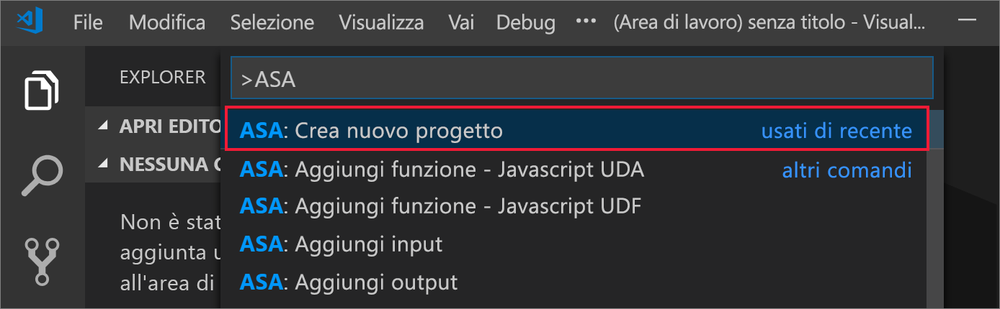

2. Immettere il nome del progetto, ad esempio **myASAproj** e selezionare una cartella per il progetto.

    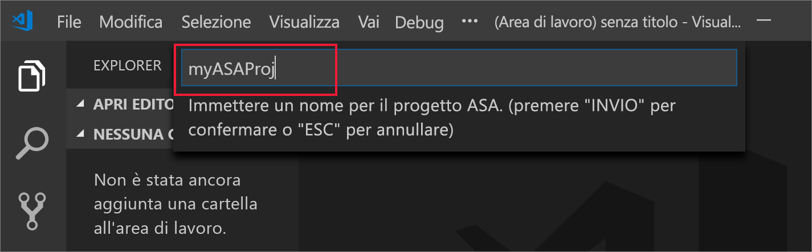

3. Il nuovo progetto verrà aggiunto all'area di lavoro. Un progetto ASA è costituito dallo script di query **(*.asaql)** , da un file **JobConfig.json** e da un file di configurazione **asaproj.json**.

   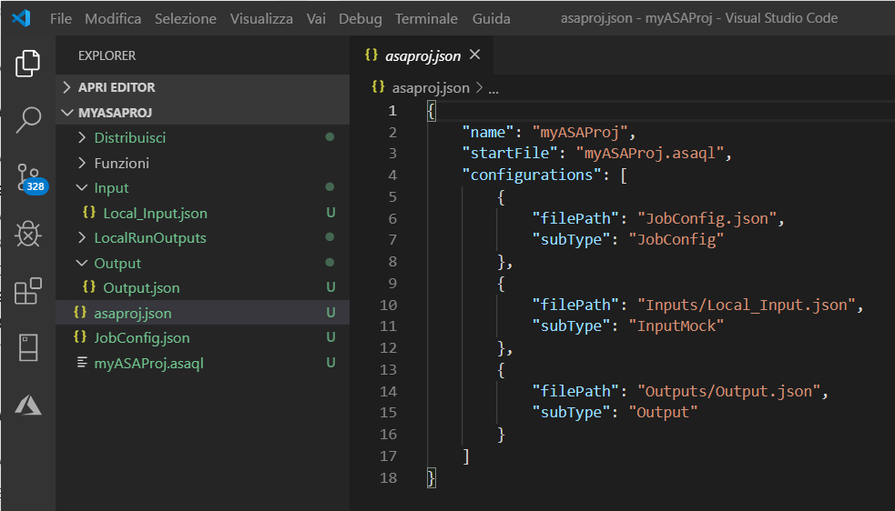

4. Il file di configurazione **asaproj.json** contiene gli input, gli output e le informazioni sul file di configurazione del processo che servono per inviare ad Azure il processo di analisi di flusso.

   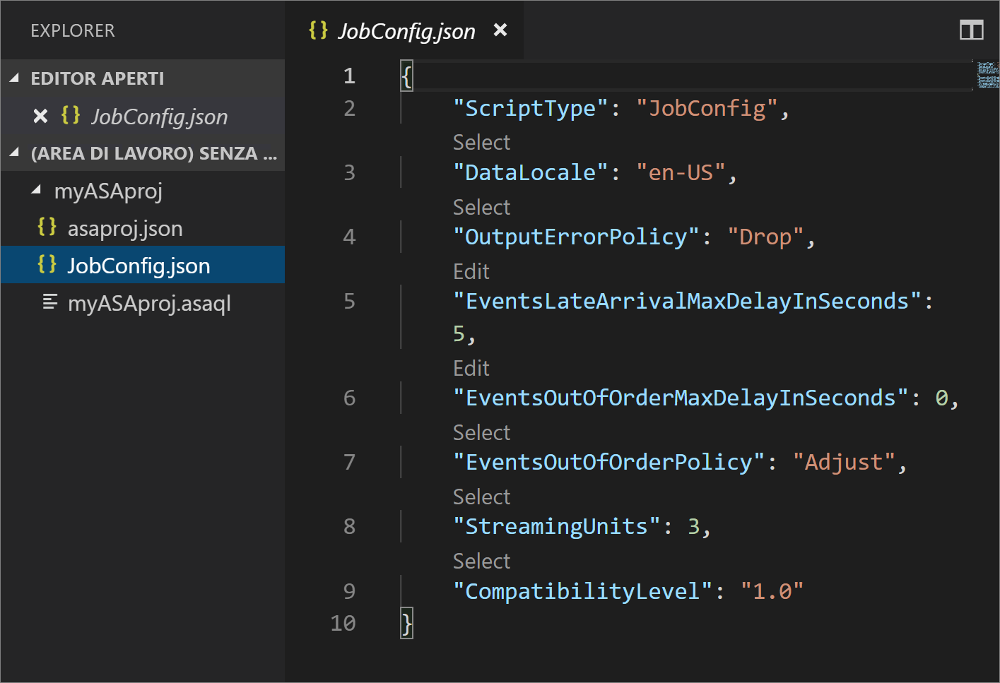

> [!Note]
> Quando si aggiungono gli input e gli output dal riquadro comandi, i percorsi corrispondenti verranno automaticamente aggiunti in **asaproj.json**. Se si aggiungono o si rimuovono direttamente gli input o gli output sul disco, è necessario aggiungerli o rimuoverli manualmente da **asaproj.json**. È possibile scegliere di inserire gli input e gli output in un'unica posizione e in seguito farvi riferimento in diversi processi, specificando i percorsi in ogni file **asaproj.json**.

## <a name="define-the-transformation-query"></a>Definire la query di trasformazione

1. Aprire **myASAproj.asaql** dalla cartella del progetto.

2. Aggiungere la query seguente:

   ```sql
   SELECT * 
   INTO Output
   FROM Input
   HAVING Temperature > 27
   ```
## <a name="test-with-sample-data"></a>Test con dati di esempio
Prima di eseguire la query nel cloud, è possibile testare la query con dati di esempio locali per verificare la logica di query.

Per altri dettagli, seguire le istruzioni riportate in [Testare con dati di esempio](vscode-local-run.md). 

 

## <a name="define-an-input"></a>Definire un input

1. Premere **CTRL+MAIUSC+P** per aprire il riquadro comandi e immettere **ASA: Add Input** (ASA: Aggiungi input).

   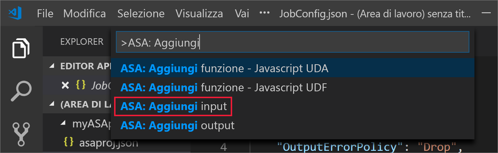

2. Scegliere **Hub IoT** come tipo di input.

   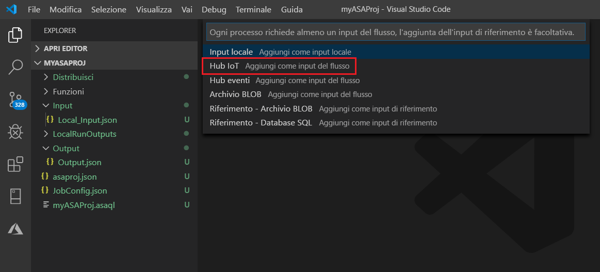

3. Scegliere lo script di query ASA che userà l'input. Verrà automaticamente popolato con il percorso file di **myASAproj.asaql**.

   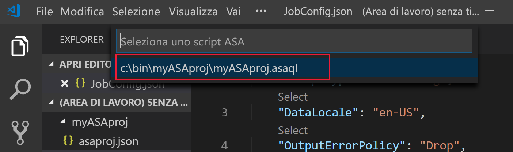

4. Come nome del file di input immettere **IoTHub**.

5. Modificare **IoTHub.json** con i valori seguenti. Mantenere i valori predefiniti per i campi non menzionati di seguito. È possibile usare CodeLens per immettere una stringa, selezionare da un elenco a discesa o modificare il testo direttamente nel file.

   |Impostazione|Valore consigliato|DESCRIZIONE|
   |-------|---------------|-----------|
   |NOME|Input|Immettere un nome per identificare l'input del processo.|
   |IoTHubNamespace|MyASAIoTHub|Scegliere o immettere il nome dell'hub IoT. I nomi dell'hub IoT vengono rilevati automaticamente se sono stati creati nella stessa sottoscrizione.|
   |SharedAccessPolicyName|iothubowner| |

   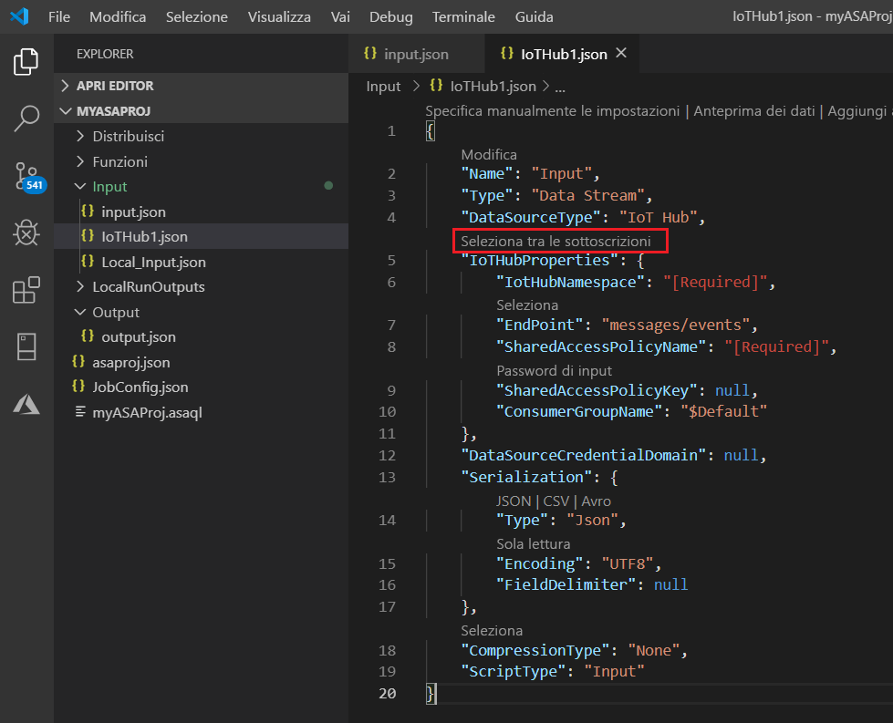


## <a name="define-an-output"></a>Definire un output

1. Premere **CTRL+MAIUSC+P** per aprire il riquadro comandi. Immettere quindi **ASA: Add Output** (ASA: Aggiungi output).

   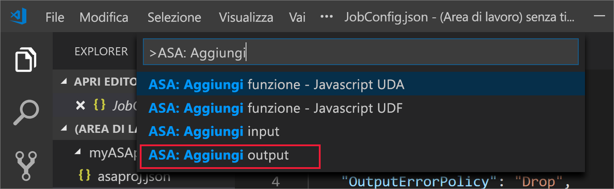

2. Scegliere **Archiviazione BLOB** come tipo di sink.

3. Scegliere lo script di query ASA che userà l'input.

4. Come nome del file di output immettere **BlobStorage**.

5. Modificare **BlobStorage** con i valori seguenti. Mantenere i valori predefiniti per i campi non menzionati di seguito. Usare CodeLens per selezionare da un elenco a discesa o immettere una stringa. 

   |Impostazione|Valore consigliato|DESCRIZIONE|
   |-------|---------------|-----------|
   |NOME|Output| Immettere un nome per identificare l'output del processo.|
   |Account di archiviazione|asaquickstartstorage|Scegliere o immettere il nome dell'account di archiviazione. I nomi degli account di archiviazione vengono rilevati automaticamente se sono stati creati nella stessa sottoscrizione.|
   |Contenitore|container1|Selezionare il contenitore esistente creato nell'account di archiviazione.|
   |Modello di percorso|output|Immettere il nome di un percorso di file da creare all'interno del contenitore.|

 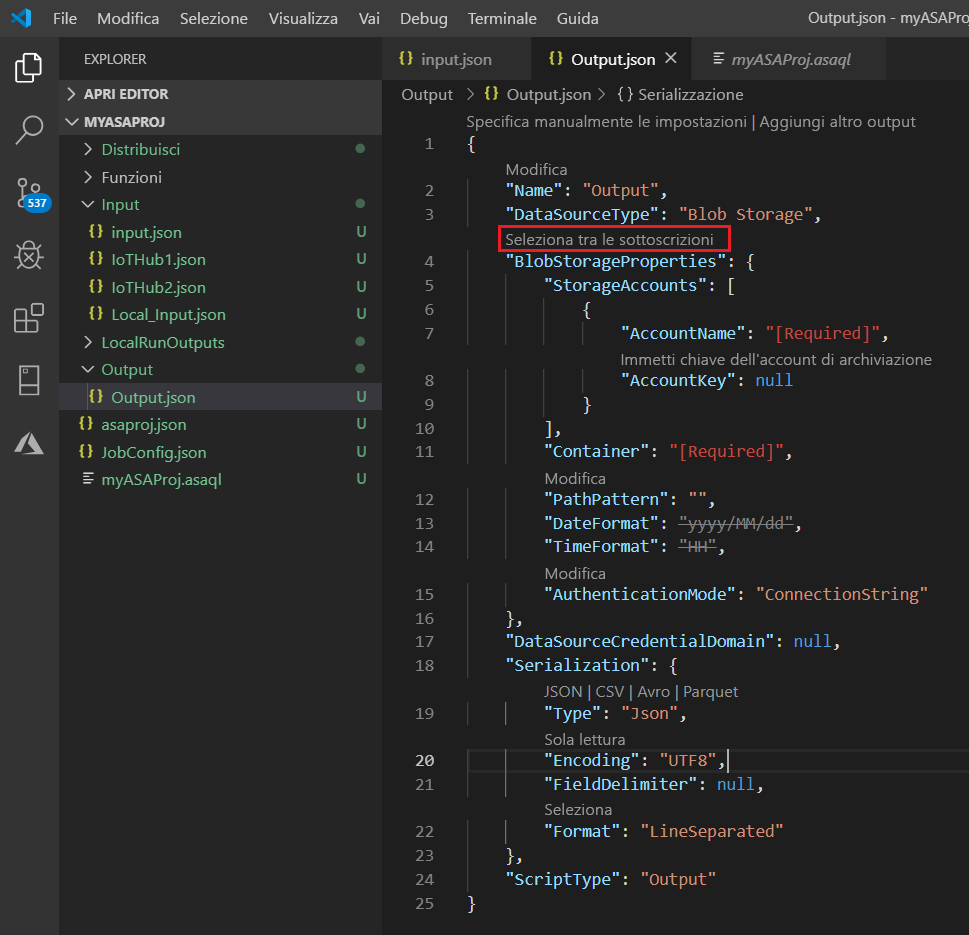

## <a name="compile-the-script"></a>Compilare lo script

Durante la compilazione dello script vengono eseguite due operazioni: il controllo della sintassi e la generazione di modelli di Azure Resource Manager per la distribuzione automatica.

Esistono due modi per attivare la compilazione dello script:

1. Selezionare lo script dall'area di lavoro e quindi attivare la compilazione dal riquadro comandi. 

   

2. Fare clic con il pulsante destro del mouse sullo script e selezionare **ASA: compile script** (ASA: Compila script).

    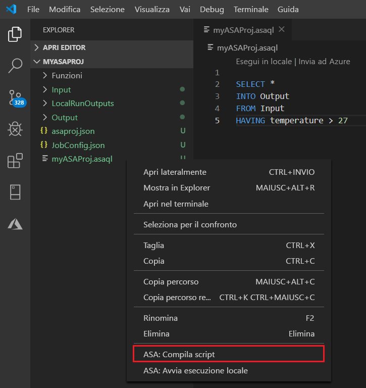

3. Dopo la compilazione, i due modelli di Azure Resource Manager generati saranno disponibili nella cartella **Distribuisci** del progetto. Questi due file vengono usati per la distribuzione automatica.

    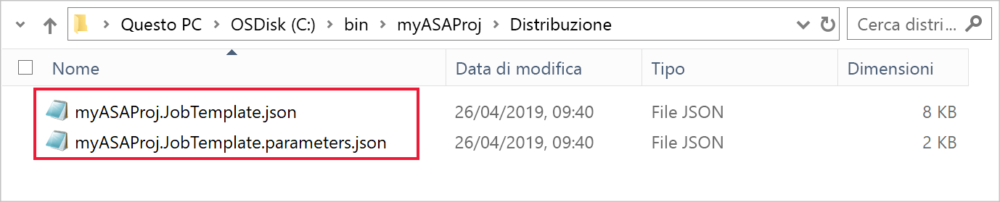

## <a name="submit-a-stream-analytics-job-to-azure"></a>Inviare ad Azure un processo di Analisi di flusso

1. Nella finestra dell'editor di script di Visual Studio Code selezionare **Selezionare dalle sottoscrizioni correnti**.

   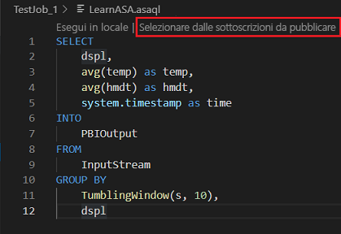

2. Selezionare la sottoscrizione nell'elenco popup.

3. Selezionare un processo**. Scegliere quindi Crea nuovo processo.

4. Immettere il nome del processo **myASAjob** e seguire le istruzioni per scegliere il gruppo di risorse e la posizione.

5. Selezionare **Invia ad Azure**. I log sono disponibili nella finestra di output. 

6. Al termine della creazione del processo, è possibile visualizzarlo in **Esplora analisi di flusso**.

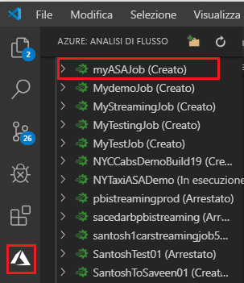


## <a name="run-the-iot-simulator"></a>Eseguire il simulatore IoT

1. Aprire il [simulatore online Azure IoT Raspberry Pi](https://azure-samples.github.io/raspberry-pi-web-simulator/) in una nuova scheda o finestra del browser.

2. Sostituire il segnaposto nella riga 15 con la stringa di connessione del dispositivo hub IoT di Azure salvato in una sezione precedente.

3. Fare clic su **Run**. L'output mostra i dati del sensore e i messaggi inviati all'hub IoT.

   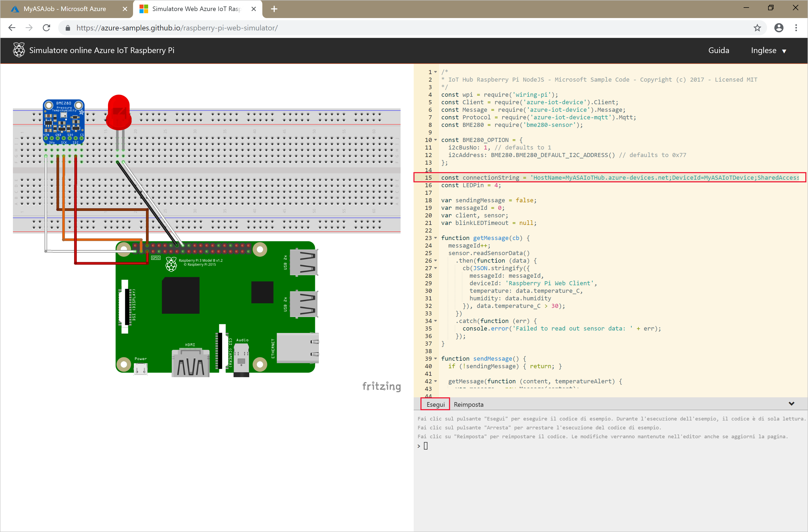

## <a name="start-the-stream-analytics-job-and-check-output"></a>Avviare il processo di Analisi di flusso e controllare l'output

1. Aprire **Esplora analisi di flusso** in Visual Studio Code e cercare il processo **myASAJob**.

2. Fare clic con il pulsante destro del mouse sul nome del processo. Nel menu di scelta rapida selezionare **Avvia**.

   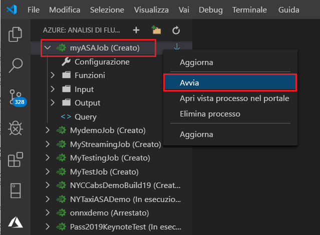

3. Scegliere **Adesso** nella finestra popup per avviare il processo.

4. Si noti che lo stato del processo è diventato **In esecuzione**. Fare clic con il pulsante destro del mouse sul nome del processo e scegliere **Open Job View in Portal** (Apri la visualizzazione processo nel portale) per visualizzare le metriche degli eventi di input e di output. Questa azione può richiedere qualche minuto.

5. Per visualizzare i risultati, aprire l'archiviazione BLOB nell'estensione di Visual Studio Code o nel portale di Azure.

## <a name="clean-up-resources"></a>Pulire le risorse

Quando non sono più necessari, eliminare il gruppo di risorse, il processo di streaming e tutte le risorse correlate. Eliminando il processo si evita di pagare per le unità di streaming utilizzate dal processo. Se si prevede di usare il processo in futuro, è possibile arrestarlo e riavviarlo in un secondo momento, quando è necessario. Se non si intende continuare a usare il processo, eliminare tutte le risorse create tramite questa guida introduttiva seguendo questa procedura:

1. Scegliere **Gruppi di risorse** dal menu a sinistra del portale di Azure e quindi selezionare il nome della risorsa creata.  

2. Nella pagina del gruppo di risorse selezionare **Elimina**, digitare il nome della risorsa da eliminare nella casella di testo e quindi selezionare **Elimina**.

## <a name="next-steps"></a>Passaggi successivi

In questo argomento di avvio rapido è stato distribuito un semplice processo di Analisi di flusso con Visual Studio Code. È anche possibile distribuire processi di analisi di flusso usando il [portale di Azure](stream-analytics-quick-create-portal.md), [PowerShell](stream-analytics-quick-create-powershell.md) e Visual Studio (stream-analytics-quick-create-vs.md). 

Per informazioni sugli strumenti di Analisi di flusso di Azure per Visual Studio, passare all'articolo seguente:

> [!div class="nextstepaction"]
> [Usare Visual Studio per visualizzare i processi di Analisi di flusso di Azure](stream-analytics-vs-tools.md)
