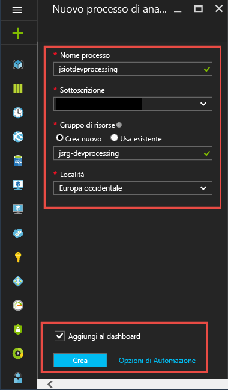

# <a name="process-real-time-iot-data-streams-with-azure-stream-analytics"></a>Elaborare flussi di dati IoT in tempo reale con Analisi di flusso di AzureProcess real-time IoT data streams with Azure Stream Analytics

In questo articolo viene illustrato come creare la logica di elaborazione del flusso per raccogliere dati dai dispositivi Internet of Things (IoT). Si utilizza un caso di utilizzo di Internet of Things (IoT) reale per dimostrare come creare la soluzione in modo rapido ed economico.

## <a name="prerequisites"></a>Prerequisiti

* Creare una sottoscrizione gratuita di Azure.Create a free [Azure subscription](https://azure.microsoft.com/pricing/free-trial/).
* Scaricare file di query e di dati di esempio da [GitHub](https://aka.ms/azure-stream-analytics-get-started-iot).

## <a name="scenario"></a>Scenario

Contoso, una società che opera nel settore dell'automazione industriale, ha completamente automatizzato il processo di produzione. I macchinari dello stabilimento hanno sensori in grado di emettere flussi di dati in tempo reale. In questo scenario, un responsabile del reparto produzione vuole avere informazioni in tempo reale dai dati del sensore per individuare modelli ricorrenti e intraprendere azioni correttive. È possibile utilizzare il linguaggio di query di Analisi di flusso (SAQL) sui dati del sensore per trovare modelli interessanti dal flusso di dati in ingresso.

In questo esempio, i dati vengono generati da un dispositivo di tag sensore Texas Instruments.In this example, the data is generated from a Texas Instruments sensor tag device. Il payload dei dati è in formato JSON ed è simile al seguente:

```json
{
    "time": "2016-01-26T20:47:53.0000000",  
    "dspl": "sensorE",  
    "temp": 123,  
    "hmdt": 34  
}  
```

In uno scenario reale possono essere presenti centinaia di questi sensori che generano eventi come un flusso. Idealmente, un dispositivo gateway dovrebbe eseguire codice per effettuare il push degli eventi a [hub eventi di Azure](https://azure.microsoft.com/services/event-hubs/) o [hub IoT di Azure](https://azure.microsoft.com/services/iot-hub/). Il processo di analisi di flusso ha lo scopo di inserire questi eventi dagli hub eventi ed eseguire query di analisi in tempo reale a fronte dei flussi. Quindi, è possibile inviare i risultati a uno degli [output supportati.](stream-analytics-define-outputs.md)

Per semplicità d'uso, questa guida introduttiva include un file di dati di esempio acquisito da dispositivi SensorTag reali. È possibile eseguire query sui dati di esempio e visualizzare i risultati. Nelle esercitazioni successive, verrà illustrato come connettere il processo agli input e agli output e distribuirli al servizio di Azure.

## <a name="create-a-stream-analytics-job"></a>Creare un processo di Analisi di flusso.

1. Nel [portale di Azure](https://portal.azure.com), selezionare **Crea una risorsa** dal menu di spostamento a sinistra. Quindi, selezionare **Processo di Analisi di flusso** da **Analytics**.
   
    

1. Immettere un nome univoco per il processo e verificare che la sottoscrizione sia quella corretta per il processo. Creare un nuovo gruppo di risorse o selezionarne uno esistente dalla sottoscrizione.

1. Selezionare una posizione per il lavoro. Usare la stessa posizione per il gruppo di risorse e tutte le risorse per aumentare la velocità di elaborazione e ridurre i costi. Dopo aver creato le configurazioni, selezionare **Crea**.
   
    

## <a name="create-an-azure-stream-analytics-query"></a>Creare una query di analisi di flusso di Azure
Il passaggio successivo dopo la creazione del processo consiste nello scrivere una query. È possibile testare le query su dati di esempio senza connettere un input o un output al processo.

Scaricare [HelloWorldASA-InputStream.json da GitHub.Download the HelloWorldASA-InputStream.json from](https://github.com/Azure/azure-stream-analytics/blob/master/Samples/GettingStarted/HelloWorldASA-InputStream.json
) GitHub. Passare quindi al processo di Analisi di flusso di Azure nel portale di Azure.Then, navigate to your Azure Stream Analytics job in the Azure portal.

Selezionare **Query** in **Topologia processo** dal menu a sinistra. Selezionare **quindi Carica input di esempio**. Caricare `HelloWorldASA-InputStream.json` il file e selezionare **Ok**.


Si noti che un'anteprima dei dati viene popolata automaticamente nella tabella di **anteprima input.**


### <a name="query-archive-your-raw-data"></a>Query: Archiviazione dei dati non elaborati

La forma più semplice di query è una query pass-through che archivia tutti i dati di input nell'output designato. Questa query è la query predefinita popolata in un nuovo processo di Analisi di flusso di Azure.This query is the default query populated in a new Azure Stream Analytics job.

```sql
SELECT 
    *
INTO
    Output
FROM
    InputStream
```

Selezionare **Test query** e visualizzare i risultati nella tabella **Risultati test.**


### <a name="query-filter-the-data-based-on-a-condition"></a>Query: Filtro dei dati in base a una condizione

Proviamo a filtrare i risultati in base a una condizione. Ai fini di questa esercitazione, si vogliono visualizzare solo i risultati relativi agli eventi provenienti da "sensorA".

```sql
SELECT 
    time,
    dspl AS SensorName,
    temp AS Temperature,
    hmdt AS Humidity
INTO
   Output
FROM
    InputStream
WHERE dspl='sensorA'
```

Incollare la query nell'editor e selezionare **Test query** per esaminare i risultati.


### <a name="query-alert-to-trigger-a-business-workflow"></a>Query: Avviso per attivare un flusso di lavoro aziendale

La query verrà ora resa più dettagliata. Per ogni tipo di sensore, si vuole monitorare la temperatura media in una finestra di 30 secondi e visualizzare i risultati solo se tale temperatura supera i 100 gradi.

```sql
SELECT 
    System.Timestamp AS OutputTime,
    dspl AS SensorName,
    Avg(temp) AS AvgTemperature
INTO
   Output
FROM
    InputStream TIMESTAMP BY time
GROUP BY TumblingWindow(second,30),dspl
HAVING Avg(temp)>100
```


Si dovrebbero vedere risultati che contengono solo 245 righe e nomi di sensori in cui la temperatura media è maggiore di 100. La query raggruppa il flusso di eventi in base al nome del sensore (**dspl**) su una **finestra a cascata** di 30 secondi. Le query temporali devono indicare il modo in cui si desidera che il tempo progredisse. Utilizzando la clausola **TIMESTAMP BY,** è stata specificata la colonna **OUTPUTTIME** per associare gli orari a tutti i calcoli temporali. Per informazioni dettagliate, leggere informazioni sulle funzioni [di gestione del tempo](https://docs.microsoft.com/stream-analytics-query/time-management-azure-stream-analytics) e di [windowing](https://docs.microsoft.com/stream-analytics-query/windowing-azure-stream-analytics).

### <a name="query-detect-absence-of-events"></a>Query: rilevare l'assenza di eventi

La scrittura di una query per trovare una mancanza di eventi di input Troviamo l'ultima volta che un sensore ha inviato dati e poi non ha inviato eventi per i successivi 5 secondi.

```sql
SELECT 
    t1.time,
    t1.dspl AS SensorName
INTO
   Output
FROM
    InputStream t1 TIMESTAMP BY time
LEFT OUTER JOIN InputStream t2 TIMESTAMP BY time
ON
    t1.dspl=t2.dspl AND
    DATEDIFF(second,t1,t2) BETWEEN 1 and 5
WHERE t2.dspl IS NULL
```


In questo caso viene usato un **LEFT OUTER JOIN** per lo stesso flusso di dati (self-join). In caso di **INNER JOIN** viene restituito un risultato solo quando viene trovata una corrispondenza.  In caso di **LEFT OUTER JOIN**, se un evento del lato sinistro del join è senza corrispondenza viene restituita una riga con valore NULL per tutte le colonne del lato destro. Questa tecnica è molto utile per trovare un'assenza di eventi. Per ulteriori informazioni, vedere [JOIN](https://docs.microsoft.com/stream-analytics-query/join-azure-stream-analytics).

## <a name="conclusion"></a>Conclusioni

Lo scopo di questo articolo è illustrare come scrivere query del linguaggio di query di Analisi di flusso diverse e visualizzare i risultati nel browser. Tuttavia, questo è solo per iniziare. Analisi di flusso supporta un'ampia gamma di input e output e può anche usare le funzioni di Azure Machine Learning per offrire uno strumento efficace per l'analisi dei flussi di dati. Per altre informazioni su come scrivere le query, vedere l'articolo sui [modelli di query comuni](stream-analytics-stream-analytics-query-patterns.md).

