<properties
	pageTitle="Introduzione all'analisi di flusso di Azure per elaborare dati dai dispositivi IoT | Analisi di flusso"
	description="Tag dei sensori IoT e flussi di dati con l'elaborazione dei dati in tempo reale e l'analisi di flusso"
	services="stream-analytics"
	documentationCenter=""
	authors="jeffstokes72"
	manager="paulettm"
	editor="cgronlun"
/>

<tags 
	ms.service="stream-analytics" 
	ms.devlang="na" 
	ms.topic="hero-article" 
	ms.tgt_pltfrm="na" 
	ms.workload="data-services" 
	ms.date="05/03/2016"
	ms.author="jeffstok"
/>

# Introduzione all'analisi di flusso di Azure per elaborare dati dai dispositivi IoT

In questa esercitazione si apprenderà a creare la logica di elaborazione del flusso per raccogliere dati dai dispositivi Internet delle cose (IoT). Verrà illustrato un caso d'uso reale di Internet delle cose (IoT) per dimostrare come compilare la soluzione in modo rapido ed economico.

## Prerequisiti

-   [Sottoscrizione di Azure](https://azure.microsoft.com/pricing/free-trial/)
-   File di dati e query di esempio scaricabili da [GitHub](https://github.com/Azure/azure-stream-analytics/tree/master/Samples/GettingStarted)

## Scenario

Contoso è una società di produzione nel settore dell'automazione industriale che ha completamente automatizzato il processo di produzione. I macchinari in questo stabilimento hanno sensori che emettono flussi di dati in tempo reale. In questo scenario, un responsabile del reparto produzione vuole avere informazioni in tempo reale dai dati del sensore per individuare modelli ricorrenti e intraprendere azioni correttive. Verrà usato il linguaggio di query di analisi di flusso (SAQL) sui dati del sensore per trovare modelli interessanti sul flusso dei dati in ingresso.

In questo caso, i dati vengono generati da un dispositivo Texas Instrument Sensor Tag.

Il payload dei dati è in formato JSON ed è simile al seguente:

    
	{
    	"time": "2016-01-26T20:47:53.0000000",  
	    "dspl": "sensorE",  
    	"temp": 123,  
	    "hmdt": 34  
	}  
    
In uno scenario reale, si hanno centinaia di questi sensori che generano eventi come un flusso. Idealmente è presente anche un dispositivo gateway che esegue codice per il push degli eventi ad [Hub eventi di Azure](https://azure.microsoft.com/services/event-hubs/). Il processo di analisi di flusso utilizzerà questi eventi da Hub eventi, eseguirà analisi in tempo reale, espresse come query, e invierà i risultati all'output desiderato.

In questa Guida introduttiva, è stato fornito un file di dati di esempio, acquisito da dispositivi SensorTag reali, in cui è possibile eseguire query diverse e visualizzarne i risultati. Nelle esercitazioni successive, verrà illustrato come connettere il processo agli input e agli output e distribuirli al servizio di Azure.

## Creare un processo di Analisi di flusso

Nel [portale di Azure](http://manage.windowsazure.com) aprire l'analisi di flusso e fare clic su **"Nuovo"** nell'angolo in basso a sinistra della pagina per creare un nuovo processo di analisi.

Fare clic su "**Creazione rapida**".

Per l'impostazione **"Account di archiviazione di monitoraggio regionale"**, selezionare **"Crea un nuovo account di archiviazione"** e assegnare un nome univoco qualsiasi. Analisi di flusso di Azure usa questo account per archiviare informazioni di monitoraggio per tutti i processi futuri.

> [AZURE.NOTE] È necessario creare l'account di archiviazione solo una volta per ogni area. In questo modo, l'archiviazione verrà condivisa tra tutti i processi di analisi di flusso creati in tale area.

Fare clic su "**Crea processo di Analisi di flusso**" in fondo alla pagina.

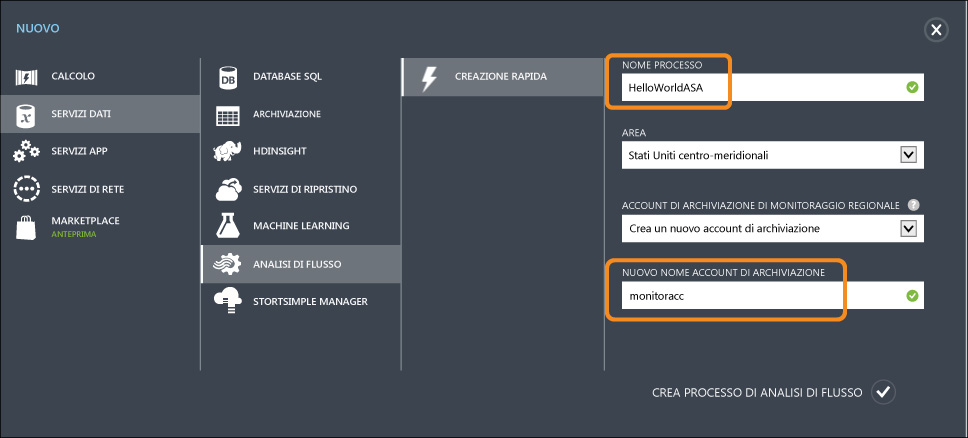

## Query di analisi di flusso di Azure

Fare clic sulla scheda Query per passare all'editor di query. La scheda Query contiene una query SQL che esegue la trasformazione dei dati in ingresso.

## Archiviazione dei dati non elaborati

Il modo più semplice di eseguire query è avviare un pass-through che archivierà tutti i dati di input nell'output designato.

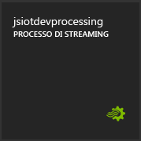

Scaricare il file di dati di esempio da [GitHub](https://github.com/Azure/azure-stream-analytics/tree/master/Samples/GettingStarted) in un percorso nel computer. Copiare e incollare la query dal file **PassThrough.txt**. Fare clic sul pulsante Test seguente e selezionare il file di dati denominato **HelloWorldASA InputStream.json** dal percorso di download.

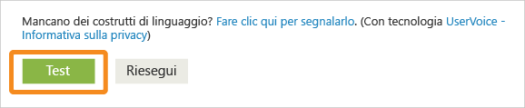

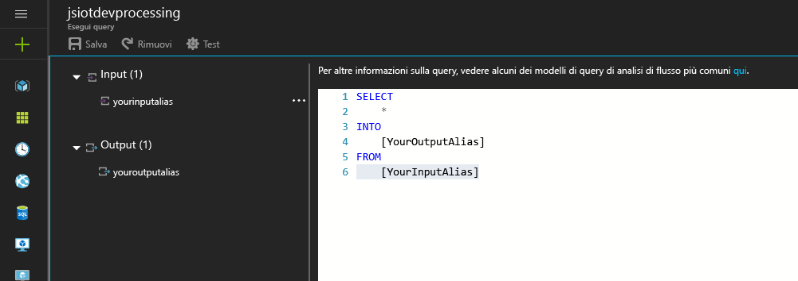

È possibile visualizzare i risultati della query nel browser seguente.

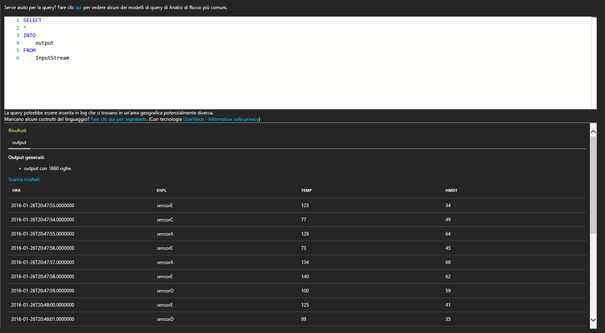

## Pulizia dei dati in base a una condizione

È possibile filtrare i risultati in base a una condizione. Ai fini di questa esercitazione, si desidera mostrare solo i risultati relativi agli eventi provenienti da "SensorA". La query si trova nel file **Filtering.txt**.

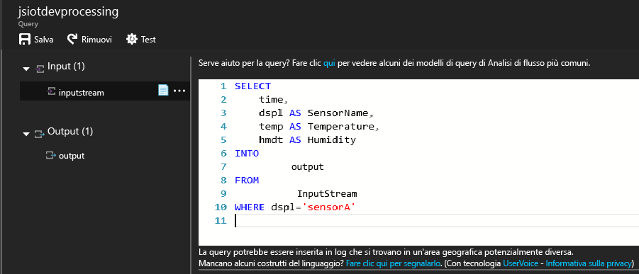

Si noti che in questo caso si sta confrontando un valore stringa e la relativa distinzione maiuscole/minuscole. Fare clic sul pulsante **Riesegui** per eseguire la query. La query deve restituire solo 389 righe di 1860 eventi.

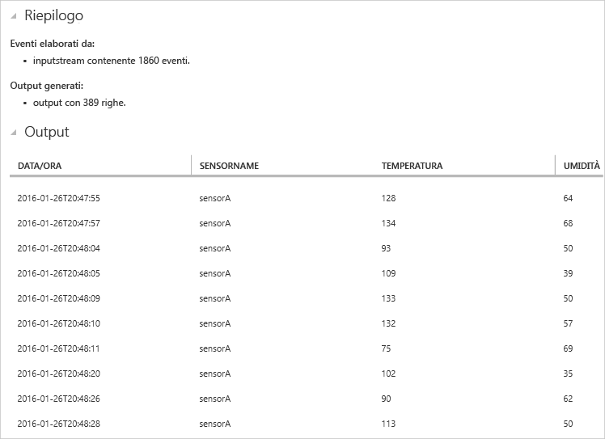

## Avvisi per attivare il flusso di lavoro aziendale

A questo punto, è possibile rendere la query più interessante. Per ogni tipo di sensore, se si vuole monitorare la temperatura media in una finestra di 30 secondi e visualizzare i risultati solo se la temperatura media supera i 100 gradi, si scriverà la query seguente e si farà quindi clic su Riesegui per visualizzare i risultati. La query si trova nel file **ThresholdAlerting.txt**.

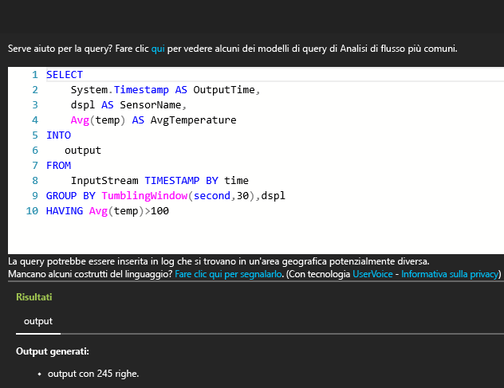

Si noti che i risultati contengono ora solo 245 righe con i sensori la cui temperatura media è maggiore di 100. In questa query è stato raggruppato il flusso di eventi da dspl, ovvero il nome del sensore, e in base a una **finestra a cascata** di 30 secondi. Quando si eseguono tali query temporali, è fondamentale indicare come si vuole indicare l'avanzamento del tempo. Tramite la clausola **TIMESTAMP BY**, la colonna "time" viene specificata come una modalità per indicare l'avanzamento del tempo per tutti i calcoli temporali. Per informazioni dettagliate, leggere gli argomenti di MSDN su [gestione del tempo](https://msdn.microsoft.com/library/azure/mt582045.aspx) e [windowing](https://msdn.microsoft.com/library/azure/dn835019.aspx).

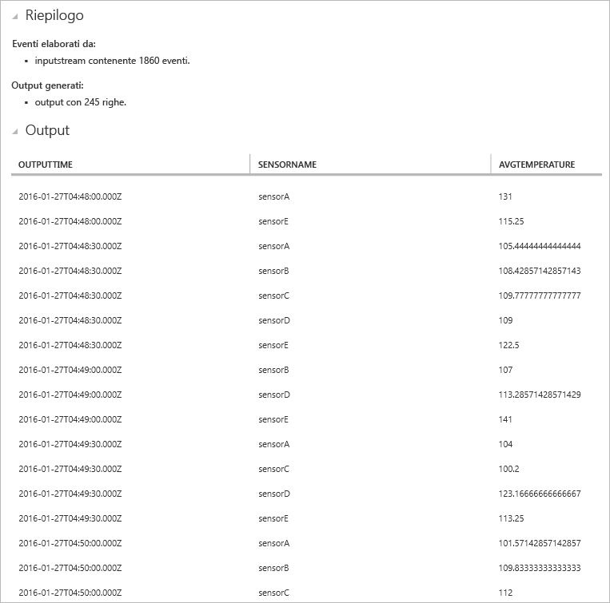

## Trovare la mancanza di modelli

Come è possibile scrivere una query per trovare la mancanza di modelli? È ad esempio possibile trovare l'ultima volta in cui un sensore ha inviato dati e poi non ha inviato alcun evento per il minuto successivo. La query si trova nel file **AbsenseOfEvent.txt**.

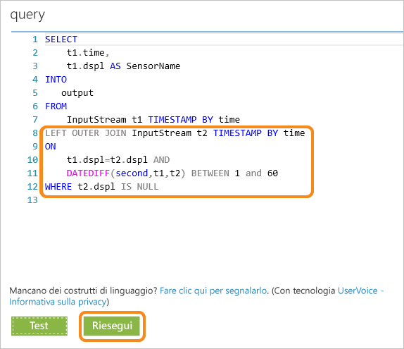

Qui viene usato un **LEFT OUTER JOIN** sullo stesso flusso di dati (self-join). Per un inner join, viene restituito un risultato solo quando viene trovata una corrispondenza. Invece, per un **LEFT OUTER** join, se un evento dal lato sinistro del join è di tipo non corrispondente, viene restituita una riga con valore NULL per tutte le colonne della riga destra. Questa tecnica è molto utile per trovare l'assenza di eventi. Per altre informazioni dettagliate sui [JOIN](https://msdn.microsoft.com/library/azure/dn835026.aspx), vedere la documentazione di MSDN.

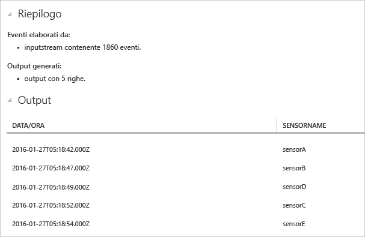

## Conclusioni

Questa esercitazione fornisce informazioni iniziali per scrivere diverse query SAQL e visualizzarne i risultati nel browser in diversi modelli sui dati. Si tratta, tuttavia, di informazioni di base, in quanto con analisi di flusso è possibile eseguire molte altre attività. Nell'esercitazione successiva verranno fornite informazioni sulla connessione del processo di analisi di flusso agli input e agli output e sulla distribuzione in Azure. Per ottenere altre informazioni sull'analisi di flusso, è possibile usare la guida con la [mappa di apprendimento](https://azure.microsoft.com/documentation/learning-paths/stream-analytics/) e per altre informazioni sulla scrittura di query, leggere l'articolo sui [modelli di query comuni](./stream-analytics-stream-analytics-query-patterns.md#query-example-detect-the-absence-of-events).

<!----HONumber=AcomDC_0504_2016-->