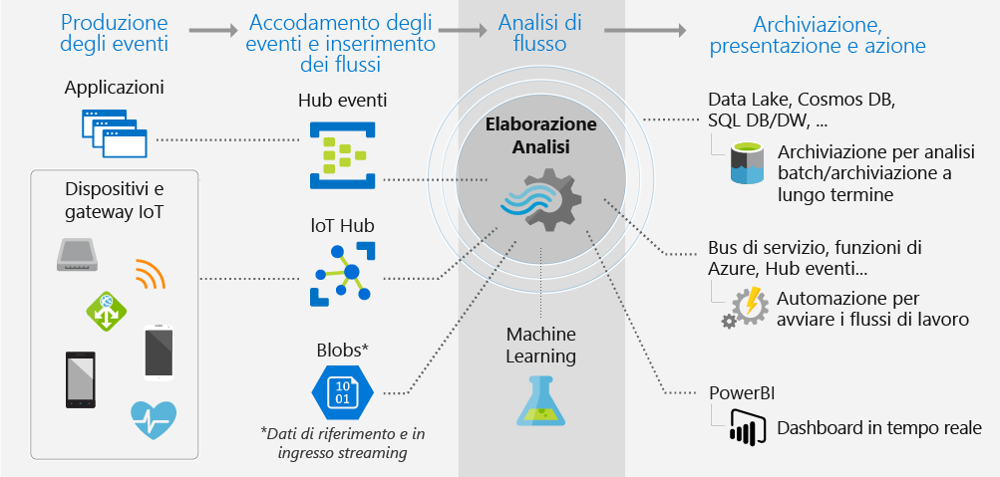
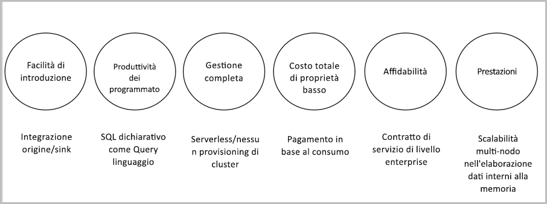

# Informazioni su Analisi di flusso di Azure

Analisi di flusso di Azure è un motore di elaborazione di eventi progettato per esaminare volumi elevati di dati in streaming. I modelli e le relazioni possono essere identificati nelle informazioni estratte da numerose origini di input tra cui dispositivi, sensori, siti Web, feed di social media e applicazioni. Questi modelli possono essere usati per attivare altre azioni a valle, ad esempio la creazione di avvisi, l'invio di informazioni a uno strumento di creazione di report o l'archiviazione dei dati trasformati per un uso successivo.

Gli scenari seguenti sono esempi di quando è possibile usare Analisi di flusso di Azure:

* Fusione di sensori di Internet delle cose (IoT) e analisi in tempo reale su dati di telemetria dei dispositivi
* Analisi di log Web/clickstream
* Analisi geospaziale per la gestione della flotta e veicoli senza conducente
* Monitoraggio remoto e manutenzione predittiva di risorse di valore elevato
* Analisi in tempo reale di dati di punti vendita per il controllo dell'inventario e il rilevamento anomalie

## Funzionamento di Analisi di flusso

Un processo di Analisi di flusso di Azure è costituito da un input, una query di trasformazione e un output. Quando vengono inseriti eventi del software o dei dispositivi da Hub eventi di Azure, dall'hub IoT di Azure o da Archiviazione BLOB di Azure, è possibile specificare uno o più di tali servizi come origine di input per il processo. La query di trasformazione, basata sul linguaggio di query SQL, viene usata per filtrare, ordinare, aggregare e unire facilmente dati in streaming in base a un periodo di tempo. È possibile modificare le opzioni di ordinamento degli eventi e la durata delle finestre temporali durante l'esecuzione delle operazioni di aggregazione.

Per ogni processo è presente un output per i dati trasformati ed è possibile controllare cosa avviene in risposta alle informazioni analizzate. Ad esempio, è possibile:

* Inviare dati a una coda monitorata per attivare avvisi o flussi di lavoro personalizzati a valle.
* Inviare dati a un dashboard di Power BI per la visualizzazione in tempo reale.
* Archiviare dati in altri servizi di archiviazione di Azure per eseguire il training di un modello di Machine Learning in base a dati cronologici oppure eseguire l'analisi in batch.

L'immagine seguente mostra il modo in cui i dati vengono inviati ad Analisi di flusso, analizzati e inviati per altre azioni, tra cui archiviazione o presentazione:

## Funzionalità e vantaggi principali

Analisi di flusso di Azure è progettato in modo da essere facile da usare, flessibile, affidabile e scalabile in base a processi di qualsiasi dimensione. È disponibile in più aree di Azure. L'immagine seguente mostra le caratteristiche principali di Analisi di flusso di Azure:

## Semplicità delle operazioni iniziali

È possibile iniziare a usare Analisi di flusso di Azure in tutta semplicità. Sono necessari solo pochi clic per connettersi a più origini o sink creando una pipeline end-to-end. Analisi di flusso può connettersi a [Hub eventi di Azure](/azure/event-hubs/) e [hub IoT di Azure](/azure/iot-hub/) per l'inserimento dei dati in streaming, nonché ad [Archiviazione BLOB di Azure](/azure/storage/storage-introduction) per l'inserimento dei dati cronologici. L'input del processo può anche includere dati di riferimento statici o a modifica lenta di Archiviazione BLOB di Azure o del [database SQL](stream-analytics-use-reference-data.md#azure-sql-database) che possono essere uniti a dati in streaming per eseguire operazioni di ricerca.

Analisi di flusso può indirizzare l'output del processo a molti sistemi di archiviazione, tra cui [Archiviazione BLOB di Azure](/azure/storage/storage-introduction), il [database SQL di Azure](/azure/sql-database/), [Azure Data Lake Storage](/azure/data-lake-store/) e [Azure Cosmos DB](/azure/cosmos-db/introduction). È possibile eseguire analisi in batch con Azure HDInsight sull'output archiviato o inviare l'output a un altro servizio, ad esempio Hub eventi per l'utilizzo o [Power BI](https://docs.microsoft.com/power-bi/) per la visualizzazione in tempo reale.

Per l'intero elenco di output di Analisi di flusso, vedere [Informazioni sugli output di Analisi di flusso di Azure](stream-analytics-define-outputs.md).

## Produttività per i programmatori

Analisi di flusso di Azure usa un semplice linguaggio di query basato su SQL che è stato migliorato con potenti vincoli temporali per analizzare i dati in continua evoluzione. Per definire le trasformazioni dei processi, è possibile usare un [linguaggio di query di Analisi di flusso](https://docs.microsoft.com/stream-analytics-query/stream-analytics-query-language-reference) semplice e dichiarativo, che permette di creare query e analisi temporali complesse usando semplici costrutti SQL. Poiché il linguaggio di query di Analisi di flusso è coerente con il linguaggio SQL, è sufficiente avere familiarità con il linguaggio SQL per iniziare a creare processi. È anche possibile creare processi usando strumenti di sviluppo come Azure PowerShell, [strumenti di Visual Studio per Analisi di flusso](stream-analytics-tools-for-visual-studio-install.md), l'[estensione Visual Studio Code per Analisi di flusso](quick-create-vs-code.md) o modelli di Azure Resource Manager. L'uso di strumenti di sviluppo permette di sviluppare query di trasformazione offline e usare la [pipeline di integrazione continua e distribuzione continua](stream-analytics-tools-for-visual-studio-cicd.md) per inviare processi ad Azure.

Il linguaggio di query di Analisi di flusso offre un'ampia gamma di funzioni per l'analisi e l'elaborazione dei dati in streaming. Questo linguaggio di query supporta la modifica di dati semplici, funzioni di aggregazione e funzioni geospaziali complesse. È possibile modificare le query nel portale e testarle usando i dati di esempio estratti da uno streaming live.

È possibile estendere le funzionalità del linguaggio di query definendo e richiamando funzioni aggiuntive. È possibile definire chiamate di funzione nel servizio Azure Machine Learning per sfruttare i vantaggi delle soluzioni Azure Machine Learning e integrare funzioni o aggregazioni definite dall'utente in JavaScript o C# per eseguire calcoli complessi come parte di una query di Analisi di flusso.

## Soluzione completamente gestita

Analisi di flusso di Azure è un'offerta senza server completamente gestita (PaaS) in Azure. Non è necessario effettuare il provisioning di hardware o gestire i cluster per l'esecuzione dei processi. Analisi di flusso di Azure gestisce completamente il processo configurando cluster di calcolo complessi nel cloud ed eseguendo l'attività di ottimizzazione delle prestazioni necessaria per l'esecuzione del processo. L'integrazione con Hub eventi di Azure e l'hub IoT di Azure permette a un processo di inserire milioni di eventi al secondo provenienti da numerose origini, tra cui dispositivi connessi, clickstream e file di log. Grazie alla funzionalità di partizionamento di Hub eventi, è possibile suddividere i calcoli in passaggi logici, ciascuno con la possibilità di essere ulteriormente suddiviso per aumentare la scalabilità.

## Eseguire nel cloud nella rete perimetrale intelligente

È possibile eseguire Analisi di flusso di Azure nel cloud per l'analisi su ampia scala oppure in IoT Edge per l'analisi a latenza ultra bassa. Analisi di flusso di Azure usa lo stesso linguaggio di query sia nel cloud che nella rete perimetrale, consentendo agli sviluppatori di creare architetture realmente ibride per l'elaborazione dello streaming.

## Costo totale di proprietà ridotto

Come servizio cloud, Analisi di flusso è ottimizzato in funzione del costo. Non sono previsti costi iniziali e si paga solo per le [unità di streaming utilizzate](stream-analytics-streaming-unit-consumption.md) e per la quantità di dati elaborati. Non è necessario alcun impegno o provisioning di cluster ed è possibile aumentare le istanze o le prestazioni del processo in base alle esigenze aziendali.

## Supporto di carichi di lavoro cruciali

Analisi di flusso di Azure è disponibile in più aree geografiche del mondo ed è progettato per l'esecuzione di carichi di lavoro cruciali, perché soddisfa i requisiti di affidabilità, sicurezza e conformità.

### Affidabilità

Analisi di flusso di Azure garantisce un'elaborazione di eventi di tipo exactly-once e il recapito di eventi at-least-once, quindi non vengono mai persi eventi. L'elaborazione exactly-once è garantita con uno specifico output, come descritto nell'articolo sulle [garanzie di recapito degli eventi](/stream-analytics-query/event-delivery-guarantees-azure-stream-analytics).

Analisi di flusso di Azure include funzionalità di ripristino predefinite in caso di errori di recapito degli eventi. Analisi di flusso fornisce anche checkpoint predefiniti per mantenere lo stato del proprio lavoro e fornisce risultati ripetibili.

Come servizio gestito, Analisi di flusso garantisce l'elaborazione di eventi con una disponibilità del 99,9% a livello di minuto. Per altre informazioni, vedere la pagina [Contratto di servizio per Analisi di flusso](https://azure.microsoft.com/support/legal/sla/stream-analytics/v1_0/). 

### Security

In termini di sicurezza, Analisi di flusso di Azure crittografa tutte le comunicazioni in ingresso e in uscita e supporta lo standard TLS 1.2. Anche i checkpoint incorporati sono crittografati. Analisi di flusso non archivia i dati in ingresso perché tutta l'elaborazione viene eseguita in memoria.

### Conformità

Analisi di flusso di Azure soddisfa più certificazioni di conformità, come descritto nella [panoramica della conformità di Azure](https://gallery.technet.microsoft.com/Overview-of-Azure-c1be3942). 

## Prestazioni

Analisi di flusso può elaborare milioni di eventi al secondo e può recapitare risultati con bassa latenza. Il servizio permette di aumentare o diminuire le risorse per gestire grandi applicazioni di elaborazione degli eventi complesse in tempo reale. Analisi di flusso supporta le prestazioni con partizionamento, consentendo di usare in parallelo ed eseguire query complesse su più nodi di streaming. Analisi di flusso di Azure si basa su [Trill](https://github.com/Microsoft/Trill), un motore di analisi di flusso in memoria ad alte prestazioni, sviluppato in collaborazione con Microsoft Research.

## Passaggi successivi

In questo articolo è stata presentata una panoramica di Analisi di flusso di Azure. È ora possibile approfondire ulteriormente l'argomento e creare il primo processo di Analisi di flusso:

* [Creare un processo di Analisi di flusso tramite il portale di Azure](stream-analytics-quick-create-portal.md).
* [Creare un processo di Analisi di flusso tramite Azure PowerShell](stream-analytics-quick-create-powershell.md).
* [Creare un processo di Analisi di flusso con Visual Studio](stream-analytics-quick-create-vs.md).
* [Creare un processo di Analisi di flusso con Visual Studio Code](quick-create-vs-code.md).
