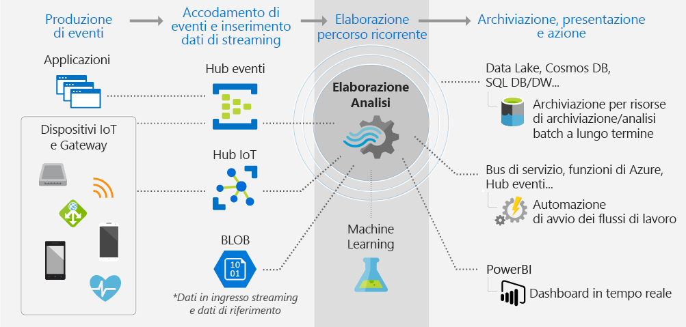

# Che cos'è Analisi di flusso?

Analisi di flusso di Azure è un motore di elaborazione di eventi completamente gestito che consente di configurare calcoli di analisi in tempo reale sui dati di streaming. I dati possono provenire da dispositivi, sensori, siti Web, feed di social media, applicazioni, sistemi di infrastruttura e altro ancora. 

## Cosa si può fare con Analisi di flusso?

Usare Analisi di flusso per esaminare volumi elevati di dati provenienti da dispositivi o processi, estrarre informazioni dal flusso di dati e cercare modelli, tendenze e relazioni. A seconda del contenuto dei dati sarà quindi possibile eseguire attività delle applicazioni. È ad esempio possibile generare avvisi, avviare flussi di lavoro di automazione, inviare informazioni a strumenti di creazione report come Power BI o archiviare i dati per analisi successive. 

Esempi:

* Analisi e avvisi del mercato azionario, in tempo reale e personalizzati, offerti da aziende di servizi finanziari.
* Rilevamento delle frodi in tempo reale in base alle analisi dei dati delle transazioni. 
* Servizi di protezione di dati e identità.
* Analisi dei dati generati da sensori e attuatori incorporati in oggetti fisici (Internet delle cose o IoT).
* Analisi clickstream Web.
* Applicazioni CRM (Customer Relationship Management), ad esempio emissione di avvisi quando l'esperienza del cliente risulta compromessa in un determinato intervallo di tempo.

## Funzionamento di Analisi di flusso

Questo diagramma illustra la pipeline di Analisi di flusso e l'inserimento, l'analisi e l'invio dei dati a scopo di presentazione o intervento. 

Analisi di flusso inizia con un'origine di dati in streaming. I dati possono essere inseriti in Azure da un dispositivo tramite un hub eventi o un hub IoT di Azure. I dati possono essere anche ottenuti da un archivio dati come un archivio BLOB di Azure. 

Per esaminare il flusso, si crea un *processo* di Analisi di flusso che specifica la provenienza dei dati. Il processo specifica anche una *trasformazione*&mdash;come cercare dati, modelli o relazioni. Per questa attività, Analisi di flusso supporta un linguaggio di query simile a SQL che consente di filtrare, ordinare, aggregare e unire dati di streaming in un periodo di tempo.

Il processo specifica infine un output al quale inviare i dati trasformati. Ciò consente di determinare quali operazioni eseguire in risposta alle informazioni analizzate. In risposta a un'analisi è ad esempio possibile:

* Inviare un comando per modificare le impostazioni di un dispositivo. 
* Inviare dati a una coda monitorata da un processo che esegue un'operazione in base a quanto rilevato. 
* Inviare dati a un dashboard di Power BI per la creazione di report.
* Inviare dati a un archivio come Data Lake Store, database di SQL Server, archivio BLOB o archivio tabelle di Azure.

È possibile monitorare un processo e modificare il numero di eventi elaborati al secondo mentre è in esecuzione. È anche possibile far sì che i processi generino log di diagnostica per la risoluzione dei problemi.

## Funzionalità e vantaggi principali

Analisi di flusso è progettato in modo da essere semplice da usare, flessibile, scalabile in funzione delle dimensioni dei processi ed economico.

### Connettività a molti input e output

Analisi di flusso si connette direttamente a [Hub eventi di Azure](https://azure.microsoft.com/services/event-hubs/) e [Hub IoT di Azure](https://azure.microsoft.com/services/iot-hub/) per l'inserimento dei flussi, nonché al [servizio di archiviazione BLOB di Azure](https://docs.microsoft.com/azure/storage/storage-introduction#blob-storage-accounts) per inserire dati cronologici. Se si ottengono dati dagli hub eventi, è possibile combinare Analisi di flusso con altre origini dati e motori di elaborazione.

L'input del processo può anche includere dati di riferimento statici o a modifica lenta. È possibile aggiungere dati di streaming a questi dati di riferimento per eseguire operazioni di ricerca così come si farebbe con le query di database.

Indirizzare l'output del processo di Analisi di flusso in più direzioni. È possibile scrivere in una risorsa di archiviazione come BLOB o tabelle di archiviazione di Azure, database SQL di Azure, Azure Data Lake Store o Azure Cosmos DB. Da lì, i dati possono essere usati per l'analisi batch con Azure HDInsight. È possibile inviare l'output a un altro servizio per l'utilizzo da parte di un altro processo, ad esempio hub eventi e code o argomenti del bus di servizio di Azure. È possibile inviare l'output a Power BI per la visualizzazione.

### Semplicità d'uso

Per definire le trasformazioni si usa un [linguaggio di query di Analisi di flusso](https://msdn.microsoft.com/library/azure/dn834998.aspx), semplice e dichiarativo, che consente di creare analisi sofisticate senza alcuna programmazione. Il linguaggio di query accetta dati di streaming come input. È possibile filtrare e ordinare i dati, aggregare valori, eseguire calcoli, aggiungere dati (all'interno di un flusso o ai dati di riferimento) e usare funzioni geospaziali. È possibile modificare le query nel portale, tramite IntelliSense e la verifica della sintassi, e testare le query con dati di esempio che possono essere estratti dal flusso live.

### Linguaggio di query estendibile

È possibile estendere le funzionalità del linguaggio di query definendo e richiamando funzioni aggiuntive. È possibile definire chiamate di funzione nel servizio Azure Machine Learning per sfruttare i vantaggi delle soluzioni di Azure Machine Learning. È anche possibile integrare funzioni JavaScript definite dall'utente per eseguire calcoli complessi nell'ambito di una query di Analisi di flusso.

### Scalabilità

Analisi di flusso può gestire fino a 1 GB di dati in ingresso al secondo. L'integrazione con [Hub eventi di Azure](https://azure.microsoft.com/services/event-hubs/) e [Hub IoT di Azure](https://azure.microsoft.com/services/iot-hub/) consente ai processi di inserire milioni di eventi al secondo provenienti da dispositivi connessi, clickstream e file di log, per citarne alcuni. Grazie alla funzionalità di partizionamento degli hub eventi, è possibile suddividere i calcoli in passaggi logici, ciascuno con la possibilità di essere ulteriormente suddiviso per aumentare la scalabilità.

### Basso costo

Come servizio cloud, Analisi di flusso è ottimizzato per consentire l'utilizzo a basso costo. L'utente può pagare in base all'uso dell'unità di streaming e alla quantità di dati elaborati dal sistema. L'utilizzo viene dedotto in base al volume di eventi elaborati e alla potenza di calcolo fornita all'interno del cluster per gestire i processi di Analisi di flusso.

### Affidabilità, ripristino rapido e ripetibilità

Come servizio gestito nel cloud, Analisi di flusso contribuisce a evitare la perdita di dati e fornisce la continuità aziendale. Se si verificano errori, il servizio offre funzionalità di ripristino predefinite. Grazie alla capacità di mantenere lo stato internamente, il servizio fornisce risultati ripetibili garantendo la possibilità di archiviare gli eventi e applicare nuovamente l'elaborazione in futuro, ottenendo sempre gli stessi risultati. Ciò consente di tornare indietro nel tempo ed esaminare i calcoli quando si esegue l'analisi delle cause radice, l'analisi di simulazione e così via.

## Passaggi successivi

* Per iniziare, [provare a usare l'input e le query provenienti da dispositivi IoT](stream-analytics-get-started-with-azure-stream-analytics-to-process-data-from-iot-devices.md).
* Compilare una [soluzione end-to-end di Analisi di flusso](stream-analytics-real-time-fraud-detection.md) per esaminare i metadati telefonici e cercare le chiamate fraudolente.
* Informazioni sul linguaggio di query simile a SQL per Analisi di flusso e su concetti specifici come le [funzioni finestra](stream-analytics-window-functions.md).
* Informazioni su come [ridimensionare i processi di Analisi di flusso](stream-analytics-scale-jobs.md). 
* Informazioni su come [integrare Analisi di flusso e Azure Machine Learning](stream-analytics-machine-learning-integration-tutorial.md).
* Trovare le risposte alle domande su Analisi di flusso nel [forum di Analisi di flusso di Azure](https://social.msdn.microsoft.com/Forums/en-US/home?forum=AzureStreamAnalytics).

