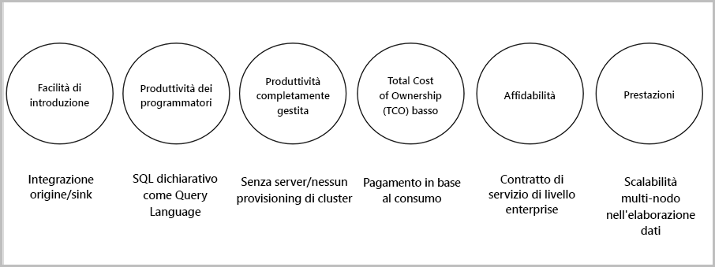

# Che cos'è Analisi di flusso?

Analisi di flusso di Azure è un motore di elaborazione di eventi che permette di esaminare volumi elevati di streaming di dati per i dispositivi. I dati in ingresso possono provenire da dispositivi, sensori, siti Web, feed di social media, applicazioni e altro ancora. Il servizio supporta anche l'estrazione di informazioni da flussi di dati, nonché l'identificazione di modelli e relazioni. È quindi possibile usare questi modelli per attivare altre azioni a valle, ad esempio avvisi, e inviare le informazioni a uno strumento di creazione di report o archiviarle per usarle successivamente.

Di seguito sono riportati alcuni esempi in cui è possibile usare Analisi di flusso di Azure: 

* Fusione di sensori di Internet delle cose (IoT) e analisi in tempo reale su dati di telemetria dei dispositivi
* Analisi di log Web/clickstream
* Analisi geospaziale per la gestione della flotta e veicoli senza conducente
* Monitoraggio remoto e manutenzione predittiva di risorse di valore elevato
* Analisi in tempo reale di dati di punti vendita per il controllo dell'inventario e il rilevamento anomalie

## Funzionamento di Analisi di flusso

Analisi di flusso di Azure inizia con la definizione di un'origine dei dati in streaming, che possono essere inseriti in Hub eventi di Azure, nell'hub IoT di Azure o da un archivio dati come Archiviazione BLOB di Azure. Per esaminare i flussi, è necessario creare un processo di Analisi di flusso che specifica l'origine di input che esegue il flusso dei dati. Il processo specifica anche una query di trasformazione che definisce come cercare dati, modelli o relazioni. La query di trasformazione sfrutta un linguaggio di query simile a SQL usato per filtrare, ordinare, aggregare e unire dati in streaming in base a un periodo di tempo. Quando si esegue il processo, è possibile modificare le opzioni di ordinamento degli eventi e la durata degli intervalli di tempo durante l'esecuzione di operazioni di aggregazione.

Dopo avere analizzato i dati in ingresso, è possibile specificare un output per i dati trasformati e controllare quali operazioni eseguire in risposta alle informazioni analizzate. Ad esempio, è possibile eseguire le azioni seguenti:

* Inviare dati a una coda monitorata per attivare flussi di lavoro personalizzati a valle.
* Inviare dati al dashboard di Power BI per la visualizzazione in tempo reale.
* Archiviare i dati in altri servizi di archiviazione di Azure.

L'immagine seguente mostra la pipeline di Analisi di flusso. Il processo di Analisi di flusso può usare tutti o un set selezionato di input e output. L'immagine mostra il modo in cui i dati vengono inviati ad Analisi di flusso, analizzati e inviati per altre azioni, tra cui archiviazione o presentazione:

## Funzionalità e vantaggi principali

Analisi di flusso di Azure è progettato in modo da essere facile da usare, flessibile, affidabile e scalabile in base a processi di qualsiasi dimensione. È disponibile in più data center, nonché in cloud sovrani. L'immagine seguente mostra le caratteristiche principali di Analisi di flusso di Azure:

## Semplicità delle operazioni iniziali

È possibile iniziare a usare Analisi di flusso di Azure in tutta semplicità. Sono necessari solo pochi clic per connettersi a più origini o sink e creare una pipeline end-to-end. Analisi di flusso può connettersi a [Hub eventi di Azure](https://docs.microsoft.com/azure/event-hubs/) o all'[hub IoT di Azure](https://docs.microsoft.com/azure/iot-hub/) per l'inserimento di dati in streaming. Può anche connettersi al servizio [Archiviazione BLOB di Azure](https://docs.microsoft.com/azure/storage/storage-introduction) per l'inserimento di dati cronologici. Può combinare dati da hub eventi con altre origini dati e motori di elaborazione. L'input del processo può anche includere dati di riferimento statici o dati a modifica lenta ed è possibile unire dati in streaming a questi dati di riferimento per eseguire operazioni di ricerca.

Analisi di flusso può indirizzare l'output del processo a molti sistemi di archiviazione, tra cui [BLOB di Azure](https://docs.microsoft.com/azure/storage/storage-introduction), il [database SQL di Azure](https://docs.microsoft.com/azure/sql-database/), [Azure Data Lake Stores](https://docs.microsoft.com/azure/data-lake-store/) o [Azure Cosmos DB](https://docs.microsoft.com/azure/cosmos-db/introduction). Al termine dell'archiviazione, è possibile eseguire analisi in batch con Azure HDInsight o inviare l'output a un altro servizio, ad esempio gli hub eventi per l'utilizzo o a [Power BI](https://docs.microsoft.com/power-bi/) per la visualizzazione in tempo reale tramite l'API di streaming di Power BI.

## Produttività per i programmatori

Analisi di flusso di Azure usa un semplice linguaggio di query basato su SQL che è stato migliorato con potenti vincoli temporali per analizzare i dati in continua evoluzione. Per definire le trasformazioni dei processi, è possibile usare un [linguaggio di query di Analisi di flusso](https://msdn.microsoft.com/library/azure/dn834998.aspx) semplice e dichiarativo, che permette di creare query e analisi temporali complesse usando semplici costrutti SQL. Il linguaggio di query di Analisi di flusso è coerente con il linguaggio SQL ed è sufficiente avere una certa familiarità con il linguaggio SQL per iniziare a creare processi. È anche possibile creare processi usando strumenti di sviluppo come Azure PowerShell, [strumenti di Visual Studio per Analisi di flusso](stream-analytics-tools-for-visual-studio-install.md) o modelli di Azure Resource Manager. L'uso di strumenti di sviluppo permette di sviluppare query di trasformazione offline e usare la [pipeline di integrazione continua e distribuzione continua](stream-analytics-tools-for-visual-studio-cicd.md) per inviare processi ad Azure. 

Il linguaggio di query di Analisi di flusso offre un'ampia gamma di funzioni per l'analisi e l'elaborazione dei dati in streaming. Questo linguaggio di query supporta la modifica di dati semplici e funzioni di aggregazione per funzioni geospaziali complesse. È possibile modificare le query nel portale e testarle usando i dati di esempio estratti dal flusso live.

È possibile estendere le funzionalità del linguaggio di query definendo e richiamando funzioni aggiuntive. È possibile definire chiamate di funzione nel servizio Azure Machine Learning per sfruttare i vantaggi delle soluzioni Azure Machine Learning e integrare funzioni definite dall'utente o aggregazioni definite dall'utente in JavaScript per eseguire calcoli complessi come parte di una query di Analisi di flusso.

## Soluzione completamente gestita 

Analisi di flusso di Azure è un'offerta senza server completamente gestita (PaaS) in Azure. Questo significa che non è necessario effettuare il provisioning di hardware o gestire i cluster per l'esecuzione dei processi. Analisi di flusso di Azure gestisce completamente il processo, occupandosi della configurazione di cluster di calcolo complessi nel cloud e dell'ottimizzazione delle prestazioni necessaria per l'esecuzione del processo. L'integrazione con Hub eventi di Azure e l'hub IoT di Azure permette ai processi di inserire milioni di eventi al secondo provenienti, tra gli altri, da dispositivi connessi, clickstream e file di log. Grazie alla funzionalità di partizionamento degli hub eventi, è possibile suddividere i calcoli in passaggi logici, ciascuno con la possibilità di essere ulteriormente suddiviso per aumentare la scalabilità.

## Costo totale di proprietà ridotto

Come servizio cloud, Analisi di flusso è ottimizzato in funzione del costo. Non sono previsti costi iniziali e si paga solo per le [unità di streaming utilizzate](stream-analytics-streaming-unit-consumption.md) e per la quantità di dati elaborati. Non è richiesto alcun impegno o provisioning del cluster. È possibile ridimensionare i processi di streaming in base alle esigenze aziendali. 

## Affidabilità 

Come servizio gestito, Analisi di flusso garantisce l'elaborazione di eventi con una disponibilità del 99,9%, contribuisce a prevenire la perdita di dati e offre continuità aziendale. Per altre informazioni, vedere la pagina del [contratto di servizio di Analisi di flusso](https://azure.microsoft.com/support/legal/sla/stream-analytics/v1_0/). Analisi di flusso può elaborare milioni di eventi al secondo e può recapitare risultati con bassa latenza.
Analisi di flusso garantisce un'elaborazione di eventi di tipo exactly-once e il recapito degli eventi almeno una volta. Il servizio include funzionalità di ripristino predefinite in caso di errori di recapito degli eventi. Analisi di flusso può mantenere internamente lo stato del processo ed è possibile avviare un processo dal momento dell'ultimo output, in modo da fornire risultati ripetibili, generando gli stessi risultati ogni volta. Questa funzionalità di Analisi di flusso permette di tornare indietro nel tempo ed esaminare i calcoli durante l'analisi delle cause principali. 

## Prestazioni

Analisi di flusso di Azure è ottimizzato per prestazioni elevate e può elaborare dati in streaming ed eseguire calcoli in memoria. Il servizio permette di aumentare o diminuire le risorse per gestire applicazioni di elaborazione degli eventi complesse in tempo reale. Analisi di flusso supporta le prestazioni tramite il partizionamento. Una query complessa può essere parallelizzata ed eseguita su più nodi di streaming. 

## Passaggi successivi

In questo articolo è stata presentata una panoramica di Analisi di flusso di Azure. È ora possibile approfondire ulteriormente l'argomento e creare il primo processo di Analisi di flusso:

* [Creare un processo di Analisi di flusso tramite il portale di Azure](stream-analytics-quick-create-portal.md).
* [Creare un processo di Analisi di flusso tramite Azure PowerShell](stream-analytics-quick-create-powershell.md).
