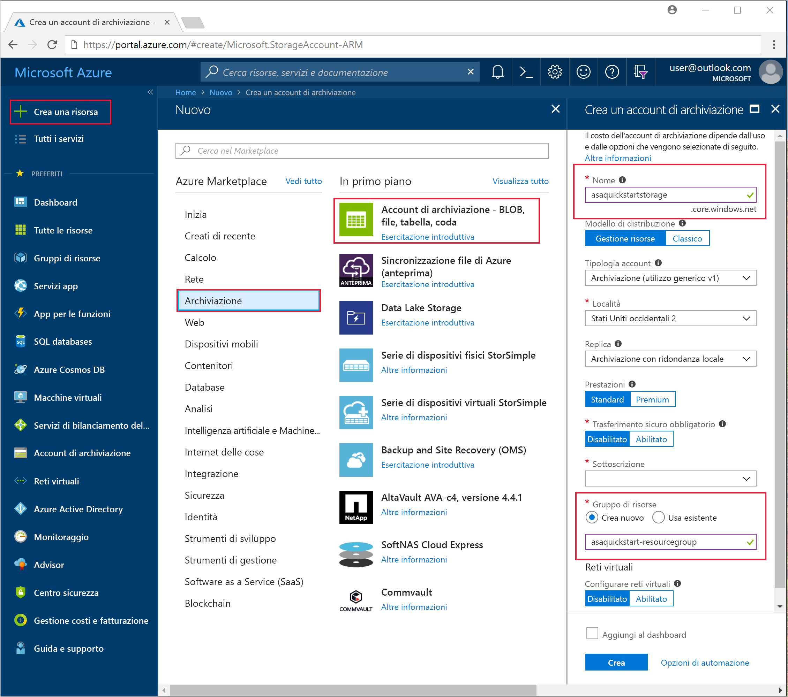
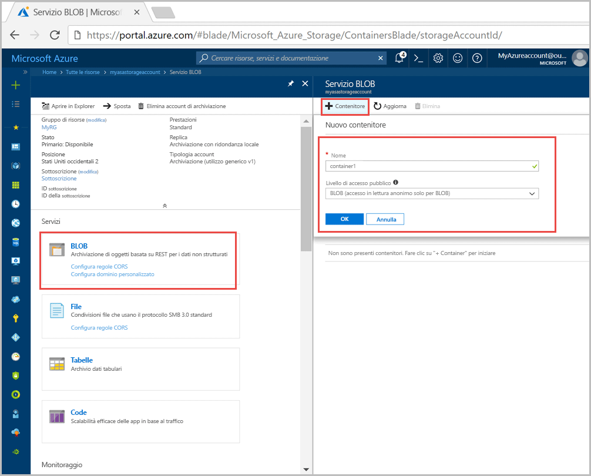
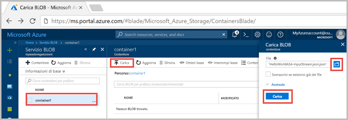
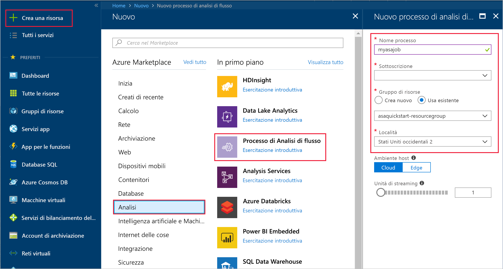
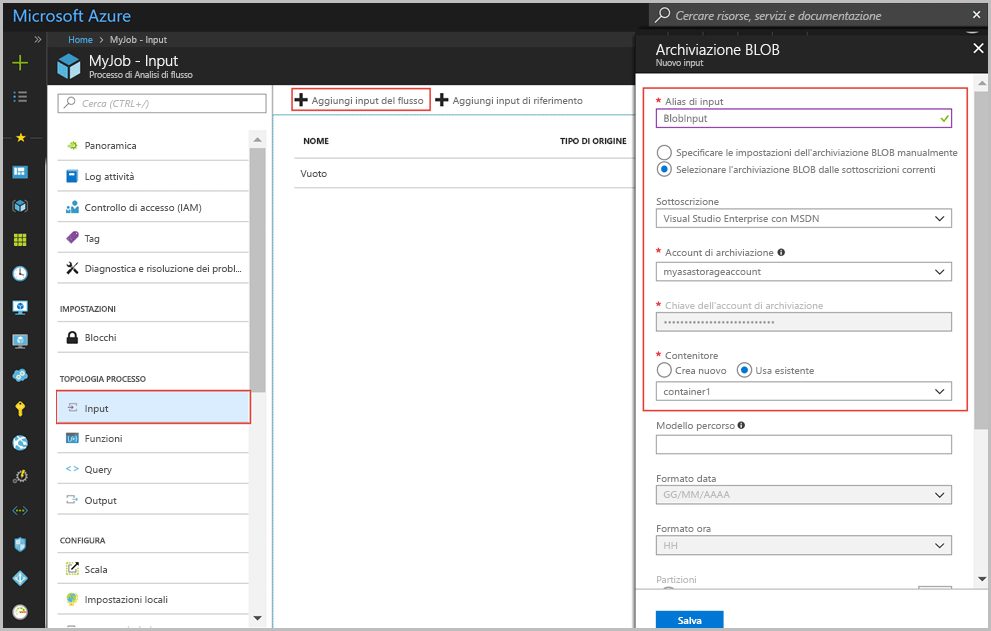
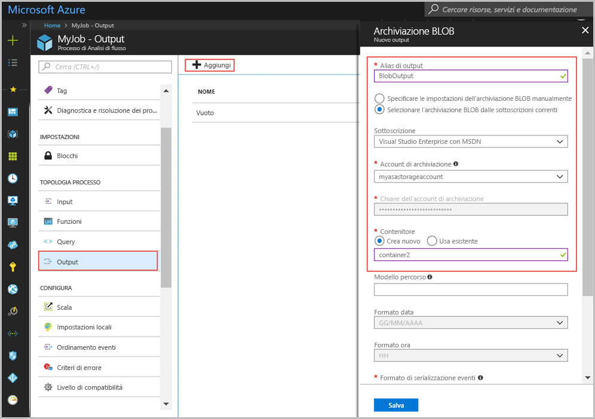
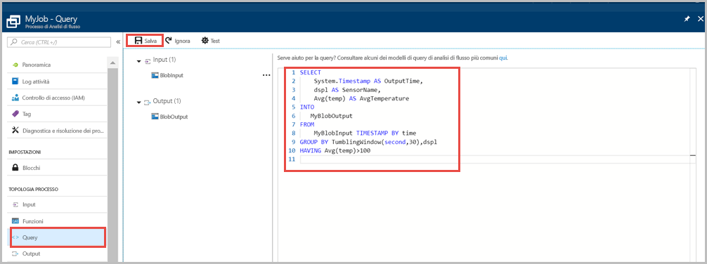
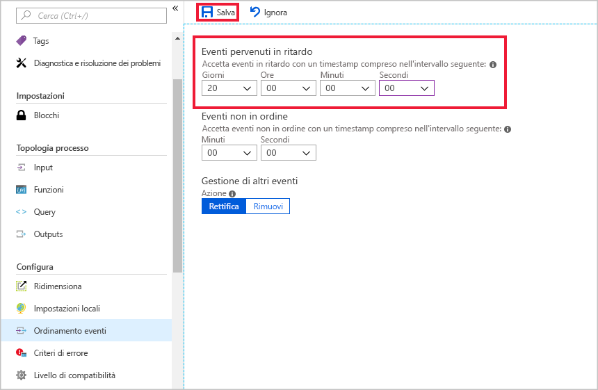
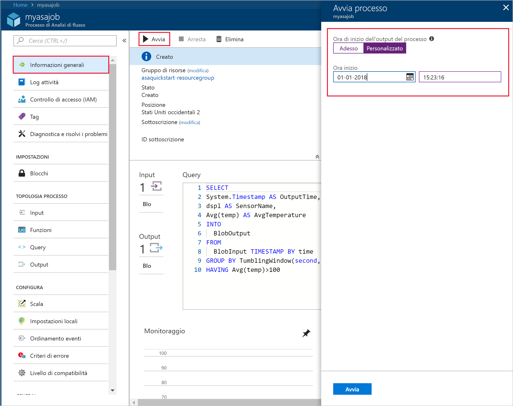
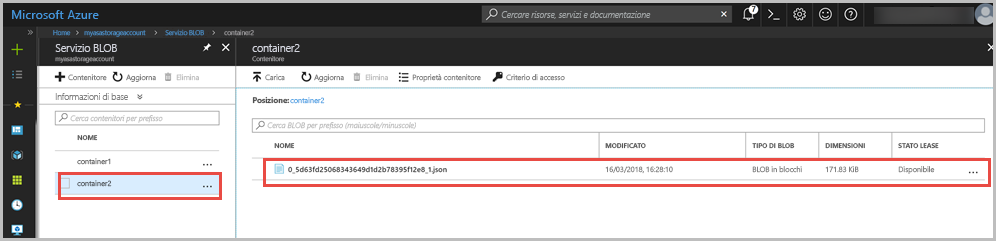

# <a name="quickstart-create-a-stream-analytics-job-by-using-the-azure-portal"></a>Guida introduttiva: Creare un processo di Analisi di flusso di Azure tramite il portale di Azure

Questa guida introduttiva descrive come iniziare a creare un processo di Analisi di flusso. In questa guida introduttiva si definirà un processo di Analisi di flusso che legge dati di esempio di sensori e filtra le righe che contengono una temperatura media maggiore di 100 per ogni 30 secondi. In questo articolo i dati vengono letti dall'archiviazione BLOB, vengono trasformati e quindi vengono scritti in un contenitore diverso nella stessa risorsa di archiviazione BLOB. Il file di dati di input utilizzati in questa guida introduttiva contiene i dati statici solo a scopo illustrativo. In uno scenario reale, si utilizza il flusso di dati di input per un processo di Analisi di flusso.

## <a name="before-you-begin"></a>Prima di iniziare

* Se non si ha una sottoscrizione di Azure, creare un [account gratuito](https://azure.microsoft.com/free/).

* Accedere al [portale di Azure](https://portal.azure.com/).

## <a name="prepare-the-input-data"></a>Preparare i dati di input

Prima di definire il processo di Analisi di flusso, è necessario preparare i dati configurati come input per il processo. Per preparare i dati di input richiesti dal processo, seguire questa procedura:

1. Scaricare i [dati di esempio dei sensori](https://raw.githubusercontent.com/Azure/azure-stream-analytics/master/Samples/GettingStarted/HelloWorldASA-InputStream.json) da GitHub. I dati di esempio contengono informazioni sui sensori nel formato JSON seguente:  

   ```json
   {
     "time": "2018-08-19T21:18:52.0000000",
     "dspl": "sensorC",
     "temp": 87,
     "hmdt": 44
   }
   ```
2. Accedere al [portale di Azure](https://portal.azure.com/).  

3. Nell'angolo superiore sinistro del portale di Azure selezionare **Crea risorsa** > **Archiviazione** > **Account di archiviazione**. Compilare la pagina del processo dell'account di archiviazione impostando **Nome** su "asaquickstartstorage", **Località** su "Stati Uniti occidentali 2", **Gruppo di risorse** su "asaquickstart-resourcegroup" (ospitare l'account di archiviazione nello stesso gruppo di risorse del processo di streaming per ottenere prestazioni migliori). Per le altre impostazioni è possibile lasciare i valori predefiniti.  

   

4. Nella pagina **Tutte le risorse** individuare l'account di archiviazione creato nel passaggio precedente. Aprire la pagina **Panoramica** e quindi il riquadro **BLOB**.  

5. Nella pagina **Servizio BLOB** selezionare **Contenitore**, impostare il campo **Nome** per il contenitore, ad esempio *container1*, modificare il **Livello di accesso pubblico** in Privato (accesso anonimo non consentito) e quindi selezionare **OK**.  

   

6. Andare al contenitore creato nel passaggio precedente. Selezionare **Carica** e caricare i dati del sensore ottenuti nel primo passaggio.  

   

## <a name="create-a-stream-analytics-job"></a>Creare un processo di Analisi di flusso.

1. Accedere al portale di Azure.

2. Selezionare **Crea risorsa** nell'angolo superiore sinistro del portale di Azure.  

3. Selezionare **Dati e analisi** > **Processo di Analisi di flusso** nell'elenco dei risultati.  

4. Compilare la pagina del processo di Analisi di flusso con le informazioni seguenti:

   |**Impostazione**  |**Valore consigliato**  |**Descrizione**  |
   |---------|---------|---------|
   |Nome processo   |  myasajob   |   Immettere un nome per identificare il processo di Analisi di flusso. Il nome del processo di Analisi di flusso può contenere solo caratteri alfanumerici, trattini e caratteri di sottolineatura e deve avere una lunghezza compresa tra 3 e 63 caratteri. |
   |Sottoscrizione  | \<Sottoscrizione in uso\> |  Selezionare la sottoscrizione di Azure che si vuole usare per il processo. |
   |Gruppo di risorse   |   asaquickstart-resourcegroup  |   Selezionare **Crea nuovo** e immettere il nome di un nuovo gruppo di risorse per l'account. |
   |Località  |  \<Selezionare l'area più vicina agli utenti\> | Selezionare la posizione geografica in cui è possibile ospitare il processo di Analisi di flusso. Usare la località più vicina agli utenti per ottenere prestazioni migliori e ridurre i costi di trasferimento dati. |
   |Unità di streaming  | 1  |   Le unità di streaming rappresentano le risorse di calcolo necessarie per eseguire un processo. Il valore predefinito di questa impostazione è 1. Per informazioni sul ridimensionamento delle unità di streaming, vedere l'articolo [Informazioni sulle unità di streaming](stream-analytics-streaming-unit-consumption.md).   |
   |Ambiente di hosting  |  Cloud  |   Per la distribuzione dei processi di Analisi di flusso è possibile scegliere tra Cloud o Edge. L'opzione Cloud consente di eseguire la distribuzione nel cloud di Azure, mentre l'opzione Edge consente di eseguire la distribuzione in un dispositivo IoT Edge. |

   

5. Selezionare la casella **Aggiungi al dashboard** per inserire il processo nel dashboard e quindi selezionare **Crea**.  

6. In alto a destra nella finestra del browser verrà visualizzato il messaggio "Distribuzione in corso". 

## <a name="configure-input-to-the-job"></a>Configurare l'input per il processo

In questa sezione viene configurata l'archiviazione BLOB come input per il processo di Analisi di flusso. Prima di configurare l'input, creare un account di archiviazione BLOB.  

### <a name="add-the-input"></a>Aggiungere l'input 

1. Passare al processo di Analisi di flusso.  

2. Selezionare **Input** > **Aggiungi input del flusso** > **Archivio BLOB**.  

3. Compilare la pagina **Archivio BLOB** con i valori seguenti:

   |**Impostazione**  |**Valore consigliato**  |**Descrizione**  |
   |---------|---------|---------|
   |Alias di input  |  BlobInput   |  Immettere un nome per identificare l'input del processo.   |
   |Sottoscrizione   |  \<Sottoscrizione in uso\> |  Selezionare la sottoscrizione di Azure che include l'account di archiviazione creato. L'account di archiviazione può essere incluso nella stessa sottoscrizione o in una diversa. Questo esempio presuppone che l'account di archiviazione sia stato creato all'interno della stessa sottoscrizione. |
   |Account di archiviazione  |  myasastorageaccount |  Scegliere o immettere il nome dell'account di archiviazione. I nomi degli account di archiviazione vengono rilevati automaticamente se sono stati creati nella stessa sottoscrizione. |
   |Contenitore  | container1 | Scegliere il nome del contenitore che include dati di esempio. I nomi dei contenitori vengono rilevati automaticamente se sono stati creati nella stessa sottoscrizione. |

4. Lasciare le altre opzioni impostate sui valori predefiniti e selezionare **Salva** per salvare le impostazioni.  

   
 
## <a name="configure-output-to-the-job"></a>Configurare l'output per il processo

1. Passare al processo di Analisi di flusso creato in precedenza.  

2. Selezionare **Output > Aggiungi > Archivio BLOB**.  

3. Compilare la pagina **Archivio BLOB** con i valori seguenti:

   |**Impostazione**  |**Valore consigliato**  |**Descrizione**  |
   |---------|---------|---------|
   |Alias di output |   BlobOutput   |   Immettere un nome per identificare l'output del processo. |
   |Sottoscrizione  |  \<Sottoscrizione in uso\>  |  Selezionare la sottoscrizione di Azure che include l'account di archiviazione creato. L'account di archiviazione può essere incluso nella stessa sottoscrizione o in una diversa. Questo esempio presuppone che l'account di archiviazione sia stato creato all'interno della stessa sottoscrizione. |
   |Account di archiviazione |  asaquickstartstorage |   Scegliere o immettere il nome dell'account di archiviazione. I nomi degli account di archiviazione vengono rilevati automaticamente se sono stati creati nella stessa sottoscrizione.       |
   |Contenitore |   container1  |  Selezionare il contenitore esistente creato nell'account di archiviazione.   |
   |Modello di percorso |   output  |  Immettere un nome da usare come percorso all'interno del contenitore esistente per l'output.   |

4. Lasciare le altre opzioni impostate sui valori predefiniti e selezionare **Salva** per salvare le impostazioni.  

   
 
## <a name="define-the-transformation-query"></a>Definire la query di trasformazione

1. Passare al processo di Analisi di flusso creato in precedenza.  

2. Selezionare **Query** e aggiornare la query nel modo seguente:  

   ```sql
   SELECT 
   System.Timestamp AS OutputTime,
   dspl AS SensorName,
   Avg(temp) AS AvgTemperature
   INTO
     BlobOutput
   FROM
     BlobInput TIMESTAMP BY time
   GROUP BY TumblingWindow(second,30),dspl
   HAVING Avg(temp)>100
   ```

3. In questo esempio la query legge i dati dal BLOB e li copia in un nuovo file nel BLOB. Selezionare **Salva**.  

   

## <a name="configure-late-arrival-policy"></a>Configurare il criterio di arrivo in ritardo

1. Passare al processo di Analisi di flusso creato in precedenza.

2. In **Configura** selezionare **Ordinamento eventi**.

3. Impostare **Eventi pervenuti in ritardo** su 20 giorni e selezionare **Salva**.

   

## <a name="start-the-stream-analytics-job-and-check-the-output"></a>Avviare il processo di Analisi di flusso e controllare l'output

1. Tornare alla pagina della panoramica del processo e selezionare **Avvia**.

2. In **Avvia processo** selezionare **Personalizzata** per il campo **Ora inizio**. Selezionare `2018-01-24` come data di inizio, ma non modificare l'ora. La data di inizio viene selezionata in quanto precede il timestamp dell'evento dai dati di esempio. Al termine, selezionare **Salva**.

   

3. Dopo pochi minuti, individuare nel portale l'account di archiviazione e il contenitore configurato come output per il processo. Selezionare il percorso di output. È ora possibile visualizzare il file di output nel contenitore. L'avvio del processo richiede pochi minuti la prima volta e, dopo l'avvio, l'esecuzione prosegue man mano che arrivano i dati.  

   

## <a name="clean-up-resources"></a>Pulire le risorse

Quando non sono più necessari, eliminare il gruppo di risorse, il processo di streaming e tutte le risorse correlate. Eliminando il processo si evita di pagare per le unità di streaming utilizzate dal processo. Se si prevede di usare il processo in futuro, è possibile arrestarlo e riavviarlo in un secondo momento, quando è necessario. Se non si intende continuare a usare il processo, eliminare tutte le risorse create tramite questa guida introduttiva seguendo questa procedura:

1. Scegliere **Gruppi di risorse** dal menu a sinistra del portale di Azure e quindi selezionare il nome della risorsa creata.  

2. Nella pagina del gruppo di risorse selezionare **Elimina**, digitare il nome della risorsa da eliminare nella casella di testo e quindi selezionare **Elimina**.

## <a name="next-steps"></a>Passaggi successivi

In questa guida introduttiva è stato distribuito un semplice processo di Analisi di flusso con il portale di Azure. È anche possibile distribuire processi di Analisi di flusso usando [PowerShell](stream-analytics-quick-create-powershell.md) e [Visual Studio](stream-analytics-quick-create-vs.md).

Per informazioni sulla configurazione di altre origini di input e sull'esecuzione del rilevamento in tempo reale, continuare con l'articolo seguente:

> [!div class="nextstepaction"]
> [Rilevamento delle frodi in tempo reale tramite Analisi di flusso di Azure](stream-analytics-real-time-fraud-detection.md)

