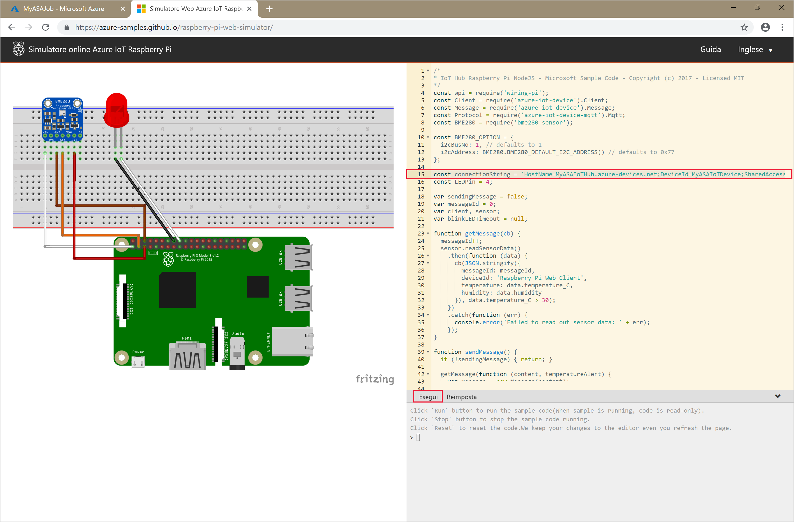

# <a name="quickstart-create-a-stream-analytics-job-using-azure-powershell"></a>Guida introduttiva: Creare un processo di Analisi di flusso usando Azure PowerShell

Il modulo Azure PowerShell viene usato per creare e gestire le risorse di Azure usando cmdlet o script di PowerShell. Questa guida introduttiva illustra in dettaglio l'uso del modulo Azure PowerShell per distribuire ed eseguire un processo di Analisi di flusso di Azure. 

Il processo di esempio legge i dati in streaming da un dispositivo hub IoT. I dati di input sono generati da un simulatore online Raspberry Pi. Il processo Analisi di flusso trasforma quindi i dati usando il linguaggio di query di analisi di flusso per filtrare i messaggi con una temperatura superiore a 27°. Scrive infine gli eventi di output risultanti in un file nell'archiviazione BLOB. 

## <a name="before-you-begin"></a>Prima di iniziare

[!INCLUDE [updated-for-az](../../includes/updated-for-az.md)]

* Se non si ha una sottoscrizione di Azure, creare un [account gratuito](https://azure.microsoft.com/free/).  

* Per questa guida di avvio rapido è richiesto il modulo Azure PowerShell. Eseguire `Get-Module -ListAvailable Az` per trovare la versione installata nel computer locale. Se è necessario eseguire l'installazione o l'aggiornamento, vedere come [installare il modulo Azure PowerShell](https://docs.microsoft.com/powershell/azure/install-Az-ps).

* Alcune azioni dell'hub IoT non sono supportate da Azure PowerShell e devono essere completate usando l'interfaccia della riga di comando di Azure versione 2.0.24 o successiva e la relativa estensione IoT. [Installare l'interfaccia della riga di comando di Azure](https://docs.microsoft.com/cli/azure/install-azure-cli?view=azure-cli-latest) e usare `az extension add --name azure-cli-iot-ext` per installare l'estensione IoT.


## <a name="sign-in-to-azure"></a>Accedere ad Azure

Accedere alla sottoscrizione di Azure con il comando `Connect-AzAccount` e immettere le credenziali di Azure nella finestra del browser a comparsa:

```powershell
# Connect to your Azure account
Connect-AzAccount
```

Se si hanno più sottoscrizioni, selezionare quella che si vuole usare per questa guida introduttiva eseguendo i cmdlet seguenti. Assicurarsi di sostituire `<your subscription name>` con il nome della sottoscrizione:  

```powershell
# List all available subscriptions.
Get-AzSubscription

# Select the Azure subscription you want to use to create the resource group and resources.
Get-AzSubscription -SubscriptionName "<your subscription name>" | Select-AzSubscription
```

## <a name="create-a-resource-group"></a>Creare un gruppo di risorse

Creare un gruppo di risorse di Azure con [New-AzResourceGroup](https://docs.microsoft.com/powershell/module/az.resources/new-azresourcegroup). Un gruppo di risorse è un contenitore logico in cui le risorse di Azure vengono distribuite e gestite.

```powershell
$resourceGroup = "StreamAnalyticsRG"
$location = "WestUS2"
New-AzResourceGroup `
   -Name $resourceGroup `
   -Location $location 
```

## <a name="prepare-the-input-data"></a>Preparare i dati di input

Prima di definire il processo di Analisi di flusso, preparare i dati configurati come input per il processo.

Il blocco di codice dell'interfaccia della riga di comando di Azure riportato di seguito esegue molti comandi per preparare i dati di input richiesti dal processo. Esaminare le sezioni per comprendere il codice.

1. Nella finestra di PowerShell eseguire il comando [az login](https://docs.microsoft.com/cli/azure/authenticate-azure-cli?view=azure-cli-latest) per accedere all'account di Azure. 

   Dopo aver effettuato l'accesso, l'interfaccia della riga di comando di Azure restituisce un elenco delle sottoscrizioni. Copiare la sottoscrizione in uso per questa guida introduttiva ed eseguire il comando [az account set](https://docs.microsoft.com/cli/azure/manage-azure-subscriptions-azure-cli?view=azure-cli-latest#change-the-active-subscription) per selezionare tale sottoscrizione. Scegliere la stessa sottoscrizione selezionata nella sezione precedente con PowerShell. Assicurarsi di sostituire `<your subscription name>` con il nome della sottoscrizione.

   ```azurecli
   az login
   
   az account set --subscription "<your subscription>"
   ```

2. Creare un hub IoT con il comando [az iot hub create](../iot-hub/iot-hub-create-using-cli.md#create-an-iot-hub). Questo esempio crea un hub IoT denominato **MyASAIoTHub**. Poiché i nomi degli hub IoT sono univoci, è necessario indicare un nome personalizzato per il proprio hub IoT. Impostare lo SKU su F1 per usare il livello gratuito se è disponibile con la sottoscrizione. In caso contrario, scegliere il successivo livello più basso.

   ```azurecli
   az iot hub create --name "<your IoT Hub name>" --resource-group $resourceGroup --sku S1
   ```

   Dopo aver creato l'hub IoT, ottenere la stringa di connessione dell'hub IoT usando il comando [az iot hub show-connection-string](https://docs.microsoft.com/cli/azure/iot/hub?view=azure-cli-latest). Copiare l'intera stringa di connessione e salvarla per quando si aggiungerà l'hub IoT come input nel processo di Analisi di flusso di Azure.
   
   ```azurecli
   az iot hub show-connection-string --hub-name "MyASAIoTHub"
   ```

3. Aggiungere un dispositivo all'hub IoT usando il comando [az iothub device-identity create](../iot-hub/quickstart-send-telemetry-c.md#register-a-device). Questo esempio crea un dispositivo denominato **MyASAIoTDevice**.

   ```azurecli
   az iot hub device-identity create --hub-name "MyASAIoTHub" --device-id "MyASAIoTDevice"
   ```

4. Ottenere la stringa di connessione del dispositivo usando il comando [az iot hub device-identity show-connection-string](/cli/azure/ext/azure-cli-iot-ext/iot/hub/device-identity#ext-azure-cli-iot-ext-az-iot-hub-device-identity-show-connection-string). Copiare l'intera stringa di connessione e salvarla per quando si creerà il simulatore Raspberry Pi.

   ```azurecli
   az iot hub device-identity show-connection-string --hub-name "MyASAIoTHub" --device-id "MyASAIoTDevice" --output table
   ```

   **Esempio di output:**

   ```azurecli
   HostName=MyASAIoTHub.azure-devices.net;DeviceId=MyASAIoTDevice;SharedAccessKey=a2mnUsg52+NIgYudxYYUNXI67r0JmNubmfVafojG8=
   ```

## <a name="create-blob-storage"></a>Creare l'archiviazione BLOB

Il seguente blocco di codice di Azure PowerShell usa comandi per creare l'archiviazione BLOB che viene usata per l'output del processo. Esaminare le sezioni per comprendere il codice.

1. Creare un account di archiviazione standard per uso generico usando il cmdlet [New-AzStorageAccount](https://docs.microsoft.com/powershell/module/az.storage/New-azStorageAccount).  Questo esempio crea un account di archiviazione denominato **myasaquickstartstorage** con archiviazione con ridondanza locale e con crittografia BLOB abilitata per impostazione predefinita.  
   
2. Recuperare il contesto `$storageAccount.Context` che definisce l'account di archiviazione da usare. Quando si usano gli account di archiviazione, si può fare riferimento al contesto anziché fornire ripetutamente le credenziali. 

3. Creare un contenitore di archiviazione con [New-AzStorageContainer](https://docs.microsoft.com/powershell/module/azure.storage/new-AzStoragecontainer).

4. Copiare la chiave di archiviazione restituita dal codice e salvarla per creare l'output del processo di streaming in un secondo momento.

   ```powershell
   $storageAccountName = "myasaquickstartstorage"
   $storageAccount = New-AzStorageAccount `
     -ResourceGroupName $resourceGroup `
     -Name $storageAccountName `
     -Location $location `
     -SkuName Standard_LRS `
     -Kind Storage
   
   $ctx = $storageAccount.Context
   $containerName = "container1"
   
   New-AzStorageContainer `
     -Name $containerName `
     -Context $ctx
   
   $storageAccountKey = (Get-AzStorageAccountKey `
     -ResourceGroupName $resourceGroup `
     -Name $storageAccountName).Value[0]
   
   Write-Host "The <storage account key> placeholder needs to be replaced in your output json files with this key value:" 
   Write-Host $storageAccountKey -ForegroundColor Cyan
   ```

## <a name="create-a-stream-analytics-job"></a>Creare un processo di Analisi di flusso.

Creare un processo di Analisi di flusso con il cmdlet [New-AzStreamAnalyticsJob](https://docs.microsoft.com/powershell/module/az.streamanalytics/new-azstreamanalyticsjob?view=azurermps-5.4.0). Questo cmdlet accetta il nome del processo, il nome del gruppo di risorse e la definizione del processo come parametri. Il nome del processo può essere un qualsiasi nome descrittivo che identifica il processo. Può contenere solo caratteri alfanumerici, trattini e caratteri di sottolineatura e deve avere una lunghezza compresa tra 3 e 63 caratteri. La definizione del processo è un file JSON che contiene le proprietà necessarie per creare un processo. Nel computer locale creare un file denominato `JobDefinition.json` e aggiungere i dati JSON seguenti:

```json
{    
   "location":"WestUS2",  
   "properties":{    
      "sku":{    
         "name":"standard"  
      },  
      "eventsOutOfOrderPolicy":"adjust",  
      "eventsOutOfOrderMaxDelayInSeconds":10,  
      "compatibilityLevel": 1.1
   }
}
```

Eseguire quindi il cmdlet `New-AzStreamAnalyticsJob`. Sostituire il valore della variabile `jobDefinitionFile` con il percorso in cui è stato archiviato il file JSON della definizione del processo. 

```powershell
$jobName = "MyStreamingJob"
$jobDefinitionFile = "C:\JobDefinition.json"
New-AzStreamAnalyticsJob `
  -ResourceGroupName $resourceGroup `
  -File $jobDefinitionFile `
  -Name $jobName `
  -Force 
```

## <a name="configure-input-to-the-job"></a>Configurare l'input per il processo

Aggiungere un input al processo tramite il cmdlet [New-AzStreamAnalyticsInput](https://docs.microsoft.com/powershell/module/az.streamanalytics/new-azstreamanalyticsinput?view=azurermps-5.4.0). Questo cmdlet accetta il nome del processo, il nome dell'input del processo, il nome del gruppo di risorse e la definizione dell'input del processo come parametri. La definizione dell'input del processo è un file JSON che contiene le proprietà necessarie per configurare l'input del processo. In questo esempio come input verrà creato un archivio BLOB. 

Nel computer locale creare un file denominato `JobInputDefinition.json` e aggiungere i dati JSON seguenti. Assicurarsi di sostituire il valore di `accesspolicykey` con la parte `SharedAccessKey` della stringa di connessione dell'hub IoT salvato in una sezione precedente.

```json
{
    "properties": {
        "type": "Stream",
        "datasource": {
            "type": "Microsoft.Devices/IotHubs",
            "properties": {
                "iotHubNamespace": "MyASAIoTHub",
                "sharedAccessPolicyName": "iothubowner",
                "sharedAccessPolicyKey": "accesspolicykey",
                "endpoint": "messages/events",
                "consumerGroupName": "$Default"
                }
        },
        "compression": {
            "type": "None"
        },
        "serialization": {
            "type": "Json",
            "properties": {
                "encoding": "UTF8"
            }
        }
    },
    "name": "IoTHubInput",
    "type": "Microsoft.StreamAnalytics/streamingjobs/inputs"
}
```

Eseguire quindi il cmdlet `New-AzStreamAnalyticsInput` e assicurarsi di sostituire il valore della variabile `jobDefinitionFile` con il percorso in cui è stato archiviato il file JSON della definizione dell'input del processo. 

```powershell
$jobInputName = "IoTHubInput"
$jobInputDefinitionFile = "C:\JobInputDefinition.json"
New-AzStreamAnalyticsInput `
  -ResourceGroupName $resourceGroup `
  -JobName $jobName `
  -File $jobInputDefinitionFile `
  -Name $jobInputName 
```

## <a name="configure-output-to-the-job"></a>Configurare l'output per il processo

Aggiungere un output al processo tramite il cmdlet [New-AzStreamAnalyticsOutput](https://docs.microsoft.com/powershell/module/az.streamanalytics/new-azstreamanalyticsoutput?view=azurermps-5.4.0). Questo cmdlet accetta il nome del processo, il nome dell'output del processo, il nome del gruppo di risorse e la definizione dell'output del processo come parametri. La definizione dell'output del processo è un file JSON che contiene le proprietà necessarie per configurare l'output del processo. In questo esempio come output viene usato l'archivio BLOB. 

Nel computer locale creare un file denominato `JobOutputDefinition.json` e aggiungere i dati JSON seguenti. Assicurarsi di sostituire il valore di `accountKey` con la chiave di accesso dell'account di archiviazione corrispondente al valore archiviato in $storageAccountKey. 

```json
{
    "properties": {
        "datasource": {
            "type": "Microsoft.Storage/Blob",
            "properties": {
                "storageAccounts": [
                    {
                      "accountName": "asaquickstartstorage",
                      "accountKey": "<storage account key>"
                    }],
                "container": "container1",
                "pathPattern": "output/",
                "dateFormat": "yyyy/MM/dd",
                "timeFormat": "HH"
            }
        },
        "serialization": {
            "type": "Json",
            "properties": {
                "encoding": "UTF8",
                "format": "LineSeparated"
            }
        }
    },
    "name": "BlobOutput",
    "type": "Microsoft.StreamAnalytics/streamingjobs/outputs"
}
```

Eseguire quindi il cmdlet `New-AzStreamAnalyticsOutput`. Assicurarsi di sostituire il valore della variabile `jobOutputDefinitionFile` con il percorso in cui è stato archiviato il file JSON della definizione dell'output del processo. 

```powershell
$jobOutputName = "BlobOutput"
$jobOutputDefinitionFile = "C:\JobOutputDefinition.json"
New-AzStreamAnalyticsOutput `
  -ResourceGroupName $resourceGroup `
  -JobName $jobName `
  -File $jobOutputDefinitionFile `
  -Name $jobOutputName -Force 
```

## <a name="define-the-transformation-query"></a>Definire la query di trasformazione

Aggiungere una trasformazione al processo tramite il cmdlet [New-AzStreamAnalyticsTransformation](https://docs.microsoft.com/powershell/module/az.streamanalytics/new-azstreamanalyticstransformation?view=azurermps-5.4.0). Questo cmdlet accetta il nome del processo, il nome della trasformazione del processo, il nome del gruppo di risorse e la definizione della trasformazione del processo come parametri. Nel computer locale creare un file denominato `JobTransformationDefinition.json` e aggiungere i dati JSON seguenti. Il file JSON contiene un parametro di query che definisce la query di trasformazione:

```json
{     
   "name":"MyTransformation",  
   "type":"Microsoft.StreamAnalytics/streamingjobs/transformations",  
   "properties":{    
      "streamingUnits":1,  
      "script":null,  
      "query":" SELECT * INTO BlobOutput FROM IoTHubInput HAVING Temperature > 27"  
   }  
}
```

Eseguire quindi il cmdlet `New-AzStreamAnalyticsTransformation`. Assicurarsi di sostituire il valore della variabile `jobTransformationDefinitionFile` con il percorso in cui è stato archiviato il file JSON della definizione della trasformazione del processo. 

```powershell
$jobTransformationName = "MyJobTransformation"
$jobTransformationDefinitionFile = "C:\JobTransformationDefinition.json"
New-AzStreamAnalyticsTransformation `
  -ResourceGroupName $resourceGroup `
  -JobName $jobName `
  -File $jobTransformationDefinitionFile `
  -Name $jobTransformationName -Force
```
## <a name="run-the-iot-simulator"></a>Eseguire il simulatore IoT

1. Aprire il [simulatore online Azure IoT Raspberry Pi](https://azure-samples.github.io/raspberry-pi-web-simulator/).

2. Sostituire il segnaposto nella riga 15 con l'intera stringa di connessione del dispositivo hub IoT di Azure salvato in una sezione precedente.

3. Fare clic su **Run**. L'output mostra i dati del sensore e i messaggi inviati all'hub IoT.

   

## <a name="start-the-stream-analytics-job-and-check-the-output"></a>Avviare il processo di Analisi di flusso e controllare l'output

Avviare il processo tramite il cmdlet [Start-AzStreamAnalyticsJob](https://docs.microsoft.com/powershell/module/az.streamanalytics/start-azstreamanalyticsjob?view=azurermps-5.4.0). Questo cmdlet accetta il nome del processo, il nome del gruppo di risorse, la modalità di avvio dell'output e l'ora di inizio come parametri. `OutputStartMode` accetta i valori `JobStartTime`, `CustomTime` o `LastOutputEventTime`. Per altre informazioni sugli elementi a cui fanno riferimento ognuno di questi valori, vedere la sezione sui [parametri](https://docs.microsoft.com/powershell/module/az.streamanalytics/start-azstreamanalyticsjob?view=azurermps-5.4.0) nella documentazione di PowerShell. 

Dopo aver eseguito il cmdlet seguente, verrà restituito `True` come output se il processo viene avviato. Nel contenitore di archiviazione viene creata una cartella di output con i dati trasformati. 

```powershell
Start-AzStreamAnalyticsJob `
  -ResourceGroupName $resourceGroup `
  -Name $jobName `
  -OutputStartMode 'JobStartTime'
```

## <a name="clean-up-resources"></a>Pulire le risorse

Quando non sono più necessari, eliminare il gruppo di risorse, il processo di streaming e tutte le risorse correlate. Eliminando il processo si evita di pagare per le unità di streaming usate dal processo. Se si prevede di usare il processo in futuro, è possibile non eliminarlo e arrestarlo per il momento. Se non si intende continuare a usare il processo, eliminare tutte le risorse create con questa guida introduttiva eseguendo il cmdlet seguente:

```powershell
Remove-AzResourceGroup `
  -Name $resourceGroup 
```

## <a name="next-steps"></a>Passaggi successivi

In questa guida introduttiva è stato distribuito un semplice processo di Analisi di flusso con PowerShell. È anche possibile distribuire processi di Analisi di flusso usando il [portale di Azure](stream-analytics-quick-create-portal.md) e [Visual Studio](stream-analytics-quick-create-vs.md).

Per informazioni sulla configurazione di altre origini di input e sull'esecuzione del rilevamento in tempo reale, continuare con l'articolo seguente:

> [!div class="nextstepaction"]
> [Rilevamento delle frodi in tempo reale tramite Analisi di flusso di Azure](stream-analytics-real-time-fraud-detection.md)
