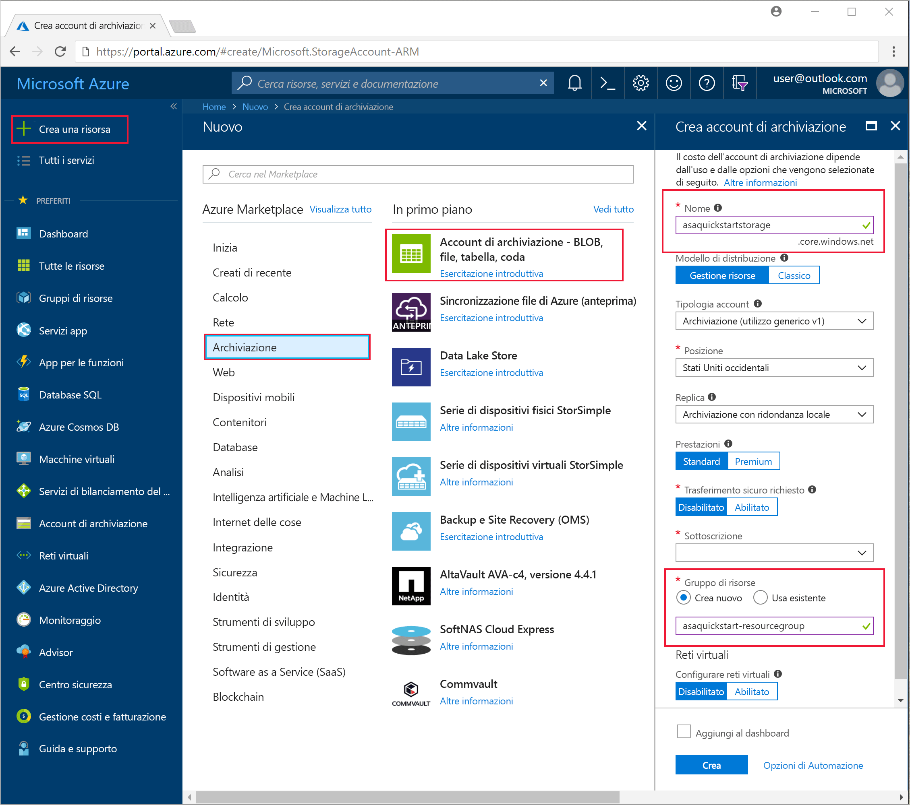
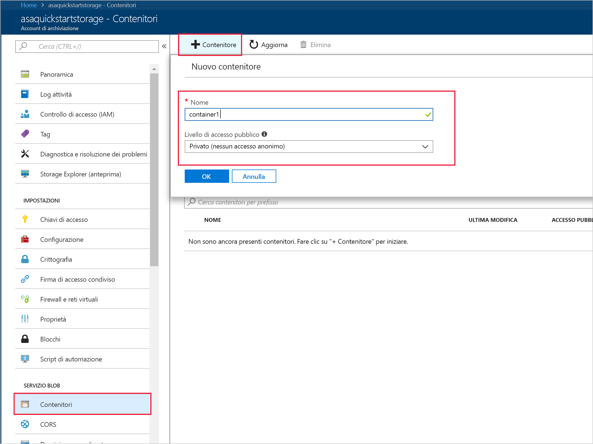
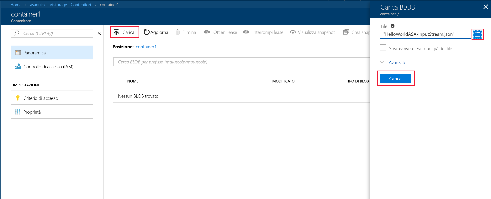

# <a name="quickstart-create-a-stream-analytics-job-by-using-the-azure-stream-analytics-tools-for-visual-studio"></a>Guida introduttiva: Creare un processo di Analisi di flusso con gli strumenti di Analisi di flusso di Azure per Visual Studio

Questa guida introduttiva descrive come creare ed eseguire un processo di Analisi di flusso usando gli strumenti di Analisi di flusso di Azure per Visual Studio. Il processo di esempio legge i dati in streaming dall'archivio BLOB di Azure. Il file di dati di input utilizzati in questa guida introduttiva contiene i dati statici solo a scopo illustrativo. In uno scenario reale, si utilizza il flusso di dati di input per un processo di Analisi di flusso. In questa guida introduttiva viene definito un processo che calcola la temperatura media quando supera i 100° e scrive gli eventi di output risultanti in un nuovo file.

## <a name="before-you-begin"></a>Prima di iniziare

* Se non si ha una sottoscrizione di Azure, creare un [account gratuito](https://azure.microsoft.com/free/).

* Accedere al [portale di Azure](https://portal.azure.com/).

* Installare Visual Studio 2017, Visual Studio 2015 o Visual Studio 2013 Update 4. Sono supportate le edizioni Enterprise (Ultimate/Premium), Professional e Community. L'edizione Express non è supportata.

* Seguire le [istruzioni di installazione](https://docs.microsoft.com/azure/stream-analytics/stream-analytics-tools-for-visual-studio-install) per installare gli strumenti di Analisi di flusso per Visual Studio.

## <a name="prepare-the-input-data"></a>Preparare i dati di input

Prima di definire il processo di Analisi di flusso, è necessario preparare i dati configurati come input per il processo. Per preparare i dati di input richiesti dal processo, seguire questa procedura:

1. Scaricare i [dati di esempio dei sensori](https://raw.githubusercontent.com/Azure/azure-stream-analytics/master/Samples/GettingStarted/HelloWorldASA-InputStream.json) da GitHub. I dati di esempio contengono informazioni sui sensori nel formato JSON seguente:  

   ```json
   {
     "time": "2018-01-26T21:18:52.0000000",
     "dspl": "sensorC",
     "temp": 87,
     "hmdt": 44
   }
   ```
2. Accedere al [portale di Azure](https://portal.azure.com/).

3. Nell'angolo superiore sinistro del portale di Azure selezionare **Crea risorsa** > **Archiviazione** > **Account di archiviazione**. Compilare la pagina del processo dell'account di archiviazione impostando **Nome** su "asaquickstartstorage", **Località** su "Stati Uniti occidentali", **Gruppo di risorse** su "asaquickstart-resourcegroup" (ospitare l'account di archiviazione nello stesso gruppo di risorse del processo di streaming per ottenere prestazioni migliori). Per le altre impostazioni è possibile lasciare i valori predefiniti.  

   

4. Nella pagina **Tutte le risorse** individuare l'account di archiviazione creato nel passaggio precedente. Aprire la pagina **Panoramica** e quindi il riquadro **BLOB**.  

5. Nella pagina **Servizio BLOB** selezionare **Contenitore**, specificare un **Nome** per il contenitore, ad esempio *container1* > scegliere **OK**.  

   

6. Andare al contenitore creato nel passaggio precedente. Selezionare **Carica** e caricare i dati del sensore ottenuti nel primo passaggio.  

   

## <a name="create-a-stream-analytics-project"></a>Creare un progetto di Analisi di flusso

1. Avviare Visual Studio.

2. Fare clic su **File > Nuovo progetto**.  

3. Nell'elenco dei modelli a sinistra selezionare **Analisi di flusso** e quindi **Applicazione Analisi di flusso di Azure**.  

4. Inserire i valori appropriati per il progetto in **Nome**, **Percorso** e **Nome soluzione** e scegliere **OK**.

   

Si notino gli elementi che sono inclusi in un progetto di Analisi di flusso di Azure.

   


## <a name="choose-the-required-subscription"></a>Scegliere la sottoscrizione richiesta

1. In Visual Studio dal menu **Visualizza** scegliere **Esplora server**.

2. Fare clic con il pulsante destro del mouse su **Azure**, selezionare **Connetti a sottoscrizione di Microsoft Azure** e quindi accedere con l'account di Azure.

## <a name="define-input"></a>Definire l'input

1. In **Esplora soluzioni** espandere il nodo **Input** e fare doppio clic su **Input.json**.

2. Compilare **Stream Analytics Input Configuration** (Configurazione input Analisi di flusso) con i valori seguenti:

   |**Impostazione**  |**Valore consigliato**  |**Descrizione**   |
   |---------|---------|---------|
   |Alias di input  |  Input   |  Immettere un nome per identificare l'input del processo.   |
   |Tipo di origine   |  Flusso dati |  Scegliere l'origine di input appropriata: Flusso dati o Dati di riferimento.   |
   |Sorgente  |  Archiviazione BLOB |  Scegliere l'origine di input appropriata.   |
   |Risorsa  | Scegliere l'origine dati dall'account corrente | Scegliere di immettere i dati manualmente o selezionare un account esistente.   |
   |Sottoscrizione  |  \<Sottoscrizione in uso\>   | Selezionare la sottoscrizione di Azure che include l'account di archiviazione creato. L'account di archiviazione può essere incluso nella stessa sottoscrizione o in una diversa. Questo esempio presuppone che l'account di archiviazione sia stato creato all'interno della stessa sottoscrizione.   |
   |Account di archiviazione  |  asaquickstartstorage   |  Scegliere o immettere il nome dell'account di archiviazione. I nomi degli account di archiviazione vengono rilevati automaticamente se sono stati creati nella stessa sottoscrizione.   |
   |Contenitore  |  container1   |  Selezionare il contenitore esistente creato nell'account di archiviazione.   |
   
3. Lasciare le altre opzioni impostate sui valori predefiniti e selezionare **Salva** per salvare le impostazioni.  

   

## <a name="define-output"></a>Definire l'output

1. In **Esplora soluzioni** espandere il nodo **Output** e fare doppio clic su **Output.json**.

2. Compilare **Stream Analytics Output Configuration** (Configurazione output Analisi di flusso) con i valori seguenti:

   |**Impostazione**  |**Valore consigliato**  |**Descrizione**   |
   |---------|---------|---------|
   |Alias di output  |  Output   |  Immettere un nome per identificare l'output del processo.   |
   |Sink   |  Archiviazione BLOB |  Scegliere il sink appropriato.    |
   |Risorsa  |  Specificare le impostazioni dell'origine dati manualmente |  Scegliere di immettere i dati manualmente o selezionare un account esistente.   |
   |Sottoscrizione  |  \<Sottoscrizione in uso\>   | Selezionare la sottoscrizione di Azure che include l'account di archiviazione creato. L'account di archiviazione può essere incluso nella stessa sottoscrizione o in una diversa. Questo esempio presuppone che l'account di archiviazione sia stato creato all'interno della stessa sottoscrizione.   |
   |Account di archiviazione  |  asaquickstartstorage   |  Scegliere o immettere il nome dell'account di archiviazione. I nomi degli account di archiviazione vengono rilevati automaticamente se sono stati creati nella stessa sottoscrizione.   |
   |Contenitore  |  container1   |  Selezionare il contenitore esistente creato nell'account di archiviazione.   |
   |Modello di percorso  |  output   |  Immettere il nome di un percorso di file da creare all'interno del contenitore.   |
   
3. Lasciare le altre opzioni impostate sui valori predefiniti e selezionare **Salva** per salvare le impostazioni.  

   

## <a name="define-the-transformation-query"></a>Definire la query di trasformazione

1. Aprire **Script.asaql** da **Esplora soluzioni** in Visual Studio.

2. Aggiungere la query seguente:

   ```sql
   SELECT 
   System.Timestamp AS OutputTime,
   dspl AS SensorName,
   Avg(temp) AS AvgTemperature
   INTO
     Output
   FROM
     Input TIMESTAMP BY time
   GROUP BY TumblingWindow(second,30),dspl
   HAVING Avg(temp)>100
   ```

## <a name="submit-a-stream-analytics-query-to-azure"></a>Inviare ad Azure una query di Analisi di flusso

1. Nell'**Editor di query** selezionare **Invia ad Azure** nell'editor di script.

2. Selezionare **Create a New Azure Stream Analytics job** (Crea un nuovo processo di Analisi di flusso di Azure) e immettere un **Nome processo**. Scegliere la **Sottoscrizione**, il **Gruppo di risorse** e il **Percorso** usati all'inizio della guida introduttiva.

   

## <a name="start-the-stream-analytics-job-and-check-output"></a>Avviare il processo di Analisi di flusso e controllare l'output

1. Quando il processo è stato creato, viene aperta automaticamente la visualizzazione del processo. Fare clic sulla freccia verde per avviare il processo.

   

2. Modificare la data **Ora personalizzata** in `2018-01-01` e selezionare **Avvia**.

   

3. Si noti che lo stato del processo viene modificato in **In esecuzione** e che sono presenti eventi di input/output. L'operazione potrebbe richiedere alcuni minuti.

   

4. Per visualizzare i risultati, dal menu **Visualizza** scegliere **Cloud Explorer** e passare all'account di archiviazione nel gruppo di risorse. In **Contenitori BLOB** fare doppio clic su **container1** e quindi sul percorso del file di **output**.

   

## <a name="clean-up-resources"></a>Pulire le risorse

Quando non sono più necessari, eliminare il gruppo di risorse, il processo di streaming e tutte le risorse correlate. Eliminando il processo si evita di pagare per le unità di streaming utilizzate dal processo. Se si prevede di usare il processo in futuro, è possibile arrestarlo e riavviarlo in un secondo momento, quando è necessario. Se non si intende continuare a usare il processo, eliminare tutte le risorse create tramite questa guida introduttiva seguendo questa procedura:

1. Scegliere **Gruppi di risorse** dal menu a sinistra del portale di Azure e quindi selezionare il nome della risorsa creata.  

2. Nella pagina del gruppo di risorse selezionare **Elimina**, digitare il nome della risorsa da eliminare nella casella di testo e quindi selezionare **Elimina**.

## <a name="next-steps"></a>Passaggi successivi

In questa guida introduttiva è stato distribuito un semplice processo di Analisi di flusso con Visual Studio. È anche possibile distribuire processi di Analisi di flusso usando il [portale di Azure](stream-analytics-quick-create-portal.md) e [PowerShell](stream-analytics-quick-create-powershell.md). 

Per informazioni sulla configurazione di altre origini di input e sull'esecuzione del rilevamento in tempo reale, continuare con l'articolo seguente:

> [!div class="nextstepaction"]
> [Rilevamento delle frodi in tempo reale tramite Analisi di flusso di Azure](stream-analytics-real-time-fraud-detection.md)
