# <a name="quickstart-create-an-azure-stream-analytics-job-by-using-visual-studio"></a>Guida introduttiva: Creare un processo di Analisi di flusso di Azure con Visual Studio Code

Questa guida introduttiva descrive come creare ed eseguire un processo di Analisi di flusso usando gli strumenti di Analisi di flusso di Azure per Visual Studio. Il processo di esempio legge i dati in streaming da un dispositivo hub IoT. Viene definito un processo che calcola la temperatura media quando supera i 27° e scrive gli eventi di output risultanti in un nuovo file nell'archiviazione BLOB.

## <a name="before-you-begin"></a>Prima di iniziare

* Se non si ha una sottoscrizione di Azure, creare un [account gratuito](https://azure.microsoft.com/free/).

* Accedere al [portale di Azure](https://portal.azure.com/).

* Installare Visual Studio 2019, Visual Studio 2015 o Visual Studio 2013 Update 4. Sono supportate le edizioni Enterprise (Ultimate/Premium), Professional e Community. L'edizione Express non è supportata.

* Seguire le [istruzioni di installazione](https://docs.microsoft.com/azure/stream-analytics/stream-analytics-tools-for-visual-studio-install) per installare gli strumenti di Analisi di flusso per Visual Studio.

## <a name="prepare-the-input-data"></a>Preparare i dati di input

Prima di definire il processo di Analisi di flusso, è necessario preparare i dati, che saranno poi configurati come input per il processo. Per preparare i dati di input richiesti dal processo, completare questa procedura:

1. Accedere al [portale di Azure](https://portal.azure.com/).

2. Selezionare **Crea una risorsa** > **Internet delle cose** > **Hub IoT**.

3. Nel riquadro **Hub IoT** immettere le informazioni seguenti:
   
   |**Impostazione**  |**Valore consigliato**  |**Descrizione**  |
   |---------|---------|---------|
   |Subscription  | \<Sottoscrizione in uso\> |  Selezionare la sottoscrizione di Azure da usare. |
   |Resource group   |   asaquickstart-resourcegroup  |   Selezionare **Crea nuovo** e immettere il nome di un nuovo gruppo di risorse per l'account. |
   |Region  |  \<Selezionare l'area più vicina agli utenti\> | Selezionare la posizione geografica in cui è possibile ospitare l'hub IoT. Usare la località più vicina agli utenti. |
   |Nome hub IoT  | MyASAIoTHub  |   Scegliere un nome per l'hub IoT.   |

   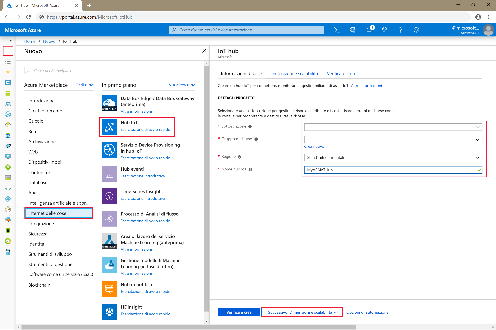

4. Selezionare **Avanti: Dimensioni e piano**.

5. Scegliere un valore per **Piano tariffario e livello di scalabilità**. Per questa guida introduttiva, selezionare il livello **F1 - Gratuito** se ancora disponibile nella sottoscrizione. Se il livello gratuito non è disponibile, scegliere il livello più basso disponibile. Per altre informazioni, vedere i [prezzi dell'hub IoT](https://azure.microsoft.com/pricing/details/iot-hub/).

   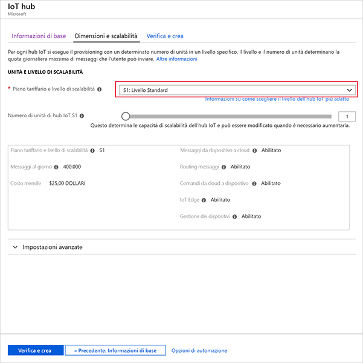

6. Selezionare **Rivedi e crea**. Esaminare le informazioni sull'hub IoT e fare clic su **Crea**. La creazione dell'hub IoT può richiedere alcuni minuti. È possibile monitorare lo stato di avanzamento nel riquadro **Notifiche**.

7. Nel menu di spostamento dell'hub IoT, fare clic su **Aggiungi** in **Dispositivi IoT**. Aggiungere un **ID dispositivo** e fare clic su **Salva**.

   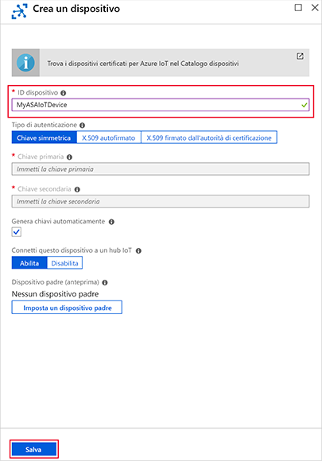

8. Dopo la creazione del dispositivo, aprirlo dall'elenco **Dispositivi IoT**. Copiare il valore di **Stringa di connessione -- Chiave primaria** e salvarlo in un Blocco note per usarlo in seguito.

   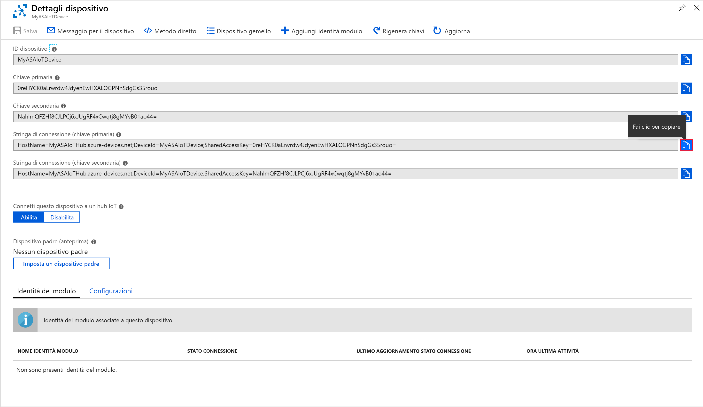

## <a name="create-blob-storage"></a>Creare l'archiviazione BLOB

1. Nell'angolo superiore sinistro del portale di Azure selezionare **Crea risorsa** > **Archiviazione** > **Account di archiviazione**.

2. Nel riquadro **Crea account di archiviazione** immettere un nome, una posizione e un gruppo di risorse per l'account di archiviazione. Scegliere la stessa posizione e lo stesso gruppo di risorse dell'hub IoT creato. Quindi fare clic su **Rivedi e crea**. per creare l'account.

   

3. Dopo aver creato l'account di archiviazione, selezionare il riquadro **BLOB** nella sezione **Panoramica**.

   

4. Nella pagina **Servizio BLOB** selezionare **Contenitore** e specificare un nome per il contenitore, ad esempio *container1*. Lasciare il **Livello di accesso pubblico** come **Privato (accesso anonimo non consentito)** e selezionare **OK**.

   

## <a name="create-a-stream-analytics-project"></a>Creare un progetto di Analisi di flusso

1. Avviare Visual Studio.

2. Fare clic su **File > Nuovo progetto**.  

3. Nell'elenco dei modelli a sinistra selezionare **Analisi di flusso** e quindi **Applicazione Analisi di flusso di Azure**.  

4. Inserire i valori appropriati per il progetto in **Nome**, **Percorso** e **Nome soluzione** e scegliere **OK**.

   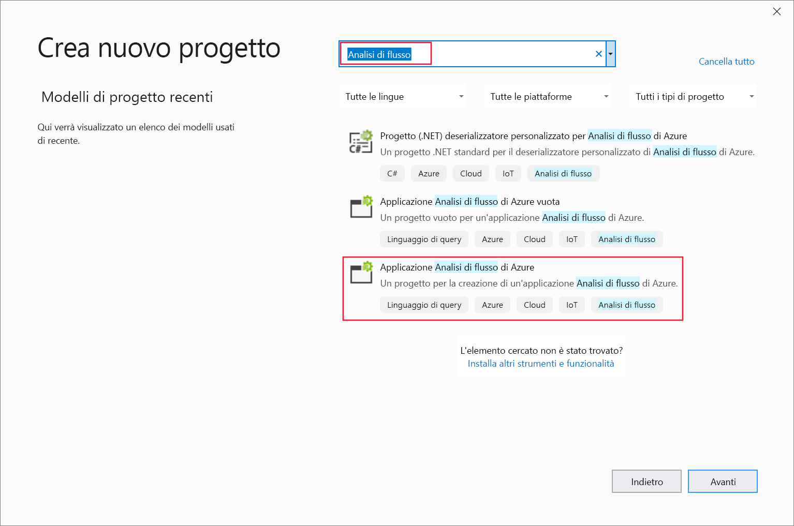

Si notino gli elementi che sono inclusi in un progetto di Analisi di flusso di Azure.

   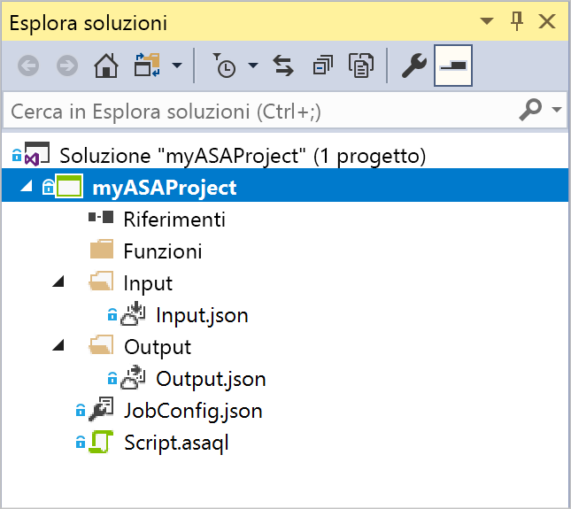


## <a name="choose-the-required-subscription"></a>Scegliere la sottoscrizione richiesta

1. In Visual Studio dal menu **Visualizza** scegliere **Esplora server**.

2. Fare clic con il pulsante destro del mouse su **Azure**, selezionare **Connetti a sottoscrizione di Microsoft Azure** e quindi accedere con l'account di Azure.

## <a name="define-input"></a>Definire l'input

1. In **Esplora soluzioni** espandere il nodo **Input** e fare doppio clic su **Input.json**.

2. Compilare **Stream Analytics Input Configuration** (Configurazione input Analisi di flusso) con i valori seguenti:

   |**Impostazione**  |**Valore consigliato**  |**Descrizione**   |
   |---------|---------|---------|
   |Alias di input  |  Input   |  Immettere un nome per identificare l'input del processo.   |
   |Tipo di origine   |  Flusso dati |  Scegliere l'origine di input appropriata: Flusso dati o Dati di riferimento.   |
   |Source (Sorgente)  |  Hub IoT |  Scegliere l'origine di input appropriata.   |
   |Risorsa  | Scegliere l'origine dati dall'account corrente | Scegliere di immettere i dati manualmente o selezionare un account esistente.   |
   |Subscription  |  \<Sottoscrizione in uso\>   | Selezionare la sottoscrizione di Azure in cui è stato creato l'hub IoT.   |
   |Hub IoT  |  MyASAIoTHub   |  Scegliere o immettere il nome dell'hub IoT. I nomi dell'hub IoT vengono rilevati automaticamente se sono stati creati nella stessa sottoscrizione.   |
   
3. Lasciare le altre opzioni impostate sui valori predefiniti e selezionare **Salva** per salvare le impostazioni.  

   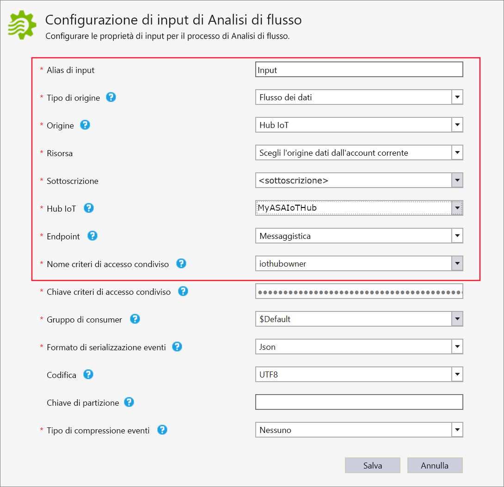

## <a name="define-output"></a>Definire l'output

1. In **Esplora soluzioni** espandere il nodo **Output** e fare doppio clic su **Output.json**.

2. Compilare **Stream Analytics Output Configuration** (Configurazione output Analisi di flusso) con i valori seguenti:

   |**Impostazione**  |**Valore consigliato**  |**Descrizione**   |
   |---------|---------|---------|
   |Alias di output  |  Output   |  Immettere un nome per identificare l'output del processo.   |
   |Sink   |  Archiviazione BLOB |  Scegliere il sink appropriato.    |
   |Risorsa  |  Specificare le impostazioni dell'origine dati manualmente |  Scegliere di immettere i dati manualmente o selezionare un account esistente.   |
   |Subscription  |  \<Sottoscrizione in uso\>   | Selezionare la sottoscrizione di Azure che include l'account di archiviazione creato. L'account di archiviazione può essere incluso nella stessa sottoscrizione o in una diversa. Questo esempio presuppone che l'account di archiviazione sia stato creato all'interno della stessa sottoscrizione.   |
   |Account di archiviazione  |  asaquickstartstorage   |  Scegliere o immettere il nome dell'account di archiviazione. I nomi degli account di archiviazione vengono rilevati automaticamente se sono stati creati nella stessa sottoscrizione.   |
   |Contenitore  |  container1   |  Selezionare il contenitore esistente creato nell'account di archiviazione.   |
   |Modello di percorso  |  output   |  Immettere il nome di un percorso di file da creare all'interno del contenitore.   |
   
3. Lasciare le altre opzioni impostate sui valori predefiniti e selezionare **Salva** per salvare le impostazioni.  

   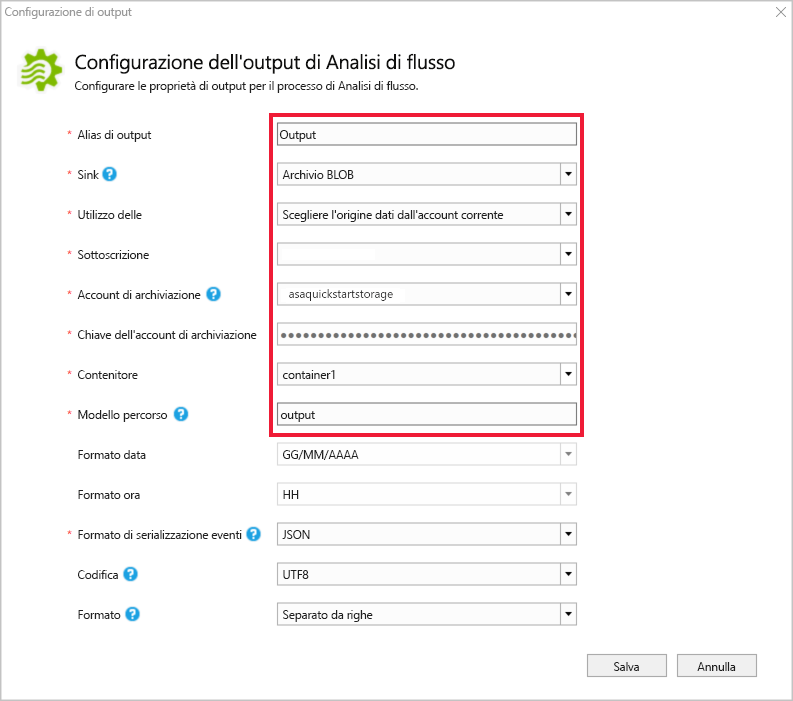

## <a name="define-the-transformation-query"></a>Definire la query di trasformazione

1. Aprire **Script.asaql** da **Esplora soluzioni** in Visual Studio.

2. Aggiungere la query seguente:

   ```sql
   SELECT *
   INTO BlobOutput
   FROM IoTHubInput
   HAVING Temperature > 27
   ```

## <a name="submit-a-stream-analytics-query-to-azure"></a>Inviare ad Azure una query di Analisi di flusso

1. Nell'**Editor di query** selezionare **Invia ad Azure** nell'editor di script.

2. Selezionare **Create a New Azure Stream Analytics job** (Crea un nuovo processo di Analisi di flusso di Azure) e immettere un **Nome processo**. Scegliere la **Sottoscrizione**, il **Gruppo di risorse** e il **Percorso** usati all'inizio della guida introduttiva.

   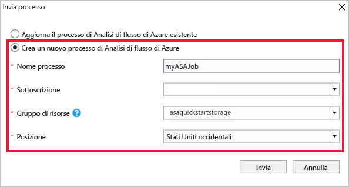

## <a name="run-the-iot-simulator"></a>Eseguire il simulatore IoT

1. Aprire il [simulatore online Azure IoT Raspberry Pi](https://azure-samples.github.io/raspberry-pi-web-simulator/) in una nuova scheda o finestra del browser.

2. Sostituire il segnaposto nella riga 15 con la stringa di connessione del dispositivo hub IoT di Azure salvato in una sezione precedente.

3. Fare clic su **Run**. L'output mostra i dati del sensore e i messaggi inviati all'hub IoT.

   

## <a name="start-the-stream-analytics-job-and-check-output"></a>Avviare il processo di Analisi di flusso e controllare l'output

1. Quando il processo è stato creato, viene aperta automaticamente la visualizzazione del processo. Fare clic sulla freccia verde per avviare il processo.

   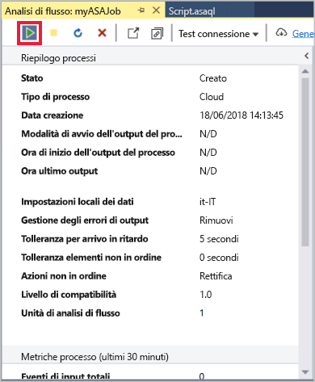

2. Modificare la **Modalità di avvio dell'output del processo** in **JobStartTime** e selezionare **Avvia**.

   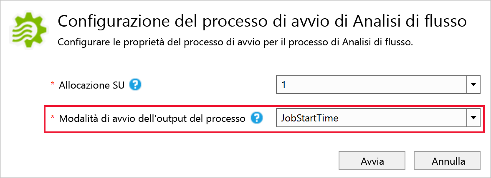

3. Si noti che lo stato del processo viene modificato in **In esecuzione** e che sono presenti eventi di input/output. L'operazione potrebbe richiedere alcuni minuti.

   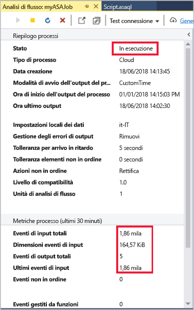

4. Per visualizzare i risultati, dal menu **Visualizza** scegliere **Cloud Explorer** e passare all'account di archiviazione nel gruppo di risorse. In **Contenitori BLOB** fare doppio clic su **container1** e quindi sul percorso del file di **output**.

   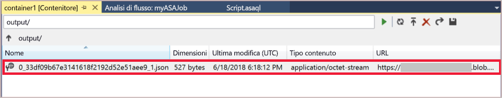

## <a name="clean-up-resources"></a>Pulire le risorse

Quando non sono più necessari, eliminare il gruppo di risorse, il processo di streaming e tutte le risorse correlate. Eliminando il processo si evita di pagare per le unità di streaming utilizzate dal processo. Se si prevede di usare il processo in futuro, è possibile arrestarlo e riavviarlo in un secondo momento, quando è necessario. Se non si intende continuare a usare il processo, eliminare tutte le risorse create tramite questa guida introduttiva seguendo questa procedura:

1. Scegliere **Gruppi di risorse** dal menu a sinistra del portale di Azure e quindi selezionare il nome della risorsa creata.  

2. Nella pagina del gruppo di risorse selezionare **Elimina**, digitare il nome della risorsa da eliminare nella casella di testo e quindi selezionare **Elimina**.

## <a name="next-steps"></a>Passaggi successivi

In questa guida introduttiva è stato distribuito un semplice processo di Analisi di flusso con Visual Studio. È anche possibile distribuire processi di Analisi di flusso usando il [portale di Azure](stream-analytics-quick-create-portal.md) e [PowerShell](stream-analytics-quick-create-powershell.md). 

Per informazioni sugli strumenti di Analisi di flusso di Azure per Visual Studio, passare all'articolo seguente:

> [!div class="nextstepaction"]
> [Usare Visual Studio per visualizzare i processi di Analisi di flusso di Azure](stream-analytics-vs-tools.md)
