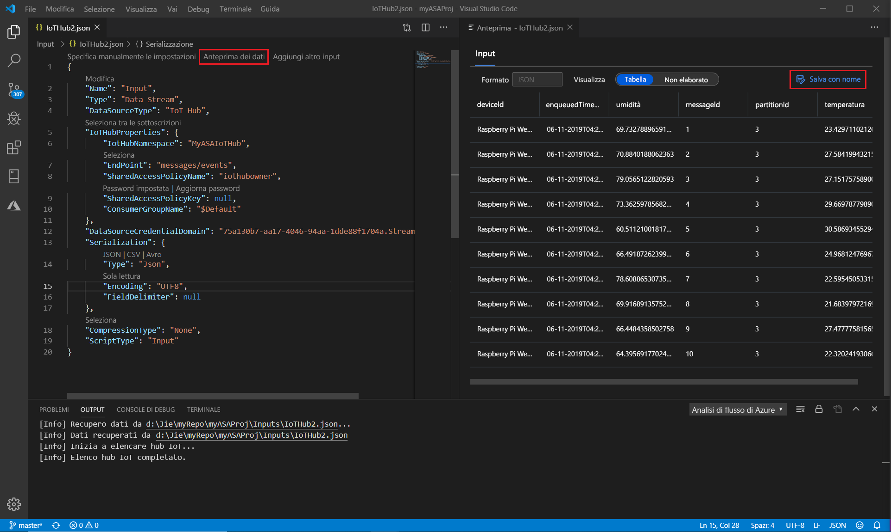

# Eseguire test locali delle query di Analisi di flusso con dati di esempio con Visual Studio Code

È possibile usare gli strumenti di analisi di flusso di Azure per Visual Studio Code per testare i processi di analisi di flusso localmente con dati di esempio. È possibile trovare i risultati della query in file JSON nella cartella **LocalRunOutputs** del progetto.

## Prerequisiti

* Installare [.NET Core SDK](https://dotnet.microsoft.com/download) e riavviare Visual Studio Code.

* Usare questa [Guida introduttiva](quick-create-vs-code.md) per informazioni su come creare un processo di analisi di flusso usando Visual Studio Code.

## Preparare i dati di esempio

Prima di tutto è necessario preparare i file di dati di input di esempio. Se si dispone già di alcuni file di dati di esempio nel computer, è possibile ignorare questo passaggio e passare a quello successivo.

1. Fare clic su **Anteprima dati** nel file di configurazione di input dalla riga superiore. Alcuni dati di input verranno recuperati dall'hub Internet e visualizzati nella finestra di anteprima. Si noti che l'operazione potrebbe richiedere alcuni minuti.

2. Una volta visualizzati i dati, fare clic su **Salva con nome** per salvare i dati in un file locale.

 

## Definire un input locale

1. Fare clic **suinput.js** nella cartella inputs nel progetto di analisi di flusso. Quindi selezionare **Aggiungi input locale** dalla riga superiore.

    

    È anche possibile usare **CTRL + MAIUSC + P** per aprire il riquadro comandi e immettere **ASA: Aggiungi input**.

   

2. Selezionare **input locale**.

    

3. Selezionare **+ nuovo input locale**.

    

4. Immettere lo stesso alias di input usato nella query.

    

5. NelLocalInput_Input.jsappena generato **su** file immettere il percorso del file in cui si trova il file di dati locale.

    

6. Selezionare **Anteprima dati** per visualizzare in anteprima i dati di input. Il tipo di serializzazione per i dati viene rilevato automaticamente se il relativo JSON o CSV. Usare il selettore per visualizzare i dati in formato **tabella** o non **elaborato** . La tabella seguente è un esempio di dati nel **formato tabella**:

     

    La tabella seguente è un esempio di dati in **formato non elaborato**:

    

## Eseguire query in locale

Tornare all'editor di query e selezionare **Esegui localmente**. Selezionare quindi **Usa input locale** nell'elenco a discesa.

Il risultato viene visualizzato nella finestra a destra. È possibile fare clic su **Esegui per eseguire** nuovamente il test. È anche possibile selezionare **Apri in cartella** per visualizzare i file dei risultati in Esplora file e aprirli di nuovo con altri strumenti. Si noti che i file dei risultati sono disponibili solo in formato JSON.

## Passaggi successivi

* [Testare i processi di analisi di flusso di Azure localmente con input Live con Visual Studio Code](visual-studio-code-local-run-live-input.md)

* [Esplorare i processi di analisi di flusso di Azure con Visual Studio Code (anteprima)](visual-studio-code-explore-jobs.md)
