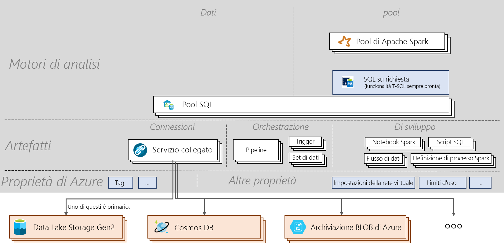

# Scheda di riferimento rapido di Azure Synapse Analytics

[!INCLUDE [preview](includes/note-preview.md)]

La scheda di riferimento rapido di Azure Synapse Analytics illustra i concetti di base del servizio e i comandi importanti. Questo articolo è utile per i nuovi utenti e per coloro che vogliono informazioni aggiornate sugli argomenti essenziali relativi ad Azure Synapse.

## Architecture

> [!div class="mx-imgBorder"]
>

## Terminologia
| Termine                         | Definizione      |
|:---                                 |:---                 |
| **Area di lavoro di Synapse (anteprima)** | Un limite di collaborazione a protezione diretta per l'analisi aziendale basata sul cloud in Azure. Un'area di lavoro viene distribuita in un'area specifica e con un account e un file system di ADLS Gen2 associati (per l'archiviazione di dati temporanei). Un'area di lavoro in un gruppo di risorse. |
| **Synapse SQL**   | Eseguire analisi con pool o con funzionalità su richiesta.  |
| **Pool SQL**   | In un'area di lavoro possono essere distribuite da 0 a N risorse con provisioning SQL con i database corrispondenti. A ogni pool SQL è associato un database. Un pool SQL può essere ridimensionato, sospeso e ripreso manualmente o automaticamente. Un pool SQL può essere ridimensionato da 100 DWU fino a 30.000 DWU.       |
| **SQL su richiesta (anteprima)**   | Sistema di elaborazione dati distribuiti destinato a dati su larga scala che consente di eseguire query sui dati nel data lake. È serverless, quindi non è necessario gestire l'infrastruttura.       |
|**Apache Spark per Synapse** | Runtime Spark usato in un pool di Spark. La versione corrente supportata è Spark 2.4 con supporto di Python 3.6.1, Scala 2.11.12, .NET per Apache Spark 0.5 e Delta Lake 0.3.  | 
| **Pool di Apache Spark (anteprima)**  | In un'area di lavoro possono essere distribuite da 0 a N risorse con provisioning Spark con i database corrispondenti. Un pool di Spark può essere sospeso automaticamente, ripreso e ridimensionato.  |
| **Replica di Spark**  |   Consiste in un processo driver e un set di processi executor. Una replica di Spark viene eseguita in un pool di Spark.            |
| **Sessione di Spark**  |   Punto di ingresso unificato di un'applicazione Spark. Offre la possibilità di interagire con varie funzionalità di Spark e con un numero minore di costrutti. Per eseguire un notebook, è necessario creare una sessione. Una sessione può essere configurata per l'esecuzione in un numero specifico di executor di dimensioni specifiche. La configurazione predefinita per una sessione di notebook consiste nell'esecuzione di due executor di medie dimensioni. |
| **Richiesta SQL**  |   Operazione, ad esempio una query, eseguita tramite il pool SQL o SQL su richiesta. |
|**Integrazione dati**| Offre la possibilità di inserire dati tra varie origini e di orchestrare le attività all'interno o all'esterno di un'area di lavoro.| 
|**Elementi**| Concetto che incapsula tutti gli oggetti necessari a un utente per la gestione delle origini dati, lo sviluppo, l'orchestrazione e la visualizzazione.|
|**Notebook**| Interfaccia interattiva e reattiva di data science e ingegneria che supporta Scala, PySpark, C# e SparkSQL. |
|**Definizione di processo Spark**|Interfaccia per l'invio di processi Spark con JAR di assembly contenente il codice e le relative dipendenze.|
|**Flusso di dati**|  Fornisce un'esperienza completamente visiva senza la necessità di codice per eseguire trasformazioni di Big Data. Tutte le attività di ottimizzazione ed esecuzione vengono gestiti in modalità serverless. |
|**Script SQL**| Set di comandi SQL salvati in un file. Uno script SQL può contenere una o più istruzioni SQL. Può essere usato per eseguire richieste SQL tramite pool SQL o SQL su richiesta.|
|**Pipeline**| Raggruppamento logico di attività che insieme svolgono una funzione.|
|**Attività**| Definisce le azioni da eseguire sui dati, ad esempio la copia, l'esecuzione di un notebook o uno script SQL.|
|**Trigger**| Esegue una pipeline. Può essere eseguita manualmente o automaticamente (pianificazione, finestra a cascata o basata su eventi).|
|**Servizio collegato**| Stringhe di connessione che definiscono le informazioni necessarie per la connessione dell'area di lavoro a risorse esterne.|
|**Set di dati**|  Vista denominata di dati che semplicemente punta o fa riferimento ai dati da usare come input e output di un'attività. Appartiene a un servizio collegato.|

## Passaggi successivi

- [Creare un'area di lavoro](quickstart-create-workspace.md)
- [Usare Synapse Studio](quickstart-synapse-studio.md)
- [Creare un pool SQL](quickstart-create-sql-pool-portal.md)
- [Usare SQL su richiesta](quickstart-sql-on-demand.md)
- [Creare un pool di Apache Spark](quickstart-create-apache-spark-pool-portal.md)

