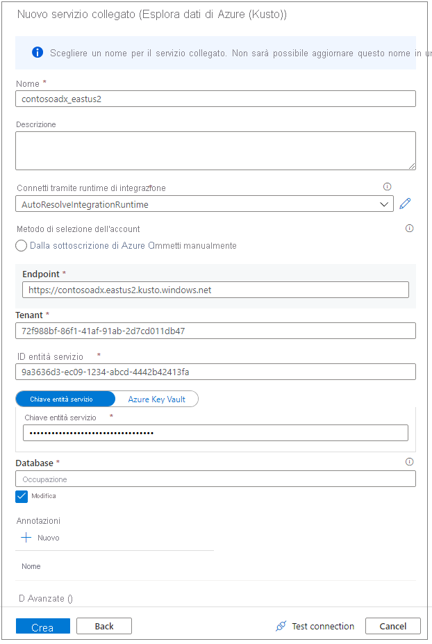
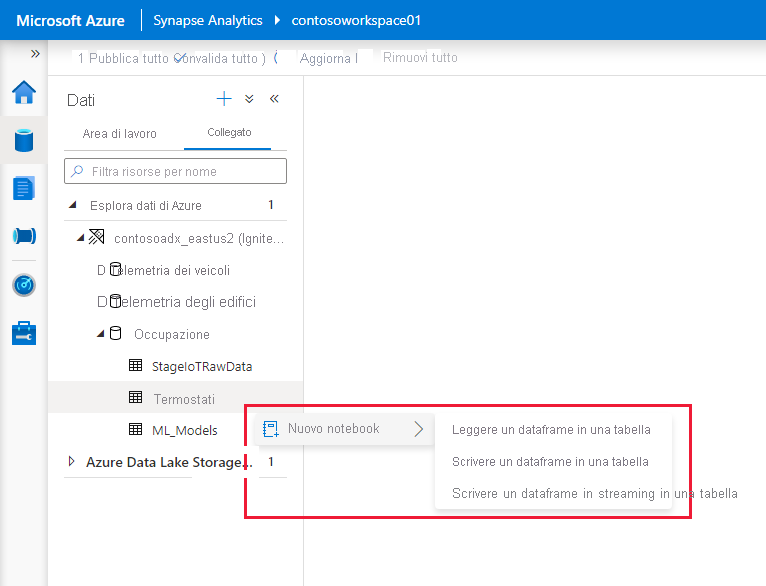

# Connettersi a Esplora dati di Azure con Apache Spark per Synapse

Questo articolo descrive come accedere a un database di Esplora dati di Azure da Synapse Studio con Apache Spark per Synapse. 

## Prerequisiti

* [Creare un database e un cluster di Esplora dati di Azure](/azure/data-explorer/create-cluster-database-portal).
* Un'area di lavoro di Synapse esistente oppure una nuova da creare seguendo questo [avvio rapido](./quickstart-create-workspace.md) 
* Un pool di Apache Spark per Synapse esistente oppure uno nuovo da creare seguendo questo [avvio rapido](./quickstart-create-apache-spark-pool-portal.md)
* [Creare l'app Azure AD effettuando il provisioning di un'applicazione Azure AD.](/azure/data-explorer/kusto/management/access-control/how-to-provision-aad-app)
* Consentire all'app Azure AD di accedere al database come descritto in [Gestire le autorizzazioni per database di Esplora dati di Azure](/azure/data-explorer/manage-database-permissions)

## Passare a Synapse Studio

In un'area di lavoro di Synapse selezionare **Avvia Synapse Studio**. Nella home page di Synapse Studio selezionare **Data** (Dati) per aprire **Data Object Explorer** (Esplora oggetti dati).

## Connettere un database di Esplora dati di Azure a un'area di lavoro di Synapse

Per la connessione di un database di Esplora dati di Azure a un'area di lavoro si usa un servizio collegato. Un servizio collegato di Esplora dati di Azure consente agli utenti di esplorare, leggere e scrivere dati in Azure Cosmos DB da Apache Spark per Azure Synapse Analytics e di eseguire processi di integrazione in una pipeline.

In Data Object Explorer (Esplora oggetti dati) seguire questa procedura per connettere direttamente un cluster di Esplora dati di Azure:

1. Selezionare l'icona **+** accanto a Dati
2. Selezionare **Connect** (Connetti) per connettersi a dati esterni
3. Selezionare **Esplora dati di Azure (Kusto)**
5. Selezionare **Continua**
6. Assegnare un nome al servizio collegato. Il nome verrà visualizzato in Esplora oggetti e verrà usato dai runtime di Synapse per connettersi al database. È consigliabile usare un nome descrittivo
7. Selezionare il cluster di Esplora dati di Azure dalla sottoscrizione o immettere l'URI.
8. Immettere il valore per "ID entità servizio" e "Chiave dell'entità servizio". Assicurarsi che questa entità servizio abbia accesso in visualizzazione al database per le operazioni di lettura e accesso in inserimento per l'inserimento dei dati.
9. Immettere il nome del database di Esplora dati di Azure.
10. Fare clic su **Test connessione** per assicurarsi che le autorizzazioni siano corrette
11. Selezionare **Crea**

    

    > [!NOTE]
    > (Facoltativo) L'opzione Test connessione non convalida l'accesso in scrittura. Assicurarsi che l'ID entità servizio abbia accesso in scrittura al database di Esplora dati di Azure.

12. I cluster e i database di Esplora dati di Azure sono visibili nella scheda **Collegato** nella sezione Esplora dati di Azure. 

    

    > [!NOTE] 
    > Nella versione corrente gli oggetti di database vengono popolati in base alle autorizzazioni dell'account AAD per i database di Esplora dati di Azure. Quando si eseguono processi di integrazione o notebook Apache Spark, verranno usate le credenziali indicate nel servizio di collegamento, ovvero l'entità servizio.

## Interagire rapidamente con le azioni generate dal codice

* Quando si fa clic con il pulsante destro del mouse su un database o una tabella, verrà visualizzato un elenco di movimenti che attivano un notebook Spark di esempio per la lettura, la scrittura e lo streaming dei dati in Esplora dati di Azure. 
    

* Ecco un esempio di lettura dei dati. Collegare il notebook al pool Spark ed eseguire la cella 

   > [!NOTE] 
   > La prima esecuzione dell'avvio della sessione di Spark può richiedere più di tre minuti. Le esecuzioni successive saranno notevolmente più rapide.  

## Limitazioni
Il connettore Esplora dati di Azure non è attualmente supportato con la rete virtuale gestita di Azure Synapse.

## Passaggi successivi

* [Codice di esempio con opzioni avanzate](https://github.com/Azure/azure-kusto-spark/blob/master/samples/src/main/python/SynapseSample.py)
* [Connettore Spark per Esplora dati di Azure (Kusto)](https://github.com/Azure/azure-kusto-spark)