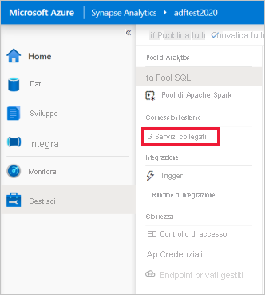
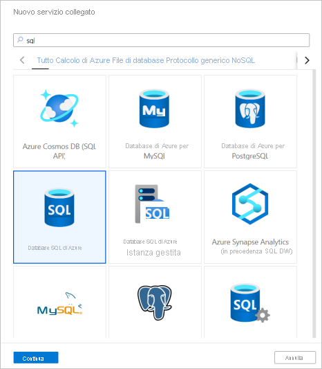
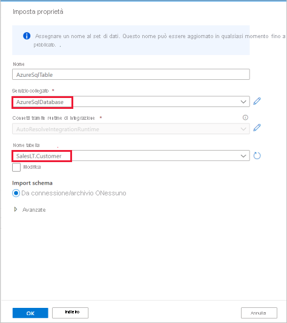

# Avvio rapido: Caricare i dati in un pool SQL con l'attività di copia

Azure Synapse Analytics offre vari motori di analisi che consentono di inserire, trasformare, modellare e analizzare i dati. Un pool SQL offre funzionalità di calcolo e archiviazione basate su T-SQL. Dopo aver creato un pool SQL nell'area di lavoro di Synapse, è possibile caricare, modellare, elaborare e consegnare i dati per ottenere dati analitici in modo più rapido.

Questo argomento di avvio rapido illustra come *caricare dati da Database SQL di Azure in Azure Synapse Analytics*. È possibile seguire una procedura simile a quella usata per copiare dati da altri tipi di archivi dati. Un flusso simile si applica anche alla copia di dati tra altre coppie di origine e sink.

## Prerequisiti

* Sottoscrizione di Azure: Se non si ha una sottoscrizione di Azure, creare un [account gratuito](https://azure.microsoft.com/free/) prima di iniziare.
* Area di lavoro di Azure Synapse: creare un'area di lavoro di Synapse usando il portale di Azure e seguendo le istruzioni in [Avvio rapido: Creare un'area di lavoro di Synapse](quickstart-create-workspace.md).
* Database SQL di Azure: questa esercitazione copia i dati del set di dati di esempio di Adventure Works LT nel database SQL di Azure. È possibile creare questo database di esempio in Database SQL seguendo le istruzioni fornite in [Creare un database di esempio in Database SQL di Azure](../azure-sql/database/single-database-create-quickstart.md). È anche possibile usare altri archivi dati seguendo una procedura simile.
* Account di archiviazione Azure: Archiviazione di Azure viene usato come area di *staging* nell'operazione di copia. Se non è disponibile un account di archiviazione di Azure, vedere le istruzioni fornite in [Creare un account di archiviazione](../storage/common/storage-account-create.md).
* Azure Synapse Analytics: si usa un pool SQL come archivio dati sink. Se non è disponibile un'istanza di Azure Synapse Analytics, vedere [Creare un pool SQL](quickstart-create-sql-pool-portal.md) per crearne una.

### Passare a Synapse Studio

Dopo aver creato l'area di lavoro di Azure Synapse, è possibile aprire Synapse Studio in due modi:

* Aprire l'area di lavoro di Synapse nel [portale di Azure](https://ms.portal.azure.com/#home). Nella parte superiore della sezione Panoramica selezionare **Avvia Synapse Studio**.
* Aprire [Azure Synapse Analytics](https://web.azuresynapse.net/) e accedere all'area di lavoro.

In questo argomento di avvio rapido viene usata come esempio l'area di lavoro denominata "adftest2020". Si verrà indirizzati automaticamente alla home page di Synapse Studio.

## Creare servizi collegati

In Azure Synapse Analytics si usano i servizi collegati per definire le informazioni di connessione ad altri servizi. In questa sezione si creeranno due tipi di servizi collegati: Database SQL di Azure e Azure Data Lake Storage Gen2.

1. Nella home page di Azure Synapse Studio selezionare la scheda **Gestisci** nel riquadro di spostamento sinistro.
1. In Connessioni esterne selezionare Servizi collegati.
  
   

1. Per aggiungere un servizio collegato, selezionare **Nuovo**.
1. Selezionare **Database SQL di Azure** nella raccolta e quindi **Continua**. È possibile digitare "sql" nella casella di ricerca per filtrare i connettori.

   

1. Nella pagina Nuovo Servizio collegato selezionare il nome del server e il nome del database dall'elenco a discesa, quindi specificare il nome utente e la password. Fare clic su **Verifica connessione** per verificare le impostazioni, quindi selezionare **Crea**.

   

1. Ripetere i passaggi 3 e 4 selezionando però **Azure Data Lake Storage Gen2** dalla raccolta. Nella pagina Nuovo servizio collegato selezionare il nome dell'account di archiviazione dall'elenco a discesa. Fare clic su **Verifica connessione** per verificare le impostazioni, quindi selezionare **Crea**. 

   
 
## Creare una pipeline

Una pipeline contiene il flusso logico per un'esecuzione di un set di attività. In questa sezione verrà creata una pipeline contenente un'attività di copia che inserisce i dati da Database SQL di Azure in un pool SQL.

1. Passare alla scheda **Integrazione**. Selezionare l'icona con il segno più accanto all'intestazione della pipeline e quindi selezionare Pipeline.

   

1. In *Move & transform* (Sposta e trasforma) nel riquadro *Attività* trascinare **Copia dati** sul canvas della pipeline.
1. Selezionare l'attività di copia e passare alla scheda Origine. Selezionare **Nuovo** per creare un nuovo set di dati di origine.

   

1. Selezionare **Database SQL di Azure** come archivio dati e quindi selezionare **Continua**.
1. Nel riquadro *Imposta proprietà* selezionare il servizio collegato Database SQL di Azure creato nel passaggio precedente. 
1. In Nome tabella selezionare una tabella di esempio da usare nell'attività di copia seguente. In questo avvio rapido si usa la tabella "SalesLT.Customer" come esempio. 

   
1. Selezionare **OK** al termine.
1. Selezionare l'attività di copia e passare alla scheda Sink. Selezionare **Nuovo** per creare un nuovo set di dati sink.
1. Selezionare **Pool di Analisi SQL** come archivio dati e quindi selezionare **Continua**.
1. Nel riquadro **Imposta proprietà** selezionare il pool di Analisi SQL creato nel passaggio precedente. Se si sta scrivendo su una tabella esistente, selezionarla dall'elenco a discesa *Nome tabella*. Altrimenti selezionare "Modifica" e immettere il nome della nuova tabella. Selezionare **OK** al termine.
1. Per le impostazioni del set di dati sink abilitare **Auto create table** (Crea tabella automaticamente) in Table option (Opzione tabella).

   

1. Nella pagina **Impostazioni** selezionare la casella di controllo **Enable staging** (Abilita staging). Questa opzione può essere applicata se i dati di origine non sono compatibili con PolyBase. Nella sezione **Staging settings** (Impostazioni di staging) selezionare come archivio di staging il servizio collegato Azure Data Lake Storage Gen2 creato nel passaggio precedente. 

    L'archivio viene usato per eseguire lo staging dei dati prima di caricarli in Azure Synapse Analytics tramite PolyBase. Al termine della copia, viene eseguita la pulizia automatica dei dati provvisori in Azure Data Lake Storage Gen2.

   

1. Per convalidare la pipeline, selezionare **Convalida** sulla barra degli strumenti. Il risultato dell'output di convalida della pipeline viene visualizzato sul lato destro della pagina. 

## Eseguire il debug della pipeline e pubblicarla

Dopo aver completato la configurazione della pipeline, è possibile eseguire il debug prima di pubblicare gli artefatti per verificare che tutto sia corretto.

1. Per eseguire il debug della pipeline, selezionare **Debug** sulla barra degli strumenti. Lo stato dell'esecuzione della pipeline verrà visualizzato nella scheda **Output** nella parte inferiore della finestra. 

   

1. Una volta che la pipeline viene eseguita correttamente, sulla barra degli strumenti superiore selezionare **Pubblica tutto**. Questa azione pubblica le entità create (set di dati e pipeline) create nel servizio Synapse Analytics.
1. Attendere fino alla visualizzazione del messaggio **Pubblicazione riuscita**. Per visualizzare i messaggi di notifica, selezionare il pulsante a forma di campana in alto a destra. 

## Attivare e monitorare la pipeline

In questa sezione si attiverà manualmente la pipeline pubblicata nel passaggio precedente. 

1. Selezionare **Aggiungi trigger** nella barra degli strumenti, quindi selezionare **Attiva adesso**. Nella pagina **Esecuzione della pipeline** selezionare **OK**.  
1. Passare alla scheda **Monitora** nella barra laterale sinistra. Viene visualizzata un'esecuzione della pipeline attivata da un trigger manuale. 
1. Al termine dell'esecuzione della pipeline, selezionare il collegamento nella colonna **Nome pipeline** per visualizzare i dettagli dell'esecuzione attività o per eseguire di nuovo la pipeline. In questo esempio è presente una sola attività, quindi nell'elenco viene visualizzata una sola voce. 
1. Per informazioni dettagliate sull'operazione di copia, selezionare il collegamento **Dettagli** (icona a forma di occhiali) nella colonna **Nome attività**. È possibile monitorare dettagli come il volume dei dati copiati dall'origine al sink, la velocità effettiva dei dati, i passaggi di esecuzione con la durata corrispondente e le configurazioni usate.

   

1. Per tornare alla visualizzazione delle esecuzioni di pipeline, selezionare il collegamento **Tutte le esecuzioni della pipeline** in alto. Selezionare **Aggiorna** per aggiornare l'elenco.
1. Verificare che i dati siano scritti correttamente nel pool SQL.

## Passaggi successivi

Leggere gli articoli seguenti per altre informazioni sul supporto di Azure Synapse Analytics:

> [!div class="nextstepaction"]
> [Pipeline e attività](https://docs.microsoft.com/azure/data-factory/concepts-pipelines-activities?toc=/azure/synapse-analytics/toc.json&bc=/azure/synapse-analytics/breadcrumb/toc.json)
> [Panoramica del connettore](https://docs.microsoft.com/azure/data-factory/connector-overview?toc=/azure/synapse-analytics/toc.json&bc=/azure/synapse-analytics/breadcrumb/toc.json)
> [Attività di copia](https://docs.microsoft.com/azure/data-factory/copy-activity-overview?toc=/azure/synapse-analytics/toc.json&bc=/azure/synapse-analytics/breadcrumb/toc.json)