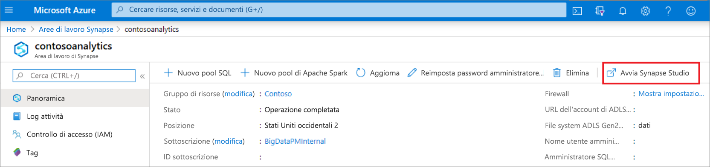
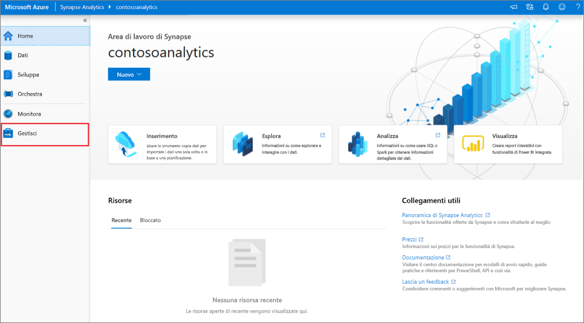
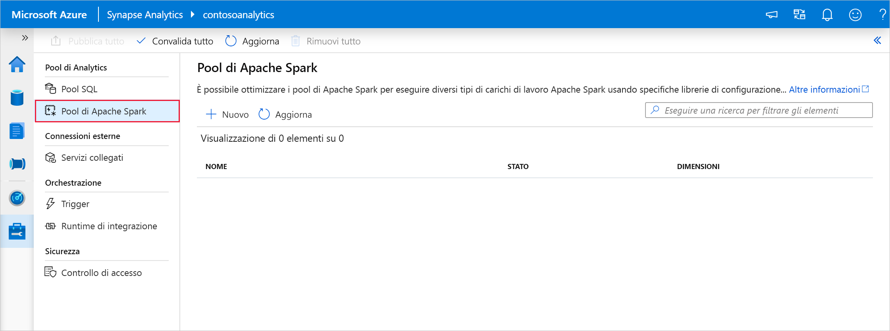
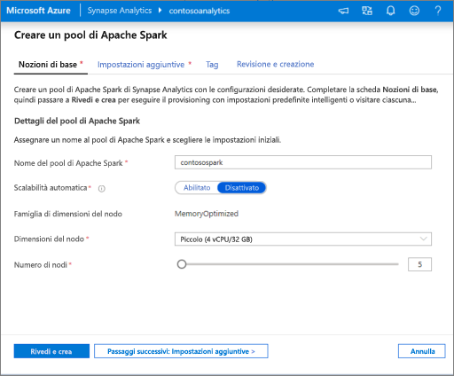
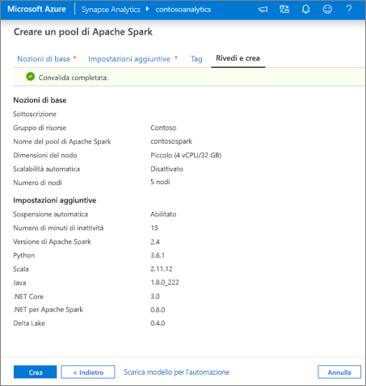
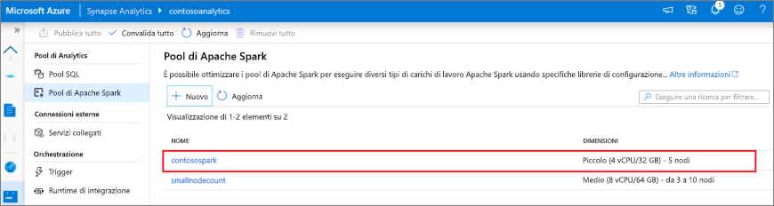
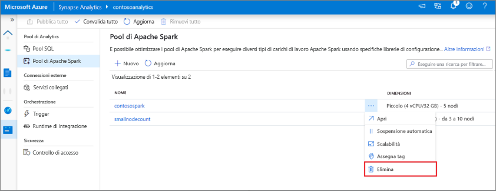

# Avvio rapido: Creare un pool di Apache Spark serverless (anteprima) con Synapse Studio

Azure Synapse Analytics offre vari motori di analisi che consentono di inserire, trasformare, modellare, analizzare e gestire i dati. Un pool di Apache Spark offre funzionalità di calcolo open source per i Big Data. Dopo aver creato un pool di Apache Spark nell'area di lavoro Synapse, è possibile caricare, modellare, elaborare e gestire i dati per ottenere informazioni dettagliate.  

Questa guida introduttiva descrive i passaggi per creare un pool di Apache Spark in un'area di lavoro di Synapse tramite Synapse Studio.

> [!IMPORTANT]
> La fatturazione delle istanze di Spark viene calcolata con ripartizione proporzionale al minuto, indipendentemente dal fatto che siano in uso o meno. Assicurarsi di arrestare l'istanza di Spark dopo averla usata oppure impostare un timeout breve. Per altre informazioni, vedere la sezione **Pulire le risorse** di questo articolo.

Se non si ha una sottoscrizione di Azure, creare un [account gratuito prima di iniziare](https://azure.microsoft.com/free/).

## Prerequisiti

- Sottoscrizione di Azure: [creare un account gratuito](https://azure.microsoft.com/free/)
- [Area di lavoro Synapse](./quickstart-create-workspace.md)

## Accedere al portale di Azure

Accedere al [portale di Azure](https://portal.azure.com/)

## Accedere all'area di lavoro di Synapse

1. Passare all'area di lavoro di Synapse in cui verrà creato il pool di Apache Spark digitando il nome del servizio (o direttamente il nome della risorsa) nella barra di ricerca.

    
1. Nell'elenco delle aree di lavoro digitare il nome (o parte del nome) dell'area di lavoro da aprire. Per questo esempio verrà usata un'area di lavoro denominata **contosoanalytics**.

    

## Avviare Synapse Studio 

Nella pagina di panoramica dell'area di lavoro selezionare l' **URL Web dell'area di lavoro** per aprire Synapse Studio.

## Creare il pool di Apache Spark in Synapse Studio

1. Nella home page di Synapse Studio passare all' **hub di gestione** nel riquadro di navigazione a sinistra selezionando l'icona **Gestisci**.

    

1. Nell'hub di gestione passare alla sezione **Pool di Apache Spark** per visualizzare l'elenco corrente dei pool di Apache Spark disponibili nell'area di lavoro.
    
    

1. Selezionare **+ Nuovo** per visualizzare la procedura guidata per la creazione del nuovo pool di Apache Spark. 

1. Immettere i dettagli seguenti nella scheda **Informazioni di base** :

    | Impostazione | Valore consigliato | Descrizione |
    | :------ | :-------------- | :---------- |
    | **Nome del pool di Apache Spark** | contosospark | Si tratta del nome che avrà il pool di Apache Spark. |
    | **Dimensioni nodo** | Piccole (4 vCPU/32 GB) | Per questa guida di avvio rapido, impostare questa opzione sulle dimensioni minime per ridurre i costi |
    | **Autoscale** | Disabled | In questa guida introduttiva la scalabilità automatica non è necessaria. |
    | **Numero di nodi** | 8 | Usare dimensioni ridotte per limitare i costi per questa guida introduttiva|
       
    
    
    > [!IMPORTANT]
    > Si noti che esistono limitazioni specifiche per i nomi che è possibile usare per i pool di Apache Spark. I nomi possono contenere solo lettere o numeri, devono essere costituiti da un massimo di 15 caratteri, devono iniziare con una lettera, non possono contenere parole riservate e devono essere univoci nell'area di lavoro.

1. Nella scheda successiva (Impostazioni aggiuntive) lasciare invariate tutte le impostazioni predefinite.

1. Per il momento non verranno aggiunti tag, quindi selezionare **Rivedi e crea**.

1. Nella scheda **Rivedi e crea** verificare che i dettagli siano corretti in base a quanto specificato in precedenza, quindi selezionare **Crea**. 

    

1. Il pool di Apache Spark avvierà il processo di provisioning.

1. Al termine del provisioning, il nuovo pool di Apache Spark verrà visualizzato nell'elenco.
    
    

## Eliminare le risorse del pool di Apache Spark tramite Synapse Studio

Per eliminare il pool di Apache Spark dall'area di lavoro tramite Synapse Studio, eseguire queste operazioni.
> [!WARNING]
> L'eliminazione di un pool SQL determina la rimozione del motore di analisi dall'area di lavoro. Non sarà più possibile connettersi al pool di Spark e tutti i notebook, le query e le pipeline che lo usano non funzioneranno più.

Per eliminare il pool di Apache Spark, procedere come segue:

1. Passare al pool di Apache Spark nell'hub di gestione in Synapse Studio.
1. Selezionare i puntini di sospensione accanto al pool di Apache da eliminare (in questo caso **contosospark** ) per visualizzare i comandi per il pool di Apache Spark.

    

1. Premere **CANC**.
1. Confermare l'eliminazione e fare clic sul pulsante **Elimina**.
1. Quando il processo viene completato, il pool di Apache Spark non sarà più elencato nelle risorse dell'area di lavoro. 

## Passaggi successivi

- Vedere [Avvio rapido: Creare un pool di Apache Spark in Synapse Studio con strumenti Web](quickstart-apache-spark-notebook.md).
- Vedere [Avvio rapido: Creare un pool di Apache Spark con il portale di Azure](quickstart-create-apache-spark-pool-portal.md).
