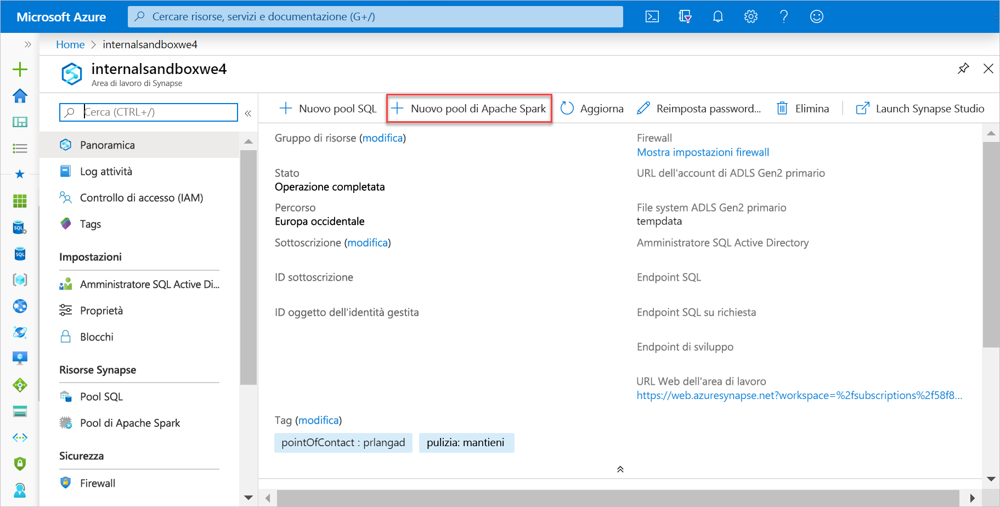
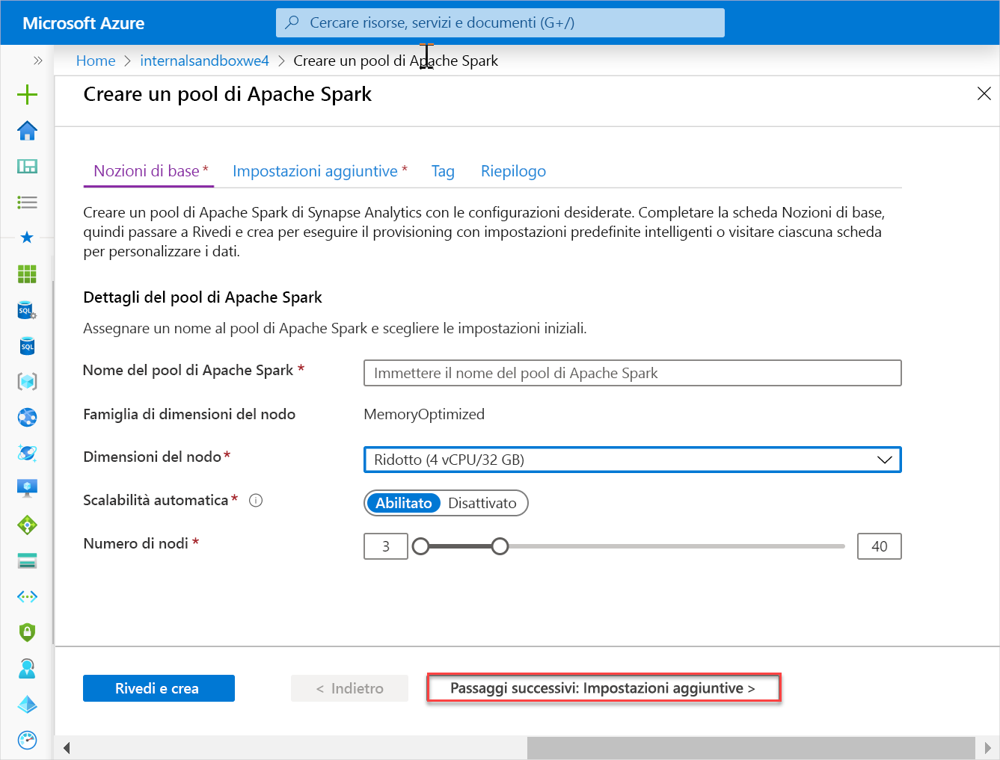
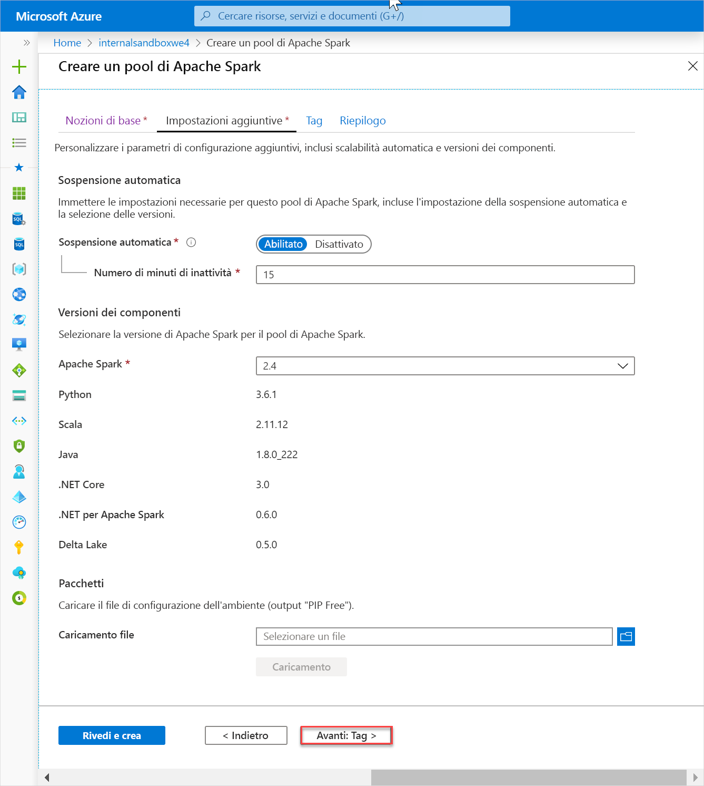
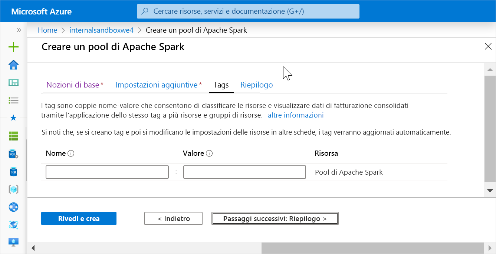
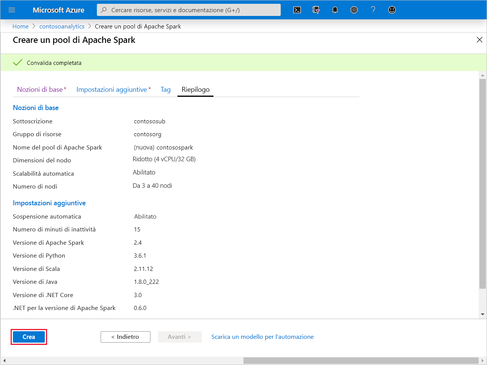
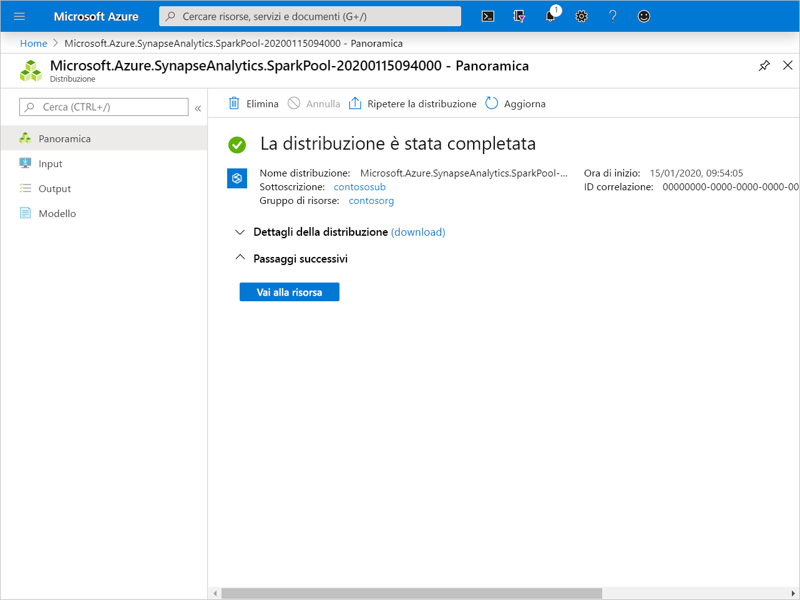
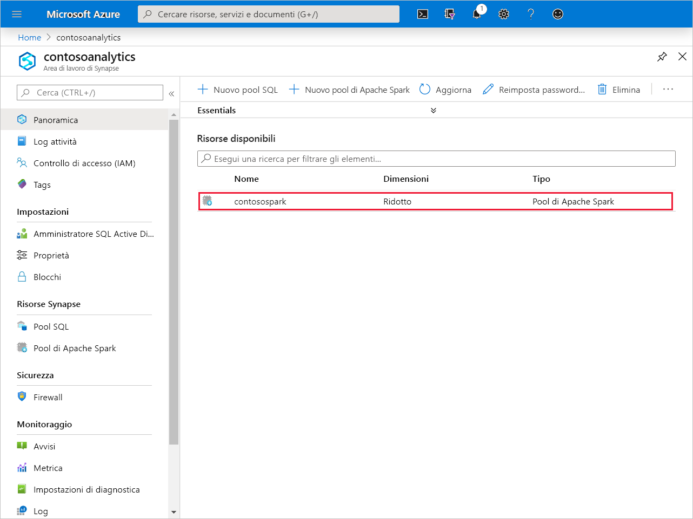
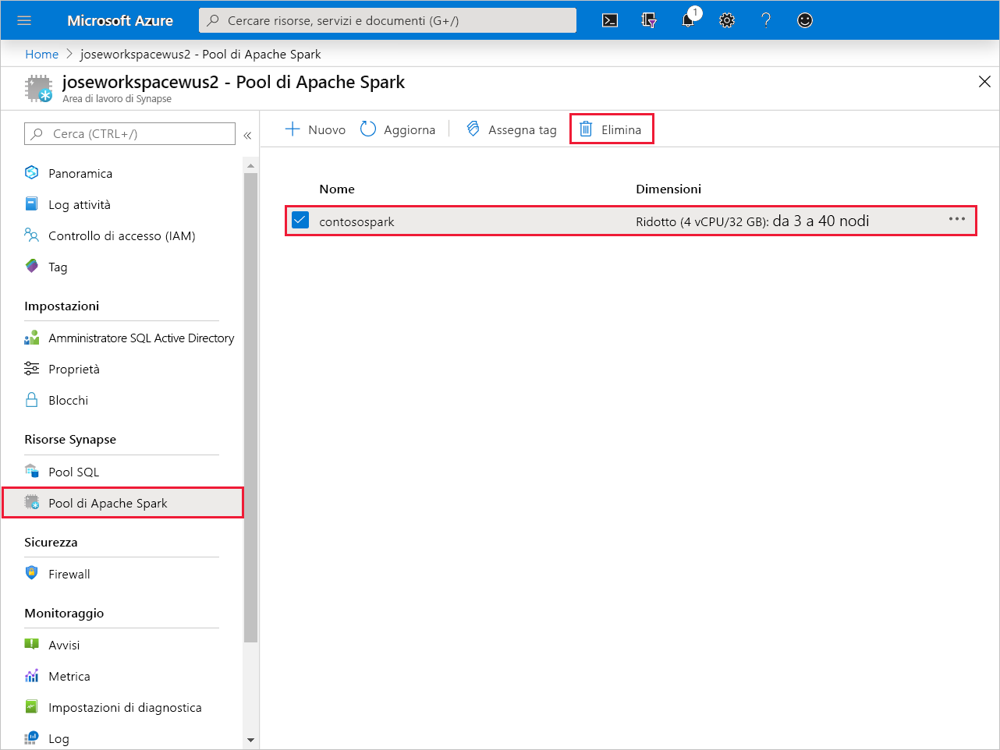
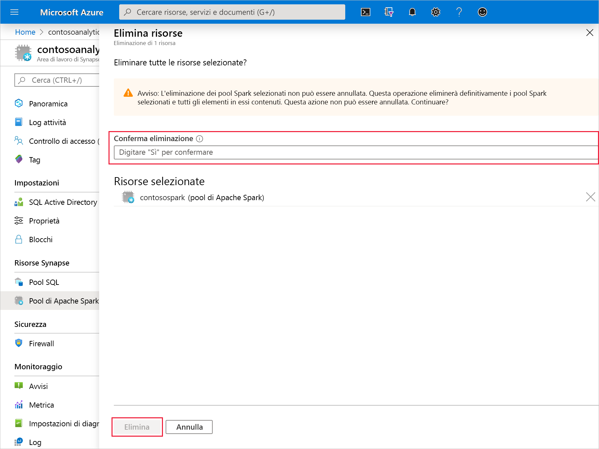

# Guida introduttiva: Creare un pool di Apache Spark (anteprima)

Synapse Analytics offre vari motori di analisi che consentono di inserire, trasformare, modellare, analizzare e gestire i dati. Un pool di Apache Spark offre funzionalità di calcolo open source per i Big Data. Dopo aver creato un pool di Apache Spark nell'area di lavoro Synapse, è possibile caricare, modellare, elaborare e gestire i dati per ottenere informazioni dettagliate.

Questa guida di avvio rapido illustra come usare il portale di Azure per creare un pool di Apache Spark in un'area di lavoro Synapse.

> [!IMPORTANT]
> La fatturazione delle istanze di Spark viene calcolata con ripartizione proporzionale al minuto, indipendentemente dal fatto che siano in uso o meno. Assicurarsi di arrestare l'istanza di Spark dopo averla usata oppure impostare un timeout breve. Per altre informazioni, vedere la sezione **Pulire le risorse** di questo articolo.

Se non si ha una sottoscrizione di Azure, creare un [account gratuito prima di iniziare](https:/azure.microsoft.com/free/).

## Prerequisiti

- Sottoscrizione di Azure: [creare un account gratuito](https:/azure.microsoft.com/free/)
- [Area di lavoro di Synapse Analytics](quickstart-create-workspace.md)

## Accedere al portale di Azure

Accedere al [portale di Azure](https:/portal.azure.com/)

## Creare un nuovo pool di Apache Spark

1. Nell'area di lavoro Synapse in cui creare il pool di Apache Spark fare clic su **Nuovo pool di Apache Spark**.

2. Immettere i dettagli seguenti nella scheda **Informazioni di base**:

    |Impostazione | Valore consigliato | Descrizione |
    | :------ | :-------------- | :---------- |
    | **Nome del pool di Apache Spark** | Un nome di pool valido | Si tratta del nome che avrà il pool di Apache Spark. |
    | **Dimensioni nodo** | Piccole (4 vCPU/32 GB) | Per questa guida di avvio rapido, impostare questa opzione sulle dimensioni minime per ridurre i costi |
    | **Autoscale** | Attivato | Lasciare l'impostazione predefinita |
    | **Numero di nodi** | 3 - 40 | Lasciare l'impostazione predefinita |
    ||||

    
    > [!IMPORTANT]
    > Si noti che esistono limitazioni specifiche per i nomi che è possibile usare per i pool di Apache Spark. I nomi possono contenere solo lettere o numeri, devono essere costituiti da un massimo di 15 caratteri, devono iniziare con una lettera, non possono contenere parole riservate e devono essere univoci nell'area di lavoro.

3. Fare clic su **Avanti: Impostazioni aggiuntive** ed esaminare le impostazioni predefinite. Non modificare le impostazioni predefinite.

4. Fare clic su **Avanti: Tag**. Non aggiungere alcun tag.

5. Fare clic su **Rivedi e crea**.

6. Verificare che i dettagli siano corretti in base a quanto specificato in precedenza, quindi fare clic su **Crea**.

7. A questo punto, il flusso di provisioning delle risorse viene avviato, indicando quando è completato 

8. Al termine del provisioning, tornando nell'area di lavoro viene visualizzata una nuova voce per il pool di Apache Spark appena creato.
 

9. A questo punto, non sono in esecuzione risorse, non sono presenti addebiti per Spark e sono stati creati i metadati sulle istanze di Spark da creare.

## Pulire le risorse

Seguire questa procedura per eliminare il pool di Apache Spark dall'area di lavoro.
> [!WARNING]
> Con l'eliminazione di un pool di Apache Spark, viene rimosso anche il motore di analisi dall'area di lavoro. Non sarà più possibile connettersi al pool di Apache Spark e tutte le query, le pipeline e i notebook che lo usano non funzioneranno più.

Per eliminare il pool di Apache Spark, procedere come segue:

1. Passare al pannello dei pool di Apache Spark nell'area di lavoro.
2. Selezionare il pool di Apache da eliminare (in questo caso, **contosospark**)
3. Premere **CANC**.
 
4. Confermare l'eliminazione e premere il pulsante **Elimina**.
 
5. Quando il processo viene completato, il pool di Apache Spark non sarà più elencato nelle risorse dell'area di lavoro.

Una volta creato, il pool SQL è disponibile nell'area di lavoro per il caricamento di dati, l'elaborazione di flussi, la lettura dal lake e così via.

## Passaggi successivi

- Vedere [Avvio rapido: Creare un pool di Apache Spark in Synapse Studio con strumenti Web](spark/apache-spark-notebook-create-spark-use-sql.md).
- Vedere [Avvio rapido: Creare un pool SQL Synapse con il portale di Azure](quickstart-create-sql-pool.md).
