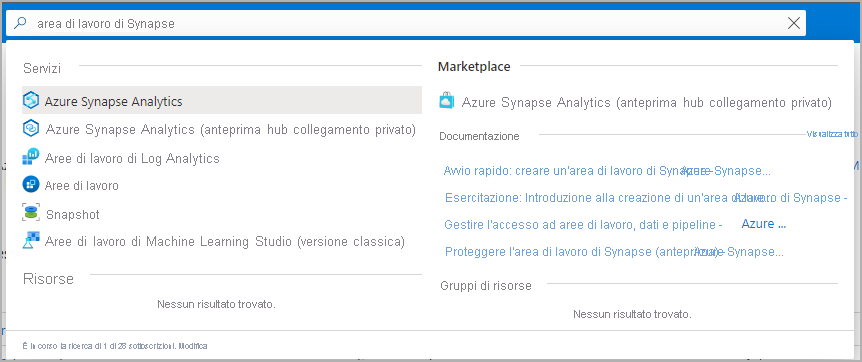
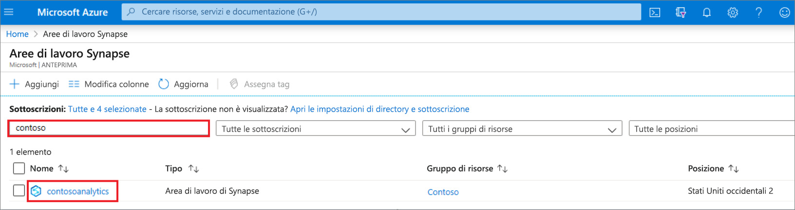
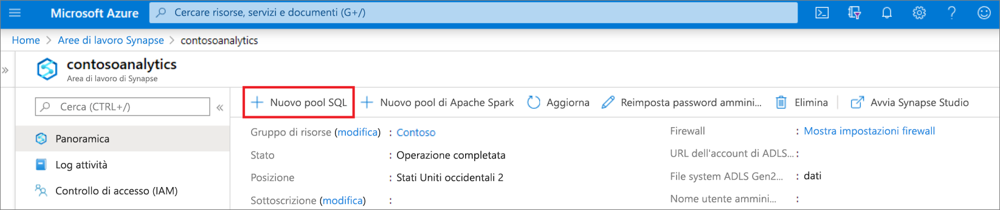
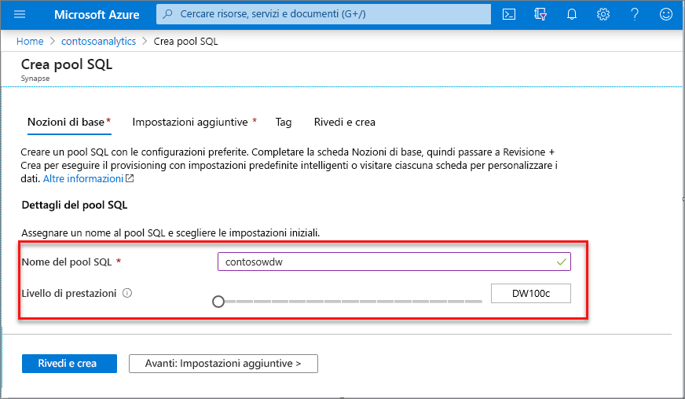
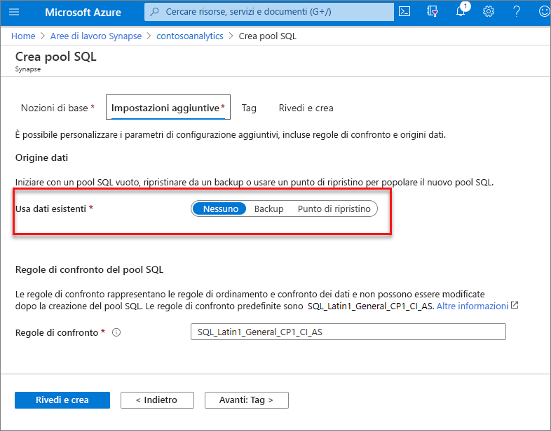
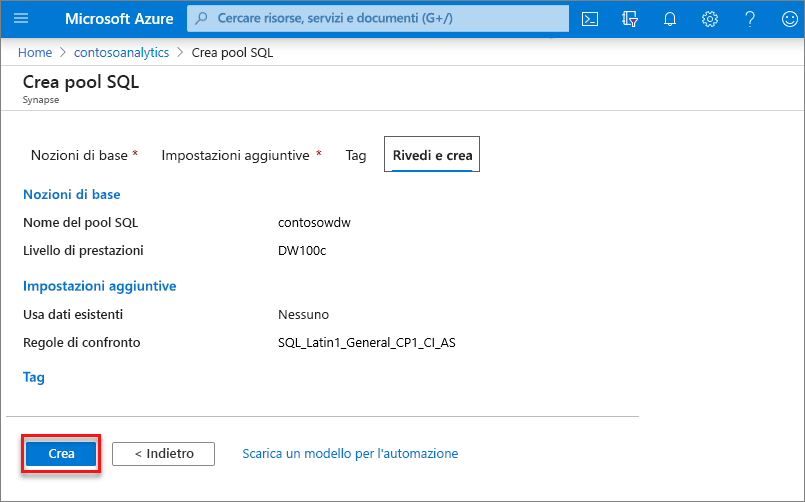
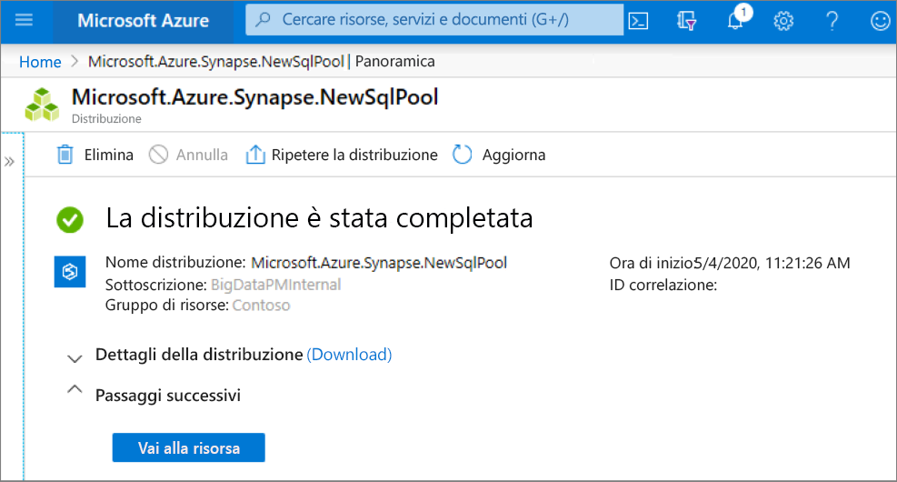
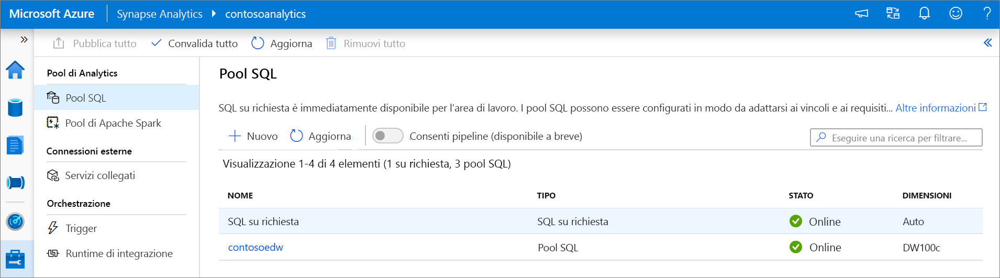
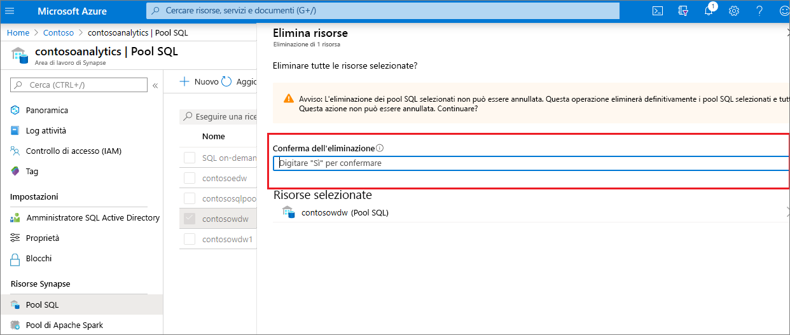

# Avvio rapido: Creare un pool SQL dedicato (anteprima) con il portale di Azure

Azure Synapse Analytics offre vari motori di analisi che consentono di inserire, trasformare, modellare e analizzare i dati. Un pool SQL dedicato offre funzionalità di calcolo e archiviazione basate su T-SQL. Dopo aver creato un pool SQL dedicato nell'area di lavoro di Synapse, è possibile caricare, modellare, elaborare e distribuire i dati per ottenere dati analitici in modo più rapido.

Questo argomento di avvio rapido illustra come creare un pool SQL dedicato in un'area di lavoro di Synapse con il portale di Azure.

Se non si ha una sottoscrizione di Azure, creare un [account gratuito prima di iniziare](https://azure.microsoft.com/free/).

## Prerequisiti

- Sottoscrizione di Azure: [creare un account gratuito](https://azure.microsoft.com/free/)
- [Area di lavoro Synapse](./quickstart-create-workspace.md)

## Accedere al portale di Azure

Accedere al [portale di Azure](https://portal.azure.com/)

## Accedere all'area di lavoro Synapse

1. Passare all'area di lavoro Synapse in cui verrà creato il pool SQL dedicato digitando il nome del servizio (o direttamente il nome della risorsa) nella barra di ricerca.
. 
1. Dall'elenco delle aree di lavoro, digitare il nome (o parte del nome) dell'area di lavoro da aprire. Per questo esempio verrà usata un'area di lavoro denominata **contosoanalytics**.

## Creare un nuovo pool SQL dedicato

1. Nell'area di lavoro di Synapse in cui si vuole creare il pool SQL dedicato selezionare il comando **Nuovo pool SQL dedicato** nella barra in alto.

2. Immettere i dettagli seguenti nella scheda **Informazioni di base** :

    | Impostazione | Valore consigliato | Descrizione |
    | :------ | :-------------- | :---------- |
    | **Nome del pool SQL** | Qualsiasi nome valido | Nome del pool SQL dedicato. |
    | **Livello di prestazioni** | DW100c | Per questa guida di avvio rapido, impostare questa opzione sulle dimensioni minime per ridurre i costi |

  
    

    > [!IMPORTANT]
    > Si noti che esistono limitazioni specifiche per i nomi che è possibile usare per i pool SQL dedicati. I nomi non possono contenere caratteri speciali, devono essere costituiti da un massimo di 15 caratteri, non possono contenere parole riservate e devono essere univoci nell'area di lavoro.

3. Selezionare **Avanti: Impostazioni aggiuntive**.
4. Selezionare **Nessuno** per effettuare il provisioning del pool SQL dedicato senza dati. Lasciare selezionate le regole di confronto predefinite.

5. Selezionare **Rivedi e crea**.
6. Verificare che i dettagli siano corretti in base a quanto specificato in precedenza. Selezionare **Crea**.

7. A questo punto, verrà avviato il flusso di provisioning delle risorse.
 

8. Al termine del provisioning, tornando all'area di lavoro viene visualizzata una nuova voce per il pool SQL dedicato appena creato.
 

Dopo la creazione, il pool SQL dedicato sarà disponibile nell'area di lavoro per il caricamento di dati, l'elaborazione di flussi, la lettura dal data lake e così via.

## Pulire le risorse

Seguire questa procedura per eliminare il pool SQL dedicato dall'area di lavoro.
> [!WARNING]
> Se si elimina un pool SQL dedicato, il motore di analisi e i dati archiviati nel database del pool SQL dedicato eliminato verranno rimossi dall'area di lavoro. Non sarà più possibile connettersi al pool SQL dedicato e tutte le query, le pipeline e i notebook che eseguono operazioni di lettura o scrittura su questo pool non funzioneranno più.

Per eliminare il pool SQL dedicato, seguire questa procedura:

1. Passare al pannello dei pool SQL nel pannello dell'area di lavoro.
1. Selezionare il pool SQL dedicato da eliminare (in questo caso, **contosowdw** )
1. Una volta selezionato, premere **CANC**
1. Confermare l'eliminazione e selezionare il pulsante **Elimina** 
1. Una volta completato il processo, il pool SQL dedicato non sarà più elencato nelle risorse dell'area di lavoro.

## Passaggi successivi

- Vedere [Avvio rapido: Creare un pool di Apache Spark serverless in Synapse Studio con gli strumenti Web](quickstart-apache-spark-notebook.md).
- Vedere [Avvio rapido: Creare un pool di Apache Spark serverless usando il portale di Azure](quickstart-create-apache-spark-pool-portal.md).
