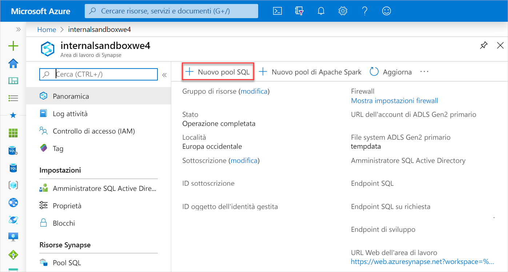
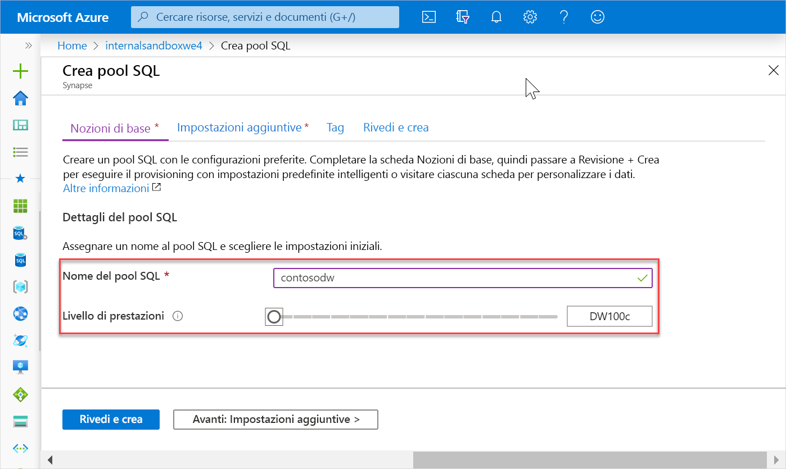
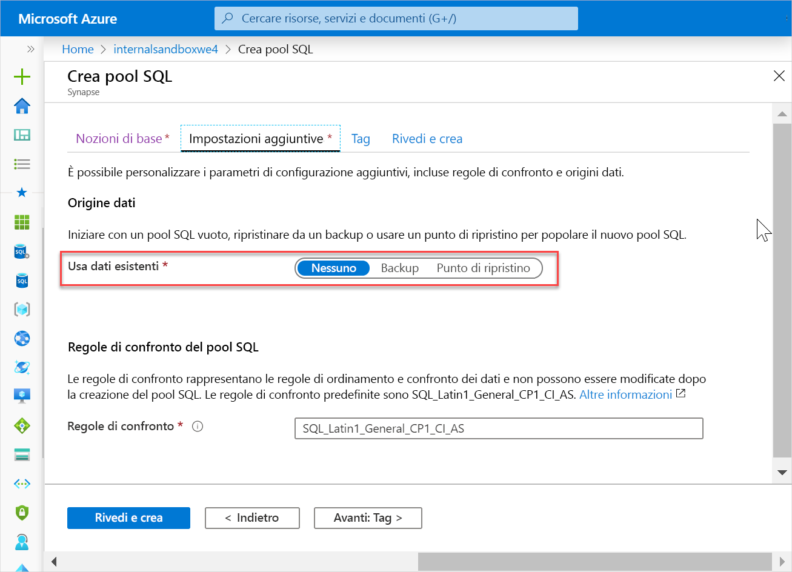
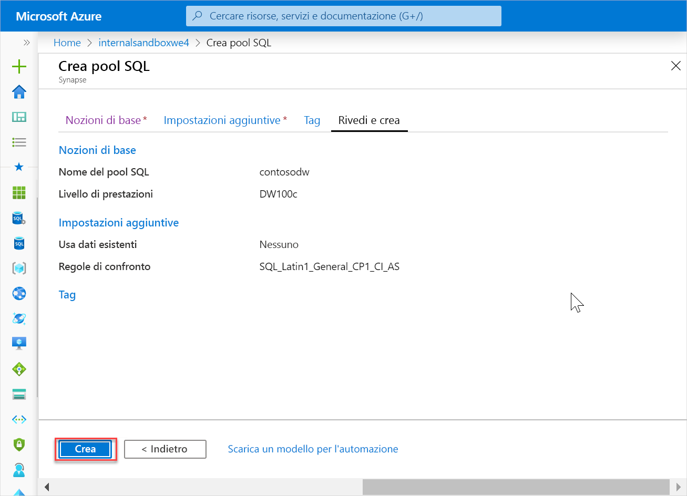
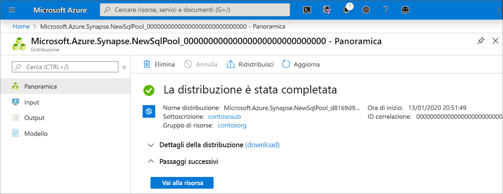
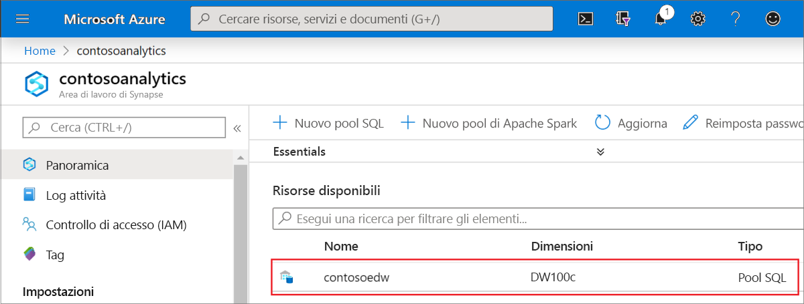
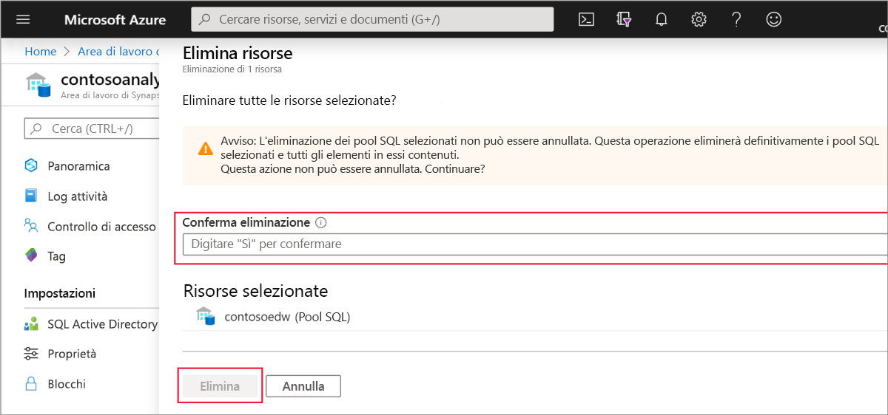

# Avvio rapido: Creare un pool SQL Synapse

Azure Synapse Analytics offre vari motori di analisi che consentono di inserire, trasformare, modellare, analizzare e gestire i dati. Un pool SQL offre funzionalità di calcolo e archiviazione basate su T-SQL. Dopo aver creato un pool SQL nell'area di lavoro di Synapse, è possibile caricare, modellare, elaborare e gestire i dati per ottenere dati analitici.

In questa guida di avvio rapido viene illustrato come creare un pool SQL in un'area di lavoro di Synapse con il portale di Azure.

Se non si ha una sottoscrizione di Azure, creare un [account gratuito prima di iniziare](https://azure.microsoft.com/free/).

## Prerequisiti

[Area di lavoro di Synapse](quickstart-create-workspace.md)

## Accedere al portale di Azure

Accedere al [portale di Azure](https://portal.azure.com/)

## Creare il nuovo pool SQL

1. Nell'area di lavoro di Synapse in cui si vuole creare il pool SQL fare clic sul comando **Nuovo pool SQL** nella barra in alto.

2. Immettere i dettagli seguenti nella scheda **Informazioni di base**:

    | Impostazione | Valore consigliato | Descrizione |
    | :------ | :-------------- | :---------- |
    | **Nome del pool SQL** | Qualsiasi nome valido | Nome del pool SQL. |
    | **Livello di prestazioni** | DW100c | Per questa guida di avvio rapido, impostare questa opzione sulle dimensioni minime per ridurre i costi |
    ||||
  
    
    > [!IMPORTANT]
    > Si noti che esistono limitazioni specifiche per i nomi che è possibile usare per i pool SQL. I nomi non possono contenere caratteri speciali, devono essere costituiti da un massimo di 15 caratteri, non possono contenere parole riservate e devono essere univoci nell'area di lavoro.

3. Fare clic su **Avanti: Impostazioni aggiuntive**.
4. Selezionare **Nessuno** per effettuare il provisioning del pool SQL senza dati. Lasciare selezionate le regole di confronto predefinite.

5. Fare clic su **Rivedi e crea**.
6. Verificare che i dettagli siano corretti in base a quanto specificato in precedenza, quindi fare clic su **Crea**.

7. A questo punto, verrà avviato il flusso di provisioning delle risorse.
 

8. Al termine del provisioning, tornando all'area di lavoro viene visualizzata una nuova voce per il pool SQL appena creato.
 

## Pulire le risorse

Seguire questa procedura per eliminare il pool SQL dall'area di lavoro.
> [!WARNING]
> Se si elimina un pool SQL, il motore di analisi e i dati archiviati nel database del pool SQL eliminato verranno rimossi dall'area di lavoro. Non sarà più possibile connettersi al pool SQL e tutte le query, le pipeline e i notebook che eseguono operazioni di lettura o scrittura su questo pool non funzioneranno più.

Per eliminare il pool SQL, seguire questa procedura:

1. Passare al pannello dei pool SQL nel pannello dell'area di lavoro.
1. Selezionare il pool SQL da eliminare (in questo caso, **contosoedw**).
1. Selezionarlo e fare clic su **Elimina**.
1. Confermare l'eliminazione e fare clic sul pulsante **Elimina**.
 
1. Quando il processo viene completato, il pool SQL non sarà più elencato nelle risorse dell'area di lavoro.

Dopo la creazione, il pool SQL sarà disponibile nell'area di lavoro per il caricamento di dati, l'elaborazione di flussi, la lettura dal lake e così via.

## Passaggi successivi

- Vedere [Avvio rapido: Creare un pool di Apache Spark in Synapse Studio con strumenti Web](spark/apache-spark-notebook-create-spark-use-sql.md).
- Vedere [Avvio rapido: Creare un pool di Apache Spark con il portale di Azure](quickstart-create-apache-spark-pool.md).
