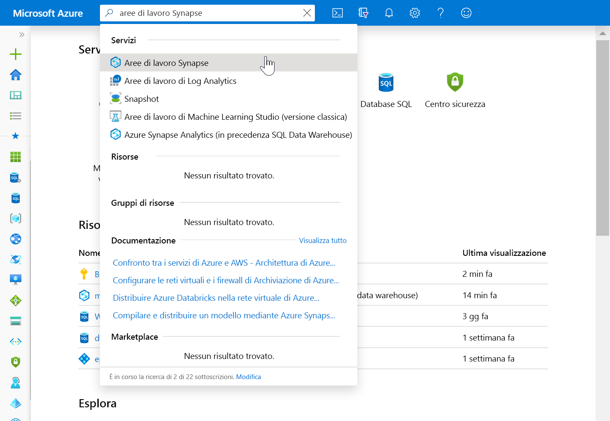
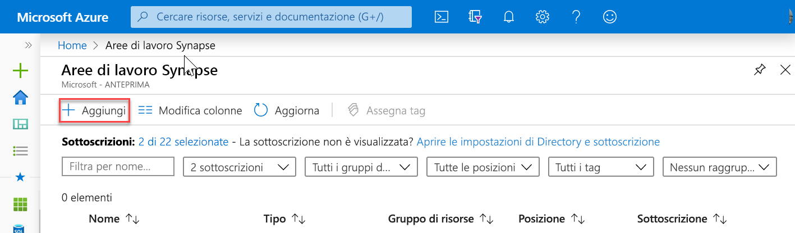
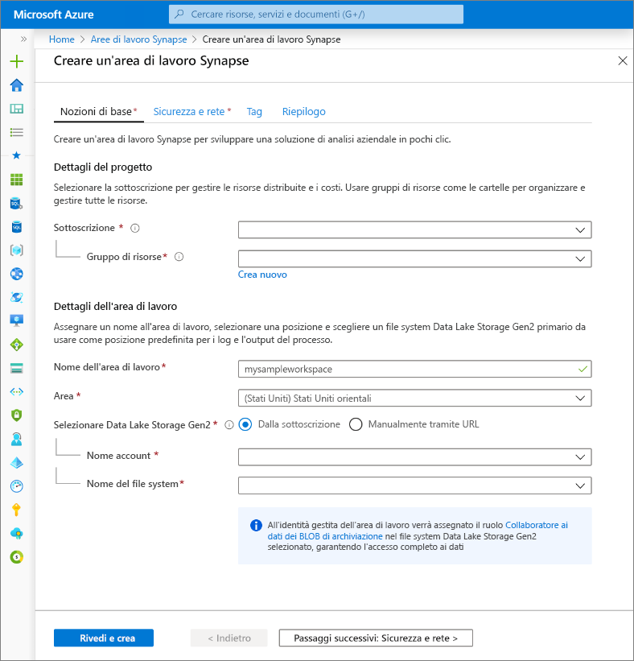
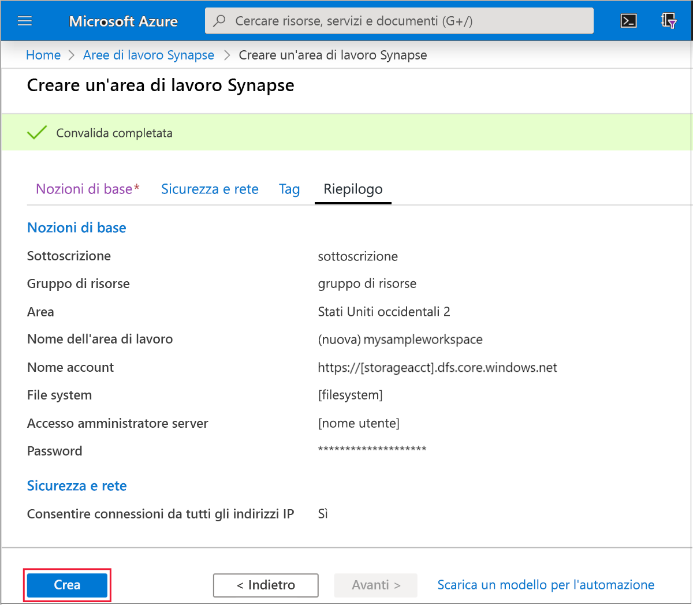
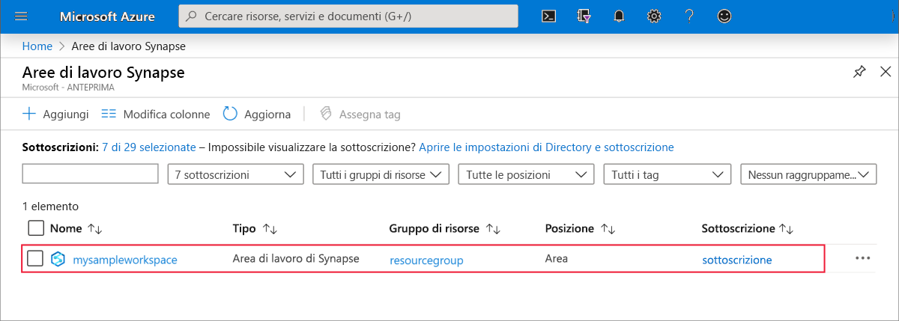
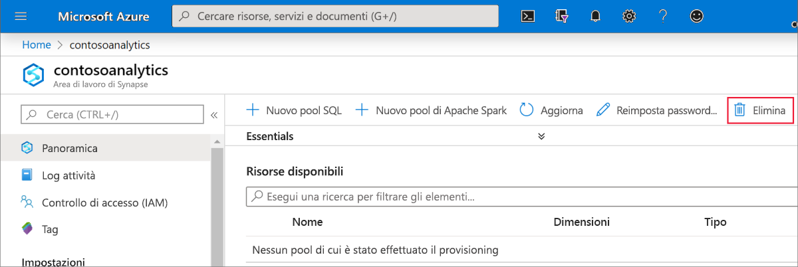
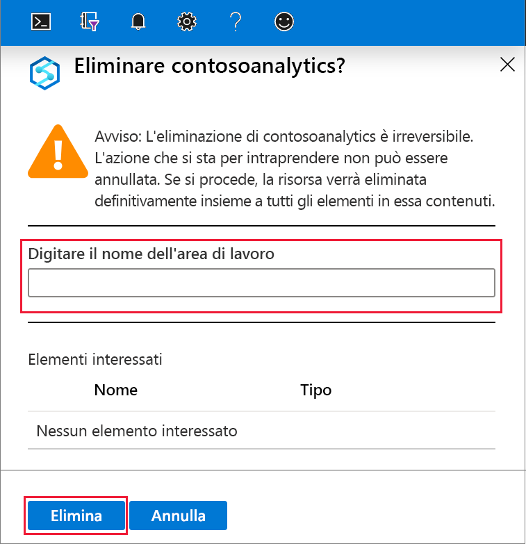

# Avvio rapido: Creare un'area di lavoro di Azure Synapse Analytics (anteprima)

Questo argomento di avvio rapido descrive la procedura per creare un'area di lavoro di Azure Synapse Analytics con il portale di Azure.

Se non si ha una sottoscrizione di Azure, creare un [account gratuito prima di iniziare](https://azure.microsoft.com/free/).

## Prerequisiti

- [Account di archiviazione di Azure Data Lake Storage Gen2 ](../storage/common/storage-account-create.md?toc=/azure/synapse-analytics/toc.json&bc=/azure/synapse-analytics/breadcrumb/toc.json)

## Accedere al portale di Azure

Accedere al [portale di Azure](https://portal.azure.com/)

## Creare un'area di lavoro di Azure Synapse Analytics con il portale di Azure

1. Nel riquadro di ricerca di Microsoft Azure immettere **area di lavoro Synapse** quindi selezionare questo servizio.

2. Nella pagina **Aree di lavoro Synapse** fare clic su **+ Aggiungi**.

3. Compilare il modulo **Area di lavoro Azure Synapse** con le informazioni seguenti:

    | Impostazione | Valore consigliato | Descrizione |
    | :------ | :-------------- | :---------- |
    | **Sottoscrizione** | *Sottoscrizione in uso* | Per informazioni dettagliate sulle sottoscrizioni, vedere [Sottoscrizioni](https://account.windowsazure.com/Subscriptions). |
    | **Gruppo di risorse** | *Any resource group* | Per i nomi di gruppi di risorse validi, vedere [Regole di denominazione e restrizioni](/azure/architecture/best-practices/resource-naming?toc=/azure/synapse-analytics/toc.json&bc=/azure/synapse-analytics/breadcrumb/toc.json&view=azure-sqldw-latest). |
    | **Nome area di lavoro** | mysampleworkspace | Specifica il nome dell'area di lavoro, che verrà usato anche per gli endpoint di connessione.|
    | **Area** | Stati Uniti Orientali 2 | Specifica la località dell'area di lavoro.|
    | **Data Lake Storage Gen2** | Account: `storage account name`   File system: `root file system to use` | Specifica il nome dell'account di archiviazione di ADLS Gen2 da usare come archiviazione primaria e il file system da usare.|
    ||||

    

    È possibile selezionare l'account di archiviazione tramite:
    - Un elenco di account di archiviazione di ADLS Gen2 disponibili nella sottoscrizione
    - Immissione manuale del nome dell'account

    > [!IMPORTANT]
    > L'area di lavoro di Azure Synapse deve essere in grado di leggere e scrivere nell'account di ADLS Gen2 selezionato. Inoltre, per qualsiasi account di archiviazione collegato come account di archiviazione primario, è necessario avere abilitato lo **spazio dei nomi gerarchico** durante la creazione dell'account di archiviazione.
    >
    > Sotto i campi di selezione di ADLS Gen2 è presente una nota che indica che l'identità gestita dell'area di lavoro verrà assegnata al ruolo **Collaboratore ai dati dei BLOB di archiviazione** nel file system di Data Lake Storage Gen2 selezionato, concedendo l'accesso completo ai dati.

4. (Facoltativo) Modificare le impostazioni predefinite della scheda **Sicurezza + rete**:
5. (Facoltativo) Aggiungere eventuali tag nella scheda **Tag**.
6. Nella scheda **Riepilogo** verranno eseguite le convalide necessarie per assicurare che l'area di lavoro possa essere creata correttamente. Quando la convalida ha esito positivo, fare clic su **Crea** 
7. Una volta completato il processo di provisioning delle risorse, verrà visualizzata una voce per l'area di lavoro creata nell'elenco delle aree di lavoro di Synapse. 

## Pulire le risorse

Per eliminare l'area di lavoro di Azure Synapse, seguire questa procedura.
> [!WARNING]
> Con l'eliminazione di un'area di lavoro di Azure Synapse, verranno rimossi anche i motori di analisi e i dati archiviati nel database dei pool SQL contenuti e dei metadati dell'area di lavoro. Non sarà più possibile connettersi agli endpoint SQL e Apache Spark. Tutti gli artefatti del codice verranno eliminati (query, notebook, definizioni di processi e pipeline).
>
> L'eliminazione dell'area di lavoro **non** influisce sui dati dell'istanza di Data Lake Store Gen2 collegata all'area di lavoro.

Per eliminare l'area di lavoro di Azure Synapse, completare la procedura seguente:

1. Passare all'area di lavoro di Azure Synapse da eliminare.
1. Premere **Elimina** sulla barra dei comandi.
 
1. Confermare l'eliminazione e fare clic sul pulsante **Elimina**.
 
1. Quando il processo viene completato, l'area di lavoro di Azure Synapse non sarà più presente nell'elenco di aree di lavoro.

## Passaggi successivi

Successivamente, è possibile [creare pool SQL](quickstart-create-sql-pool-studio.md) o [pool di Apache Spark](quickstart-create-apache-spark-pool-studio.md) per iniziare ad analizzare ed esplorare i dati.
