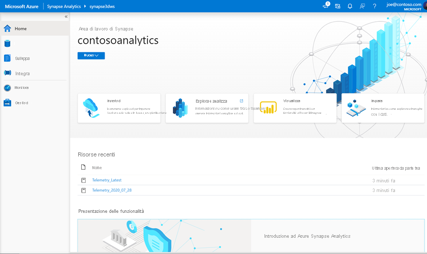
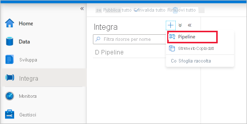

# <a name="quickstart-transform-data-using-mapping-data-flows"></a>Guida introduttiva: trasformare i dati usando il mapping dei flussi di dati

In questa Guida introduttiva si userà Azure sinapsi Analytics per creare una pipeline che trasforma i dati da un'origine Azure Data Lake Storage Gen2 (ADLS Gen2) a un sink ADLS Gen2 usando il flusso di dati di mapping. Il modello di configurazione in questa Guida introduttiva può essere espanso quando si trasformano i dati utilizzando il flusso di dati di mapping

In questa Guida introduttiva vengono eseguiti i passaggi seguenti:

> [!div class="checklist"]
> * Creare una pipeline con un'attività flusso di dati in Azure sinapsi Analytics.
> * Compilare un flusso di dati di mapping con quattro trasformazioni.
> * Eseguire test della pipeline.
> * Monitorare un'attività flusso di dati

## <a name="prerequisites"></a>Prerequisiti

* **Sottoscrizione di Azure**: Se non si ha una sottoscrizione di Azure, creare un [account gratuito](https://azure.microsoft.com/free/) prima di iniziare.
* **Area di lavoro di Azure sinapsi**: creare un'area di lavoro sinapsi usando il portale di Azure seguendo le istruzioni in [Guida introduttiva: creare un'area di lavoro sinapsi](quickstart-create-workspace.md).
* **Account di archiviazione di Azure**: si usa l'archiviazione ADLS come archivi dati di *origine* e *sink* . Se non si ha un account di archiviazione, vedere [Creare un account di archiviazione di Azure](../storage/common/storage-account-create.md) per informazioni su come crearne uno.

    Il file che si sta trasformando in questa esercitazione è MoviesDB.csv, disponibile [qui](https://raw.githubusercontent.com/djpmsft/adf-ready-demo/master/moviesDB.csv). Per recuperare il file da GitHub, copiare il contenuto in un editor di testo di propria scelta per salvarlo localmente come file con estensione CSV. Per caricare il file nell'account di archiviazione, vedere [caricare BLOB con il portale di Azure](../storage/blobs/storage-quickstart-blobs-portal.md). Gli esempi faranno riferimento a un contenitore denominato "Sample-Data".

### <a name="navigate-to-the-synapse-studio"></a>Passare a Synapse Studio

Dopo aver creato l'area di lavoro di Azure Synapse, è possibile aprire Synapse Studio in due modi:

* Aprire l'area di lavoro di Synapse nel [portale di Azure](https://ms.portal.azure.com/#home). Selezionare **Apri** nella scheda Open sinapsi studio in Guida introduttiva.
* Aprire [Azure Synapse Analytics](https://web.azuresynapse.net/) e accedere all'area di lavoro.

In questo argomento di avvio rapido viene usata come esempio l'area di lavoro denominata "adftest2020". Si verrà indirizzati automaticamente alla home page di Synapse Studio.



## <a name="create-a-pipeline-with-a-data-flow-activity"></a>Creare una pipeline con un'attività flusso di dati

Una pipeline contiene il flusso logico per un'esecuzione di un set di attività. In questa sezione verrà creata una pipeline che contiene un'attività flusso di dati.

1. Passare alla scheda **Integrazione**. Selezionare l'icona con il segno più accanto all'intestazione della pipeline e quindi selezionare Pipeline.

   

1. Nella pagina impostazioni **Proprietà** della pipeline immettere **TransformMovies** per **nome**.

1. In *spostamento e trasformazione* nel riquadro *attività* trascinare il **flusso di dati** nell'area di disegno della pipeline.

1. Nella finestra popup aggiunta della pagina **flusso di dati** selezionare **Crea nuovo** flusso di dati flusso di dati  ->  **Data flow**. Fare clic su **OK** al termine dell'operazione.

   

1. Denominare il flusso di dati **TransformMovies** nella pagina delle **Proprietà** .

## <a name="build-transformation-logic-in-the-data-flow-canvas"></a>Logica di trasformazione compilazione nell'area di disegno del flusso di dati

Dopo aver creato il flusso di dati, verrà inviato automaticamente all'area di disegno del flusso di dati. In questo passaggio verrà compilato un flusso di dati che accetta il MoviesDB.csv nell'archiviazione ADLS e aggrega la valutazione media di Comedie da 1910 a 2000. Il file verrà quindi scritto nuovamente nell'archivio ADLS.

1. Sopra l'area di disegno del flusso di dati, far scorrere il dispositivo di scorrimento **debug del flusso di dati** . La modalità di debug consente il test interattivo della logica di trasformazione in un cluster Spark attivo. I cluster di flussi di dati impiegano 5-7 minuti per il riscaldamento e si consiglia agli utenti di attivare prima il debug se pianificano lo sviluppo del flusso di dati. Per altre informazioni, vedere [Modalità di debug](https://docs.microsoft.com/azure/data-factory/concepts-data-flow-debug-mode?toc=/azure/synapse-analytics/toc.json&bc=/azure/synapse-analytics/breadcrumb/toc.json).

    

1. Nell'area di disegno del flusso di dati aggiungere un'origine facendo clic sulla casella **Aggiungi origine** .

1. Assegnare un nome all'origine **MoviesDB**. Fare clic su **nuovo** per creare un nuovo set di dati di origine.

    

1. Scegliere **Azure Data Lake storage Gen2**. Fare clic su Continue.

    

1. Scegliere **DelimitedText**. Fare clic su Continue.

1. Denominare il set di dati **MoviesDB**. Nell'elenco a discesa servizio collegato scegliere **nuovo**.

1. Nella schermata di creazione del servizio collegato assegnare un nome al servizio collegato ADLS Gen2 **ADLSGen2** e specificare il metodo di autenticazione. Immettere quindi le credenziali di connessione. In questa Guida introduttiva viene usata la chiave dell'account per connettersi all'account di archiviazione. È possibile fare clic su **Test connessione** per verificare che le credenziali siano state immesse correttamente. Al termine, fare clic su **Crea**.

    

1. Quando si torna alla schermata di creazione del set di dati, nel campo **percorso file** immettere il percorso in cui si trova il file. In questa Guida introduttiva il file "MoviesDB.csv" si trova nel contenitore "Sample-Data". Quando il file contiene intestazioni, controllare la **prima riga come intestazione**. Selezionare **da connessione/archivio** per importare lo schema dell'intestazione direttamente dal file nella risorsa di archiviazione. Fare clic su **OK** al termine dell'operazione.

    

1. Se il cluster di debug è stato avviato, passare alla scheda **Anteprima dati** della trasformazione origine e fare clic su **Aggiorna** per ottenere uno snapshot dei dati. È possibile utilizzare l'anteprima dati per verificare che la trasformazione sia configurata correttamente.

    

1. Accanto al nodo di origine nell'area di disegno del flusso di dati fare clic sull'icona a forma di segno più per aggiungere una nuova trasformazione. La prima trasformazione che si sta aggiungendo è un **filtro**.

    

1. Assegnare un nome alla trasformazione filtro **FilterYears**. Fare clic sulla casella espressione accanto a applica **filtro** per aprire Generatore di espressioni. Qui si specificherà la condizione di filtro.

1. Il generatore di espressioni del flusso di dati consente di compilare in modo interattivo espressioni da usare in diverse trasformazioni. Le espressioni possono includere funzioni predefinite, colonne dello schema di input e parametri definiti dall'utente. Per ulteriori informazioni su come compilare espressioni, vedere [Generatore di espressioni del flusso di dati](https://docs.microsoft.com/azure/data-factory/concepts-data-flow-expression-builder?toc=/azure/synapse-analytics/toc.json&bc=/azure/synapse-analytics/breadcrumb/toc.json).

    In questa Guida introduttiva si vogliono filtrare i film di genere Comedy che si sono rivelati tra gli anni 1910 e 2000. Come Year è attualmente una stringa, è necessario convertirla in un Integer usando la ```toInteger()``` funzione. Utilizzare gli operatori maggiore di o uguale a (>=) e minore o uguale a (<=) per confrontare i valori letterali anno 1910 e 200-. Unire queste espressioni con l'operatore and (&&). L'espressione viene visualizzata come segue:

    ```toInteger(year) >= 1910 && toInteger(year) <= 2000```

    Per individuare i film che rappresentano le medie, è possibile usare la ```rlike()``` funzione per trovare il modello "Comedy" nei generi di colonna. Unione dell'espressione rlike con il confronto Year da ottenere:

    ```toInteger(year) >= 1910 && toInteger(year) <= 2000 && rlike(genres, 'Comedy')```

    

    Se si dispone di un cluster di debug attivo, è possibile verificare la logica facendo clic su **Aggiorna** per visualizzare l'output delle espressioni rispetto agli input utilizzati. Esiste più di una risposta giusta su come eseguire questa logica usando il linguaggio delle espressioni del flusso di dati.

    Al termine dell'espressione, fare clic su **Salva e fine** .

1. Recuperare un' **anteprima dei dati** per verificare che il filtro funzioni correttamente.

1. La trasformazione successiva che verrà aggiunta è una trasformazione **aggregazione** nel **modificatore dello schema**.

    

1. Assegnare un nome alla trasformazione aggregazione **AggregateComedyRatings**. Nella scheda **raggruppa** per selezionare **anno** dall'elenco a discesa per raggruppare le aggregazioni in base all'anno in cui si è rivelato il film.

    

1. Passare alla scheda **aggregazioni** . Nella casella di testo a sinistra, denominare la colonna aggregata **AverageComedyRating**. Fare clic sulla casella espressione a destra per immettere l'espressione di aggregazione tramite Generatore di espressioni.

    

1. Per ottenere la media della **classificazione** di colonna, utilizzare la ```avg()``` funzione di aggregazione. Poiché **rating** è una stringa e ```avg()``` accetta un input numerico, è necessario convertire il valore in un numero tramite la ```toInteger()``` funzione. Questa espressione ha un aspetto simile al seguente:

    ```avg(toInteger(Rating))```

    Al termine, fare clic su **Salva e fine** .

    

1. Passare alla scheda **Anteprima dati** per visualizzare l'output della trasformazione. Si noti che sono presenti solo due colonne, **year** e **AverageComedyRating**.

    

1. Successivamente, si desidera aggiungere una trasformazione **sink** in **destinazione**.

    

1. Assegnare un nome al **sink** di sink. Fare clic su **nuovo** per creare il set di dati del sink.

1. Scegliere **Azure Data Lake storage Gen2**. Fare clic su Continue.

1. Scegliere **DelimitedText**. Fare clic su Continue.

1. Assegnare al set di dati del sink il nome **MoviesSink**. Per servizio collegato scegliere il servizio collegato ADLS Gen2 creato nel passaggio 7. Immettere una cartella di output in cui scrivere i dati. In questa Guida introduttiva si sta scrivendo nella cartella "output" nel contenitore "Sample-Data". La cartella non deve esistere in anticipo e può essere creata dinamicamente. Impostare la **prima riga come intestazione** su true e selezionare **None** per **Importa schema**. Fare clic su **OK** al termine dell'operazione.

    

A questo punto è stata completata la creazione del flusso di dati. Si è pronti per eseguirlo nella pipeline.

## <a name="running-and-monitoring-the-data-flow"></a>Esecuzione e monitoraggio del flusso di dati

È possibile eseguire il debug di una pipeline prima di pubblicarla. In questo passaggio verrà avviata un'esecuzione del debug della pipeline del flusso di dati. Sebbene l'anteprima dei dati non scriva i dati, un'esecuzione del debug scriverà i dati nella destinazione del sink.

1. Passare all'area di disegno della pipeline. Fare clic su **debug** per attivare un'esecuzione del debug.

    

1. Il debug della pipeline delle attività del flusso di dati usa il cluster di debug attivo, ma occorre ancora almeno un minuto per l'inizializzazione. È possibile tenere traccia dello stato di avanzamento tramite la scheda **output** . Una volta completata l'esecuzione, fare clic sull'icona degli occhiali per aprire il riquadro monitoraggio.

    

1. Nel riquadro monitoraggio è possibile visualizzare il numero di righe e il tempo impiegato in ogni passaggio della trasformazione.

    

1. Fare clic su una trasformazione per ottenere informazioni dettagliate sulle colonne e il partizionamento dei dati.

    

Se questa Guida introduttiva è stata eseguita correttamente, è necessario avere scritto 83 righe e 2 colonne nella cartella del sink. È possibile verificare i dati controllando l'archivio BLOB.


## <a name="next-steps"></a>Passaggi successivi

Per informazioni sul supporto di analisi sinapsi di Azure, passare agli articoli seguenti:

> [!div class="nextstepaction"]
> [Pipeline e attività](https://docs.microsoft.com/azure/data-factory/concepts-pipelines-activities?toc=/azure/synapse-analytics/toc.json&bc=/azure/synapse-analytics/breadcrumb/toc.json) 
>  [Cenni preliminari](https://docs.microsoft.com/azure/data-factory/concepts-data-flow-overview?toc=/azure/synapse-analytics/toc.json&bc=/azure/synapse-analytics/breadcrumb/toc.json) 
>  sul flusso di dati mapping [Linguaggio delle espressioni del flusso di dati](https://docs.microsoft.com/azure/data-factory/data-flow-expression-functions?toc=/azure/synapse-analytics/toc.json&bc=/azure/synapse-analytics/breadcrumb/toc.json)
