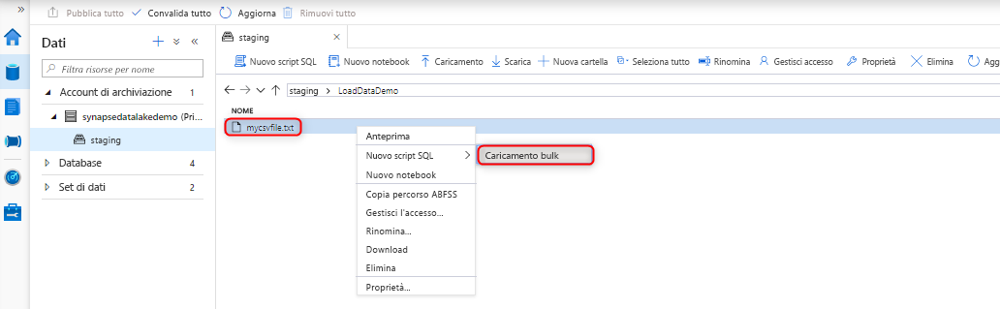
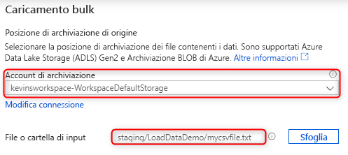
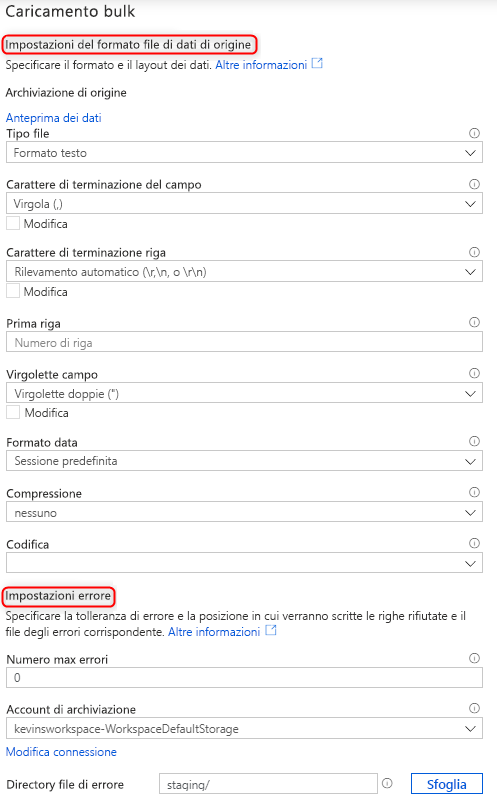
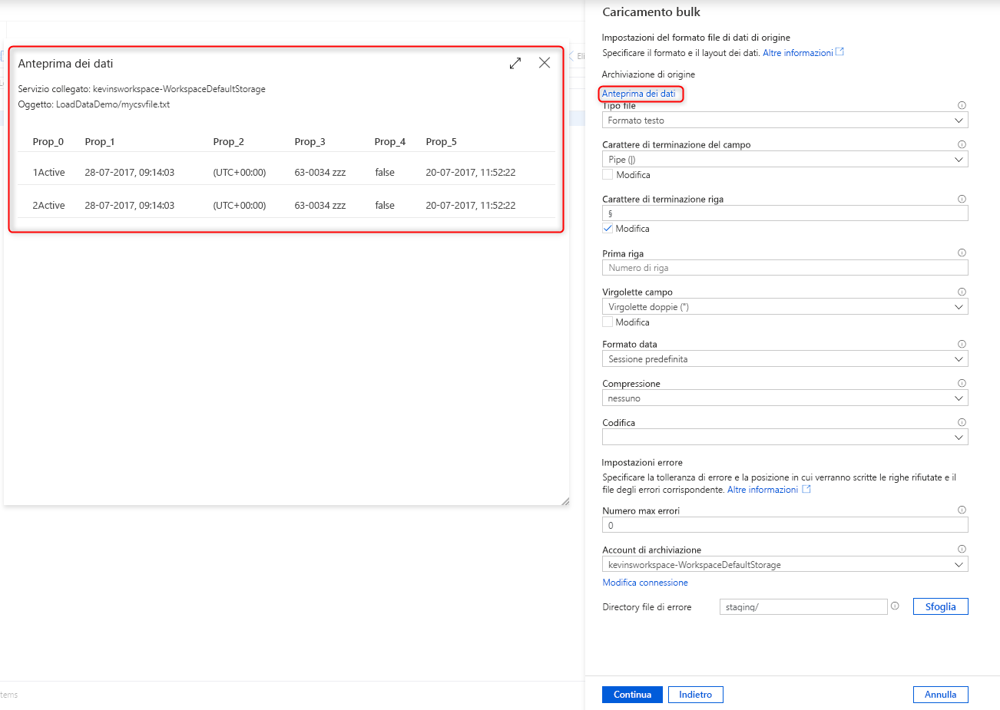
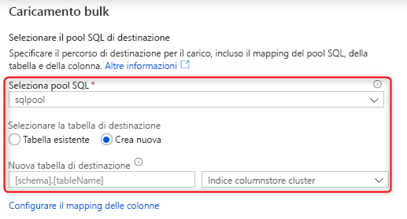
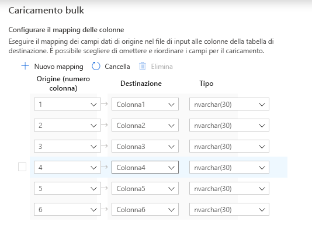
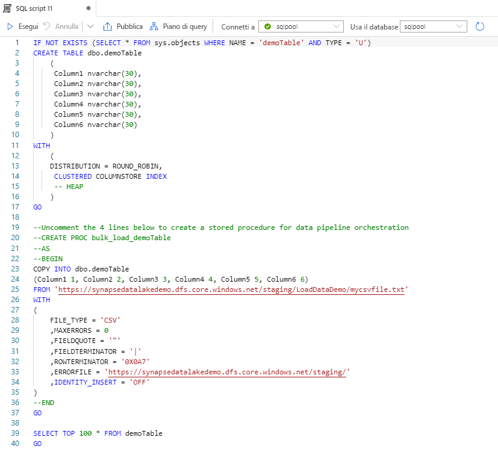

# Caricamento bulk con Synapse SQL

La procedura guidata Caricamento bulk di Synapse Studio semplifica enormemente il caricamento dei dati. Consente infatti di creare uno script T-SQL con l'[istruzione COPY](https://docs.microsoft.com/sql/t-sql/statements/copy-into-transact-sql?view=azure-sqldw-latest) per eseguire il caricamento bulk dei dati. 

## Punti di ingresso per la procedura guidata Caricamento bulk

È ora possibile eseguire facilmente il caricamento bulk dei dati usando i pool SQL con un semplice clic con il pulsante destro del mouse sulle aree seguenti all'interno di Synapse Studio:

- Un file o una cartella di un account di archiviazione di Azure collegato all'area di lavoro 

## Prerequisiti

- Questa procedura guidata genera un'istruzione COPY che usa il pass-through di AAD per l'autenticazione. È necessario che l'[utente di AAD abbia accesso](https://docs.microsoft.com/azure/synapse-analytics/sql-data-warehouse/quickstart-bulk-load-copy-tsql-examples#d-azure-active-directory-authentication-aad) all'area di lavoro con almeno il ruolo Controllo degli accessi in base al ruolo di Collaboratore ai dati dei BLOB di archiviazione per l'account ADLS Gen2.

- È necessario avere le [autorizzazioni richieste per l'uso dell'istruzione COPY](https://docs.microsoft.com/sql/t-sql/statements/copy-into-transact-sql?view=azure-sqldw-latest#permissions) e le autorizzazioni per la creazione di tabelle, se viene creata una nuova tabella in cui caricare i dati.

- Il servizio collegato associato all'account di ADLS Gen2 **deve avere accesso al file**/**cartella** per il caricamento. Se ad esempio il meccanismo di autenticazione del servizio collegato è Identità gestita, l'identità gestita dell'area di lavoro deve avere almeno l'autorizzazione di lettura per i dati dei BLOB di archiviazione nell'account di archiviazione.

- Se nell'area di lavoro è abilitata una rete virtuale, assicurarsi che sia abilitata la creazione interattiva per il runtime integrato associato ai servizi collegati dell'account di ADLS Gen2 per la posizione dei dati di origine e del file di errori. La creazione interattiva è necessaria per il rilevamento automatico dello schema, la visualizzazione in anteprima del contenuto del file di origine e l'esplorazione degli account di archiviazione di ADLS Gen2 all'interno della procedura guidata.

### Passaggi

1. Selezionare l'account di archiviazione e il file o la cartella da cui eseguire il caricamento nel pannello della posizione di archiviazione di origine: 

2. Selezionare le impostazioni del formato di file, incluso l'account di archiviazione in cui scrivere le righe rifiutate (file di errori). Attualmente sono supportati solo i file CSV e Parquet.

    

3. Per configurare le impostazioni del formato di file, è possibile fare clic su "Anteprima dati" per vedere come verrà analizzato il file dall'istruzione COPY. Fare clic su "Anteprima dati" ogni volta che si cambia un'impostazione del formato di file per vedere come verrà analizzato il file dall'istruzione COPY con l'impostazione aggiornata:  

4. Selezionare il pool SQL che si usa per il caricamento, specificando anche se verrà eseguito per una cartella esistente o per una nuova: 

5. Fare clic su "Configure column mapping" (Configura mapping di colonne) per assicurarsi di avere il mapping di colonne appropriato. Per le nuove tabelle, la configurazione del mapping di colonne è fondamentale per l'aggiornamento dei tipi di dati delle colonne di destinazione: 

6. Fare clic su "Apri script" per generare uno script T-SQL con l'istruzione COPY da caricare dal data lake: 

## Passaggi successivi

- Per altre informazioni sulle funzionalità di COPY, vedere l'articolo [Istruzione COPY](https://docs.microsoft.com/sql/t-sql/statements/copy-into-transact-sql?view=azure-sqldw-latest#syntax)
- Vedere l'articolo [Panoramica sul caricamento dei dati](https://docs.microsoft.com/azure/synapse-analytics/sql-data-warehouse/design-elt-data-loading#what-is-elt)
