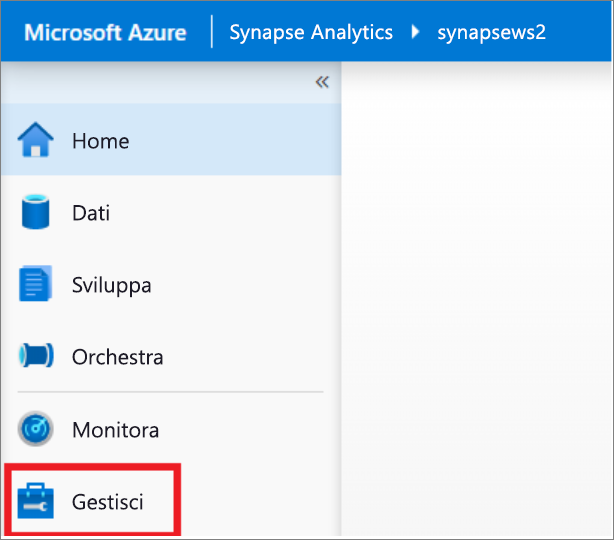
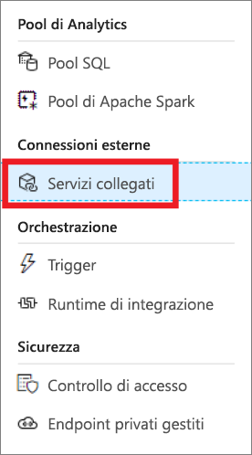
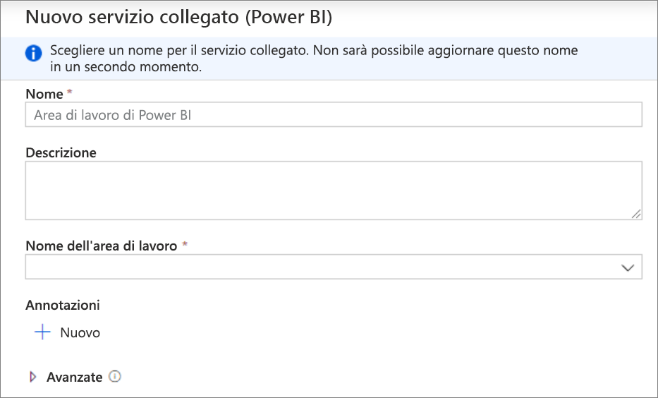
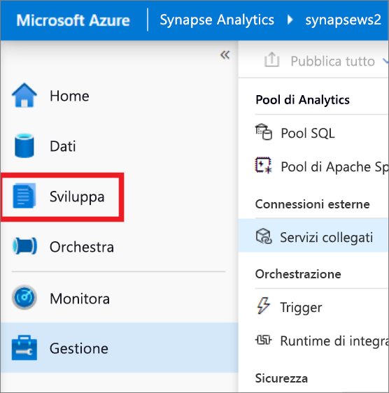
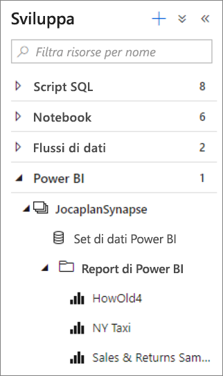
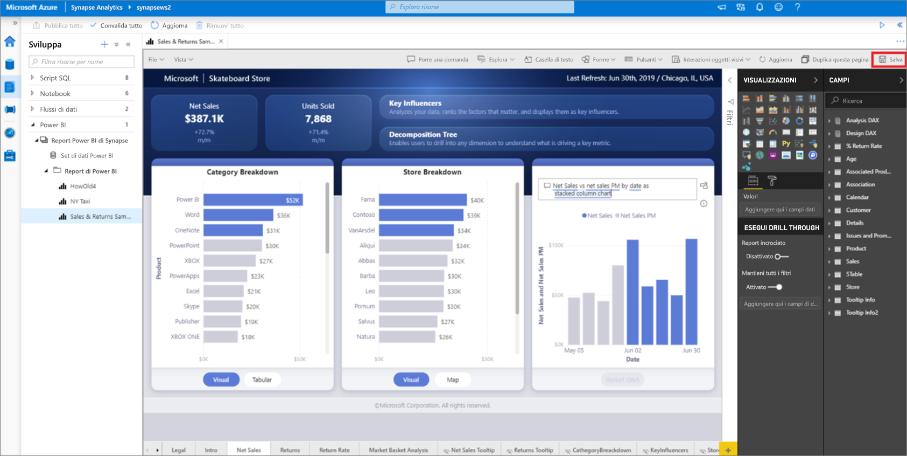

# Avvio rapido: Collegamento di un'area di lavoro Power BI a un'area di lavoro di Synapse

In questo argomento di Avvio rapido si apprenderà come connettere un'area di lavoro Power BI a un'area di lavoro Synapse Analytics per creare nuovi report e set di dati Power BI da Synapse Studio (anteprima).

Se non si ha una sottoscrizione di Azure, creare un [account gratuito prima di iniziare](https://azure.microsoft.com/free/).

## Prerequisiti

- [Creare un'area di lavoro di Azure Synapse e un account di archiviazione associato](quickstart-create-workspace.md)
- [Area di lavoro Power BI Professional o Premium](https://docs.microsoft.com/power-bi/service-create-the-new-workspaces)

## Collegare un’area di lavoro Power BI all’area di lavoro Synapse

1. A partire da Synapse Studio, fare clic su **Gestisci**.

    

2. In **Connessioni esterne**, fare clic su **Servizi collegati**.

    

3. Fare clic su **+ Nuovo**.

    

4. Fare clic su **Power BI** e fare clic su **Continua**.

    

5. Immettere un nome per il servizio collegato e selezionare un'area di lavoro dall'elenco a discesa.

    

6. Fare clic su **Crea**.

## Visualizzare l’area di lavoro Power BI in Synapse Studio

Una volta collegate le aree di lavoro, è possibile esplorare i set di dati Power BI, modificare/creare nuovi report Power BI da Synapse Studio.

1. Fare clic su **Sviluppa**.

    

2. Espandere Power BI e l'area di lavoro che si desidera utilizzare.

    

È possibile creare nuovi report facendo clic su **+** nella parte superiore della scheda **Sviluppa**. È possibile modificare i report esistenti facendo clic sul nome del report. Eventuali modifiche salvate verranno riscritte nell'area di lavoro Power BI.

## Passaggi successivi

Altre informazioni su come [creare il report di Power BI sui file archiviati in Archiviazione di Azure](sql/tutorial-connect-power-bi-desktop.md).
