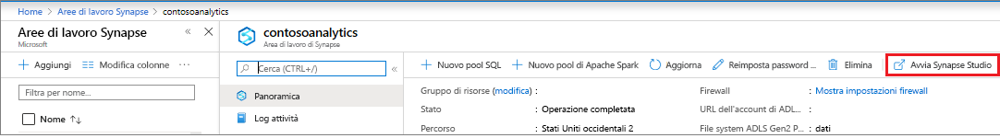
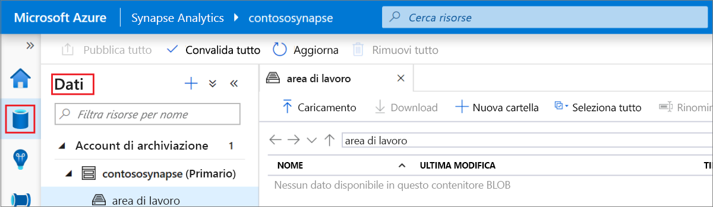
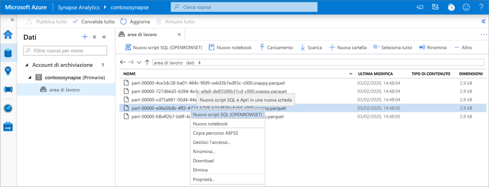
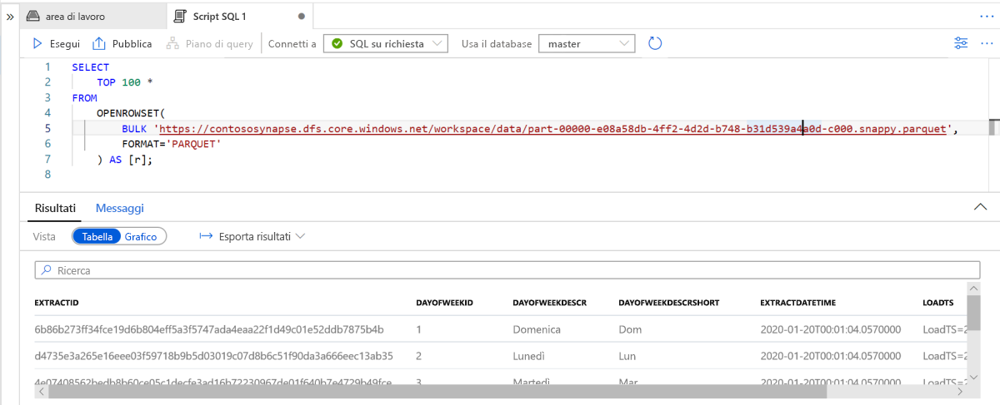

# Avvio rapido: Usare Synapse Studio (anteprima)

In questo argomento di avvio rapido verrà illustrato come eseguire query sui file con Synapse Studio.

Se non si ha una sottoscrizione di Azure, creare un account [gratuito](https://azure.microsoft.com/free/) prima di iniziare.

## Accedere al portale di Azure

Accedere al [portale di Azure](https://portal.azure.com/).

## Prerequisiti

[Creare un'area di lavoro di Azure Synapse e un account di archiviazione associato](quickstart-create-workspace.md).

## Avviare Synapse Studio

Nell'area di lavoro di Azure Synapse nel portale di Azure fare clic su **Avvia Synapse Studio**.

In alternativa, per avviare Synapse Studio, fare clic su [Azure Synapse Analytics](https://web.azuresynapse.net) e fornire i valori appropriati per tenant, sottoscrizione e area di lavoro.

## Esplorare gli account di archiviazione

Dopo aver aperto Synapse Studio, passare a **Dati** e quindi espandere **Account di archiviazione** per visualizzare l'account di archiviazione nell'area di lavoro.

Per creare nuove cartelle e caricare i file, usare i collegamenti nella barra degli strumenti per organizzare i file.

## Eseguire query sui file nell'account di archiviazione

> [!IMPORTANT]
> Per poter eseguire query sui file, è necessario essere un membro del ruolo `Storage Blob Reader` nello spazio di archiviazione sottostante. Informazioni su come [assegnare le autorizzazioni **Ruolo con autorizzazioni di lettura per i dati dei BLOB di archiviazione** o **Collaboratore ai dati dei BLOB di archiviazione** di Controllo degli accessi in base al ruolo in Archiviazione di Azure](../storage/common/storage-auth-aad-rbac-portal.md?toc=/azure/synapse-analytics/toc.json&bc=/azure/synapse-analytics/breadcrumb/toc.json#assign-a-built-in-rbac-role).

1. Caricare alcuni file di `PARQUET`.
2. Selezionare uno o più file e quindi creare un nuovo script SQL o un notebook di Spark per visualizzare il contenuto dei file. Se si vuole creare un notebook, è necessario creare un [pool di Apache Spark nelle aree di lavoro Synapse](quickstart-create-apache-spark-pool-studio.md).

   

3. Eseguire la query o il notebook generato per visualizzare il contenuto del file.

   

4. È possibile modificare la query per filtrare e ordinare i risultati. Per le funzionalità del linguaggio disponibili in SQL su richiesta nella [panoramica delle funzionalità di SQL](sql/overview-features.md).

## Passaggi successivi

- Consentire agli utenti di Azure AD di eseguire query sui file [assegnando le autorizzazioni **Ruolo con autorizzazioni di lettura per i dati dei BLOB di archiviazione** o **Collaboratore ai dati dei BLOB di archiviazione** di Controllo degli accessi in base al ruolo in Archiviazione di Azure](../storage/common/storage-auth-aad-rbac-portal.md?toc=/azure/synapse-analytics/toc.json&bc=/azure/synapse-analytics/breadcrumb/toc.json#assign-a-built-in-rbac-role)
- [Eseguire query su file in Archiviazione di Azure con SQL su richiesta](sql/on-demand-workspace-overview.md)
- [Creare il pool di Apache Spark con il portale di Azure](quickstart-create-apache-spark-pool-portal.md)
- [Creare il report di Power BI sui file archiviati in Archiviazione di Azure](sql/tutorial-connect-power-bi-desktop.md)
