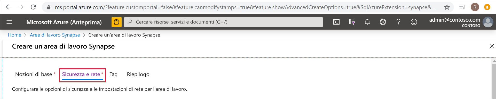
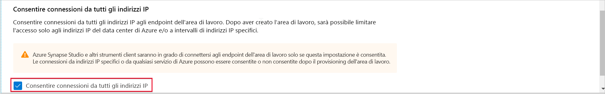
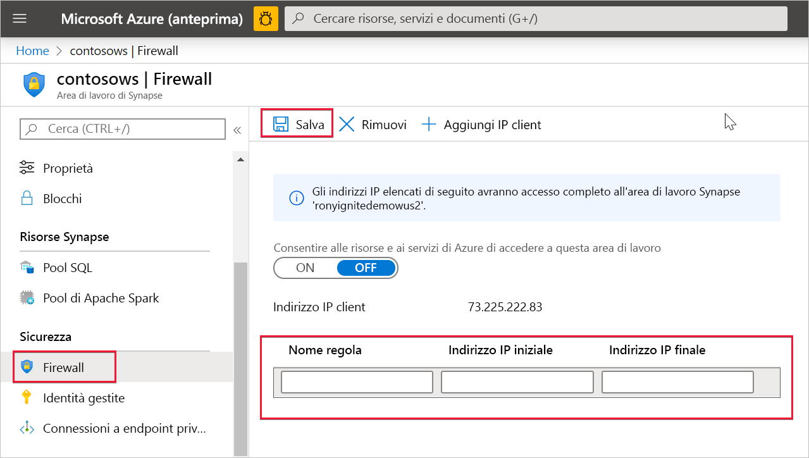

# Regole del firewall IP di Azure Synapse Analytics (anteprima)

Questo articolo illustra le regole del firewall IP e spiega come configurarle in Azure Synapse Analytics.

## Regole del firewall IP

Le regole del firewall IP consentono di concedere o negare l'accesso all'area di lavoro di Synapse in base all'indirizzo IP di origine di ogni richiesta. È possibile configurare le regole del firewall IP per l'area di lavoro. Le regole del firewall IP configurate a livello di area di lavoro si applicano a tutti gli endpoint pubblici dell'area di lavoro (pool SQL, SQL su richiesta e di sviluppo).

## Creare e gestire le regole del firewall IP

È possibile aggiungere regole del firewall IP a un'area di lavoro Synapse in due modi diversi. Per aggiungere un firewall IP all'area di lavoro, selezionare **Sicurezza + rete** e quindi **Consenti connessioni da tutti gli indirizzi IP** durante la creazione dell'area di lavoro.

È anche possibile aggiungere regole del firewall IP a un'area di lavoro Synapse dopo la creazione dell'area di lavoro. Selezionare **Firewall** in **Sicurezza** del portale di Azure. Per aggiungere una nuova regola del firewall IP, assegnarle un nome, un indirizzo IP iniziale e un indirizzo IP finale. Al termine, selezionare **Salva** .

## Connettersi a Synapse dalla propria rete

Per connettersi all'area di lavoro di Synapse, usare Synapse Studio. È anche possibile usare SQL Server Management Studio (SSMS) per connettersi alle risorse SQL (pool SQL e SQL su richiesta) nell'area di lavoro.

Assicurarsi che il firewall nella rete e nel computer locale consenta la comunicazione TCP in uscita attraverso le porte TCP 80, 443 e 1443 per Synapse Studio.

È inoltre necessario consentire la comunicazione in uscita attraverso la porta UDP 53 per Synapse Studio. Per connettersi con strumenti quali SSMS e Power BI, è necessario consentire la comunicazione in uscita tramite la porta TCP 1433.

Se si usa l'impostazione predefinita dei criteri di connessione di reindirizzamento, potrebbe essere necessario consentire la comunicazione in uscita tramite porte aggiuntive. Per altre informazioni sui criteri di connessione, vedere [qui](https://docs.microsoft.com/azure/sql-database/sql-database-connectivity-architecture#connection-policy).

## Passaggi successivi

Creare un'[area di lavoro di Azure Synapse](../quickstart-create-workspace.md)

Creare un'area di lavoro di Azure Synapse con una [rete virtuale dell'area di lavoro gestita](./synapse-workspace-managed-vnet.md)