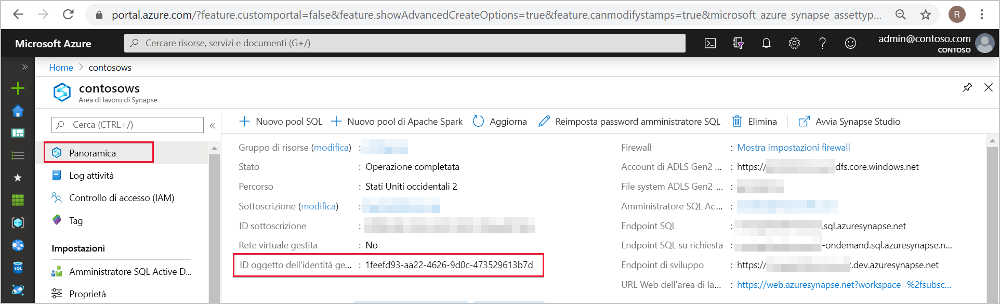
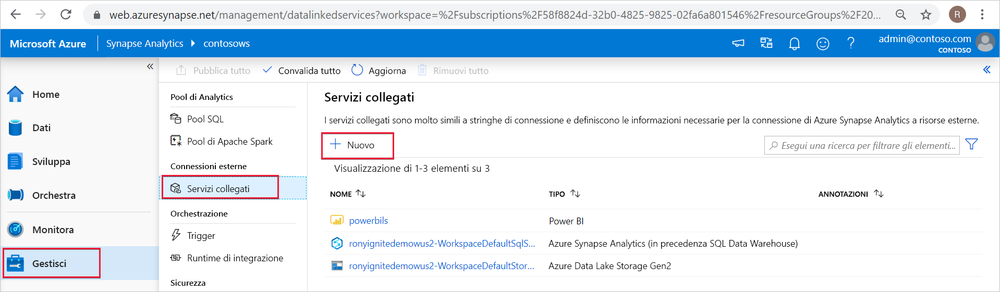
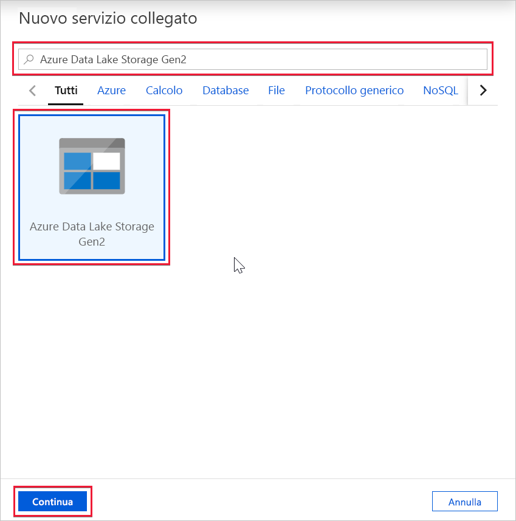
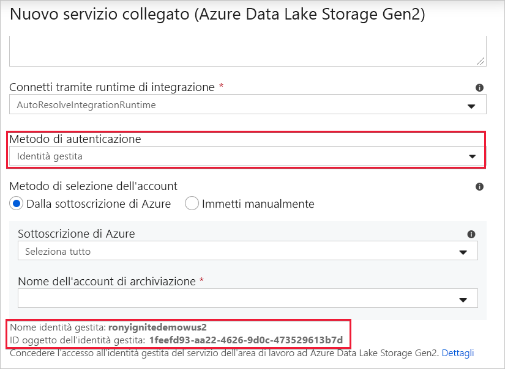

# Identità gestita dell'area di lavoro di Azure Synapse (anteprima)

Questo articolo illustra la funzionalità dell'identità gestita nell'area di lavoro di Azure Synapse.

## Identità gestite

L'identità gestita per le risorse di Azure è una funzionalità di Azure Active Directory. La funzionalità offre ai servizi di Azure un'identità gestita automaticamente in Azure AD. È possibile usare la funzionalità di identità gestita per eseguire l'autenticazione a qualsiasi servizio che supporti l'autenticazione Azure AD.

Le identità gestite per le risorse di Azure corrispondono al servizio noto in precedenza come identità del servizio gestita. Per altre informazioni, vedere [Identità gestite](../../active-directory/managed-identities-azure-resources/overview.md?toc=/azure/synapse-analytics/toc.json&bc=/azure/synapse-analytics/breadcrumb/toc.json).

## Identità gestita dell'area di lavoro di Azure Synapse

Quando si crea l'area di lavoro, viene creata un'identità gestita assegnata dal sistema per l'area di lavoro di Azure Synapse.

>[!NOTE]
>A questa identità gestita dell'area di lavoro verrà fatto riferimento come identità gestita nel resto di questo documento.

Azure Synapse usa l'identità gestita per integrare le pipeline. Il ciclo di vita dell'identità gestita è direttamente collegato all'area di lavoro di Azure Synapse. Se si elimina l'area di lavoro di Azure Synapse, viene cancellata anche l'identità gestita.

L'identità gestita dell'area di lavoro richiede autorizzazioni per eseguire operazioni nelle pipeline. È possibile usare l'ID oggetto o il nome dell'area di lavoro di Azure Synapse per trovare l'identità gestita quando si concedono le autorizzazioni.

## Recuperare l'identità gestita nel portale di Azure

È possibile recuperare l'identità gestita nel portale di Azure. Aprire l'area di lavoro di Azure Synapse nel portale di Azure e selezionare **Panoramica** nel riquadro di spostamento a sinistra. L'ID oggetto dell'identità gestita viene visualizzato nella schermata principale.

Le informazioni sull'identità gestita vengono visualizzate anche quando si crea un servizio collegato che supporta l'autenticazione dell'identità gestita da Azure Synapse Studio.

Avviare **Azure Synapse Studio** e selezionare la scheda **Gestisci** nel riquadro di spostamento sinistro. Selezionare quindi **Servizi collegati** e scegliere l'opzione **+ Nuovo** per creare un nuovo servizio collegato.

Nella finestra **New linked service** (Nuovo servizio collegato) digitare *Azure Data Lake Storage Gen2*. Selezionare il tipo di risorsa **Azure Data Lake Storage Gen2** nell'elenco seguente e scegliere **Continua**.

Nella finestra successiva scegliere **Identità gestita** in **Metodo di autenticazione**. Verranno visualizzati il **nome** e l' **ID oggetto** dell'identità gestita.

## Passaggi successivi

Altre informazioni su [Concessione delle autorizzazioni all'identità gestita dell'area di lavoro di Azure Synapse](./how-to-grant-workspace-managed-identity-permissions.md)
