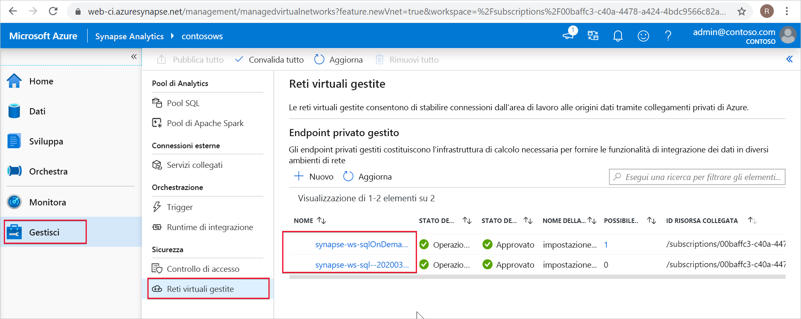

# Endpoint privati gestiti di Synapse (anteprima)

Questo articolo illustra gli endpoint privati gestiti in Azure Synapse Analytics.

## Endpoint privati gestiti

Gli endpoint privati gestiti sono endpoint privati creati nella rete virtuale di Microsoft Azure dell'area di lavoro gestita che consentono di stabilire un collegamento privato alle risorse di Azure. Azure Synapse gestisce questi endpoint privati per conto dell'utente.

Azure Synapse supporta i collegamenti privati. Il collegamento privato consente di accedere in modo sicuro a servizi di Azure, ad esempio Archiviazione di Azure e Azure Cosmos DB, nonché a servizi di clienti/partner ospitati in Azure da Rete virtuale di Azure.

Quando si usa un collegamento privato, il traffico tra la rete virtuale e l'area di lavoro attraversa interamente la rete backbone Microsoft. Il collegamento privato protegge da rischi di esfiltrazione dei dati. Per stabilire un collegamento privato a una risorsa, è necessario creare un endpoint privato.

L'endpoint privato usa un indirizzo IP privato della rete virtuale per introdurre in modo efficace il servizio nella rete virtuale. Gli endpoint privati sono associati a una risorsa specifica in Azure e non all'intero servizio. I clienti possono limitare la connettività a una risorsa specifica approvata dall'organizzazione. 

Altre informazioni su [collegamenti ed endpoint privati](https://docs.microsoft.com/azure/private-link/).

>[!IMPORTANT]
>Gli endpoint privati gestiti sono supportati solo nelle aree di lavoro di Azure Synapse con una rete virtuale dell'area di lavoro gestita.

>[!NOTE]
>Tutto il traffico in uscita dalla rete virtuale dell'area di lavoro gestita, eccetto quello tramite gli endpoint privati gestiti, verrà bloccato in futuro. È consigliabile creare endpoint privati gestiti per connettersi a tutte le origini dati di Azure esterne all’area di lavoro. 

Quando si crea un endpoint privato gestito in Azure Synapse, viene creata una connessione all'endpoint privato con lo stato "In sospeso". Viene avviato un flusso di lavoro di approvazione. Il proprietario della risorsa del collegamento privato ha la responsabilità di approvare la connessione.

Se il proprietario approva la connessione, il collegamento privato viene stabilito. Se tuttavia il proprietario non approva la connessione, il collegamento privato non verrà stabilito. In entrambi i casi, l'endpoint privato gestito verrà aggiornato con lo stato della connessione.

Solo un endpoint privato gestito in uno stato approvato può inviare il traffico a una risorsa del collegamento privato specificata.

## Endpoint privati gestiti per il pool SQL dedicato e il pool SQL serverless

Il pool SQL dedicato e il pool SQL serverless sono funzionalità analitiche disponibili nell'area di lavoro di Azure Synapse. Queste funzionalità usano l'infrastruttura multi-tenant che non viene distribuita nella [rete virtuale dell'area di lavoro gestita](./synapse-workspace-managed-vnet.md).

Quando si crea un'area di lavoro, Azure Synapse crea al suo interno due endpoint privati gestiti, uno per il pool SQL dedicato e l'altro per il pool SQL serverless. 

Questi due endpoint privati gestiti sono elencati in Azure Synapse Studio. Selezionare **Gestisci** nel riquadro di spostamento a sinistra e quindi selezionare **Managed Virtual Networks** (Reti virtuali gestite) per visualizzarle in Studio.

L'endpoint privato gestito destinato al pool SQL è denominato *synapse-ws-sql--\<workspacename\>* , mentre quello destinato al pool SQL serverless è denominato *synapse-ws-sqlOnDemand--\<workspacename\>* .

Questi due endpoint privati gestiti vengono creati automaticamente quando si crea l'area di lavoro di Azure Synapse. I costi correlati a questi due endpoint privati gestiti non vengono addebitati.

## Passaggi successivi

Per altre informazioni, passare all'articolo [Creare endpoint privati gestiti per le origini dati](./how-to-create-managed-private-endpoints.md).
