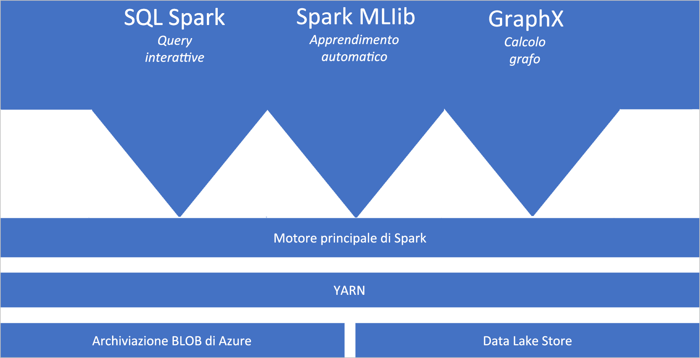
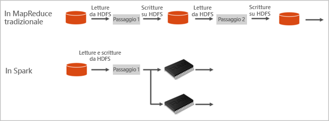

# Che cos'è Apache Spark in Azure Synapse Analytics

Apache Spark è un framework di elaborazione parallela che supporta l'elaborazione in memoria per migliorare le prestazioni di applicazioni analitiche di Big Data. Apache Spark in Azure Synapse Analytics è una delle implementazioni Microsoft di Apache Spark nel cloud. Azure Synapse semplifica la creazione e la configurazione di un pool di Spark (anteprima) in Azure. I pool di Spark in Azure Synapse sono compatibili con Archiviazione di Azure e Azure Data Lake Storage Gen2. È quindi possibile usare i pool di Spark in Azure per elaborare i dati archiviati in Azure.

[!INCLUDE [preview](../includes/note-preview.md)]

## Che cos'è Apache Spark

Apache Spark fornisce le primitive per il cluster computing in memoria. Un processo Spark può caricare i dati e memorizzarli nella cache in memoria ed eseguire query su di essi ripetutamente. L'elaborazione in memoria è molto più veloce rispetto alle applicazioni basate su disco. Spark si integra inoltre con più linguaggi di programmazione per consentire di modificare set di dati distribuiti come raccolte locali. Non è necessario strutturare tutti gli elementi come operazioni di mapping e riduzione.

I pool di Spark in Azure Synapse offrono un servizio Spark completamente gestito. La tabella seguente descrive i vantaggi che si ottengono creando un pool di Spark in Synapse Analytics.

| Funzionalità | Descrizione |
| --- | --- |
| Velocità ed efficienza |Le istanze di Spark vengono avviate in circa 2 minuti in presenza di meno di 60 nodi e in circa 5 minuti in presenza di più di 60 nodi. Per impostazione predefinita, l'istanza viene arrestata 5 minuti dopo l'esecuzione dell'ultimo processo, a meno che non venga mantenuta attiva da una connessione del notebook. |
| Facilità di creazione |È possibile creare un nuovo pool di Spark in Azure Synapse in pochi minuti usando il portale di Azure, Azure PowerShell o Synapse Analytics .NET SDK. Vedere [Creare un pool di Apache Spark (anteprima) in Synapse Analytics usando gli strumenti Web](../quickstart-create-apache-spark-pool-studio.md). |
| Semplicità d'uso |Synapse Analytics include un notebook personalizzato derivato da [Nteract](https://nteract.io/). È possibile usare questi notebook per la visualizzazione e l'elaborazione interattiva di dati.|
| API REST |Spark in Synapse Analytics include [Apache Livy](https://github.com/cloudera/hue/tree/master/apps/spark/java#welcome-to-livy-the-rest-spark-server), un server dei processi Spark basato sull'API REST per l'invio e il monitoraggio in remoto dei processi. |
| Supporto per Azure Data Lake Storage Gen2| I pool di Spark in Azure Synapse possono usare sia Azure Data Lake Storage Gen2 sia l'archiviazione BLOB. Per altre informazioni su Data Lake Storage, vedere [Panoramica di Azure Data Lake Storage](../../data-lake-store/data-lake-store-overview.md). |
| Integrazione con IDE di terze parti | Azure Synapse fornisce un plug-in IDE per [IntelliJ IDEA di JetBrains](https://www.jetbrains.com/idea/) utile per creare applicazioni e inviarle a un pool di Spark. |
| Librerie Anaconda precaricate |I pool di Spark in Azure Synapse sono dotati di librerie Anaconda preinstallate. [Anaconda](https://docs.continuum.io/anaconda/) offre quasi 200 librerie per Machine Learning, l'analisi dei dati, la visualizzazione e così via. |
| Scalabilità | Nei pool di Apache Spark in Azure Synapse può essere abilitata la scalabilità automatica, in modo da dimensionare i pool aggiungendo o rimuovendo i nodi secondo le necessità. È anche possibile arrestare i pool di Spark senza alcuna perdita di dati, in quanto tutti i dati sono archiviati in Archiviazione di Azure o Data Lake Storage. |

I pool di Spark in Azure Synapse includono i componenti seguenti che sono disponibili nei pool per impostazione predefinita.

- [Spark Core](https://spark.apache.org/docs/latest/). Include Spark Core, Spark SQL, GraphX e MLlib.
- [Anaconda](https://docs.continuum.io/anaconda/)
- [Apache Livy](https://github.com/cloudera/hue/tree/master/apps/spark/java#welcome-to-livy-the-rest-spark-server)
- [Notebook di Nteract](https://nteract.io/)

## Architettura dei pool di Spark

È facile comprendere i componenti di Spark se si comprende come Spark viene eseguito in Synapse Analytics.

Le applicazioni Spark vengono eseguite in un pool come set di processi indipendenti, coordinati dall'oggetto SparkContext nel programma principale (detto programma driver).

SparkContext può connettersi al componente di gestione cluster, che alloca le risorse tra le applicazioni. Il componente di gestione cluster è [Apache Hadoop YARN](https://hadoop.apache.org/docs/current/hadoop-yarn/hadoop-yarn-site/YARN.html). Una volta connesso, Spark acquisisce gli executor nei nodi del pool, che sono i processi che eseguono calcoli e archiviano i dati per l'applicazione. Successivamente, invia il codice dell'applicazione (definito dai file JAR o Python passati a SparkContext) agli executor. Infine, SparkContext invia le attività agli executor per l'esecuzione.

SparkContext esegue la funzione principale dell'utente e le diverse operazioni parallele nei nodi. In seguito, SparkContext raccoglie i risultati delle operazioni. I nodi leggono e scrivono i dati dal e nel file system. Inoltre, memorizzano nella cache i dati trasformati in memoria come oggetti RDD (Resilient Distributed Dataset).

SparkContext si connette al pool di Spark ed è responsabile della conversione di un'applicazione in un grafo aciclico diretto (DAG). Il grafo è costituito da singole attività che vengono eseguite all'interno di un processo executor nei nodi. Ogni applicazione ottiene i propri processi executor, che rimangono attivi per la durata dell'intera applicazione ed eseguono attività in più thread.

## Casi d'uso di Apache Spark in Synapse Analytics

I pool di Spark in Synapse Analytics supportano gli scenari principali seguenti:

### Ingegneria dei dati/Preparazione dei dati

Apache Spark include numerose funzionalità del linguaggio per supportare la preparazione e l'elaborazione di grandi volumi di dati in modo che possano essere resi più utili e quindi utilizzati da altri servizi all'interno di Azure Synapse. Queste funzionalità sono abilitate tramite più linguaggi (C#, Scala, PySpark, Spark SQL) e librerie fornite per l'elaborazione e la connettività.

### Machine Learning

Apache Spark include [MLlib](https://spark.apache.org/mllib/), una libreria di Machine Learning basata su Spark che è possibile usare da un pool di Spark in Synapse Analytics. I pool di Spark in Synapse Analytics includono anche Anaconda, una distribuzione di Python con un'ampia gamma di pacchetti per data science, incluso il Machine Learning. Aggiungendo il supporto incorporato per notebook, si otterrà un ambiente per la creazione di applicazioni di Machine Learning.

## Da dove iniziare

Per altre informazioni su Apache Spark in Synapse Analytics, vedere gli articoli seguenti:

- [Avvio rapido: Creare un pool di Spark in Azure Synapse](../quickstart-create-apache-spark-pool-portal.md)
- [Avvio rapido: Creare un notebook Apache Spark](../quickstart-apache-spark-notebook.md)
- [Esercitazione: Machine Learning con Apache Spark](./apache-spark-machine-learning-mllib-notebook.md)
- [Documentazione ufficiale di Apache Spark](https://spark.apache.org/docs/latest/)

> [!NOTE]
> Parte della documentazione ufficiale di Apache Spark si basa sull'uso della console Spark, che non è disponibile in Spark di Azure Synapse. Usare al suo posto un notebook o IntelliJ.

## Passaggi successivi

Questa panoramica ha fornito una conoscenza di base di Apache Spark in Azure Synapse Analytics. Passare al prossimo articolo per apprendere come creare un pool di Spark in Azure Synapse Analytics:

- [Creare un pool di Spark in Azure Synapse](../quickstart-create-apache-spark-pool-portal.md)
