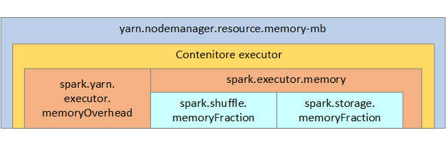

# <a name="optimize-apache-spark-jobs-preview-in-azure-synapse-analytics"></a>Ottimizzare i processi di Apache Spark (anteprima) in Azure Synapse Analytics

Informazioni su come ottimizzare la configurazione di un cluster [Apache Spark](https://spark.apache.org/) per carichi di lavoro specifici.  Il problema più comune è legato a un carico eccessivo sulla memoria, causato da configurazioni non corrette (in particolare, a executor di dimensioni errate), operazioni con esecuzione prolungata e attività che generano operazioni cartesiane. È possibile velocizzare i processi con una memorizzazione nella cache appropriata e consentendo l'[asimmetria dei dati](#optimize-joins-and-shuffles). Per ottenere prestazioni ottimali, monitorare e analizzare i processi Spark che comportano un'esecuzione prolungata e un consumo eccessivo di risorse.

Le sezioni seguenti descrivono alcune raccomandazioni e procedure di ottimizzazione comuni per i processi Spark.

## <a name="choose-the-data-abstraction"></a>Scegliere l'astrazione dei dati

Nelle versioni precedenti di Spark si usano RDD per estrapolare dati. In particolare, in Spark 1.3 e 1.6 sono stati introdotti rispettivamente frame di dati e set di dati. Valutare i seguenti vantaggi:

* **Frame di dati**
  * La soluzione ottimale nella maggior parte dei casi
  * Consentono l'ottimizzazione query tramite Catalyst
  * Generazione di codici whole-stage
  * Accesso diretto alla memoria
  * Sovraccarico ridotto di Garbage Collection (GC)
  * Per gli sviluppatori non risultano efficienti quanto i set di dati, perché non sono presenti controlli in fase di compilazione né alcuna programmazione degli oggetti di dominio
* **Set di dati**
  * Ideali nelle pipeline ETL complesse in cui l'impatto sulle prestazioni è accettabile
  * Sconsigliati nelle aggregazioni in cui l'impatto sulle prestazioni può essere considerevole
  * Consentono l'ottimizzazione query tramite Catalyst
  * Apprezzati dagli sviluppatori, offrono controlli in fase di compilazione e programmazione di oggetti di dominio
  * Comportano un sovraccarico di serializzazione/deserializzazione
  * Sovraccarico GC elevato
  * Interrompono la generazione di codici whole-stage
* **RDD**
  * Non è necessario usare RDD, a meno che non sia necessario creare un nuovo RDD personalizzato.
  * Nessuna ottimizzazione query tramite Catalyst
  * Nessuna generazione di codici whole-stage
  * Sovraccarico GC elevato
  * È necessario usare API legacy per Spark 1.x

## <a name="use-optimal-data-format"></a>Uso del formato dati ottimale

Spark supporta molti formati, come ad esempio csv, json, xml, parquet, orc e avro. Spark può essere esteso per supportare numerosi formati con origini dati esterne; per altre informazioni, vedere [Pacchetti Apache Spark](https://spark-packages.org).

Il formato migliore per le prestazioni è Parquet con *compressione Snappy*, ovvero l'impostazione predefinita in Spark 2.x. Parquet archivia i dati in formato a colonne ed è altamente ottimizzato in Spark. Inoltre, anche se la *compressione Snappy* può generare file di dimensioni maggiori rispetto alla compressione gzip, a causa della loro natura suddivisibile questi file verranno decompressi più velocemente.

## <a name="use-the-cache"></a>Usare la cache

Spark offre meccanismi di memorizzazione nella cache nativi che possono essere usati con metodi diversi, ad esempio `.persist()`, `.cache()` e `CACHE TABLE`. La memorizzazione nella cache nativa è efficace con set di dati di piccole dimensioni, così come con pipeline ETL, in cui è necessario memorizzare nella cache i risultati intermedi. Tuttavia, la memorizzazione nella cache nativa in Spark attualmente non funziona in modo ottimale con il partizionamento, poiché le tabelle memorizzate nella cache non conservano i dati del partizionamento.

## <a name="use-memory-efficiently"></a>Uso efficiente della memoria

Spark funziona inserendo i dati in memoria; pertanto, la gestione delle risorse di memoria è un aspetto essenziale per ottimizzare l'esecuzione dei processi Spark.  Esistono diverse tecniche che è possibile applicare per usare la memoria del cluster in modo efficiente.

* Prediligere partizioni di dati più piccole e tenere conto delle dimensioni, del tipo e della distribuzione dei dati nella strategia di partizionamento.
* Valutare la versione più recente e più efficiente di [serializzazione dei dati Kryo](https://github.com/EsotericSoftware/kryo), anziché la serializzazione Java predefinita.
* Monitorare e ottimizzare le impostazioni di configurazione di Spark.

La struttura della memoria Spark e alcuni parametri di memoria dell'executor chiave vengono visualizzati nella figura seguente per riferimento.

### <a name="spark-memory-considerations"></a>Considerazioni sulla memoria Spark

Apache Spark in Azure Synapse usa [Apache Hadoop YARN](https://hadoop.apache.org/docs/current/hadoop-yarn/hadoop-yarn-site/YARN.html), che controlla la quantità complessiva massima di memoria usata da tutti i contenitori in ogni nodo Spark.  Il diagramma seguente mostra gli oggetti chiave e le relative relazioni.



Per indirizzare messaggi di "memoria insufficiente", provare a:

* Esaminare le riproduzioni casuali con gestione DAG. Ridurre mediante riduzione lato mappa, pre-partizione (o assegnazione di bucket) dell'origine dati, ottimizzazione delle riproduzioni con sequenza casuale singole e riduzione della quantità di dati inviati.
* Prediligere `ReduceByKey` per il limite di memoria fissa rispetto a `GroupByKey`, che fornisce aggregazioni, windowing e altre funzioni, ma non ha limite di memoria.
* Prediligere `TreeReduce`, che esegue più operazioni su executor e partizioni rispetto a `Reduce`, che esegue tutto il lavoro sul driver.
* Sfruttare i frame di dati, anziché gli oggetti RDD di livello inferiore.
* Creare tipi complessi in grado di incapsulare azioni, come ad esempio "Top N", diverse aggregazioni od operazioni di windowing.

## <a name="optimize-data-serialization"></a>Ottimizzare la serializzazione dei dati

I processi Spark vengono distribuiti, per cui una serializzazione dei dati appropriata è importante per ottenere prestazioni ottimali.  Sono disponibili due opzioni di serializzazione per Spark:

* La serializzazione predefinita è quella in Java.
* La serializzazione Kryo è un formato più recente e può rivelarsi più veloce e più compatta rispetto a Java.  Kryo richiede la registrazione delle classi nel programma e non supporta ancora tutti i tipi serializzabili.

## <a name="use-bucketing"></a>Uso di bucket

L'uso di bucket è simile al partizionamento dei dati, ma ogni bucket può contenere un set di valori in colonna anziché uno solo. I bucket funzionano anche per il partizionamento di valori più numerosi (nell'ordine di milioni o più), ad esempio per gli identificatori prodotto. Un bucket è determinato dall'hash affiancato alla chiave di bucket della riga. Le tabelle inserite in bucket offrono ottimizzazioni univoche perché archiviano i metadati relativi a come sono state inserite in bucket e ordinate.

Ecco alcune funzionalità bucket avanzate:

* Ottimizzazione query in base alla ripartizione in bucket di metainformazioni
* Aggregazioni ottimizzate
* Join ottimizzati

È possibile usare partizionamento e bucket contemporaneamente.

## <a name="optimize-joins-and-shuffles"></a>Ottimizzare join e riproduzioni con sequenza casuale

Se sono presenti processi lenti in un'operazione Join o di riproduzione casuale, la causa è probabilmente dovuta a un'*asimmetria dei dati*, ovvero nei dati del processo. Ad esempio, un processo di mapping può richiedere 20 secondi, mentre l'esecuzione di un processo in cui i dati vengono uniti in Join o aggiunti o selezionati in ordine casuale richiede ore. Per correggere l'asimmetria dei dati è consigliabile archiviare in valori salt l'intera chiave o usare un *salt isolato* soltanto per alcuni subset di chiavi. Se si usa un salting isolato, è necessario filtrare ulteriormente per isolare il subset di chiavi archiviate con salting nei join di mapping. È anche possibile introdurre una colonna di bucket ed eseguire una prima aggregazione in bucket.

Un altro fattore che può causare join lenti è il tipo di join. Per impostazione predefinita, Spark usa il tipo di join `SortMerge`. Questo tipo di join è ideale per grandi set di dati, mentre in caso contrario risulta oneroso, perché è necessario innanzitutto ordinare i lati sinistro e destro dei dati prima di unirli.

Un join `Broadcast` è particolarmente appropriato per i set di dati più piccoli o laddove un lato del join sia nettamente inferiore all'altro. Questo tipo di join trasmette un solo lato a tutti gli executor e pertanto richiede più memoria per le trasmissioni in generale.

È possibile modificare il tipo di join nella configurazione impostando `spark.sql.autoBroadcastJoinThreshold`; in alternativa, è possibile impostare un join hint usando le API del frame di dati (`dataframe.join(broadcast(df2))`).

```scala
// Option 1
spark.conf.set("spark.sql.autoBroadcastJoinThreshold", 1*1024*1024*1024)

// Option 2
val df1 = spark.table("FactTableA")
val df2 = spark.table("dimMP")
df1.join(broadcast(df2), Seq("PK")).
    createOrReplaceTempView("V_JOIN")

sql("SELECT col1, col2 FROM V_JOIN")
```

Se si usano tabelle inserite in bucket, è possibile usare un terzo tipo di join, ovvero `Merge`. Un set di dati correttamente pre-partizionato e preordinato ignorerà la fase costosa di ordinamento da un join `SortMerge`.

L'ordine dei join è importante, in particolare nelle query più complesse. Iniziare con i join più selettivi. Laddove possibile, spostare anche i join che aumentano il numero di righe dopo le aggregazioni.

Per gestire il parallelismo per i join cartesiani, è possibile aggiungere strutture annidate, windowing e talvolta anche ignorare uno o più passaggi nel processo Spark.

### <a name="select-the-correct-executor-size"></a>Selezionare le dimensioni corrette dell'executor

Quando si sceglie la configurazione dell'executor, prendere in considerazione l'overhead di Java Garbage Collection (GC).

* Fattori che riducono le dimensioni dell'executor:
  * Ridurre le dimensioni heap al di sotto di 32 GB per mantenere un overhead di GC < 10%.
  * Ridurre il numero di core per mantenere un overhead di GC < 10%.

* Fattori che aumentano le dimensioni dell'executor:
  * Ridurre l'overhead di comunicazione tra executor.
  * Ridurre il numero di connessioni aperte tra executor (N2) nei cluster di grandi dimensioni (> 100 executor).
  * Aumentare le dimensioni dell'heap per consentire un uso intensivo della memoria.
  * Facoltativo: ridurre l'overhead della memoria per ogni executor.
  * Facoltativo: aumentare la concorrenza e l'uso mediante sovrascrittura della CPU.

Come regola empirica generale quando si selezionano le dimensioni dell'executor:

* Iniziare con 30 GB per executor e distribuire i core disponibili sul computer.
* Aumentare il numero di core per executor per i cluster di grandi dimensioni (> 100 executor).
* Modificare le dimensioni in base alle esecuzioni di prova e ai fattori precedenti, ad esempio l'overhead di Garbage Collection.

Durante l'esecuzione di query simultanee, considerare quanto segue:

* Iniziare con 30 GB per ogni executor e per tutti i core del computer.
* Creare più applicazioni Spark parallele sovrascrivendo la CPU (miglioramento della latenza di circa il 30%).
* Distribuire le query tra applicazioni parallele.
* Modificare le dimensioni in base alle esecuzioni di prova e ai fattori precedenti, ad esempio l'overhead di Garbage Collection.

Monitorare le prestazioni della query per gli outlier o altri problemi di prestazioni osservando la visualizzazione della sequenza temporale, il grafico SQL, le statistiche dei processi e così via. In alcuni casi, uno o più executor possono rivelarsi più lenti rispetto ad altri e richiedere molto più tempo per eseguire le attività. Ciò si verifica spesso nei cluster di dimensioni maggiori (> 30 nodi). In questo caso, suddividere il lavoro in un numero maggiore di attività, in modo che l'utilità di pianificazione riesca a compensare l'effetto di rallentamento delle attività. 

Ad esempio, prevedere almeno il doppio di attività rispetto al numero di core degli executor nell'applicazione. È anche possibile abilitare l'esecuzione speculativa delle attività con `conf: spark.speculation = true`.

## <a name="optimize-job-execution"></a>Ottimizzare l'esecuzione del processo

* Memorizzare nella cache secondo necessità; ad esempio, se si usano i dati due volte, memorizzarli nella cache.
* Trasmissione di variabili a tutti gli executor. Le variabili vengono serializzate solo una volta, con conseguente snellimento delle ricerche.
* Usare il pool di thread sul driver, determinando operazioni più veloci per molte attività.

La chiave per le prestazioni delle query di Spark 2.x è il motore al tungsteno, che dipende dalla generazione di codici whole-stage. In alcuni casi, la generazione di codici whole-stage potrebbe essere disabilitata. 

Ad esempio, se si usa un tipo non modificabile (`string`) nell'espressione di aggregazione, viene visualizzato `SortAggregate` al posto di `HashAggregate`. Ad esempio, per ottenere prestazioni migliori, eseguire le operazioni seguenti, quindi abilitare nuovamente la generazione di codici:

```sql
MAX(AMOUNT) -> MAX(cast(AMOUNT as DOUBLE))
```

## <a name="next-steps"></a>Passaggi successivi

- [Ottimizzazione di Apache Spark](https://spark.apache.org/docs/latest/tuning.html)
- [Come ottimizzare efficacemente i processi Apache Spark in modo che funzionino](https://www.slideshare.net/ilganeli/how-to-actually-tune-your-spark-jobs-so-they-work)
- [Serializzazione Kryo](https://github.com/EsotericSoftware/kryo)
