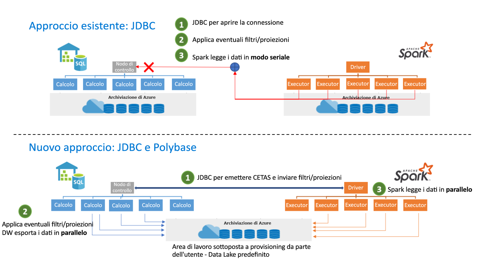

# <a name="introduction"></a>Introduzione

Il connettore da Apache Spark di Azure Synapse a Synapse SQL è progettato per trasferire in modo efficiente i dati tra i pool di Spark (anteprima) e i pool SQL in Azure Synapse. Il connettore Apache Spark di Azure Synapse a Synapse SQL funziona solo nei pool SQL e non funziona con SQL su richiesta.

## <a name="design"></a>Progettazione

Il trasferimento dei dati tra i pool di Spark e i pool SQL può essere eseguito tramite JDBC. Tuttavia, in due sistemi distribuiti come i pool SQL e Spark, JDBC tende a creare un collo di bottiglia con il trasferimento dei dati seriali.

Il connettore dal pool Apache Spark di Azure Synapse a Synapse SQL è un'implementazione di origini dati per Apache Spark. Usa Azure Data Lake Storage Gen2 e Polybase nei pool SQL per trasferire i dati in modo efficiente tra il cluster Spark e l'istanza di Synapse SQL.



## <a name="authentication-in-azure-synapse-analytics"></a>Autenticazione in Azure Synapse Analytics

Azure Synapse Analytics semplifica l'autenticazione tra i sistemi. Un servizio token si connette con Azure Active Directory per ottenere i token di sicurezza da usare per accedere all'account di archiviazione o al server del data warehouse. 

Per questo motivo, non occorre creare le credenziali o specificarle nell'API del connettore, purché l'autenticazione di AAD sia configurata nell'account di archiviazione e nel server del data warehouse. In caso contrario, è possibile specificare l'autenticazione SQL. Per informazioni più dettagliate, vedere la sezione [Uso](#usage).

## <a name="constraints"></a>Vincoli

- Questo connettore funziona solo in Scala.

## <a name="prerequisites"></a>Prerequisiti

- È necessario il ruolo **db_exporter** nel database o nel pool SQL nel quale e dal quale si vogliono trasferire i dati.

Per creare utenti, connettersi al database e seguire questi esempi:

```sql
CREATE USER Mary FROM LOGIN Mary;
CREATE USER [mike@contoso.com] FROM EXTERNAL PROVIDER;
```

Per assegnare un ruolo:

```sql
EXEC sp_addrolemember 'db_exporter', 'Mary';
```

## <a name="usage"></a>Uso

Le istruzioni di importazione non sono necessarie, ma sono pre-importate per l'esperienza del notebook.

### <a name="transferring-data-to-or-from-a-sql-pool-attached-with-the-workspace"></a>Trasferimento di dati in o da un pool SQL collegato all'area di lavoro

> [!NOTE]
> **Importazioni non necessarie nell'esperienza del notebook**

```scala
 import com.microsoft.spark.sqlanalytics.utils.Constants
 import org.apache.spark.sql.SqlAnalyticsConnector._
```

#### <a name="read-api"></a>API di lettura

```scala
val df = spark.read.sqlanalytics("[DBName].[Schema].[TableName]")
```

L'API riportata sopra funziona sia per le tabelle interne (gestite) sia per quelle esterne nel pool SQL.

#### <a name="write-api"></a>API di scrittura

```scala
df.write.sqlanalytics("[DBName].[Schema].[TableName]", [TableType])
```

dove TableType può essere Constants.INTERNAL o Constants.EXTERNAL

```scala
df.write.sqlanalytics("[DBName].[Schema].[TableName]", Constants.INTERNAL)
df.write.sqlanalytics("[DBName].[Schema].[TableName]", Constants.EXTERNAL)
```

L'autenticazione con Archiviazione di Azure e SQL Server è stata completata

### <a name="if-you-are-transferring-data-to-or-from-a-sql-pool-or-database-outside-the-workspace"></a>Se si trasferiscono dati in o da un database o un pool SQL esterno all'area di lavoro

> [!NOTE]
> Importazioni non necessarie nell'esperienza del notebook

```scala
 import com.microsoft.spark.sqlanalytics.utils.Constants
 import org.apache.spark.sql.SqlAnalyticsConnector._
```

#### <a name="read-api"></a>API di lettura

```scala
val df = spark.read.
option(Constants.SERVER, "samplews.database.windows.net").
sqlanalytics("<DBName>.<Schema>.<TableName>")
```

#### <a name="write-api"></a>API di scrittura

```scala
df.write.
option(Constants.SERVER, "[samplews].[database.windows.net]").
sqlanalytics("[DBName].[Schema].[TableName]", [TableType])
```

### <a name="using-sql-auth-instead-of-aad"></a>Uso dell'autenticazione SQL invece di quella di AAD

#### <a name="read-api"></a>API di lettura

Il connettore attualmente non supporta l'autenticazione basata su token con un pool SQL esterno all'area di lavoro. È necessario usare l'autenticazione di SQL.

```scala
val df = spark.read.
option(Constants.SERVER, "samplews.database.windows.net").
option(Constants.USER, [SQLServer Login UserName]).
option(Constants.PASSWORD, [SQLServer Login Password]).
sqlanalytics("<DBName>.<Schema>.<TableName>")
```

#### <a name="write-api"></a>API di scrittura

```scala
df.write.
option(Constants.SERVER, "[samplews].[database.windows.net]").
option(Constants.USER, [SQLServer Login UserName]).
option(Constants.PASSWORD, [SQLServer Login Password]).
sqlanalytics("[DBName].[Schema].[TableName]", [TableType])
```

### <a name="using-the-pyspark-connector"></a>Uso del connettore PySpark

> [!NOTE]
> Questo esempio è valido solo per l'esperienza del notebook.

Supponiamo di avere un "pyspark_df" da scrivere nel data warehouse.

Creare una tabella temporanea usando il dataframe in PySpark

```py
pyspark_df.createOrReplaceTempView("pysparkdftemptable")
```

Eseguire una cella Scala nel notebook PySpark usando i comandi magic

```scala
%%spark
val scala_df = spark.sqlContext.sql ("select * from pysparkdftemptable")

pysparkdftemptable.write.sqlanalytics("sqlpool.dbo.PySparkTable", Constants.INTERNAL)
```

Allo stesso modo, nello scenario di lettura leggere i dati usando Scala e scriverli in una tabella temporanea, quindi usare Spark SQL in PySpark per eseguire query sulla tabella temporanea in un dataframe.

## <a name="allowing-other-users-to-use-the-dw-connector-in-your-workspace"></a>Consentire ad altri utenti di usare il connettore DW nell'area di lavoro

Per modificare le autorizzazioni mancanti per altri utenti, è necessario essere proprietario dei dati BLOB di archiviazione nell'account di archiviazione ADLS Gen2 connesso all'area di lavoro. Verificare che l'utente disponga dell'accesso all'area di lavoro e delle autorizzazioni per eseguire i notebook.

### <a name="option-1"></a>Opzione 1

- Rendere l'utente un collaboratore/proprietario dei dati BLOB di archiviazione

### <a name="option-2"></a>Opzione 2

- Specificare gli elenchi di controllo di accesso seguenti nella struttura di cartelle:

| Cartella | / | synapse | aree di lavoro  | <workspacename> | pool spark | <sparkpoolname>  | istanze di pool spark  |
|--|--|--|--|--|--|--|--|
| Autorizzazioni di accesso | --X | --X | --X | --X | --X | --X | -WX |
| Autorizzazioni predefinite | ---| ---| ---| ---| ---| ---| ---|

- Dovrebbe essere possibile specificare l'elenco di controllo di accesso per tutte le cartelle da "synapse" e verso il basso dal portale di Azure. Per specificare l'elenco di controllo di accesso nella cartella radice "/", eseguire queste operazioni.

- Accedere all'account di archiviazione connesso all'area di lavoro da Storage Explorer tramite AAD
- Selezionare l'account e assegnare l'URL ADLS Gen2 e il file system predefinito per l'area di lavoro
- Quando viene visualizzato l'account di archiviazione elencato, fare clic con il pulsante destro del mouse sull'area di lavoro elenco e selezionare "Gestisci accesso".
- Aggiungere l'utente alla cartella / con l'autorizzazione di accesso "Esegui". Selezionare "OK"

> [!IMPORTANT]
> Verificare di non selezionare "Predefinito" se non lo si desidera.

## <a name="next-steps"></a>Passaggi successivi

- [Creare un pool SQL usando il portale di Azure](../../synapse-analytics/quickstart-create-apache-spark-pool-portal.md)
- [Creare un pool di Apache Spark usando il portale di Azure](../../synapse-analytics/quickstart-create-apache-spark-pool-portal.md) 
