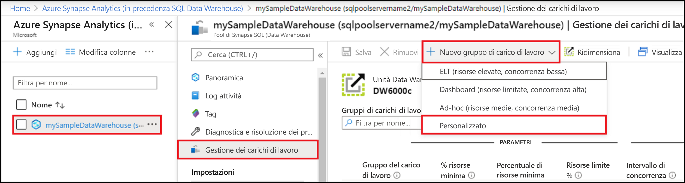
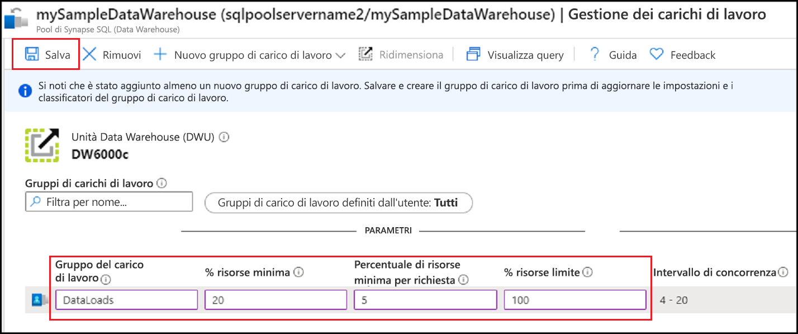
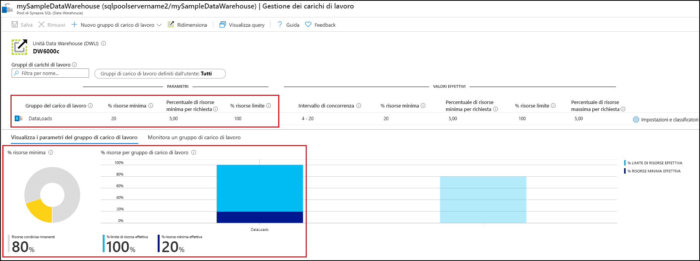
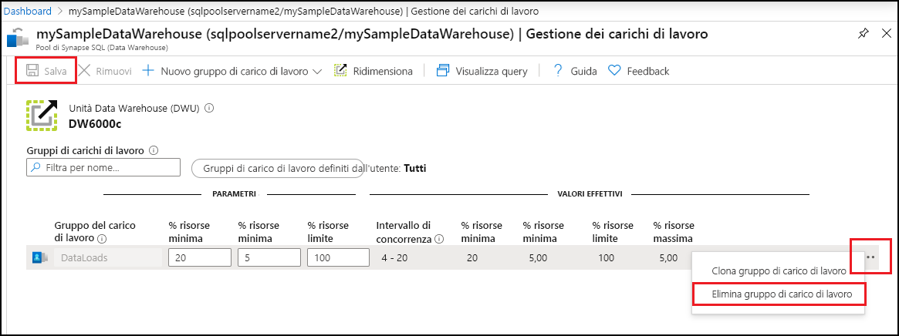

# Guida introduttiva: Configurare l'isolamento del carico di lavoro del pool Synapse SQL usando un gruppo di carico di lavoro nel portale di Azure

Questa guida di avvio rapido descrive come configurare l'[isolamento dei carichi di lavoro](sql-data-warehouse-workload-isolation.md) creando un gruppo di carico di lavoro per prenotare le risorse.  Ai fini di questa esercitazione, verrà creato il gruppo di carico di lavoro per il caricamento dei dati denominato `DataLoads`. Il gruppo di carico di lavoro prenoterà il 20% delle risorse del sistema.  Con un isolamento del 20% per il caricamento dei dati, si tratta di risorse garantite per soddisfare i contratti di servizio.  Dopo aver creato il gruppo di carico di lavoro, [creare un classificatore del carico di lavoro](quickstart-create-a-workload-classifier-portal.md) per assegnare query a questo gruppo di carico di lavoro.

Se non si ha una sottoscrizione di Azure, creare un account [gratuito](https://azure.microsoft.com/free/) prima di iniziare.

## Accedere al portale di Azure

Accedere al [portale di Azure](https://portal.azure.com/).

> [!NOTE]
> La creazione di un'istanza del pool SQL in Azure Synapse Analytics può tradursi in un nuovo servizio fatturabile.  Per altre informazioni, vedere [Prezzi di Azure Synapse Analytics](https://azure.microsoft.com/pricing/details/sql-data-warehouse/).

## Prerequisiti

Questa guida di avvio rapido presuppone che l'utente abbia già un'istanza del pool SQL in Synapse SQL con autorizzazioni CONTROL DATABASE. Se è necessario crearne uno, fare riferimento a [Creare e connettere - portale](create-data-warehouse-portal.md) per creare un data warehouse denominato **mySampleDataWarehouse**.

>[!IMPORTANT] 
>Per configurare la gestione del carico di lavoro, il pool SQL deve essere online. 

## Configurare l'isolamento dei carichi di lavoro
Le risorse del pool SQL possono essere isolate e riservate per carichi di lavoro specifici tramite la creazione gruppi di carico di lavoro.  Per informazioni dettagliate su come gestire il carico di lavoro tramite i gruppi di carico di lavoro, vedere la documentazione relativa ai concetti di [isolamento dei carichi di lavoro](sql-data-warehouse-workload-isolation.md).  Nella guida di avvio rapido [Creare e connettere - Portale](create-data-warehouse-portal.md) è stato creato il data warehouse **mySampleDataWarehouse** ed è stato inizializzato con 400 unità Data Warehouse. Nella procedura seguente viene creato un gruppo di carico di lavoro in **mySampleDataWarehouse**.

Per creare un gruppo di carico di lavoro con un isolamento del 20%:
1.  Fare clic su **Azure Synapse Analytics (in precedenza SQL DW)** nella pagina sinistra del portale di Azure.
2.  Selezionare **mySampleDataWarehouse** nella pagina **Azure Synapse Analytics (in precedenza SQL DW)** . Verrà aperto il pool SQL.
3.  Fare clic su **Gestione del carico di lavoro**.
4.  Fare clic su **Nuovo gruppo di carico di lavoro**.
5.  Fare clic su **Personalizzato**.

    

6.  Immettere `DataLoads` per **Gruppo di carico di lavoro**.
7.  Immettere `20` per **% risorse minima**.
8.  Immettere `5` per **Percentuale di risorse minima per richiesta**.
9.  Immettere `100` per **% massima di risorse**.
10.   Fare clic su **Salva**.

   

Verrà visualizzata una notifica del portale non appena viene completata la creazione del gruppo di carico di lavoro.  Le risorse del gruppo di carico di lavoro vengono visualizzate nei grafici sotto i valori configurati.

   

## Pulire le risorse

Per eliminare il gruppo di carico di lavoro `DataLoads` creato in questa esercitazione:
1. Fare clic su **`...`** a destra del gruppo di carico di lavoro `DataLoads`.
2. Fare clic su **Elimina gruppo di carico di lavoro**.
3. Fare clic su **Sì** quando viene richiesto di confermare l'eliminazione del gruppo di carico di lavoro.
4. Fare clic su **Save**.

   

Per le unità del data warehouse e i dati archiviati vengono addebitati costi. Le risorse di calcolo e archiviazione vengono fatturate separatamente.

- Se si vogliono mantenere i dati nelle risorse di archiviazione, è possibile sospendere il calcolo quando il data warehouse non è in uso. In questo modo, vengono addebitati solo i costi per l'archiviazione dei dati. Quando si è pronti a lavorare con i dati, riprendere il calcolo.
- Per evitare di ricevere addebiti in futuro, è possibile eliminare il data warehouse.

Seguire questa procedura per pulire le risorse.

1. Accedere al [portale di Azure](https://portal.azure.com) e selezionare il proprio data warehouse.

    

2. Per sospendere il calcolo, selezionare il pulsante **Pausa**. Quando si sospende il data warehouse, viene visualizzato il pulsante **Avvia**.  Per riprendere il calcolo, selezionare **Avvia**.

3. Per rimuovere il data warehouse in modo da non ricevere addebiti per operazioni di calcolo o archiviazione, selezionare **Elimina**.

4. Per rimuovere il server SQL creato, selezionare **sqlpoolservername.database.windows.net** nell'immagine precedente e quindi selezionare **Elimina**.  Fare attenzione quando si esegue questa operazione perché l'eliminazione del server comporta anche quella di tutti i database assegnati al server.

5. Per rimuovere il gruppo di risorse, selezionare **myResourceGroup** e quindi **Elimina gruppo di risorse**.

## Passaggi successivi

Per usare il gruppo di carico di lavoro `DataLoads`, è necessario creare un [classificatore del carico di lavoro](/sql/t-sql/statements/create-workload-classifier-transact-sql?toc=/azure/synapse-analytics/sql-data-warehouse/toc.json&bc=/azure/synapse-analytics/sql-data-warehouse/breadcrumb/toc.json&view=azure-sqldw-latest) per instradare le richieste al gruppo di carico di lavoro.  Procedere all'esercitazione [Creare un classificatore del carico di lavoro](quickstart-create-a-workload-classifier-portal.md) per creare un classificatore del carico di lavoro per `DataLoads`.

## Vedere anche
Per informazioni dettagliate su come monitorare i carichi di lavoro per la gestione dei carichi di lavoro, vedere l'articolo [Gestire e monitorare Gestione del carico di lavoro](sql-data-warehouse-how-to-manage-and-monitor-workload-importance.md).
