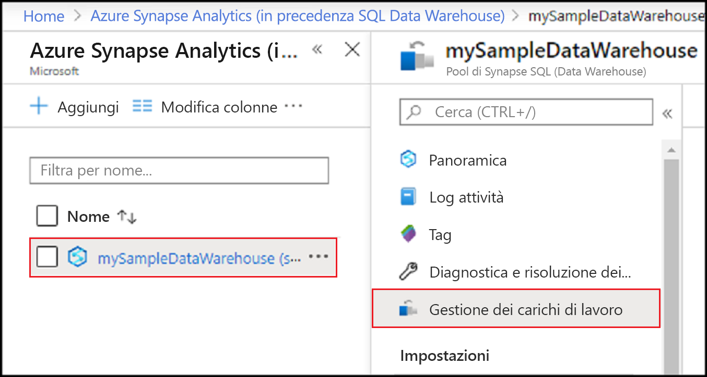
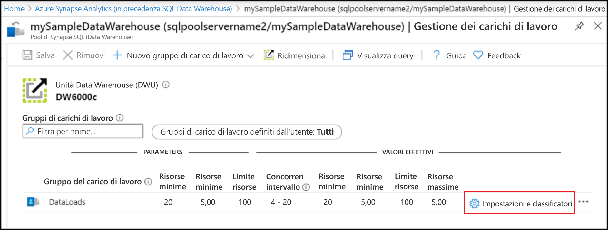
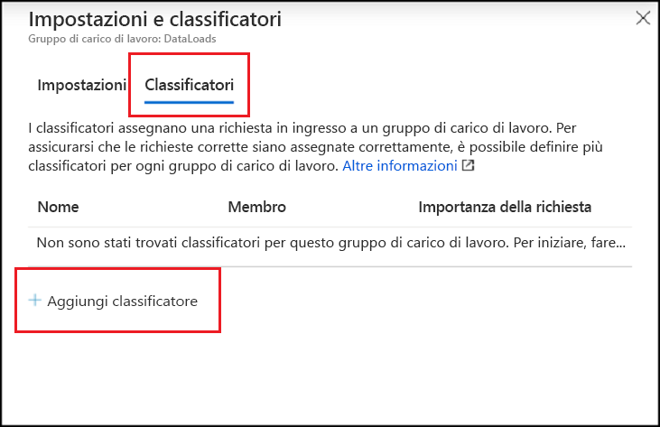
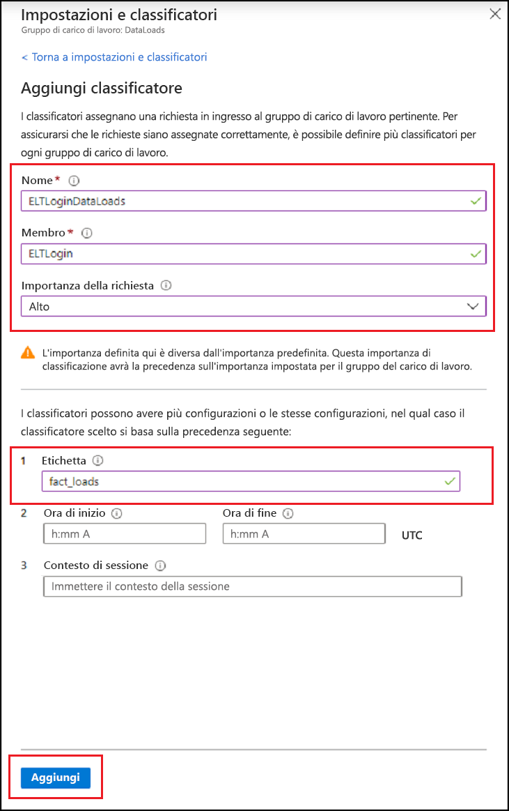
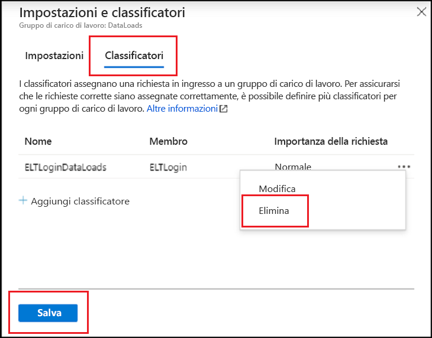
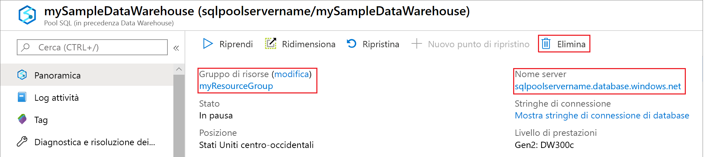

# <a name="quickstart-create-a-synapse-sql-pool-workload-classifier-using-the-azure-portal"></a>Guida introduttiva: Creare un classificatore del carico di lavoro di un pool SQL Synapse con il portale di Azure

Questa guida di avvio rapido descrive come creare un [classificatore del carico di lavoro](sql-data-warehouse-workload-classification.md) per l'assegnazione di query a un gruppo di carico di lavoro.  Il classificatore assegnerà le richieste dall'utente SQL `ELTLogin` al gruppo di carico di lavoro `DataLoads`.   Seguire l'esercitazione [Avvio rapido: Configurare l'isolamento dei carichi di lavoro](quickstart-configure-workload-isolation-portal.md) per creare il gruppo di carico di lavoro `DataLoads`.  Questa esercitazione creerà un classificatore del carico di lavoro con l'opzione WLM_LABEL per facilitare ulteriormente la classificazione delle richieste in modo corretto.  Il classificatore assegnerà l'[importanza del carico di lavoro](sql-data-warehouse-workload-importance.md) `HIGH` anche a queste richieste.


Se non si ha una sottoscrizione di Azure, creare un account [gratuito](https://azure.microsoft.com/free/) prima di iniziare.


## <a name="sign-in-to-the-azure-portal"></a>Accedere al portale di Azure

Accedere al [portale di Azure](https://portal.azure.com/).

> [!NOTE]
> La creazione di un'istanza del pool SQL in Azure Synapse Analytics può tradursi in un nuovo servizio fatturabile.  Per altre informazioni, vedere [Prezzi di Azure Synapse Analytics](https://azure.microsoft.com/pricing/details/sql-data-warehouse/).

## <a name="prerequisites"></a>Prerequisiti

Questa guida di avvio rapido presuppone che l'utente abbia già un'istanza del pool SQL in Synapse SQL con autorizzazioni CONTROL DATABASE. Se è necessario crearne uno, fare riferimento a [Creare e connettere - portale](create-data-warehouse-portal.md) per creare un data warehouse denominato **mySampleDataWarehouse**.
<br><br>
È disponibile un gruppo di carico di lavoro `DataLoads`.  Vedere l'esercitazione [Avvio rapido: Configurare l'isolamento dei carichi di lavoro](quickstart-configure-workload-isolation-portal.md) per creare il gruppo di carico di lavoro.
<br><br>
>[!IMPORTANT] 
>Per configurare la gestione del carico di lavoro, il pool SQL deve essere online. 


## <a name="create-a-login-for-eltlogin"></a>Creare un account di accesso per ELTLogin

Creare un account di accesso con autenticazione di SQL Server nel database `master` con l'istruzione [CREATE LOGIN](/sql/t-sql/statements/create-login-transact-sql?toc=/azure/synapse-analytics/sql-data-warehouse/toc.json&bc=/azure/synapse-analytics/sql-data-warehouse/breadcrumb/toc.json&view=azure-sqldw-latest) per `ELTLogin`.

```sql
IF NOT EXISTS (SELECT * FROM sys.sql_logins WHERE name = 'ELTLogin')
BEGIN
CREATE LOGIN [ELTLogin] WITH PASSWORD='<strongpassword>'
END
;
```

## <a name="create-user-and-grant-permissions"></a>Creare l'utente e concedere le autorizzazioni

Dopo aver creato l'account di accesso, è necessario creare un utente nel database.  Usare l'istruzione [CREATE USER](/sql/t-sql/statements/create-user-transact-sql?toc=/azure/synapse-analytics/sql-data-warehouse/toc.json&bc=/azure/synapse-analytics/sql-data-warehouse/breadcrumb/toc.json&view=azure-sqldw-latest) per creare l'utente SQL `ELTRole` nel database **mySampleDataWarehouse**.  Poiché in questa esercitazione verrà testata la classificazione, concedere a `ELTLogin` le autorizzazioni per **mySampleDataWarehouse**. 

```sql
IF NOT EXISTS (SELECT * FROM sys.database_principals WHERE name = 'ELTLogin')
BEGIN
CREATE USER [ELTLogin] FOR LOGIN [ELTLogin]
GRANT CONTROL ON DATABASE::mySampleDataWarehouse TO ELTLogin 
END
;
```

## <a name="configure-workload-classification"></a>Configurare la classificazione del carico di lavoro
La classificazione consente di instradare le richieste, in base a un set di regole, a un gruppo di carico di lavoro.  Nell'esercitazione [Avvio rapido: Configurare l'isolamento dei carichi di lavoro](quickstart-configure-workload-isolation-portal.md) è stato creato il gruppo di carico di lavoro `DataLoads`.  A questo punto verrà creato un classificatore del carico di lavoro per instradare le query al gruppo di carico di lavoro `DataLoads`.


1.  Fare clic su **Azure Synapse Analytics (in precedenza SQL DW)** nella pagina sinistra del portale di Azure.
2.  Selezionare **mySampleDataWarehouse** nella pagina **Azure Synapse Analytics (in precedenza SQL DW)** . Verrà aperto il pool SQL.
3.  Fare clic su **Gestione del carico di lavoro**.

    

4.  Fare clic su **Impostazioni e classificatori** sul lato destro del gruppo di carico di lavoro `DataLoads`.

    

5. Fare clic su **Classificatori**.
6. Fare clic su **Aggiungi classificatore**.

    

7.  Immettere `ELTLoginDataLoads` per **Nome**.
8.  Immettere `ELTLogin` per **Membro**.
9.  Scegliere `High` per **Importanza della richiesta**.  *Facoltativo*, il valore predefinito è importanza normale.
10. Immettere `fact_loads` per **Etichetta**.
11. Scegliere **Aggiungi**.
12. Fare clic su **Salva**.

    

## <a name="verify-and-test-classification"></a>Verificare e testare la classificazione
Controllare la vista del catalogo [sys.workload_management_workload_classifiers](/sql/relational-databases/system-catalog-views/sys-workload-management-workload-classifiers-transact-sql?view=azure-sqldw-latest) per verificare l'esistenza del classificatore `ELTLoginDataLoads`.

```sql
SELECT * FROM sys.workload_management_workload_classifiers WHERE name = 'ELTLoginDataLoads'
```

Controllare la vista del catalogo [sys.workload_management_workload_classifier_details](/sql/relational-databases/system-catalog-views/sys-workload-management-workload-classifier-details-transact-sql?view=azure-sqldw-latest) per verificare i dettagli del classificatore.

```sql
SELECT c.[name], c.group_name, c.importance, cd.classifier_type, cd.classifier_value
  FROM sys.workload_management_workload_classifiers c
  JOIN sys.workload_management_workload_classifier_details cd
    ON cd.classifier_id = c.classifier_id
  WHERE c.name = 'ELTLoginDataLoads'
```

Per testare la classificazione, eseguire le istruzioni seguenti.  Assicurarsi di essere connessi come ``ELTLogin`` e che ``Label`` sia presente nella query.
```sql
CREATE TABLE factstaging (ColA int)
INSERT INTO factstaging VALUES(0)
INSERT INTO factstaging VALUES(1)
INSERT INTO factstaging VALUES(2)
GO

CREATE TABLE testclassifierfact WITH (DISTRIBUTION = ROUND_ROBIN)
AS
SELECT * FROM factstaging
OPTION (LABEL='fact_loads')
```

Verificare l'istruzione `CREATE TABLE` classificata nel gruppo di carico di lavoro `DataLoads` usando il classificatore del carico di lavoro `ELTLoginDataLoads`.
```sql 
SELECT TOP 1 request_id, classifier_name, group_name, resource_allocation_percentage, submit_time, [status], [label], command 
FROM sys.dm_pdw_exec_requests 
WHERE [label] = 'fact_loads'
ORDER BY submit_time DESC
```


## <a name="clean-up-resources"></a>Pulire le risorse

Per eliminare il classificatore del carico di lavoro `ELTLoginDataLoads` creato in questa esercitazione:

1. Fare clic su **1 Classifier** sul lato destro del gruppo di carico di lavoro `DataLoads`.

    

2. Fare clic su **Classificatori**.
3. Fare clic su **`...`** a destra del classificatore del carico di lavoro `ELTLoginDataLoads`.
4. Fare clic su **Elimina**.
5. Fare clic su **Save**.

    

Per le unità del data warehouse e i dati archiviati vengono addebitati costi. Le risorse di calcolo e archiviazione vengono fatturate separatamente.

- Se si vogliono mantenere i dati nelle risorse di archiviazione, è possibile sospendere il calcolo quando il data warehouse non è in uso. In questo modo, vengono addebitati solo i costi per l'archiviazione dei dati. Quando si è pronti a lavorare con i dati, riprendere il calcolo.
- Per evitare di ricevere addebiti in futuro, è possibile eliminare il data warehouse.

Seguire questa procedura per pulire le risorse.

1. Accedere al [portale di Azure](https://portal.azure.com) e selezionare il proprio data warehouse.

    

2. Per sospendere il calcolo, selezionare il pulsante **Pausa**. Quando si sospende il data warehouse, viene visualizzato il pulsante **Avvia**.  Per riprendere il calcolo, selezionare **Avvia**.

3. Per rimuovere il data warehouse in modo da non ricevere addebiti per operazioni di calcolo o archiviazione, selezionare **Elimina**.

4. Per rimuovere il server SQL creato, selezionare **sqlpoolservername.database.windows.net** nell'immagine precedente e quindi selezionare **Elimina**.  Fare attenzione quando si esegue questa operazione perché l'eliminazione del server comporta anche quella di tutti i database assegnati al server.

5. Per rimuovere il gruppo di risorse, selezionare **myResourceGroup** e quindi **Elimina gruppo di risorse**.

## <a name="next-steps"></a>Passaggi successivi

Monitorare il carico di lavoro usando le metriche di monitoraggio del portale di Azure.  Per informazioni dettagliate, vedere [Gestire e monitorare Gestione del carico di lavoro](sql-data-warehouse-how-to-manage-and-monitor-workload-importance.md).
