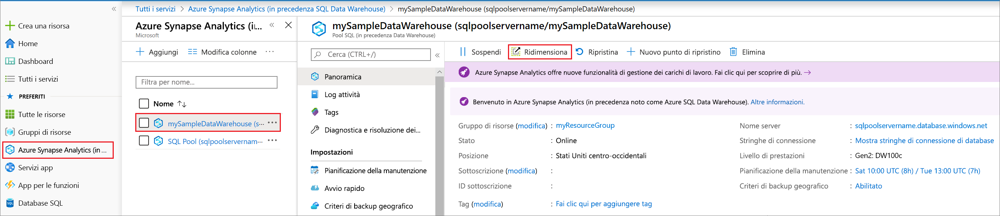
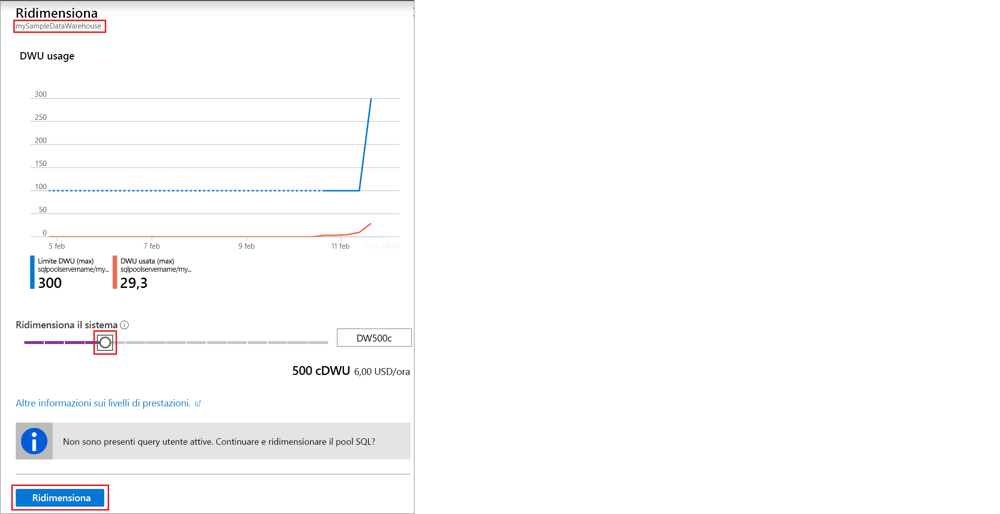

# Guida introduttiva: Ridimensionare le risorse di calcolo per il pool SQL di Synapse con il portale di Azure

È possibile ridimensionare le risorse di calcolo per il pool SQL di Synapse (data warehouse) usando il portale di Azure. [aumentandone il numero](sql-data-warehouse-manage-compute-overview.md) per ottenere prestazioni migliori o riducendolo per diminuire i costi. 

Se non si ha una sottoscrizione di Azure, creare un account [gratuito](https://azure.microsoft.com/free/) prima di iniziare.

## Accedere al portale di Azure

Accedere al [portale di Azure](https://portal.azure.com/).

## Prima di iniziare

È possibile ridimensionare un pool SQL già disponibile oppure fare riferimento a [Avvio rapido: Creare e connettere - portale](create-data-warehouse-portal.md) per creare un pool SQL denominato **mySampleDataWarehouse**. In questa Guida introduttiva viene ridimensionato **mySampleDataWarehouse**.

>[!IMPORTANT] 
>Il pool SQL da ridimensionare deve essere online. 

## Ridimensionare le risorse di calcolo

È possibile ridimensionare le risorse di calcolo del pool SQL aumentando o diminuendo le unità di data warehouse. La [Guida introduttiva: Create and Connect-Portal](create-data-warehouse-portal.md) ha creato **mySampleDataWarehouse** e inizializzato con 400 DWU. La procedura seguente modifica le unità Data Warehouse per **mySampleDataWarehouse**.

Per modificare le unità Data Warehouse:

1. Fare clic su **Azure Synapse Analytics (in precedenza SQL DW)** nella pagina sinistra del portale di Azure.
2. Selezionare **mySampleDataWarehouse** nella pagina **Azure Synapse Analytics (in precedenza SQL DW)** . Verrà aperto il pool SQL.
3. Fare clic su **Scale**.

    

2. Nel pannello Ridimensiona spostare il dispositivo di scorrimento a sinistra o a destra per modificare l'impostazione delle unità Data Warehouse. Quindi selezionare Ridimensiona.

    

## Passaggi successivi
Per altre informazioni sul pool SQL, continuare con l'esercitazione [Caricare i dati in un pool SQL](load-data-from-azure-blob-storage-using-polybase.md). 
