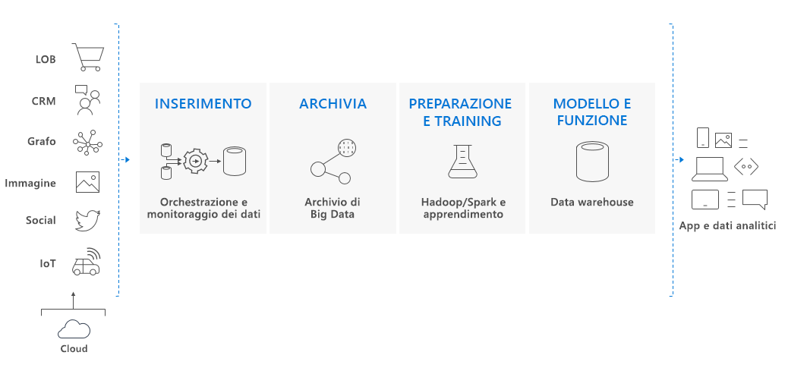

# Che cos'è Azure Synapse Analytics (in precedenza SQL Data Warehouse)?

> [!NOTE]
>Esplorare la [documentazione di Azure Synapse (anteprima per aree di lavoro)](../overview-what-is.md).
>

Azure Synapse è un servizio di analisi che riunisce funzionalità aziendali di data warehousing e analisi di Big Data. Offre la libertà di eseguire query sui dati in base alle proprie esigenze, usando risorse serverless su richiesta o con provisioning, su larga scala. Azure Synapse offre questi due mondi insieme a un'esperienza unificata per l'inserimento, la preparazione, la gestione e la distribuzione dei dati per esigenze immediate di business intelligence e Machine Learning.

Azure Synapse è costituito da quattro componenti:

- SQL Synapse: analisi completa basata su T-SQL - disponibile a livello generale
  - Pool SQL dedicato (pagamento per ogni DWU con provisioning)
  - Pool SQL serverless (pagamento per ogni TB elaborato) (anteprima)
- Spark: Apache Spark completamente integrato (anteprima)
- Pipeline di Synapse: Integrazione di dati ibridi (anteprima)
- Studio: esperienza utente unificata (anteprima)

## Pool SQL dedicato in Azure Synapse

Per pool SQL dedicato si intendono le funzionalità di data warehousing aziendali disponibili a livello generale in Azure Synapse.

Il pool SQL dedicato rappresenta una raccolta di risorse di analisi di cui viene effettuato il provisioning durante l'uso di Synapse SQL. Le dimensioni di un pool SQL dedicato sono determinate dalle unità Data Warehouse (DWU).

Importare i Big Data con semplici query T-SQL [PolyBase](/sql/relational-databases/polybase/polybase-guide?toc=/azure/synapse-analytics/sql-data-warehouse/toc.json&bc=/azure/synapse-analytics/sql-data-warehouse/breadcrumb/toc.json&view=azure-sqldw-latest) e quindi sfruttare la potenza del motore di query distribuite per eseguire analisi ad alte prestazioni. Man mano che si procede con l'integrazione e l'analisi dei dati, Synapse SQL diventerà il punto di riferimento dell'azienda da cui ricavare più rapidamente informazioni dettagliate più affidabili. 

## Componente chiave di una soluzione per Big Data

Il data warehouse è un componente chiave di una soluzione per Big Data end-to-end basata sul cloud.

In una soluzione cloud per i dati, i dati vengono inseriti in archivi di Big Data da numerose origini. Una volta inseriti i dati in un archivio di Big Data, Hadoop, Spark e gli algoritmi di apprendimento automatico preparano i dati e ne eseguono il training. Quando i dati sono pronti per essere sottoposti ad analisi complesse, il pool SQL dedicato usa PolyBase per eseguire query sugli archivi di Big Data. PolyBase usa query T-SQL standard per inserire i dati in tabelle del pool SQL dedicato.

Il pool SQL dedicato archivia i dati in tabelle relazionali con archiviazione a colonne. Questo formato consente di ridurre notevolmente i costi di archiviazione dei dati e di migliorare le prestazioni di query. Una volta archiviati i dati, è possibile eseguire analisi su larga scala. Rispetto ai sistemi di database tradizionali, le query di analisi vengono completate in secondi invece che in minuti oppure in ore invece che in giorni.

I risultati delle analisi possono essere passati ad applicazioni o database di report in tutto il mondo. Gli analisti aziendali possono quindi ottenere informazioni dettagliate per prendere decisioni ben informate.

## Passaggi successivi

- Esplorare l'[architettura di Azure Synapse](massively-parallel-processing-mpp-architecture.md)
- [Creare un pool SQL dedicato](create-data-warehouse-portal.md) in tempi rapidi
- [Caricare dati di esempio](load-data-from-azure-blob-storage-using-polybase.md).
- Esplorare i [video](https://azure.microsoft.com/documentation/videos/index/?services=sql-data-warehouse)

Oppure vedere alcune delle altre risorse disponibili per Azure Synapse.

- Eseguire ricerche nei [blog](https://azure.microsoft.com/blog/tag/azure-sql-data-warehouse/)
- Inviare [richieste di funzionalità](https://feedback.azure.com/forums/307516-sql-data-warehouse)
- [Creare un ticket di supporto](sql-data-warehouse-get-started-create-support-ticket.md)
- Eseguire ricerche nella [Pagina delle domande di Domande e risposte Microsoft](https://docs.microsoft.com/answers/topics/azure-synapse-analytics.html)
- Eseguire ricerche nel [forum di Stack Overflow](https://stackoverflow.com/questions/tagged/azure-sqldw)
