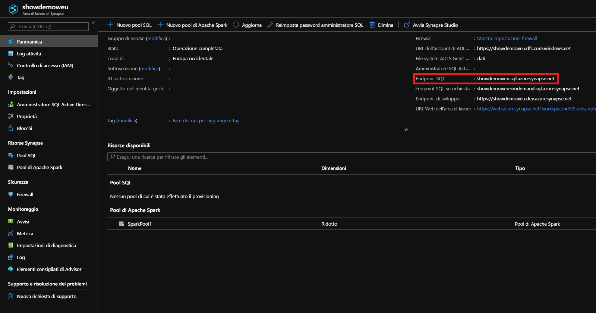
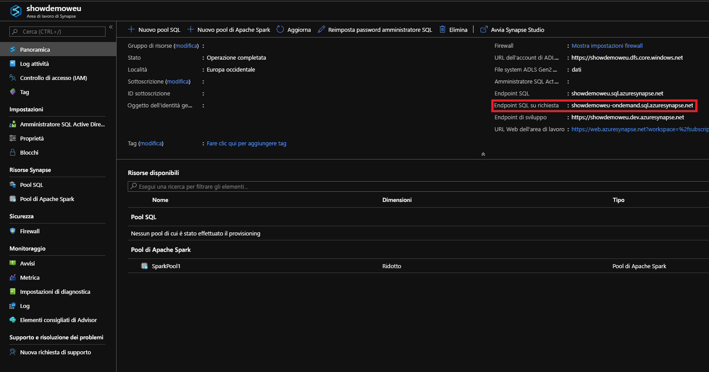

# <a name="connect-to-synapse-sql"></a>Connettersi a Synapse SQL
Connettersi alla funzionalità Synapse SQL in Azure Synapse Analytics.

## <a name="supported-tools-for-serverless-sql-pool-preview"></a>Strumenti supportati per il pool SQL serverless (anteprima)

[Azure Data Studio](/sql/azure-data-studio/download-azure-data-studio) è completamente supportato a partire dalla versione 1.18.0. SSMS è parzialmente supportato a partire dalla versione 18.5 ed è possibile usarlo solo per connettersi ed eseguire query.

> [!NOTE]
> Se un accesso di AAD ha una connessione aperta per più di un'ora al momento dell'esecuzione della query, tutte le query che si basano su AAD avranno esito negativo. È inclusa l'esecuzione di query sull'archiviazione tramite pass-through di AAD e le istruzioni che interagiscono con AAD (ad esempio CREATE EXTERNAL PROVIDER). Ciò influisce su tutti gli strumenti che mantengono aperta la connessione, ad esempio l'editor di query in SSMS e ADS. Gli strumenti che aprono una nuova connessione per eseguire query, ad esempio Synapse Studio, non sono interessati.

> Per attenuare questo problema, è possibile riavviare SSMS o connettersi e disconnettersi in ADS. 

## <a name="find-your-server-name"></a>Trovare il nome del server

Il nome del pool SQL dedicato nell'esempio seguente è showdemoweu.sql.azuresynapse.net.
Il nome del server per il pool SQL serverless nell'esempio seguente è showdemoweu-ondemand.sql.azuresynapse.net.

Per trovare il nome completo del server, procedere come segue:

1. Accedere al [portale di Azure](https://portal.azure.com).
2. Selezionare **Aree di lavoro Synapse**.
3. Selezionare l'area di lavoro a cui connettersi.
4. Passare a Panoramica.
5. Individuare il nome completo del server.

## <a name="sql-pool"></a>**Pool SQL**



## <a name="serverless-sql-pool"></a>**Pool SQL serverless**



## <a name="supported-drivers-and-connection-strings"></a>Driver supportati e stringhe di connessione
Synapse SQL supporta [ADO.NET](https://msdn.microsoft.com/library/e80y5yhx(v=vs.110).aspx), [ODBC](https://msdn.microsoft.com/library/jj730314.aspx), [PHP](https://msdn.microsoft.com/library/cc296172.aspx?f=255&MSPPError=-2147217396) e [JDBC](https://msdn.microsoft.com/library/mt484311(v=sql.110).aspx). Per trovare la versione e la documentazione più recenti, selezionare uno dei driver precedenti. Per generare automaticamente la stringa di connessione per il driver in uso dal portale di Azure, selezionare **Mostra stringhe di connessione del database** nell'esempio precedente. Di seguito sono riportati alcuni esempi di come si presenta la stringa di connessione per ogni driver.

> [!NOTE]
> Per preservare la connessione in caso di brevi periodi di indisponibilità, può essere opportuno impostare il timeout di connessione su 300 secondi.

### <a name="adonet-connection-string-example"></a>Esempio di stringa di connessione ADO.NET

```csharp
Server=tcp:{your_server}.sql.azuresynapse.net,1433;Database={your_database};User ID={your_user_name};Password={your_password_here};Encrypt=True;TrustServerCertificate=False;Connection Timeout=30;
```

### <a name="odbc-connection-string-example"></a>Esempio di stringa di connessione ODBC

```csharp
Driver={SQL Server Native Client 11.0};Server=tcp:{your_server}.sql.azuresynapse.net,1433;Database={your_database};Uid={your_user_name};Pwd={your_password_here};Encrypt=yes;TrustServerCertificate=no;Connection Timeout=30;
```

### <a name="php-connection-string-example"></a>Esempio di stringa di connessione PHP

```PHP
Server: {your_server}.sql.azuresynapse.net,1433 \r\nSQL Database: {your_database}\r\nUser Name: {your_user_name}\r\n\r\nPHP Data Objects(PDO) Sample Code:\r\n\r\ntry {\r\n   $conn = new PDO ( \"sqlsrv:server = tcp:{your_server}.sql.azuresynapse.net,1433; Database = {your_database}\", \"{your_user_name}\", \"{your_password_here}\");\r\n    $conn->setAttribute( PDO::ATTR_ERRMODE, PDO::ERRMODE_EXCEPTION );\r\n}\r\ncatch ( PDOException $e ) {\r\n   print( \"Error connecting to SQL Server.\" );\r\n   die(print_r($e));\r\n}\r\n\rSQL Server Extension Sample Code:\r\n\r\n$connectionInfo = array(\"UID\" => \"{your_user_name}\", \"pwd\" => \"{your_password_here}\", \"Database\" => \"{your_database}\", \"LoginTimeout\" => 30, \"Encrypt\" => 1, \"TrustServerCertificate\" => 0);\r\n$serverName = \"tcp:{your_server}.sql.azuresynapse.net,1433\";\r\n$conn = sqlsrv_connect($serverName, $connectionInfo);
```

### <a name="jdbc-connection-string-example"></a>Esempio di stringa di connessione JDBC

```Java
jdbc:sqlserver://yourserver.sql.azuresynapse.net:1433;database=yourdatabase;user={your_user_name};password={your_password_here};encrypt=true;trustServerCertificate=false;hostNameInCertificate=*.sql.azuresynapse.net;loginTimeout=30;
```

## <a name="connection-settings"></a>Impostazioni di connessione
Synapse SQL standardizza alcune impostazioni durante la connessione e la creazione di oggetti. Queste impostazioni, di cui non è possibile eseguire l'override, includono:

| Impostazione del database | valore |
|:--- |:--- |
| [ANSI_NULLS](/sql/t-sql/statements/set-ansi-nulls-transact-sql?toc=/azure/synapse-analytics/toc.json&bc=/azure/synapse-analytics/breadcrumb/toc.json&view=azure-sqldw-latest&preserve-view=true) |ON |
| [QUOTED_IDENTIFIERS](/sql/t-sql/statements/set-quoted-identifier-transact-sql?toc=/azure/synapse-analytics/toc.json&bc=/azure/synapse-analytics/breadcrumb/toc.json&view=azure-sqldw-latest&preserve-view=true) |ON |
| [DATEFORMAT](/sql/t-sql/statements/set-dateformat-transact-sql?toc=/azure/synapse-analytics/toc.json&bc=/azure/synapse-analytics/breadcrumb/toc.json&view=azure-sqldw-latest&preserve-view=true) |mdy |
| [DATEFORMAT](/sql/t-sql/statements/set-datefirst-transact-sql?toc=/azure/synapse-analytics/toc.json&bc=/azure/synapse-analytics/breadcrumb/toc.json&view=azure-sqldw-latest&preserve-view=true) |7 |

## <a name="recommendations"></a>Consigli

Per eseguire le query del **pool SQL serverless**, gli strumenti consigliati sono [Azure Data Studio](get-started-azure-data-studio.md) e Azure Synapse Studio.

## <a name="next-steps"></a>Passaggi successivi
Per connettersi ed eseguire query con Visual Studio, vedere [Eseguire query con Visual Studio](../sql-data-warehouse/sql-data-warehouse-query-visual-studio.md?toc=/azure/synapse-analytics/toc.json&bc=/azure/synapse-analytics/breadcrumb/toc.json). Per altre informazioni sulle opzioni di autenticazione, vedere [Autenticazione in Synapse SQL](../sql-data-warehouse/sql-data-warehouse-authentication.md?toc=/azure/synapse-analytics/toc.json&bc=/azure/synapse-analytics/breadcrumb/toc.json).