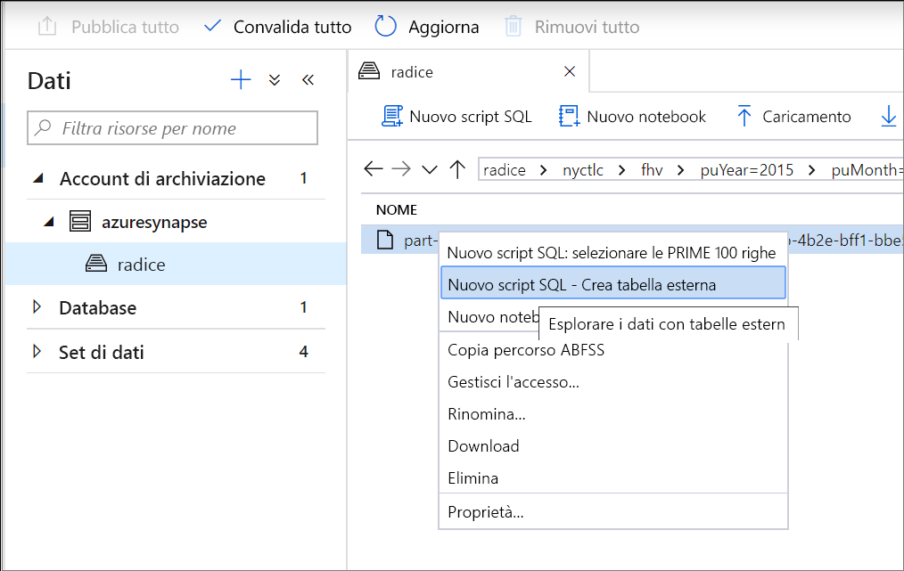
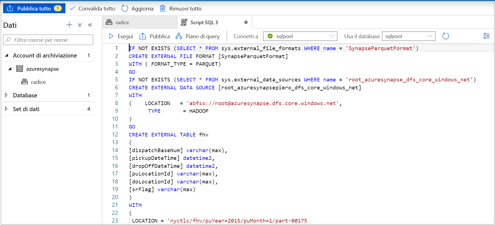
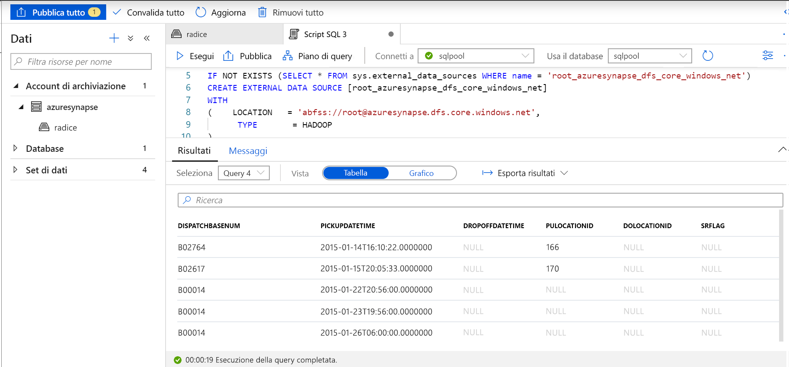
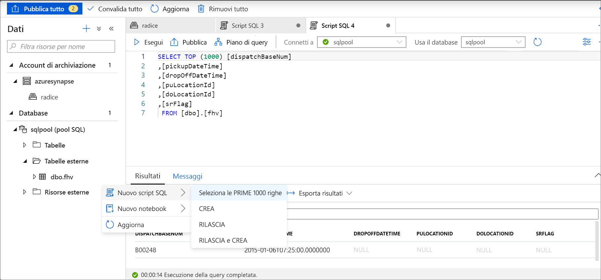

# <a name="use-external-tables-with-synapse-sql"></a>Usare tabelle esterne con Synapse SQL

Una tabella esterna punta ai dati situati in Hadoop, BLOB del servizio di archiviazione di Azure o Azure Data Lake Storage. Le tabelle esterne vengono usate per leggere o scrivere dati nei file in Archiviazione di Azure. Con Synapse SQL è possibile usare le tabelle esterne per leggere e scrivere i dati in un pool SQL o in SQL su richiesta (anteprima).

## <a name="external-tables-in-synapse-sql-pool-and-on-demand"></a>Tabelle esterne nel pool Synapse SQL e su richiesta

### <a name="sql-pool"></a>[Pool SQL](#tab/sql-pool) 

Nel pool SQL è possibile usare una tabella esterna per:

- Eseguire query su Archiviazione BLOB di Azure e Azure Data Lake Gen2 con istruzioni Transact-SQL.
- Importare e archiviare i dati da Archiviazione BLOB di Azure e Azure Data Lake Storage in un pool SQL.

Se eseguita in combinazione con l'istruzione [CREATE TABLE AS SELECT](../sql-data-warehouse/sql-data-warehouse-develop-ctas.md?toc=/azure/synapse-analytics/toc.json&bc=/azure/synapse-analytics/breadcrumb/toc.json), la selezione da una tabella esterna importa i dati in una tabella all'interno del pool SQL. Oltre all'[istruzione COPY](/sql/t-sql/statements/copy-into-transact-sql?toc=/azure/synapse-analytics/toc.json&bc=/azure/synapse-analytics/breadcrumb/toc.json&view=azure-sqldw-latest), le tabelle esterne risultano utili per il caricamento dei dati. 

Per un'esercitazione sul caricamento, vedere [Usare PolyBase per caricare dati da Archiviazione BLOB di Azure](../sql-data-warehouse/load-data-from-azure-blob-storage-using-polybase.md?toc=/azure/synapse-analytics/toc.json&bc=/azure/synapse-analytics/breadcrumb/toc.json).

### <a name="sql-on-demand"></a>[SQL su richiesta](#tab/sql-on-demand)

Per SQL su richiesta, si userà una tabella esterna per:

- Eseguire query sui dati in Archiviazione BLOB di Azure e Azure Data Lake Storage con istruzioni Transact-SQL
- Archiviare i risultati della query di SQL su richiesta in file in Archiviazione BLOB di Azure o Azure Data Lake Storage tramite [CETAS](develop-tables-cetas.md)

È possibile creare tabelle esterne con SQL su richiesta seguendo questa procedura:

1. CREATE EXTERNAL DATA SOURCE
2. CREATE EXTERNAL FILE FORMAT
3. CREATE EXTERNAL TABLE

---

### <a name="security"></a>Sicurezza

Per leggere i dati, l'utente deve disporre dell'autorizzazione `SELECT` sulla tabella esterna.
La tabella esterna accede all'archiviazione di Azure sottostante tramite le credenziali in ambito database definite nell'origine dati usando le regole seguenti:
- L'origine dati senza credenziali consente alle tabelle esterne di accedere ai file disponibili pubblicamente nell'archiviazione di Azure.
- L'origine dati può disporre di credenziali che consentono alle tabelle esterne di accedere solo ai file nell'archiviazione di Azure usando il token SAS o l'identità gestita dell'area di lavoro. Per esempi, vedere l'articolo sullo [sviluppo di un controllo di accesso per memorizzare file di archiviazione](develop-storage-files-storage-access-control.md#examples).

> [!IMPORTANT]
> Nel pool SQL un'origine dati senza credenziali consente all'utente di Azure AD di accedere ai file di archiviazione usando l'identità Azure AD. In SQL su richiesta è necessario creare un'origine dati con credenziali in ambito database con la proprietà `IDENTITY='User Identity'`. Vedere [qui gli esempi](develop-storage-files-storage-access-control.md#examples).

## <a name="create-external-data-source"></a>CREATE EXTERNAL DATA SOURCE

Le origini dati esterne vengono usate per connettersi agli account di archiviazione. La documentazione completa è disponibile [qui](/sql/t-sql/statements/create-external-data-source-transact-sql?toc=/azure/synapse-analytics/toc.json&bc=/azure/synapse-analytics/breadcrumb/toc.json&view=azure-sqldw-latest).

### <a name="syntax-for-create-external-data-source"></a>Sintassi per CREATE EXTERNAL DATA SOURCE

#### <a name="sql-pool"></a>[Pool SQL](#tab/sql-pool)

```syntaxsql
CREATE EXTERNAL DATA SOURCE <data_source_name>
WITH
(    LOCATION         = '<prefix>://<path>'
     [, CREDENTIAL = <database scoped credential> ]
     , TYPE = HADOOP
)
[;]
```

#### <a name="sql-on-demand"></a>[SQL su richiesta](#tab/sql-on-demand)

```syntaxsql
CREATE EXTERNAL DATA SOURCE <data_source_name>
WITH
(    LOCATION         = '<prefix>://<path>'
     [, CREDENTIAL = <database scoped credential> ]
)
[;]
```

---

### <a name="arguments-for-create-external-data-source"></a>Argomenti per CREATE EXTERNAL DATA SOURCE

data_source_name

Specifica il nome definito dall'utente per l'origine dati. Il nome deve essere univoco all'interno del database.

#### <a name="location"></a>Location
LOCATION = `'<prefix>://<path>'`: fornisce il protocollo di connettività e il percorso dell'origine dati esterna. Per il percorso è possibile usare i modelli seguenti:

| Origine dati esterna        | Prefisso della posizione | Percorso                                         |
| --------------------------- | --------------- | ----------------------------------------------------- |
| Archiviazione BLOB di Azure          | `wasb[s]`       | `<container>@<storage_account>.blob.core.windows.net` |
| Archiviazione BLOB di Azure          | `http[s]`       | `<storage_account>.blob.core.windows.net/<container>/subfolders` |
| Azure Data Lake Store Gen 1 | `http[s]`       | `<storage_account>.azuredatalakestore.net/webhdfs/v1` |
| Azure Data Lake Store Gen 2 | `http[s]`       | `<storage_account>.dfs.core.windows.net/<container>/subfolders`  |

Il prefisso `https:` consente di usare la sottocartella nel percorso.

#### <a name="credential"></a>Credenziale
CREDENTIAL = `<database scoped credential>` è una credenziale facoltativa usata per l'autenticazione nell'archiviazione di Azure. L'origine dati esterna senza credenziali può accedere all'account di archiviazione pubblico. 

Le origini dati esterne senza credenziali nel pool SQL possono anche usare l'identità Azure AD dei chiamanti per accedere ai file nell'archiviazione. L'origine dati esterna con credenziali usa l'identità specificata nelle credenziali per accedere ai file.
- Nel pool SQL le credenziali in ambito database possono specificare identità dell'applicazione personalizzata, identità gestita dell'area di lavoro o chiave SAK. 
- In SQL su richiesta le credenziali in ambito database possono specificare l'identità Azure AD del chiamante, l'identità gestita dell'area di lavoro o la chiave SAS. 

#### <a name="type"></a>TYPE
TYPE = `HADOOP` è un'opzione obbligatoria nel pool SQL e specifica che per accedere ai file sottostanti viene usata la tecnologia Polybase. Questo parametro non può essere usato nel servizio SQL su richiesta che usa il lettore nativo incorporato.

### <a name="example-for-create-external-data-source"></a>Esempio di CREATE EXTERNAL DATA SOURCE

#### <a name="sql-pool"></a>[Pool SQL](#tab/sql-pool)

L'esempio seguente crea un'origine dati esterna per Azure Data Lake Gen2 che punta al set di dati New York:

```sql
CREATE EXTERNAL DATA SOURCE AzureDataLakeStore
WITH
  -- Please note the abfss endpoint when your account has secure transfer enabled
  ( LOCATION = 'abfss://data@newyorktaxidataset.dfs.core.windows.net' ,
    CREDENTIAL = ADLS_credential ,
    TYPE = HADOOP
  ) ;
```

#### <a name="sql-on-demand"></a>[SQL su richiesta](#tab/sql-on-demand)

L'esempio seguente crea un'origine dati esterna per Azure Data Lake Gen2 a cui è possibile accedere usando le credenziali SAS:

```sql
CREATE DATABASE SCOPED CREDENTIAL [sqlondemand]
WITH IDENTITY='SHARED ACCESS SIGNATURE',  
SECRET = 'sv=2018-03-28&ss=bf&srt=sco&sp=rl&st=2019-10-14T12%3A10%3A25Z&se=2061-12-31T12%3A10%3A00Z&sig=KlSU2ullCscyTS0An0nozEpo4tO5JAgGBvw%2FJX2lguw%3D'
GO

CREATE EXTERNAL DATA SOURCE SqlOnDemandDemo WITH (
    LOCATION = 'https://sqlondemandstorage.blob.core.windows.net',
    CREDENTIAL = sqlondemand
);
```

L'esempio seguente crea un'origine dati esterna per Azure Data Lake Gen2 che punta al set di dati New York disponibile pubblicamente:

```sql
CREATE EXTERNAL DATA SOURCE YellowTaxi
WITH ( LOCATION = 'https://azureopendatastorage.blob.core.windows.net/nyctlc/yellow/')
```
---

## <a name="create-external-file-format"></a>CREATE EXTERNAL FILE FORMAT

Crea un oggetto formato di file esterno che definisce i dati esterni archiviati in Archiviazione BLOB di Azure o Azure Data Lake Storage. La creazione di un formato di file esterno è un prerequisito per la creazione di una tabella esterna. La documentazione completa è disponibile [qui](/sql/t-sql/statements/create-external-file-format-transact-sql?toc=/azure/synapse-analytics/toc.json&bc=/azure/synapse-analytics/breadcrumb/toc.json&view=azure-sqldw-latest).

Creando un formato di file esterno, si specifica il layout effettivo dei dati a cui fa riferimento una tabella esterna.

### <a name="syntax-for-create-external-file-format"></a>Sintassi per CREATE EXTERNAL FILE FORMAT

```syntaxsql
-- Create an external file format for PARQUET files.  
CREATE EXTERNAL FILE FORMAT file_format_name  
WITH (  
    FORMAT_TYPE = PARQUET  
    [ , DATA_COMPRESSION = {  
        'org.apache.hadoop.io.compress.SnappyCodec'  
      | 'org.apache.hadoop.io.compress.GzipCodec'      }  
    ]);  

--Create an external file format for DELIMITED TEXT files
CREATE EXTERNAL FILE FORMAT file_format_name  
WITH (  
    FORMAT_TYPE = DELIMITEDTEXT  
    [ , DATA_COMPRESSION = 'org.apache.hadoop.io.compress.GzipCodec' ]
    [ , FORMAT_OPTIONS ( <format_options> [ ,...n  ] ) ]  
    );  

<format_options> ::=  
{  
    FIELD_TERMINATOR = field_terminator  
    | STRING_DELIMITER = string_delimiter
    | First_Row = integer
    | USE_TYPE_DEFAULT = { TRUE | FALSE }
    | Encoding = {'UTF8' | 'UTF16'}
}
```

### <a name="arguments-for-create-external-file-format"></a>Argomenti per CREATE EXTERNAL FILE FORMAT

file_format_name: specifica un nome per il formato di file esterno.

FORMAT_TYPE = [ PARQUET | DELIMITEDTEXT]: specifica il formato dei dati esterni.

- PARQUET: specifica un formato Parquet.
- DELIMITEDTEXT: specifica un formato di testo con delimitatori di colonna, detti anche caratteri di terminazione del campo.

FIELD_TERMINATOR = *field_terminator*: si applica solo ai file di testo delimitato. Il carattere di terminazione del campo specifica uno o più caratteri che contrassegnano la fine di ogni campo (colonna) nel file di testo delimitato. Il valore predefinito è il carattere pipe ('|').

Esempi:

- FIELD_TERMINATOR = '|'
- FIELD_TERMINATOR = ' '
- FIELD_TERMINATOR = ꞌ\tꞌ

STRING_DELIMITER = *string_delimiter*: specifica il carattere di terminazione del campo per i dati di tipo stringa nel file di testo delimitato. Il delimitatore di stringa è costituito da uno o più caratteri ed è racchiuso tra virgolette singole. Il valore predefinito è la stringa vuota ("").

Esempi:

- STRING_DELIMITER = '"'
- STRING_DELIMITER = '*'
- STRING_DELIMITER = ꞌ,ꞌ

FIRST_ROW = *First_row_int*: specifica il numero di riga che viene letto per primo e si applica a tutti i file. Se il valore è impostato su due, la prima riga di ogni file (riga di intestazione) viene ignorata quando i dati vengono caricati. Le righe vengono ignorate in base all'esistenza di caratteri di terminazione della riga (r/n, /r, /n).

USE_TYPE_DEFAULT = { TRUE | **FALSE** }: specifica come gestire i valori mancanti nei file di testo delimitato durante il recupero di dati.

TRUE: se si recuperano dati dal file di testo, archivia ogni valore mancante usando il tipo di dati del valore predefinito per la colonna corrispondente nella definizione di tabella esterna. Ad esempio, sostituire un valore mancante con:

- 0 se la colonna viene definita come colonna numerica. Le colonne decimali non sono supportate e genereranno un errore.
- Una stringa vuota ("") se la colonna è una colonna stringa.
- 1900-01-01 se la colonna è una colonna di data.

FALSE: archivia tutti i valori mancanti come NULL. Tutti i valori NULL archiviati usando la parola NULL nel file di testo delimitato vengono importati come stringa "NULL".

Encoding = {'UTF8' | 'UTF16'}: SQL su richiesta può leggere file di testo delimitato con codifica UTF8 e UTF16.

DATA_COMPRESSION = *data_compression_method*: questo argomento specifica il metodo di compressione per i dati esterni. 

Il tipo di formato PARQUET supporta i seguenti metodi di compressione:

- DATA_COMPRESSION = 'org.apache.hadoop.io.compress.GzipCodec'
- DATA_COMPRESSION = 'org.apache.hadoop.io.compress.SnappyCodec'

Durante la lettura dalle tabelle esterne PARQUET, questo argomento viene ignorato, ma viene usato nella scrittura in tabelle esterne usando [CETAS](develop-tables-cetas.md).

Il tipo di formato di file DELIMITEDTEXT supporta il metodo di compressione seguente:

- DATA_COMPRESSION = 'org.apache.hadoop.io.compress.GzipCodec'

### <a name="example-for-create-external-file-format"></a>Esempio di CREATE EXTERNAL FILE FORMAT

L'esempio seguente crea un formato di file esterno per i dati di censimento:

```sql
CREATE EXTERNAL FILE FORMAT census_file_format
WITH
(  
    FORMAT_TYPE = PARQUET,
    DATA_COMPRESSION = 'org.apache.hadoop.io.compress.SnappyCodec'
)
```

## <a name="create-external-table"></a>CREATE EXTERNAL TABLE

Il comando CREATE EXTERNAL TABLE crea una tabella esterna per Synapse SQL per accedere ai dati archiviati in Archiviazione BLOB di Azure o Azure Data Lake Storage. 

### <a name="syntax-for-create-external-table"></a>Sintassi per CREATE EXTERNAL TABLE

```sql
CREATE EXTERNAL TABLE { database_name.schema_name.table_name | schema_name.table_name | table_name }
    ( <column_definition> [ ,...n ] )  
    WITH (
        LOCATION = 'folder_or_filepath',  
        DATA_SOURCE = external_data_source_name,  
        FILE_FORMAT = external_file_format_name
    )  
[;]  

<column_definition> ::=
column_name <data_type>
    [ COLLATE collation_name ]
```

### <a name="arguments-create-external-table"></a>Argomenti per CREATE EXTERNAL TABLE

*{ nome_database.nome_schema.nome_tabella | nome_schema.nome_tabella | nome_tabella }*

Nome della tabella da creare, composto da una, due o tre parti. Per una tabella esterna, SQL su richiesta archivia solo i relativi metadati. Nessun dato effettivo viene archiviato o spostato in SQL su richiesta.

<column_definition>, ...*n* ]

CREATE EXTERNAL TABLE supporta la possibilità di configurare il nome di colonna, il tipo di dati, il supporto dei valori Null e le regole di confronto. Non è possibile usare DEFAULT CONSTRAINT nelle tabelle esterne.

>[!IMPORTANT]
>Le definizioni di colonna, inclusi i tipi di dati e il numero di colonne, devono corrispondere ai dati nei file esterni. In caso di mancata corrispondenza, le righe di file verranno rifiutate quando si eseguono query sui dati effettivi.

Per la lettura da file Parquet, è possibile specificare solo le colonne da leggere e ignorare il resto.

LOCATION = '*folder_or_filepath*'

Specifica la cartella o il percorso e il nome del file per i dati effettivi in Archiviazione BLOB di Azure. Il percorso inizia dalla cartella radice. La cartella radice è il percorso dei dati specificato nell'origine dati esterna.

Se si specifica un percorso di cartella, una query di SQL su richiesta eseguirà la selezione nella tabella esterna e recupererà i file dalla stessa.

> [!NOTE]
> A differenza di Hadoop e PolyBase, SQL su richiesta non restituisce le sottocartelle. Restituisce i file il cui nome file inizia con un carattere di sottolineatura (_) o un punto (.).

In questo esempio, se LOCATION='/webdata/', una query di SQL su richiesta restituirà le righe dai file mydata.txt e mydata2.txt. Non restituirà mydata2.txt e mydata3.txt perché si trovano in una sottocartella.


DATA_SOURCE = *external_data_source_name*: specifica il nome dell'origine dati esterna che contiene la posizione dei dati esterni. Per creare un'origine dati esterna, usare [CREATE EXTERNAL DATA SOURCE](#create-external-data-source).

FILE_FORMAT = *external_file_format_name*: specifica il nome dell'oggetto formato di file esterno che archivia il tipo di file e il metodo di compressione per i dati esterni. Per creare un formato di file esterno, usare [CREATE EXTERNAL FILE FORMAT](#create-external-file-format).

### <a name="permissions-create-external-table"></a>Autorizzazioni per CREATE EXTERNAL TABLE

Per effettuare una selezione in una tabella esterna, sono necessarie le credenziali appropriate con autorizzazioni di lettura e di elenco.

### <a name="example-create-external-table"></a>Esempio di CREATE EXTERNAL TABLE

L'esempio seguente crea una tabella esterna. Restituisce la prima riga:

```sql
CREATE EXTERNAL TABLE census_external_table
(
    decennialTime varchar(20),
    stateName varchar(100),
    countyName varchar(100),
    population int,
    race varchar(50),
    sex    varchar(10),
    minAge int,
    maxAge int
)  
WITH (
    LOCATION = '/parquet/',
    DATA_SOURCE = population_ds,  
    FILE_FORMAT = census_file_format
)
GO

SELECT TOP 1 * FROM census_external_table
```

## <a name="create-and-query-external-tables-from-a-file-in-azure-data-lake"></a>Creare ed eseguire query su tabelle esterne da un file in Azure Data Lake

Usando le funzionalità di esplorazione di Data Lake, è ora possibile creare ed eseguire query su una tabella esterna usando un pool SQL o SQL su richiesta con un semplice clic con il pulsante destro del mouse sul file.

### <a name="prerequisites"></a>Prerequisiti

- È necessario avere accesso all'area di lavoro con almeno il ruolo di accesso Collaboratore ai dati del BLOB di archiviazione di Azure Resource Manager per l'account ADLS Gen2

- È necessario avere almeno le [autorizzazioni per creare](/sql/t-sql/statements/create-external-table-transact-sql?toc=/azure/synapse-analytics/toc.json&bc=/azure/synapse-analytics/breadcrumb/toc.json&view=azure-sqldw-latest#permissions-2) ed eseguire query su tabelle esterne nel pool SQL o in SQL su richiesta

- Il servizio collegato associato all'account di ADLS Gen2 **deve avere accesso al file**. Se ad esempio il meccanismo di autenticazione del servizio collegato è l'identità, l'identità gestita dell'area di lavoro deve disporre almeno dell'autorizzazione di lettura per i dati dei BLOB di archiviazione nell'account di archiviazione

Nel pannello Dati selezionare il file da cui creare la tabella esterna:
> [!div class="mx-imgBorder"]
>

Verrà visualizzata una finestra di dialogo. Selezionare Pool SQL o SQL su richiesta, assegnare un nome alla tabella e selezionare Apri script:

> [!div class="mx-imgBorder"]
>

Lo script SQL viene generato automaticamente deducendo lo schema dal file:
> [!div class="mx-imgBorder"]
>

Eseguire lo script. Lo script eseguirà automaticamente SELECT TOP 100*:
> [!div class="mx-imgBorder"]
>

La tabella esterna è stata creata. Per l'esplorazione futura del contenuto di questa tabella esterna, l'utente può eseguire una query direttamente dal riquadro Dati:
> [!div class="mx-imgBorder"]
>

## <a name="next-steps"></a>Passaggi successivi

Per informazioni su come salvare i risultati della query in una tabella esterna in Archiviazione di Azure, vedere l'articolo [CETAS](develop-tables-cetas.md). In alternativa, è possibile eseguire query sulle [tabelle esterne di Apache Spark per Azure Synapse](develop-storage-files-spark-tables.md).
