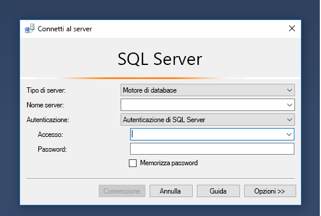
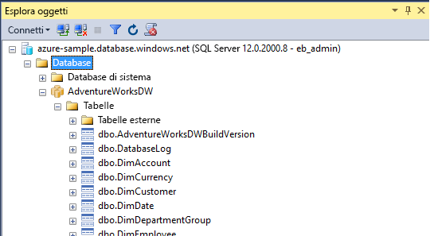
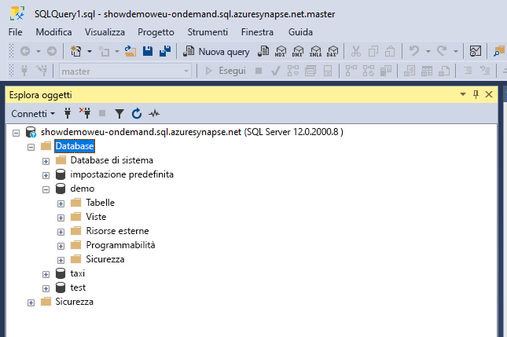
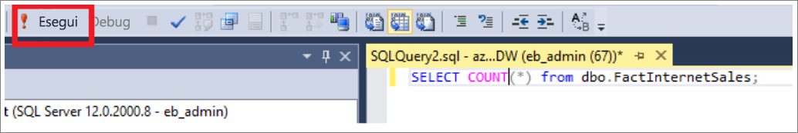
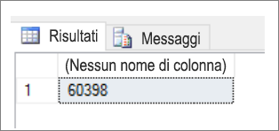
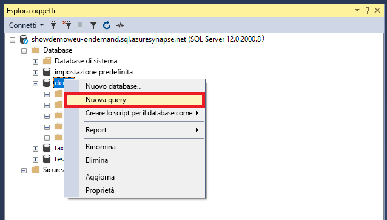
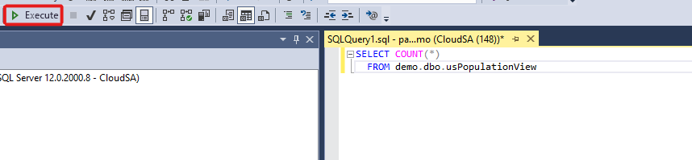

# <a name="connect-to-synapse-sql-with-sql-server-management-studio-ssms"></a>Connettersi a Synapse SQL con SQL Server Management Studio (SSMS)
> [!div class="op_single_selector"]
> * [Azure Data Studio](get-started-azure-data-studio.md)
> * [Power BI](get-started-power-bi-professional.md)
> * [Visual Studio](../sql-data-warehouse/sql-data-warehouse-query-visual-studio.md?toc=/azure/synapse-analytics/toc.json&bc=/azure/synapse-analytics/breadcrumb/toc.json)
> * [sqlcmd](../sql/get-started-connect-sqlcmd.md)
> * [SSMS](get-started-ssms.md)
> 
> 

È possibile usare [SQL Server Management Studio (SSMS)](/sql/ssms/download-sql-server-management-studio-ssms) per connettersi ed eseguire query su Synapse SQL in Azure Synapse Analytics tramite risorse di SQL su richiesta (anteprima) o del pool SQL. 

### <a name="supported-tools-for-sql-on-demand-preview"></a>Strumenti supportati per SQL su richiesta (anteprima)

SSMS è parzialmente supportato a partire dalla versione 18.5 con funzionalità limitate, ad esempio la connessione e l'esecuzione di query. [Azure Data Studio](/sql/azure-data-studio/download-azure-data-studio) è completamente supportato.

## <a name="prerequisites"></a>Prerequisiti

Prima di iniziare, verificare di aver soddisfatto i prerequisiti seguenti:  

* [SQL Server Management Studio (SSMS)](/sql/ssms/download-sql-server-management-studio-ssms). 
* Per il pool SQL è necessario un data warehouse esistente. Per crearne uno, vedere [Creare un pool SQL](../quickstart-create-sql-pool.md). Per SQL su richiesta, è già stato effettuato il provisioning di un'istanza nell'area di lavoro al momento della creazione. 
* Il nome completo dell'istanza di SQL Server. Per trovarlo, vedere [Connettersi a Synapse SQL](connect-overview.md).

## <a name="connect"></a>Connessione

### <a name="sql-pool"></a>Pool SQL

Per connettersi a Synapse SQL tramite il pool SQL, seguire questa procedura: 

1. Aprire SQL Server Management Studio (SSMS). 
1. Nella finestra di dialogo **Connetti al server** compilare i campi e quindi selezionare **Connetti**: 
  
    
   
   * **Nome server**: Immettere il **nome server** identificato in precedenza.
   * **Autenticazione**:  scegliere un tipo di autenticazione, ad esempio **Autenticazione di SQL Server** o **Autenticazione integrata di Active Directory**.
   * **Nome utente** e **Password**: se è stata selezionata l'autenticazione di SQL Server, immettere il nome utente e la password.

1. Espandere Azure SQL Server in **Esplora oggetti**. È possibile visualizzare i database associati al server, come il database di esempio AdventureWorksDW. Per vedere le tabelle, espandere il database:
   
    


### <a name="sql-on-demand-preview"></a>SQL su richiesta (anteprima)

Per connettersi a Synapse SQL tramite SQL su richiesta, seguire questa procedura: 

1. Aprire SQL Server Management Studio (SSMS).
1. Nella finestra di dialogo **Connetti al server** compilare i campi e quindi selezionare **Connetti**: 
   
    
   
   * **Nome server**: Immettere il **nome server** identificato in precedenza.
   * **Autenticazione**: scegliere un tipo di autenticazione, ad esempio **Autenticazione di SQL Server** o **Autenticazione integrata di Active Directory**:
   * **Nome utente** e **Password**: se è stata selezionata l'autenticazione di SQL Server, immettere il nome utente e la password.
   * Fare clic su **Connetti**.

4. Per l'esplorazione, espandere il server SQL Azure. È possibile visualizzare i database associati al server. Espandere *demo* per visualizzare il contenuto nel database di esempio.
   
    


## <a name="run-a-sample-query"></a>Eseguire una query di esempio

### <a name="sql-pool"></a>Pool SQL

Ora che è stata stabilita una connessione al database, è possibile eseguire una query sui dati.

1. Fare clic con il pulsante destro del mouse sul database in Esplora oggetti di SQL Server.
2. Selezionare **Nuova query**. Viene visualizzata una nuova finestra di query.
   
    
3. Copiare questa query T-SQL nella finestra di query:
   
    ```sql
    SELECT COUNT(*) FROM dbo.FactInternetSales;
    ```
4. Consente di eseguire la query. A questo scopo, fare clic su `Execute` oppure usare la combinazione di tasti seguente: `F5`.
   
    
5. Osservare i risultati della query. In questo esempio la tabella FactInternetSales include 60398 righe.
   
    

### <a name="sql-on-demand"></a>SQL su richiesta

Ora che è stata stabilita una connessione al database, è possibile eseguire una query sui dati.

1. Fare clic con il pulsante destro del mouse sul database in Esplora oggetti di SQL Server.
2. Selezionare **Nuova query**. Viene visualizzata una nuova finestra di query.
   
    
3. Copiare la query T-SQL seguente nella finestra di query:
   
    ```sql
    SELECT COUNT(*) FROM demo.dbo.usPopulationView
    ```
4. Consente di eseguire la query. A questo scopo, fare clic su `Execute` oppure usare la combinazione di tasti seguente: `F5`.
   
    
5. Osservare i risultati della query. In questo esempio, la vista usPopulationView contiene 3664512 righe.
   
    

## <a name="next-steps"></a>Passaggi successivi
Ora che è possibile connettersi ed eseguire una query, provare a [visualizzare i dati con Power BI](get-started-power-bi-professional.md).

Per configurare l'ambiente per l'autenticazione di Azure Active Directory, vedere [Eseguire l'autenticazione in Synapse SQL](../sql-data-warehouse/sql-data-warehouse-authentication.md?toc=/azure/synapse-analytics/toc.json&bc=/azure/synapse-analytics/breadcrumb/toc.json).

