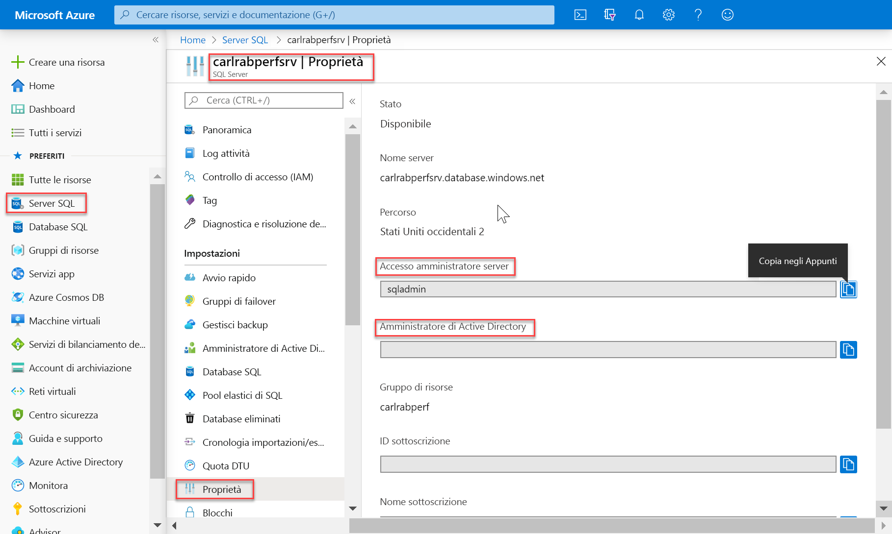
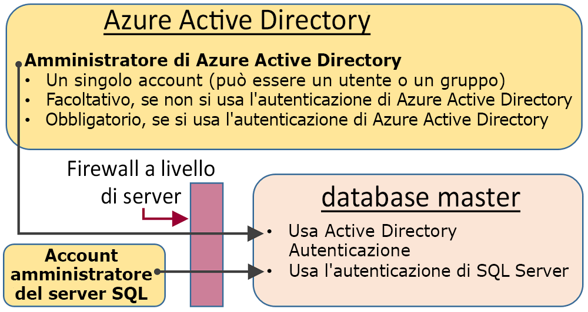
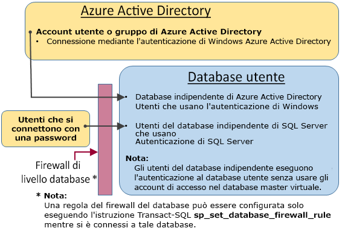

# <a name="sql-authentication"></a>Autenticazione SQL

Azure Synapse Analytics include due fattori di forma SQL che consentono di controllare il consumo di risorse. Questo articolo illustra come i due fattori di forma controllano l'autenticazione utente.

Per Synapse SQL, è possibile usare due tipi di autorizzazione:

- Autorizzazione AAD
- Autorizzazione SQL

L'autorizzazione AAD si basa su Azure Active Directory e consente di gestire gli utenti da una singola posizione. L'autorizzazione SQL consente alle applicazioni legacy di usare Synapse SQL in un modo familiare.

## <a name="administrative-accounts"></a>Account amministrativi

Sono disponibili due account amministrativi, **Amministratore del server** e **Amministratore di Active Directory**, che agiscono come amministratori. Per identificare questi account amministratore per SQL Server, aprire il portale di Azure e passare alla scheda Proprietà di Synapse SQL.



- **Amministratore del server**

  Quando si crea un'istanza di Azure Synapse Analytics, è necessario designare un **account di accesso di amministratore del server**. Il server SQL crea l'account come account di accesso nel database master. Tale account, che effettua la connessione con l'autenticazione di SQL Server (nome utente e password), Può esistere un solo account di questo tipo.

- **Amministratore di Azure Active Directory**

  È possibile configurare come amministratore anche un account singolo o di gruppo di sicurezza di Azure Active Directory. La configurazione di un amministratore di Azure AD è facoltativa, ma **è necessaria** se si vogliono usare gli account Azure AD per la connessione a Synapse SQL.

Gli account **Amministratore del server** e **Amministratore di Azure Active Directory** hanno le caratteristiche seguenti:

- Questi sono gli unici account che possono connettersi automaticamente a qualsiasi database SQL nel server. Per connettersi a un database utente, gli altri account devono essere il proprietario del database o avere un account utente nel database utente.
- Questi account accedono ai database utente come utente `dbo` e hanno a disposizione tutte le autorizzazioni nei database utente. Anche il proprietario di un database utente accede al database come utente `dbo`.
- Essi non accedono al database `master` come utente `dbo` e hanno autorizzazioni limitate nel database master.
- Questi account **non** sono membri del ruolo predefinito del server `sysadmin` di SQL Server, che non è disponibile in Database SQL.  
- Essi possono creare, modificare ed eliminare database, account di accesso, utenti nel database master e regole del firewall IP a livello di server.
- Questi account possono aggiungere e rimuovere membri per i ruoli `dbmanager` e `loginmanager`.
- Essi possono visualizzare la tabella di sistema `sys.sql_logins`.

## <a name="sql-on-demand-preview"></a>[SQL su richiesta (anteprima)](#tab/serverless)

Per gestire gli utenti che hanno accesso a SQL su richiesta, è possibile seguire queste istruzioni.

Per creare un account di accesso a SQL su richiesta, usare la sintassi seguente:

```sql
CREATE LOGIN Mary WITH PASSWORD = '<strong_password>';
-- or
CREATE LOGIN Mary@domainname.net FROM EXTERNAL PROVIDER;
```
Una volta creato l'account di accesso, è possibile creare utenti nei singoli database all'interno dell'endpoint SQL su richiesta e concedere loro le autorizzazioni necessarie. Per creare un utente, è possibile usare la sintassi seguente:
```sql
CREATE USER Mary FROM LOGIN Mary;
-- or
CREATE USER Mary FROM LOGIN Mary@domainname.net;
-- or
CREATE USER [mike@contoso.com] FROM EXTERNAL PROVIDER;
```

Una volta creati l'account di accesso e l'utente, è possibile usare la normale sintassi di SQL Server per concedere diritti.

## <a name="sql-pool"></a>[Pool SQL](#tab/provisioned)

### <a name="administrator-access-path"></a>Percorso di accesso degli amministratori

Quando il firewall a livello di server è configurato correttamente, l'**amministratore del server SQL** e l'**amministratore di Azure Active Directory** possono connettersi usando strumenti client come SQL Server Management Studio o SQL Server Data Tools. Solo gli strumenti più recenti offrono tutte le caratteristiche e le funzionalità. 

Il diagramma seguente mostra una configurazione tipica per i due account amministratore:
 


Quando viene usata una porta aperta nel firewall a livello di server, gli amministratori possono connettersi a qualsiasi database SQL.

### <a name="database-creators"></a>Creatori di database

Uno di questi ruoli amministrativi è il ruolo **dbmanager**. I membri di questo ruolo possono creare nuovi database. Per usare questo ruolo, creare un utente nel database `master` e quindi aggiungere l'utente al ruolo **dbmanager** del database. 

Per creare un database, l'utente deve essere basato su un account di accesso di SQL Server nel database `master` o essere un utente di database indipendente basato su un utente di Azure Active Directory.

1. Connettersi al database `master` usando un account amministratore.
2. creare un account di accesso con autenticazione di SQL Server con l'istruzione [CREATE LOGIN](/sql/t-sql/statements/create-login-transact-sql?toc=/azure/synapse-analytics/toc.json&bc=/azure/synapse-analytics/breadcrumb/toc.json&view=azure-sqldw-latest). Istruzione di esempio:

   ```sql
   CREATE LOGIN Mary WITH PASSWORD = '<strong_password>';
   ```

   > [!NOTE]
   > Quando si crea un account di accesso o un utente di database indipendente, usare una password complessa. Per altre informazioni, vedere [Strong Passwords](/sql/relational-databases/security/strong-passwords?toc=/azure/synapse-analytics/toc.json&bc=/azure/synapse-analytics/breadcrumb/toc.json&view=azure-sqldw-latest).

   Per migliorare le prestazioni, gli account di accesso (entità a livello di server) vengono temporaneamente memorizzati nella cache a livello di database. Per aggiornare la cache di autenticazione, vedere [DBCC FLUSHAUTHCACHE](/sql/t-sql/database-console-commands/dbcc-flushauthcache-transact-sql?toc=/azure/synapse-analytics/toc.json&bc=/azure/synapse-analytics/breadcrumb/toc.json&view=azure-sqldw-latest).

3. Creare un utente di database usando l'istruzione [CREATE USER](/sql/t-sql/statements/create-user-transact-sql?toc=/azure/synapse-analytics/toc.json&bc=/azure/synapse-analytics/breadcrumb/toc.json&view=azure-sqldw-latest). L'utente può essere un utente di database indipendente con autenticazione di Azure Active Directory (se l'ambiente è stato configurato per l'autenticazione di Azure AD), un utente di database indipendente con autenticazione di SQL Server oppure un utente con autenticazione di SQL Server basato su un account di accesso con autenticazione di SQL Server (creato nel passaggio precedente). Istruzioni di esempio:

   ```sql
   CREATE USER [mike@contoso.com] FROM EXTERNAL PROVIDER; -- To create a user with Azure Active Directory
   CREATE USER Ann WITH PASSWORD = '<strong_password>'; -- To create a SQL Database contained database user
   CREATE USER Mary FROM LOGIN Mary;  -- To create a SQL Server user based on a SQL Server authentication login
   ```

4. Aggiungere il nuovo utente al ruolo del database **dbmanager** in `master` usando la routine [sp_addrolemember](https://docs.microsoft.com/sql/relational-databases/system-stored-procedures/sp-addrolemember-transact-sql?view=azure-sqldw-latest) (si noti che l'istruzione [ALTER ROLE](/sql/t-sql/statements/alter-role-transact-sql?toc=/azure/synapse-analytics/toc.json&bc=/azure/synapse-analytics/breadcrumb/toc.json&view=azure-sqldw-latest) non è supportata in SQL con provisioning). Istruzioni di esempio:

   ```sql
   EXEC sp_addrolemember 'dbmanager', 'Mary'; 
   EXEC sp_addrolemember 'dbmanager', 'mike@contoso.com]'; 
   ```

   > [!NOTE]
   > Poiché dbmanager è un ruolo del database nel database master, è possibile aggiungere solo un utente di database al ruolo dbmanager. Non si può aggiungere un account di accesso a livello di server a un ruolo a livello di database.

5. Se necessario, configurare una regola firewall per consentire la connessione del nuovo utente. Il nuovo utente può essere gestito da una regola firewall esistente.

L'utente potrà così connettersi al database `master` e creare nuovi database. L'account che crea il database ne diventa il proprietario.

### <a name="login-managers"></a>Gestione degli account di accesso

L'altro ruolo amministrativo è il ruolo di gestione degli account di accesso. I membri di questo ruolo possono creare nuovi account di accesso nel database master. Se si vuole, è possibile completare la stessa procedura (ovvero creare un account di accesso e aggiungere un utente al ruolo **loginmanager**) per consentire a un utente di creare nuovi account di accesso nel database master. Gli account di accesso non sono in genere necessari perché è consigliabile usare utenti di database indipendente che eseguono l'autenticazione a livello di database anziché utenti basati su account di accesso. Per altre informazioni, vedere [Utenti di database indipendente: rendere portabile un database](/sql/relational-databases/security/contained-database-users-making-your-database-portable?toc=/azure/synapse-analytics/toc.json&bc=/azure/synapse-analytics/breadcrumb/toc.json&view=azure-sqldw-latest).

---

## <a name="non-administrator-users"></a>Utenti non amministratori

Per gli account non amministratore non è in genere necessario l'accesso al database master. Creare utenti di database indipendente a livello di database con l'istruzione [CREATE USER (Transact-SQL)](https://msdn.microsoft.com/library/ms173463.aspx) . 

L'utente può essere un utente di database indipendente con autenticazione di Azure Active Directory (se l'ambiente è stato configurato per l'autenticazione di Azure AD), un utente di database indipendente con autenticazione di SQL Server oppure un utente con autenticazione di SQL Server basato su un account di accesso con autenticazione di SQL Server (creato nel passaggio precedente).  

Per creare utenti, connettersi al database ed eseguire istruzioni simili ai seguenti esempi:

```sql
CREATE USER Mary FROM LOGIN Mary;
CREATE USER [mike@contoso.com] FROM EXTERNAL PROVIDER;
```

Inizialmente, solo gli amministratori o il proprietario del database possono creare utenti. Per autorizzare utenti aggiuntivi a creare nuovi utenti, concedere all'utente selezionato l'autorizzazione `ALTER ANY USER` con un'istruzione come la seguente:

```sql
GRANT ALTER ANY USER TO Mary;
```

Per concedere a utenti aggiuntivi il controllo completo del database, rendere tali utenti membri del ruolo predefinito del database **db_owner**.

Nel database SQL di Azure o in Synapse serverless usare l'istruzione `ALTER ROLE`.

```sql
ALTER ROLE db_owner ADD MEMBER Mary;
```

Nel pool SQL usare [EXEC sp_addrolemember](/sql/relational-databases/system-stored-procedures/sp-addrolemember-transact-sql?toc=/azure/synapse-analytics/toc.json&bc=/azure/synapse-analytics/breadcrumb/toc.json&view=azure-sqldw-latest).

```sql
EXEC sp_addrolemember 'db_owner', 'Mary';
```

> [!NOTE]
> Uno dei motivi comuni per creare un utente di database in base a un account di accesso server è l'esigenza degli utenti di accedere a più database. Dato che gli utenti di database indipendenti sono singole entità, ogni database gestisce utente e password propri. Ciò può causare complicazioni quando l'utente deve ricordare le password per tutti i database e può diventare insostenibile quando occorre modificare più password per molti database. Tuttavia, quando si usano gli account di accesso di SQL Server e la disponibilità elevata (replica geografica attiva e gruppi di failover), gli account di accesso di SQL Server devono essere impostati manualmente in ogni server. In caso contrario, l'utente del database non verrà più mappato all'account di accesso server dopo un failover e non sarà in grado di accedere al database dopo il failover. 

Per altre informazioni sulla configurazione degli account di accesso per la replica geografica, vedere [Configurare e gestire la sicurezza dei database SQL di Azure per il ripristino geografico o il failover](../../azure-sql/database/active-geo-replication-security-configure.md?toc=/azure/synapse-analytics/toc.json&bc=/azure/synapse-analytics/breadcrumb/toc.json).

### <a name="configuring-the-database-level-firewall"></a>Configurazione del firewall a livello di database

Come procedura consigliata, gli utenti non amministratori dovrebbero avere accesso tramite il firewall solo ai database usati. Invece di autorizzarne gli indirizzi IP tramite il firewall a livello di server e concedere loro l'accesso a tutti i database, usare l'istruzione [sp_set_database_firewall_rule](/sql/relational-databases/system-stored-procedures/sp-set-database-firewall-rule-azure-sql-database?toc=/azure/synapse-analytics/toc.json&bc=/azure/synapse-analytics/breadcrumb/toc.json&view=azure-sqldw-latest) per configurare il firewall a livello di database. Il firewall a livello di database non può essere configurato usando il portale.

### <a name="non-administrator-access-path"></a>Percorso di accesso degli utenti non amministratori

Quando il firewall a livello di database è configurato correttamente, gli utenti di database possono connettersi usando strumenti client come SQL Server Management Studio o SQL Server Data Tools. Solo gli strumenti più recenti offrono tutte le caratteristiche e le funzionalità. Il diagramma seguente illustra un percorso di accesso tipico degli utenti non amministratori.



## <a name="groups-and-roles"></a>Gruppi e ruoli

In una gestione efficiente degli accessi vengono usate autorizzazioni assegnate a gruppi e ruoli anziché singoli utenti.

- Quando si usa l'autenticazione di Azure Active Directory, inserire gli utenti di Azure Active Directory in un gruppo di Azure Active Directory. Creare un utente di database indipendente per il gruppo. Inserire uno o più utenti di database in un [ruolo del database](/sql/relational-databases/security/authentication-access/database-level-roles?toc=/azure/synapse-analytics/toc.json&bc=/azure/synapse-analytics/breadcrumb/toc.json&view=azure-sqldw-latest) e quindi assegnare [autorizzazioni](/sql/relational-databases/security/permissions-database-engine?toc=/azure/synapse-analytics/toc.json&bc=/azure/synapse-analytics/breadcrumb/toc.json&view=azure-sqldw-latest) al ruolo del database.

- Quando si usa l'autenticazione di SQL Server, creare utenti di database indipendenti nel database. Inserire uno o più utenti di database in un [ruolo del database](/sql/relational-databases/security/authentication-access/database-level-roles?toc=/azure/synapse-analytics/toc.json&bc=/azure/synapse-analytics/breadcrumb/toc.json&view=azure-sqldw-latest) e quindi assegnare [autorizzazioni](/sql/relational-databases/security/permissions-database-engine?toc=/azure/synapse-analytics/toc.json&bc=/azure/synapse-analytics/breadcrumb/toc.json&view=azure-sqldw-latest) al ruolo del database.

I ruoli del database possono essere ruoli predefiniti come **db_owner**, **db_ddladmin**, **db_datawriter**, **db_datareader**, **db_denydatawriter** e **db_denydatareader**. Per concedere autorizzazioni complete a un numero limitato di utenti viene usato comunemente **db_owner**. Gli altri ruoli predefiniti del database sono utili per ottenere rapidamente un database semplice nello sviluppo, ma non sono consigliabili per la maggior parte dei database di produzione. 

Il ruolo predefinito del database **db_datareader**, ad esempio, concede l'accesso in lettura a tutte le tabelle del database, che in genere è più di quanto strettamente necessario. 

È preferibile usare l'istruzione [CREATE ROLE](https://msdn.microsoft.com/library/ms187936.aspx) per creare ruoli del database definiti dall'utente e concedere con attenzione a ogni ruolo le autorizzazioni minime necessarie per le esigenze aziendali. Quando un utente è membro di più ruoli, vengono aggregate le autorizzazioni di tutti.

## <a name="permissions"></a>Autorizzazioni

Nel database SQL possono essere concesse o negate singolarmente oltre 100 autorizzazioni. Molte di queste autorizzazioni sono annidate. L'autorizzazione `UPDATE` per uno schema, ad esempio, include l'autorizzazione `UPDATE` per ogni tabella all'interno di tale schema. Come nella maggior parte dei sistemi di autorizzazioni, la negazione di un'autorizzazione determina l'override di una concessione. 

A causa dell'annidamento e del numero delle autorizzazioni, progettare un sistema di autorizzazioni appropriato per proteggere correttamente il database può richiedere un attento studio. 

Per iniziare, vedere l'elenco di autorizzazioni in [Autorizzazioni (Motore di database)](https://docs.microsoft.com/sql/relational-databases/security/permissions-database-engine) e la [grafica in formato di poster](https://docs.microsoft.com/sql/relational-databases/security/media/database-engine-permissions.png) relativa alle autorizzazioni.

### <a name="considerations-and-restrictions"></a>Considerazioni e restrizioni

Quando si gestiscono gli account di accesso e gli utenti nel database SQL, tenere presente quanto segue:

- È necessario essere connessi al database **master** durante l'esecuzione delle istruzioni `CREATE/ALTER/DROP DATABASE`.
- L'utente di database corrispondente all'account di accesso **Amministratore del server** non può essere modificato o eliminato.
- L'inglese americano è la lingua predefinita dell'account di accesso **Amministratore del server**.
- Soltanto gli amministratori (**amministratore del server** o amministratore di Azure AD) e i membri del ruolo di database **dbmanager** nel database **master** sono autorizzati a eseguire le istruzioni `CREATE DATABASE` e `DROP DATABASE`.
- È necessario essere connessi al database master durante l'esecuzione delle istruzioni `CREATE/ALTER/DROP LOGIN` . È tuttavia sconsigliato l'uso di account di accesso. Usare invece gli utenti del database indipendente.
- Per connettersi a un database utente è necessario specificare il nome del database nella stringa di connessione.
- Soltanto gli utenti con accesso dell’entità di livello server e i membri del ruolo del database **loginmanager** nel database **master** sono autorizzati a eseguire le istruzioni `CREATE LOGIN`, `ALTER LOGIN` e `DROP LOGIN`.
- Quando si eseguono le istruzioni `CREATE/ALTER/DROP LOGIN` e `CREATE/ALTER/DROP DATABASE` in un'applicazione ADO.NET, non è consentito usare i comandi con parametri. Per ulteriori informazioni, vedere [Comandi e parametri](/dotnet/framework/data/adonet/commands-and-parameters?toc=/azure/synapse-analytics/toc.json&bc=/azure/synapse-analytics/breadcrumb/toc.json).
- Quando si esegue le istruzioni `CREATE/ALTER/DROP DATABASE` e `CREATE/ALTER/DROP LOGIN`, ognuna di queste istruzioni deve essere l'unica istruzione in un batch Transact-SQL. In caso contrario si verifica un errore. Ad esempio, il seguente Transact-SQL controlla se il database esiste. Se esiste, un’istruzione `DROP DATABASE` viene chiamata per rimuovere il database. Poiché l’istruzione `DROP DATABASE` non è l'unica istruzione nel batch, l'esecuzione della seguente istruzione Transact-SQL genera un errore.

  ```sql
  IF EXISTS (SELECT [name]
           FROM   [sys].[databases]
           WHERE  [name] = N'database_name')
  DROP DATABASE [database_name];
  GO
  ```
  
  Usare invece l'istruzione Transact-SQL seguente:
  
  ```sql
  DROP DATABASE IF EXISTS [database_name]
  ```

- Quando si esegue l’istruzione `CREATE USER` con l’opzione `FOR/FROM LOGIN`, l’istruzione deve essere l'unica in un batch Transact-SQL.
- Quando si esegue l’istruzione `ALTER USER` con l’opzione `WITH LOGIN`, l’istruzione deve essere l'unica in un batch Transact-SQL.
- Per `CREATE/ALTER/DROP` un utente richiede l’autorizzazione `ALTER ANY USER` per il database.
- Quando il proprietario di un ruolo del database tenta di aggiungere o rimuovere un altro utente del database in o da tale ruolo del database, potrebbe verificarsi il seguente errore: **L’utente o il ruolo 'Name' non esiste nel database.** Questo errore si verifica perché l'utente non è visibile al proprietario. Per risolvere questo problema, concedere al proprietario del ruolo l’autorizzazione `VIEW DEFINITION` per l'utente. 

## <a name="next-steps"></a>Passaggi successivi

Per altre informazioni, vedere [Utenti di database indipendente: rendere portabile un database](https://msdn.microsoft.com/library/ff929188.aspx).
 
