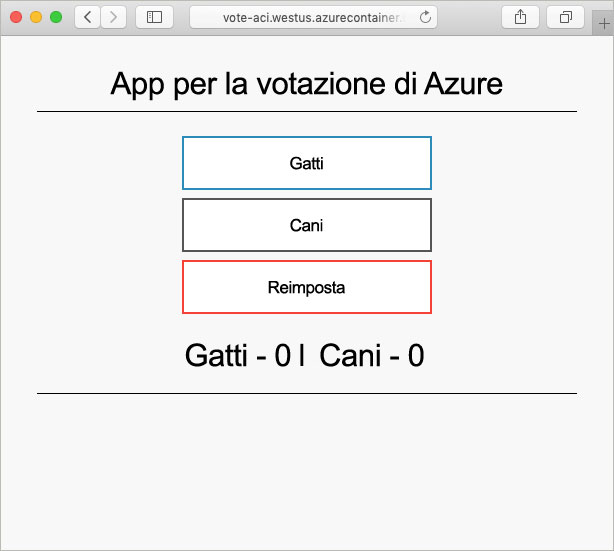

# <a name="quickstart-create-a-terraform-configuration-for-azure"></a>Guida introduttiva: Creare una configurazione Terraform per Azure

In questa guida di avvio rapido verranno create risorse di Azure con Terraform. I passaggi descritti in questo articolo illustrano come creare le risorse seguenti:

> [!div class="checklist"]
> * Istanza di Azure Cosmos DB
> * Istanza di contenitore di Azure
> * App che funziona in queste due risorse

## <a name="create-first-configuration"></a>Crea la prima configurazione

In questa sezione si creerà la configurazione per un'istanza di Azure Cosmos DB.

1. Accedere al [portale di Azure](https://go.microsoft.com/fwlink/p/?LinkID=525040).

1. Aprire Azure Cloud Shell.

1. Avviare l'editor di Cloud Shell:

    ```bash
    code main.tf
    ```

1. La configurazione in questo passaggio crea alcune risorse di Azure. Queste risorse includono un gruppo di risorse di Azure e un'istanza di Azure Cosmos DB. Viene usato un numero intero casuale per creare un nome univoco per l'istanza di Cosmos DB. Vengono configurate anche diverse impostazioni di Cosmos DB. Per altre informazioni, vedere le [Informazioni di riferimento su Terraform per Cosmos DB](https://www.terraform.io/docs/providers/azurerm/r/cosmosdb_account.html). Copiare e incollare la configurazione di Terraform seguente nell'editor:

    ```hcl
    resource "azurerm_resource_group" "vote-resource-group" {
      name     = "vote-resource-group"
      location = "westus"
    }

    resource "random_integer" "ri" {
      min = 10000
      max = 99999
    }

    resource "azurerm_cosmosdb_account" "vote-cosmos-db" {
      name                = "tfex-cosmos-db-${random_integer.ri.result}"
      location            = azurerm_resource_group.vote-resource-group.location
      resource_group_name = azurerm_resource_group.vote-resource-group.name
      offer_type          = "Standard"
      kind                = "GlobalDocumentDB"

      consistency_policy {
        consistency_level       = "BoundedStaleness"
        max_interval_in_seconds = 10
        max_staleness_prefix    = 200
      }

      geo_location {
        location          = "westus"
        failover_priority = 0
      }
    }
    ```

1. Salvare il file ( **&lt;CTRL+S**) e uscire dall'editor ( **&lt;CTRL+Q**).

## <a name="run-the-configuration"></a>Eseguire la configurazione

In questa sezione vengono usati numerosi comandi di Terraform per eseguire la configurazione.

1. Il comando [terraform init](https://www.terraform.io/docs/commands/init.html) inizializza la directory di lavoro. Eseguire il comando seguente in Cloud Shell:

    ```bash
    terraform init
    ```

1. È possibile usare il comando [terraform plan](https://www.terraform.io/docs/commands/plan.html) per convalidare la sintassi della configurazione. Il parametro `-out` indirizza i risultati a un file. Il file di output può essere usato in un secondo momento per applicare la configurazione. Eseguire il comando seguente in Cloud Shell:

    ```bash
    terraform plan --out plan.out
    ```

1. Per applicare la configurazione, viene usato il comando [terraform apply](https://www.terraform.io/docs/commands/apply.html). Viene specificato il file di output del passaggio precedente. Questo comando determina la creazione delle risorse di Azure. Eseguire il comando seguente in Cloud Shell:

    ```bash
    terraform apply plan.out
    ```

1. Per verificare i risultati all'interno del portale di Azure, passare al nuovo gruppo di risorse. La nuova istanza di Azure Cosmos DB si trova nel nuovo gruppo di risorse.

## <a name="update-configuration"></a>Aggiornare la configurazione

Questa sezione mostra come aggiornare la configurazione in modo da includere un'istanza di Azure Container. Il contenitore esegue un'applicazione che legge e scrive i dati in Cosmos DB.

1. Avviare l'editor di Cloud Shell:

    ```bash
    code main.tf
    ```

1. La configurazione in questo passaggio imposta due variabili di ambiente: `COSMOS_DB_ENDPOINT` e `COSMOS_DB_MASTERKEY`. Queste variabili contengono il percorso e la chiave per l'accesso al database. I valori di queste variabili vengono ottenuti dall'istanza di database creata nel passaggio precedente. Questo processo è noto come interpolazione. Per altre informazioni sull'interpolazione di Terraform, vedere l'articolo relativo alla [sintassi di interpolazione](https://www.terraform.io/docs/configuration/interpolation.html). La configurazione include anche un blocco di output, che restituisce il nome di dominio completo (FQDN) dell'istanza del contenitore. Copiare e incollare il codice seguente nell'editor:

    ```hcl
    resource "azurerm_container_group" "vote-aci" {
      name                = "vote-aci"
      location            = azurerm_resource_group.vote-resource-group.location
      resource_group_name = azurerm_resource_group.vote-resource-group.name
      ip_address_type     = "public"
      dns_name_label      = "vote-aci"
      os_type             = "linux"

      container {
        name   = "vote-aci"
        image  = "microsoft/azure-vote-front:cosmosdb"
        cpu    = "0.5"
        memory = "1.5"
        ports {
          port     = 80
          protocol = "TCP"
        }

        secure_environment_variables = {
          "COSMOS_DB_ENDPOINT"  = azurerm_cosmosdb_account.vote-cosmos-db.endpoint
          "COSMOS_DB_MASTERKEY" = azurerm_cosmosdb_account.vote-cosmos-db.primary_master_key
          "TITLE"               = "Azure Voting App"
          "VOTE1VALUE"          = "Cats"
          "VOTE2VALUE"          = "Dogs"
        }
      }
    }

    output "dns" {
      value = azurerm_container_group.vote-aci.fqdn
    }
    ```

1. Salvare il file ( **&lt;CTRL+S**) e uscire dall'editor ( **&lt;CTRL+Q**).

1. Come nella sezione precedente, eseguire il comando seguente per visualizzare le modifiche da apportare:

    ```bash
    terraform plan --out plan.out
    ```

1. Eseguire il comando `terraform apply` per applicare la configurazione.

    ```bash
    terraform apply plan.out
    ```

1. Prendere nota del nome di dominio completo dell'istanza di contenitore.

## <a name="test-application"></a>Testare l'applicazione

Per testare l'applicazione, passare al nome di dominio completo dell'istanza di contenitore. Verrà visualizzata un output simile al seguente:



## <a name="clean-up-resources"></a>Pulire le risorse

Quando non sono più necessarie, eliminare le risorse create in questo articolo.

Eseguire il comando [terraform destroy](https://www.terraform.io/docs/commands/destroy.html) per rimuovere le risorse di Azure create in questa esercitazione:

```bash
terraform destroy -auto-approve
```

## <a name="next-steps"></a>Passaggi successivi

> [!div class="nextstepaction"]
> [Installare e configurare Terraform per il provisioning delle risorse di Azure](../virtual-machines/linux/terraform-install-configure.md).