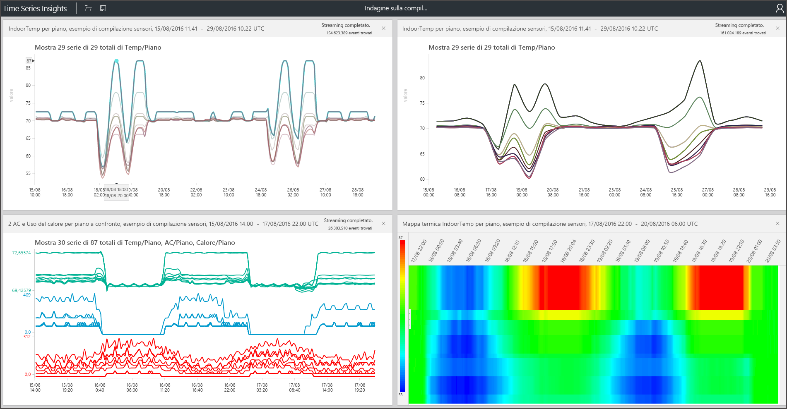

# Strumento di esplorazione di Azure Time Series Insights
In questo articolo vengono descritte le funzionalità e le opzioni disponibili nell'app Web dello strumento di esplorazione di Time Series Insights. Usare lo strumento di esplorazione di Time Series Insights nel Web browser per creare visualizzazioni di dati.
 
Azure Time Series Insights è un servizio completamente gestito per analisi, archiviazione e visualizzazione, che semplifica l'esplorazione e l'analisi di miliardi di eventi IoT contemporaneamente. Offre una visualizzazione globale dei dati e consente di convalidare rapidamente le soluzioni IoT e di evitare così costosi periodi di inattività per i dispositivi di importanza strategica. È possibile individuare tendenze nascoste e anomalie, nonché eseguire analisi della causa radice. Lo strumento di esplorazione di Time Series Insights è attualmente disponibile nella versione di anteprima pubblica.

## prerequisiti

Prima di poter usare lo strumento di esplorazione di Time Series Insights, è necessario:
- Creare un ambiente Time Series Insights
- Fornire l'accesso al proprio account nell'ambiente
- Aggiungere un'origine evento per l'inserimento e l'archiviazione dei dati

## Esplorare ed eseguire query sui dati
Dopo aver connesso l'origine evento all'ambiente Time Series Insights, è possibile esplorare ed eseguire query sui dati di serie temporali.

1. Per iniziare, aprire lo [strumento di esplorazione di Time Series Insights ](https://insights.timeseries.azure.com/) nel Web browser e selezionare un ambiente sul lato sinistro della finestra. Tutti gli ambiente a cui l'utente può accedere sono elencati in ordine alfabetico.

2. Dopo aver selezionato un ambiente, usare le configurazioni **FROM** (DA) e **TO** (A) disponibili nella parte superiore oppure fare clic e trascinare il puntatore del mouse sull'intervallo di tempo desiderato.  Fare clic sulla lente di ingrandimento in alto a destra o fare clic con il pulsante destro del mouse sull'intervallo di tempo selezionato e scegliere **Search** (Cerca).  

3. È anche possibile aggiornare automaticamente la disponibilità ogni minuto selezionando il pulsante **Auto On** (Abilita aggiornamento automatico).  Da notare che il pulsante 'Auto-On' (Abilita aggiornamento automatico) si applica al solo grafico della disponibilità e non al contenuto della visualizzazione principale.

4. L'icona del cloud di Azure consente di passare all'ambiente nel portale di Azure.

   

5. Nel grafico visualizzato è riportato il conteggio di tutti gli eventi durante l'intervallo di tempo selezionato.  Sono disponibili i controlli seguenti:

    **Pannello Terms Editor** (Editor termini): in questo pannello vengono eseguite le query sull'ambiente.  Il pannello è disponibile sul lato sinistra della schermata. 
      - **Measure** (Misura): in questo elenco a discesa sono visualizzate tutte le colonne numeriche (valori di tipo Double)
      - **Split By** (Diviso per): in questo elenco a discesa sono visualizzate le colonne delle categorie (valori di tipo String)
      - È possibile abilitare l'interpolazione graduale, visualizzare i valori massimi e minimi e adattare l'asse Y tramite il pannello di controllo accanto alla misura.  È anche possibile definire se i dati visualizzati sono un conteggio, una media oppure una somma di dati.
      - È possibile aggiungere fino a cinque termini da visualizzare sull'asse X.  Usare il pulsante per la **copia verso il basso** per aggiungere altri termini oppure fare clic sul pulsante **Add**  (Aggiungi) per aggiungere un nuovo termine.
     
        

      - **Predicate** (Predicato): il predicato consente di filtrare rapidamente gli eventi tramite il set di operandi elencati di seguito. Se si esegue una ricerca tramite selezione o clic, il predicato viene automaticamente aggiornato in base a tale ricerca.      I tipi di operandi supportati includono:

         |Operazione  |Tipi supportati  |Note  |
         |---------|---------|---------|
         |<, >, <=, >=     |  Double, DateTime, TimeSpan       |         |
         |=, !=, <>     | String, Bool, Double, DateTime, TimeSpan, NULL        |         |
         |IN     | String, Bool, Double, DateTime, TimeSpan, NULL        |  Tutti gli operandi devono essere dello stesso tipo o essere una costante NULL.        |
         |HAS     | string        |  Sono consentiti solo valori letterali di tipo stringa costante sul lato destro. Non sono consentiti valori NULL o stringhe vuote.       |

      - **Esempi di query**
      
         

6. Il dispositivo di scorrimento **Interval Size** (Dimensione intervallo) consente di eseguire lo zoom avanti e indietro dei periodi inclusi nello stesso intervallo di tempo.  Questo strumento garantisce un controllo più preciso dello spostamento tra intervalli di tempo di particolare entità, consentendo di visualizzare tendenze uniformi in sezioni temporali riferite a millisecondi e pertanto di mostrare sezioni di dati con granularità e risoluzione superiori. Il punto iniziale predefinito del dispositivo di scorrimento è impostato sulla visualizzazione ottimale dei dati basata sulla selezione effettuata, ovvero risoluzione del bilanciamento, velocità della query e granularità.

7. Lo strumento **Time brush** (Pennello tempo) semplifica il passaggio tra intervalli di tempo diversi grazie a un'esperienza utente intuitiva che garantisce spostamenti uniformi tra intervalli di tempo.

8. Il comando **Save** (Salva) consente di salvare la query corrente e abilitarla per la condivisione con altri utenti dell'ambiente. Usare il pulsante **Open** per visualizzare tutte le query salvate e qualsiasi query condivisa di altri utenti dell'ambiente a cui si ha accesso. 

   

9. Lo strumento **Perspective View** (Visualizzazione prospettiva) fornisce una visualizzazione simultanea di un massimo di quattro query univoche. Il pulsante Perspective View (Visualizzazione prospettiva) è disponibile nell'angolo superiore destro del grafico.  

   

10. Lo strumento **Chart** (Grafico) consente di esplorare visivamente i dati. Lo strumento Chart (Grafico) include le funzionalità seguenti:

   - Selezione/clic: è possibile eseguire la selezione di un intervallo di tempo specifico o di una singola serie di dati.  
   - Selezione all'interno di un intervallo di tempo: è possibile eseguire lo zoom o esplorare gli eventi.  
   - Selezione all'interno di una serie di dati: è possibile suddividere la serie in base a una colonna diversa, aggiungere la serie sotto forma di nuovo termine, visualizzare solo la serie selezionata, escludere la serie selezionata, bloccare tale serie o esplorare gli eventi nella serie selezionata.
   - Nell'area dei filtri a sinistra del grafico è possibile visualizzare tutte le serie di dati disponibili e riordinarle in base al valore o al nome, nonché visualizzare tutte le serie di dati o serie di dati bloccate o sbloccate.  È anche possibile selezionare una singola serie di dati e suddividerla in base a una colonna diversa, aggiungere la serie sotto forma di nuovo termine, visualizzare solo la serie selezionata, escludere la serie selezionata, bloccare tale serie o esplorare gli eventi nella serie selezionata.
   - In caso di visualizzazione contemporanea di più termini, è possibile impilare, rimuovere la pila, visualizzare dati aggiuntivi su una serie di dati specifica e usare lo stesso asse Y in tutti i termini grazie ai pulsanti disponibili nell'angolo superiore destro del grafico.
 
    

11. Lo strumento **Heatmap** (Mappa termina) può essere usato per individuare rapidamente serie di dati univoci o anomali in una query specifica. È possibile visualizzare come mappa termica solo un termine di ricerca.    

   

12. **Events** (Eventi): quando si sceglie di esplorare gli eventi mediante una selezione o un clic con il pulsante destro del mouse nell'area soprastante, viene visualizzato il riquadro degli eventi.  In questa area è possibile visualizzare tutti gli eventi non elaborati ed esportare gli eventi come file con estensione json o csv. In Time Series Insights vengono archiviati tutti i dati non elaborati.

   

13. Fare clic sulla scheda **STATS** (Statistiche) dopo aver esplorato gli eventi per visualizzare i modelli e le statistiche di colonna.  

   - **Patterns** (Motivi): questa funzionalità evidenzia in modo proattivo i modelli statisticamente più significativi all'interno di un'area dati selezionata. Ciò consente di evitare di dover analizzare migliaia di eventi per individuare i modelli che maggiormente richiedono tempo ed energia. Time Series Insights consente inoltre di passare direttamente ai modelli statisticamente più significativi individuati e continuare ad analizzare i dati. Questa funzionalità risulta utile anche per le analisi retrospettive di dati storici. 

   - **Column stats** (Statistiche di colonna): in questa area sono visualizzati grafici e tabelle che suddividono i dati per ciascuna colonna della serie di dati selezionata nell'intervallo di tempo selezionato.  
 
       

Sono state introdotte le varie funzionalità e opzioni disponibili nell'app Web dello strumento di esplorazione di Time Series Insights. 

## Passaggi successivi
> [!div class="nextstepaction"]
>[Diagnosticare e risolvere i problemi nell'ambiente Time Series Insights](time-series-insights-diagnose-and-solve-problems.md)
