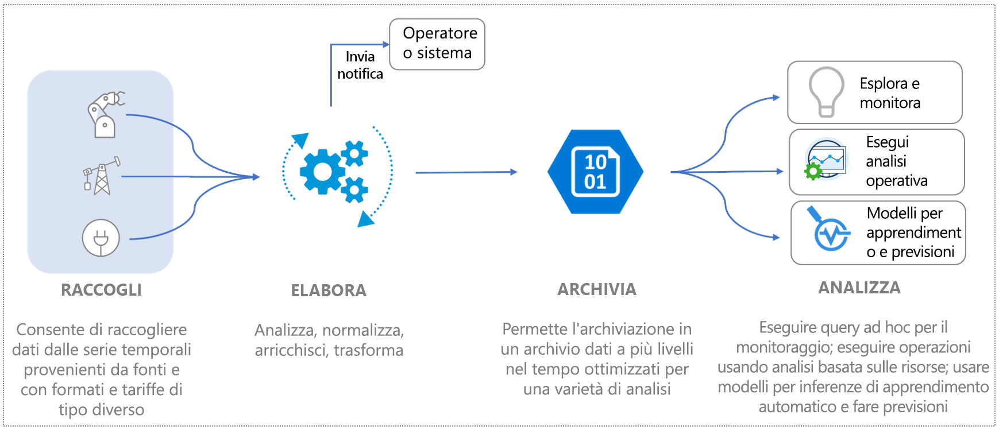
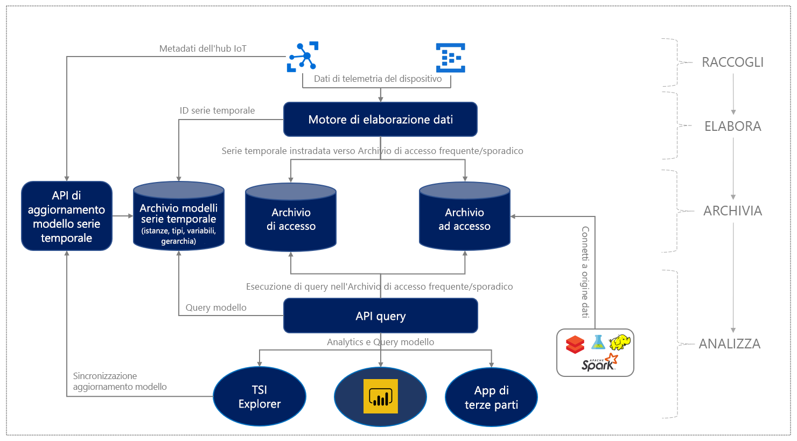

# Informazioni su Azure Time Series Insights (anteprima)

Anteprima di Azure Time Series Insights è una piattaforma end-to-end distribuita come servizio (PaaS). È possibile usarlo per eseguire operazioni di raccolta, elaborazione, archiviazione, analisi e query su dati a livello di Internet delle Cose, ovvero dati altamente contestualizzati e ottimizzati per le serie temporali. 

Time Series Insights è ideale per l'esplorazione di dati ad hoc e per l'analisi operativa. È un servizio estendibile e personalizzato, in grado di soddisfare le esigenze di vario tipo delle distribuzioni IoT industriali.

## Video

Altre informazioni sull'anteprima di Time Series Insights.

> [!VIDEO https://channel9.msdn.com/Shows/Internet-of-Things-Show/Azure-Time-Series-Insights-e2e-solution-for-industrial-IoT-analytics/player]

## Definizione di dati IoT

I dati di IoT industriale nelle organizzazioni a elevato utilizzo di risorse spesso mancano di coerenza strutturale a causa della diversificata natura di dispositivi e sensori in un ambiente industriale. I dati di questi flussi sono caratterizzati da lacune significative e in alcuni casi da messaggi danneggiati e false letture. I dati IoT spesso sono significativi nel contesto di input di dati aggiuntivi che provengono da origini proprietarie o di terzi, ad esempio CRM o ERP che aggiungono contesto per flussi di lavoro end-to-end. Gli input provenienti da origini dati di terze parti, ad esempio i dati meteorologici, possono contribuire ad aumentare i flussi di dati di telemetria in una determinata installazione. 

Ciò implica che solo una parte dei dati viene usata per scopi operativi e aziendali e l'analisi richiede la contestualizzazione. I dati industriali sono spesso disposti in ordine cronologico per un'analisi approfondita basata su intervalli di tempo più lunghi, al fine di comprendere e correlare le tendenze. Rendere i dati IoT raccolti informazioni dettagliate richiede: 

* Elaborazione dei dati per pulire, filtrare, interpolare, trasformare e preparare i dati per l'analisi.
* Definizione di una struttura per esplorare e comprendere i dati, ossia, per normalizzare e contestualizzare i dati.
* Archiviazione a basso costo per la conservazione a lungo termine o illimitata di dati elaborati o derivati e dati non elaborati.

Tali dati forniscono informazioni coerenti, complete, aggiornate e corrette per l'analisi e la creazione di report aziendali.

La figura seguente illustra un tipico flusso di dati IoT.

## Azure Time Series Insights per i dati IoT industriali

Il panorama IoT è diverso con i clienti che si occupano di vari segmenti industriali, tra cui produzione, automobili, energia, servizi pubblici, edifici intelligenti e consulenza. In questa vasta gamma di mercati IoT industriali, le soluzioni native del cloud che forniscono analisi complete mirate a dati IoT su larga scala sono in continua evoluzione. 

Azure Time Series Insights risponde a questa esigenza del mercato offrendo una soluzione di analisi IoT end-to-end chiavi in mano, con funzionalità di modellazione semantica avanzate per la contestualizzazione dei dati delle serie temporali, informazioni dettagliate basate su asset e un'esperienza utente ottimale per l'individuazione, l'individuazione delle tendenze, il rilevamento delle anomalie e le informazioni operative. 

Piattaforma di analisi operativa avanzata combinata alle funzionalità di esplorazione dei dati interattive, è possibile usare Time Series Insights per ottenere maggior valore dai dati raccolti dagli asset IoT. L'offerta dell'anteprima supporta: 

* Soluzione di archiviazione a più livelli con supporto di analisi a caldo e a freddo che offre ai clienti la possibilità di instradare i dati tra caldo e freddo per l'analisi interattiva sui dati a caldo e l'intelligenza operativa su decenni di dati cronologici. 

    *   Una soluzione di analisi a caldo estremamente interattiva per eseguire un numero elevato di query frequenti su dati di intervalli di tempo più brevi 
    *   Un data lake delle serie temporali scalabile e ottimizzato per prestazioni e costi basato su Archiviazione di Azure che consente ai clienti di individuare le tendenze di anni di dati delle serie temporali in pochi secondi. 

* Il supporto di modelli semantici che descrive il dominio e i metadati associati ai segnali derivati e non elaborati da asset e dispositivi.

* Piattaforma analitica flessibile per archiviare i dati cronologici delle serie temporali nell'account di Archiviazione di Azure di proprietà del cliente, consentendo così ai clienti di disporre della proprietà dei propri dati IoT. I dati vengono archiviati in un formato open source Apache Parquet che consente la connettività e l'interoperabilità tra diversi scenari di dati, tra cui analisi predittiva, Machine Learning e altri calcoli personalizzati eseguiti usando tecnologie note, tra cui Spark, Databricks e Jupyter.

* Analisi avanzate con API di query avanzate ed esperienza utente che combina informazioni dettagliate sui dati basati su asset con analisi avanzate dei dati ad hoc con supporto per interpolazione, funzioni scalari e di aggregazione, variabili categoriali, grafici a dispersione e segnali delle serie temporali con cambio d'ora per l'analisi approfondita.

*   Piattaforma di livello Enterprise per supportare le esigenze di scalabilità, prestazioni, sicurezza e affidabilità dei clienti IoT aziendali.

* Supporto di estendibilità e integrazione per l'analisi end-to-end. Time Series Insights offre una piattaforma di analisi estendibile per diversi scenari di dati. Il connettore Power BI di Time Series Insights consente ai clienti di portare le query eseguite in Time Series Insights direttamente in Power BI per ottenere una visualizzazione unificata delle analisi di BI e delle serie temporali in un unico pannello.

Il diagramma seguente mostra il flusso di lavoro generale.

  

Azure Time Series Insights offre un modello di determinazione dei prezzi con pagamento in base al consumo scalabile per l'elaborazione dei dati, l'archiviazione (dati e metadati) e le query, consentendo ai clienti di ottimizzare l'utilizzo in base alle esigenze aziendali. 
 
Con l'introduzione di queste funzionalità IoT industriali chiave, Time Series Insights offre anche gli importanti vantaggi illustrati di seguito.  

| | |
| ---| ---|
| Archiviazione a più livelli per i dati IoT delle serie temporali | Con una pipeline di elaborazione dei dati condivisi per l'inserimento di dati, è possibile inserire dati in archivi ad accesso sporadico e frequente. Usare l'archivio ad accesso frequente per le query interattive e l'archivio ad accesso sporadico per archiviare volumi elevati di dati. Per altre informazioni su come sfruttare i vantaggi delle query basate su asset con prestazioni elevate, vedere l'argomento relativo alle [query](./time-series-insights-update-tsq.md). |
| Modello di Time Series per contestualizzare i dati di telemetria non elaborati e ricavare informazioni dettagliate basate sugli asset | È possibile usare il modello Time Series per creare istanze, gerarchie, tipi e variabili per i dati delle serie temporali. Per altre informazioni sul modello Time Series, vedere l'argomento relativo al [modello Time Series](./time-series-insights-update-tsm.md).  |
| Integrazione facile e continua con altre soluzioni di dati | I dati nell'archivio ad accesso sporadico di Time Series Insights vengono [archiviati](./time-series-insights-update-storage-ingress.md) nei file Apache Parquet open source. Ciò consente l'integrazione dei dati con altre soluzioni dati di proprietà o di terzi, per scenari che includono business intelligence, Machine Learning avanzato e analisi predittiva. |
| Esplorazione dei dati quasi in tempo reale | L'esperienza utente dell'[anteprima di Azure Time Series Insights Explorer](./time-series-insights-update-explorer.md) fornisce una visualizzazione per tutti i dati trasmessi nella pipeline di inserimento. Dopo aver effettuato la connessione a un'origine evento, è possibile visualizzare, esplorare ed eseguire query sui dati dell'evento. In questo modo, è possibile verificare se un dispositivo genera dati come previsto. È anche possibile monitorare l'integrità, la produttività e l'efficienza complessiva di un asset IoT. | 
| Estendibilità e integrazione | L'integrazione del connettore Power BI di Azure Time Series Insights è disponibile direttamente nell'esperienza utente dello strumento di esplorazione di Time Series tramite l'opzione **Esporta**, consentendo ai clienti di esportare direttamente in Power BI Desktop le query delle serie temporali create nell'esperienza utente e di visualizzare i relativi grafici delle serie temporali insieme ad altre analisi BI. In questo modo, si apre la porta a una nuova classe di scenari per le aziende IoT industriali che hanno investito in Power BI, offrendo un unico pannello per visualizzare le analisi di diverse origini dati, tra cui le serie temporali IoT. | 
| Applicazioni personalizzate costruite sulla piattaforma Time Series Insights | Time Series Insights supporta [JavaScript SDK](https://github.com/microsoft/tsiclient/blob/master/docs/API.md). SDK fornisce controlli avanzati e accesso semplificato alle query. Usare SDK per creare applicazioni IoT personalizzate all'inizio di Time Series Insights in base alle esigenze aziendali. Inoltre, è possibile usare le [API di query](./time-series-insights-update-tsq.md) di Time Series Insights direttamente per integrare i dati nelle applicazioni IoT personalizzate. |

## Passaggi successivi

Iniziare a usare l'anteprima di Azure Time Series Insights:

> [!div class="nextstepaction"]
> [Guida di avvio rapido](./time-series-insights-update-quickstart.md)

Ulteriori informazioni sui casi d'uso:

> [!div class="nextstepaction"]
> [Casi d'uso sull'anteprima di Azure Time Series Insights](./time-series-insights-update-use-cases.md)