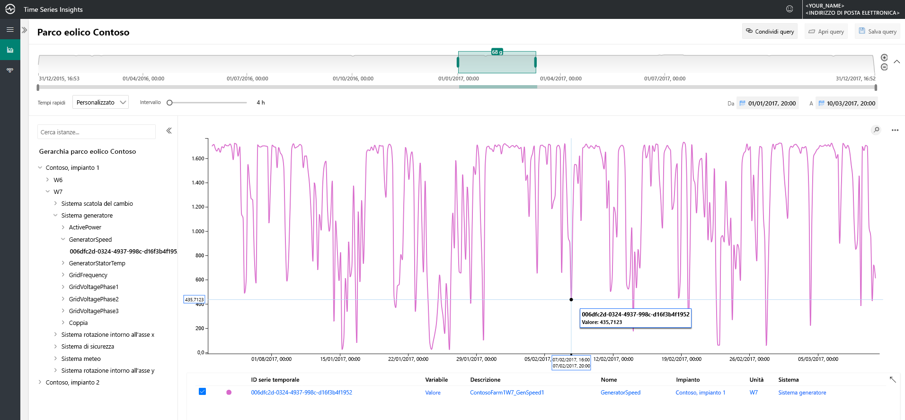
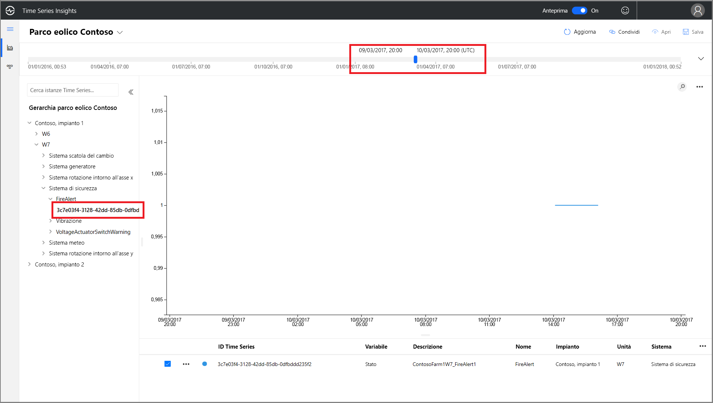
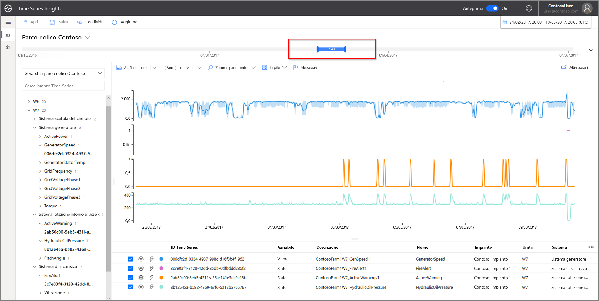
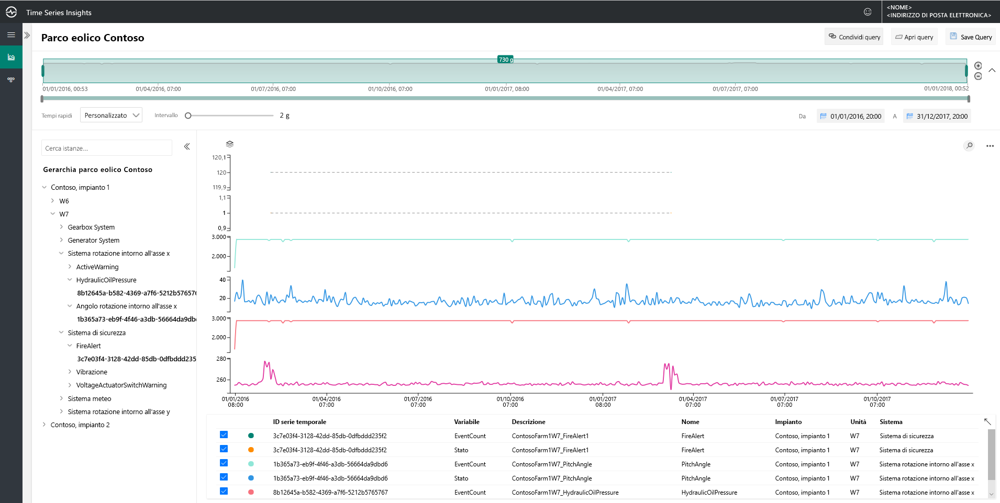
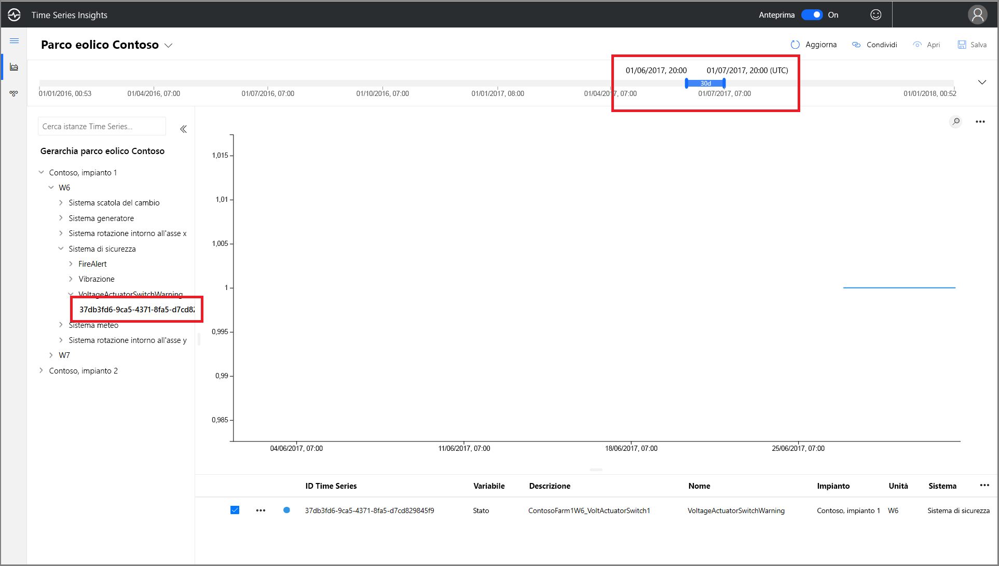
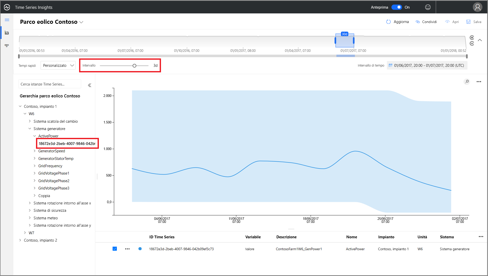
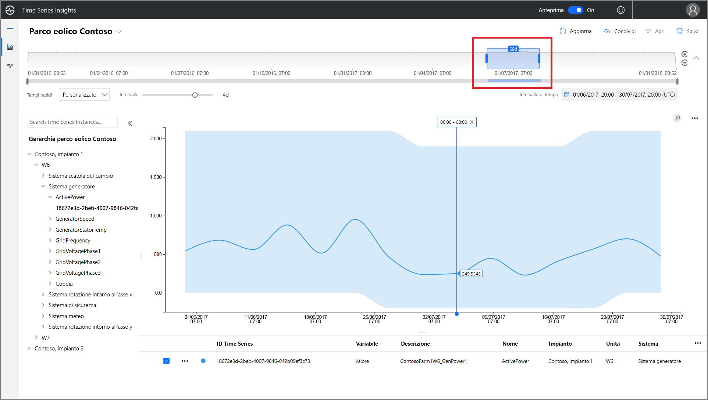
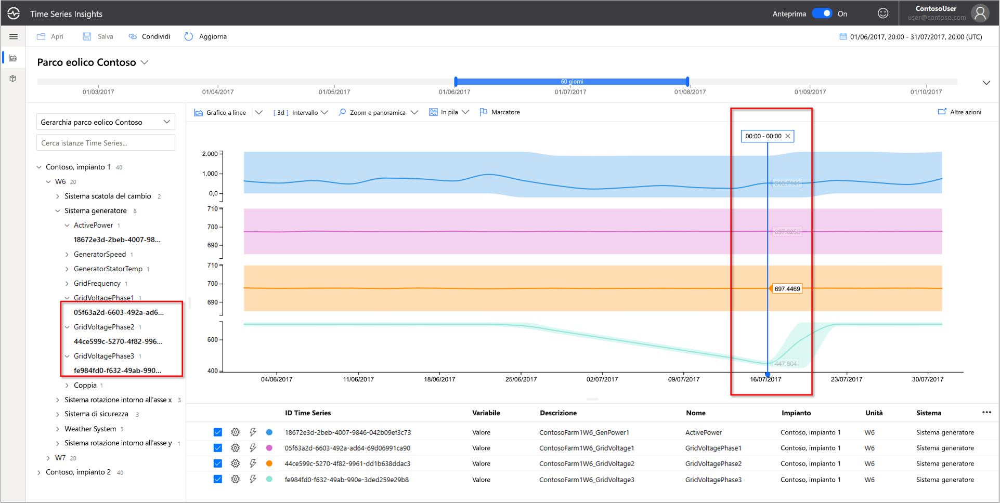
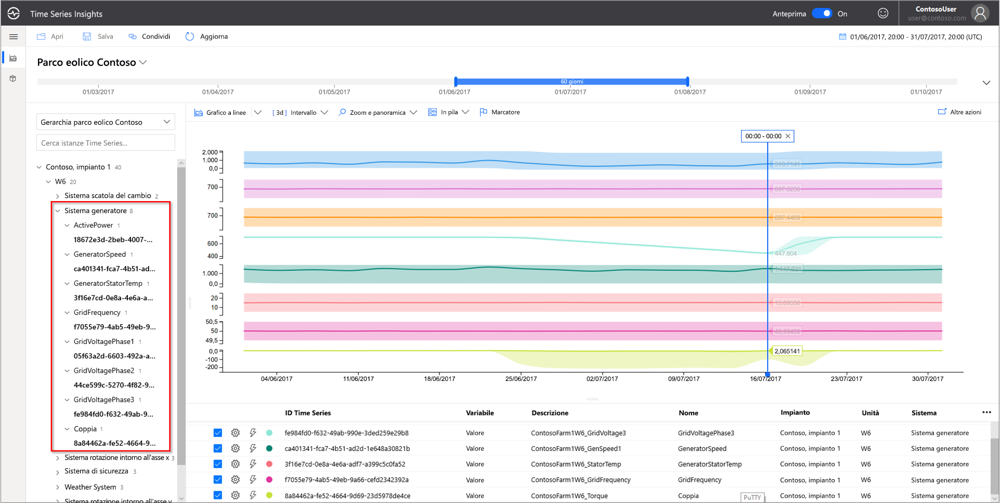

# Guida introduttiva: Esplorare l'ambiente demo Anteprima di Azure Time Series Insights

Questa guida di avvio rapido offre informazioni introduttive sull'ambiente di anteprima di Azure Time Series Insights. La demo gratuita offre una panoramica delle funzionalità principali aggiunte ad Anteprima di Time Series Insights.

L'ambiente demo di Anteprima di Time Series Insights contiene una società fittizia, Contoso, che gestisce due centrali con turbine eoliche, ognuna con 10 turbine. Ogni turbina è dotata di 20 sensori che inviano dati ogni minuto all’hub IoT di Azure. I sensori raccolgono informazioni su condizioni meteo, inclinazione delle pale e posizione di imbardata, ma vengono registrate anche informazioni su prestazioni del generatore, comportamento della trasmissione e monitoraggi di sicurezza.

Questa guida di avvio rapido illustra come usare Time Series Insights per trovare informazioni dettagliate di utilità pratica nei dati di Contoso. Si condurrà anche una breve analisi della causa radice per agevolare la previsione dei guasti critici e la manutenzione.

> [!IMPORTANT]
> Creare un [account di Azure gratuito](https://azure.microsoft.com/free/?ref=microsoft.com&utm_source=microsoft.com&utm_medium=docs&utm_campaign=visualstudio) se non se ne ha già uno.

## Esaminare lo strumento di esplorazione di Time Series Insights in un ambiente demo

Lo strumento di esplorazione di anteprima di Time Series Insights consente di visualizzare i dati cronologici e di eseguire un'analisi delle cause radice. Attività iniziali

1. Passare all'ambiente  [demo di Contoso Wind Farm](https://insights.timeseries.azure.com/preview/samples).  

1. Se viene richiesto, accedere allo strumento di esplorazione di Time Series Insights usando le credenziali dell'account Azure.

## Usare i dati cronologici

1. In **Contoso Plant 1** esaminare la turbina eolica **W7**.  

   1. Cambiare l'intervallo di visualizzazione da **1/1/17 20:00:00.00 a 3/10/17 20:00:00.00 (UTC)** .
   1. Per selezionare un sensore, selezionare **Contoso Plant 1** > **W7** > **Generator System** > **GeneratorSpeed**. Esaminare quindi i valori visualizzati.

      

1. Di recente, Contoso ha riscontrato un incendio nella turbina eolica **W7**. Le opinioni sulla causa dell'incendio sono diverse. In Time Series Insights è possibile vedere che il sensore dell'allarme antincendio si è attivato durante l'incendio.

   1. Cambiare l'intervallo di visualizzazione da **3/9/17 20:00:00.00 a 3/10/17 20:00:00.00 (UTC)** .
   1. Selezionare **Safety System** > **FireAlert**.

      

1. Esaminare gli altri eventi verificatisi al momento dell'incendio per capire cosa è accaduto. La pressione dell'olio e gli avvisi attivi hanno raggiunto valori di picco subito prima dell'incendio.

   1. Selezionare **Pitch System** > **HydraulicOilPressure**.
   1. Selezionare **Pitch System** > **ActiveWarning**.

      

1. I sensori della pressione dell'olio e degli avvisi attivi hanno raggiunto valori di picco subito prima dell'incendio. Espandere la serie temporale visualizzata per verificare la presenza di altri segnali che conducono all'incendio. Entrambi i sensori hanno fatto registrare una fluttuazione costante nel tempo. Le fluttuazioni indicano un modello persistente e preoccupante.

    * Cambiare l'intervallo di visualizzazione da **2/24/17 20:00:00.00 a 3/10/17 20:00:00.00 (UTC)** .

      

1. L'analisi di due anni di dati cronologici rivela che si era già verificato un incendio con le stesse fluttuazioni dei sensori.

    * Cambiare l'intervallo di visualizzazione da **1/1/16 a 12/31/17 (UTC)** (tutti i dati).

      

Tramite i dati di telemetria di sensori e di Time Series Insights, abbiamo individuato una tendenza a lungo termine nascosta nei dati cronologici. Con queste nuove informazioni dettagliate, è possibile:

* Illustrare ciò che è effettivamente accaduto.
* Risolvere il problema.
* Implementare sistemi di notifica degli avvisi migliori.

## Analisi della causa radice

1. Alcuni scenari richiedono un'analisi sofisticata per scoprire gli indizi nei dati. Selezionare la turbina eolica **W6** in data **6/25**

    1. Cambiare l'intervallo di visualizzazione da **6/1/17 20:00:00.00 a 7/1/17 20:00:00.00 (UTC)** .
    1. Selezionare **Contoso Plant 1** > **W6** > **Safety System** > **VoltageActuatorSwitchWarning**.

       

1. L'avviso indica un problema con la tensione del generatore. La potenza complessiva in uscita del generatore si trova entro i normali parametri nell'intervallo corrente. Se si aumenta l'intervallo, si noterà un calo evidente.

    1. Rimuovere il sensore **VoltageActuatorSwitchWarning**.
    1. Selezionare **Generator System** > **ActivePower**.
    1. Cambiare l'intervallo in **3d**.

       

1. Espandendo l'intervallo di tempo, è possibile determinare se il problema si è risolto o se continua.

    * Estendere l'intervallo di tempo fino a 60 giorni.

      

1. È possibile aggiungere altri punti dati del sensore per fornire un contesto più ampio. Visualizzando un numero più elevato di sensori, è possibile comprendere meglio il problema. Inserire un indicatore per visualizzare i valori effettivi. 

    1. Selezionare **Generator System** e quindi selezionare tre sensori: **GridVoltagePhase1**, **GridVoltagePhase2** e **GridVoltagePhase3**.
    1. Inserire un indicatore nell'ultimo punto dati nell'area visibile.

       

    Due dei tre sensori di tensione stanno funzionando in modo analogo ed entro parametri normali. Il sensore **GridVoltagePhase3** sembra essere la causa.

1. Con l'aggiunta di dati altamente contestuali, appare sempre più evidente che il problema è dovuto al calo della fase 3. A questo punto si ha un buon indizio sulle cause dell'avviso. È quindi possibile affidare la soluzione del problema al team di manutenzione.  

    * Cambiare la visualizzazione in modo da sovrapporre tutti i sensori di **Generator System** sulla stessa scala del grafico.

      

## Pulire le risorse

Dopo aver completato la Guida di avvio rapido, eliminare le risorse create:

1. Nel [portale di Azure](https://portal.azure.com) selezionare **Tutte le risorse** nel menu a sinistra e quindi individuare il gruppo di risorse di Azure Time Series Insights.
1. Per eliminare l'intero gruppo di risorse e tutte le risorse in esso contenute, selezionare **Elimina** oppure rimuovere ogni risorsa singolarmente.

## Passaggi successivi

A questo punto si è pronti a creare l'ambiente Anteprima di Time Series Insights. Per iniziare:

> [!div class="nextstepaction"]
> [Pianificare l’ambiente Anteprima di Time Series Insights](time-series-insights-update-plan.md)

Informazioni su come usare la demo e le relative funzionalità:

> [!div class="nextstepaction"]
> [Strumento di esplorazione di Anteprima di Time Series Insights](time-series-insights-update-explorer.md)