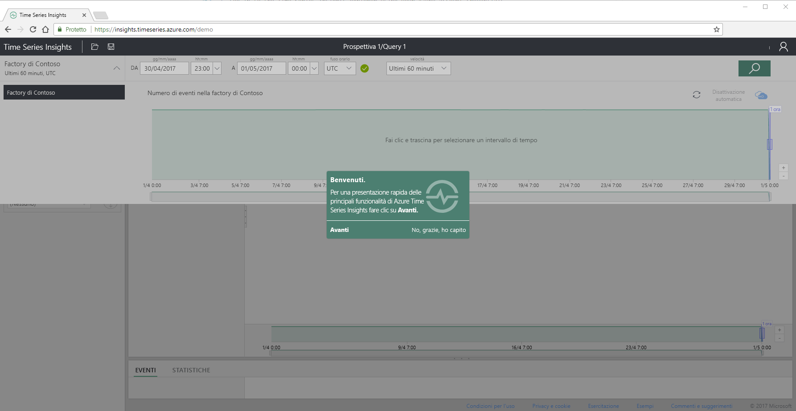
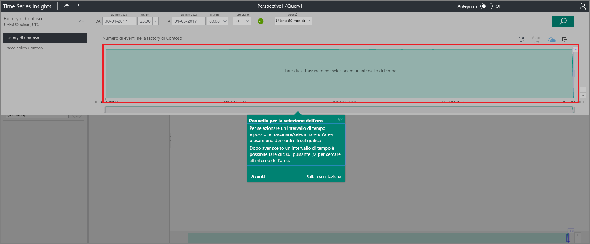
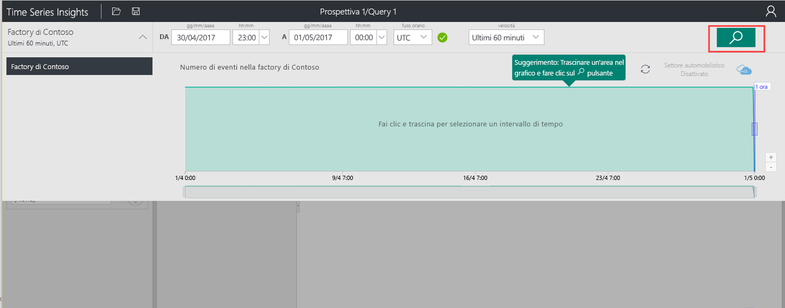
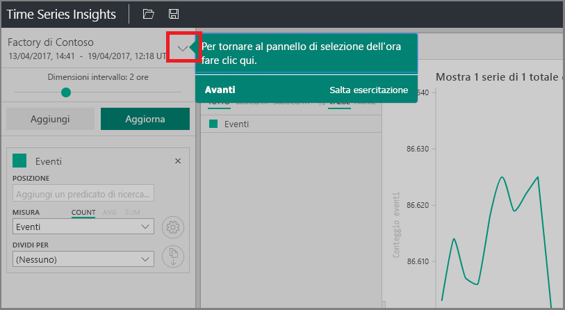
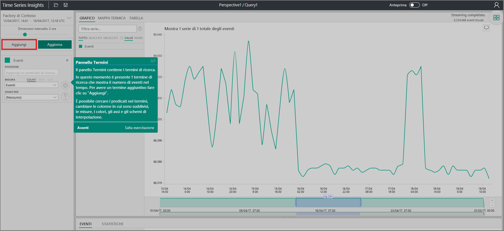
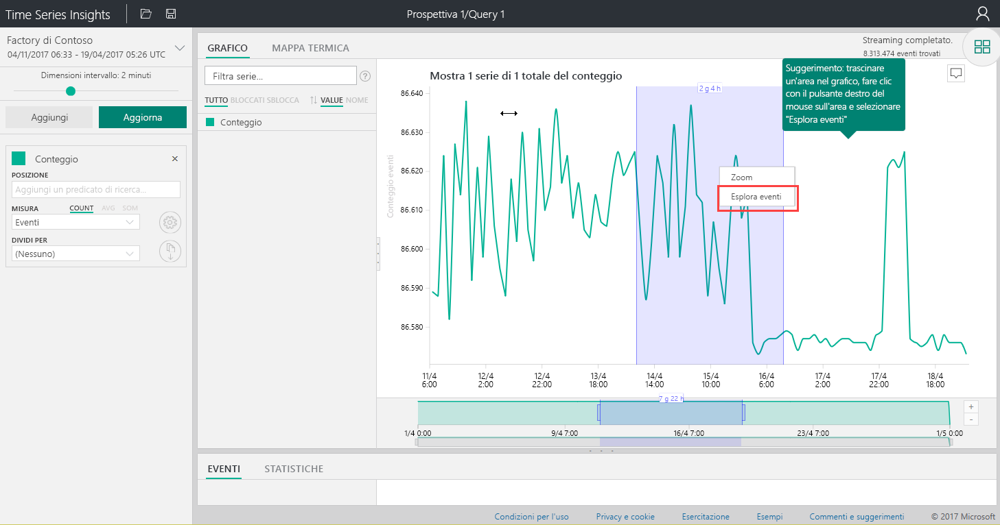
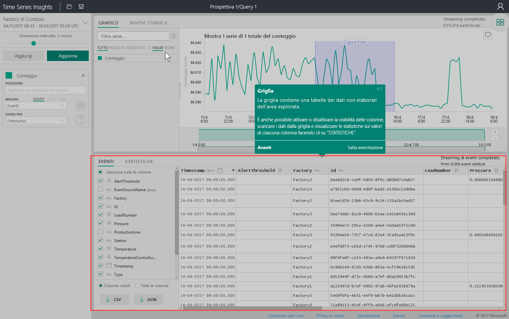
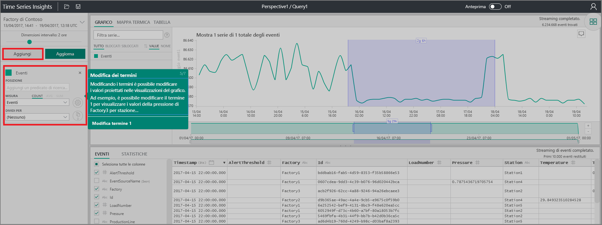
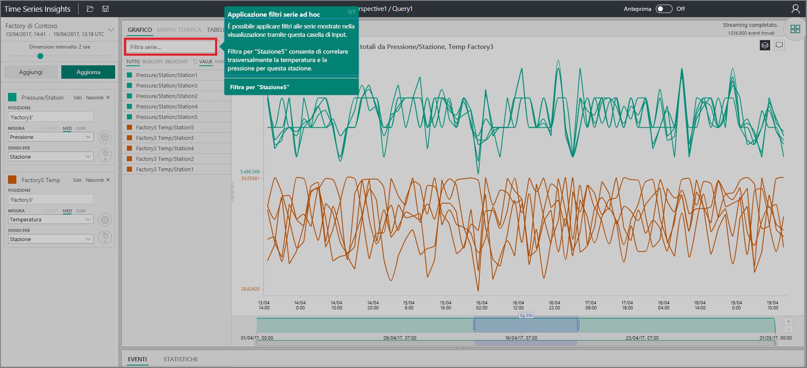

# Guida introduttiva: Esplorare Azure Time Series Insights
In questa guida introduttiva viene illustrato come iniziare a usare lo strumento di esplorazione di Azure Time Series Insights in un ambiente demo gratuito. Si imparerà a usare il Web browser per visualizzare grandi volumi di dati IoT e verranno introdotte le caratteristiche principali dello strumento di esplorazione di Time Series Insights. 

Azure Time Series Insights è un servizio completamente gestito per analisi, archiviazione e visualizzazione, che semplifica l'esplorazione e l'analisi di miliardi di eventi IoT contemporaneamente. Offre una visualizzazione globale dei dati e permette di convalidare rapidamente le soluzioni IoT ed evitare costosi tempi di inattività per i dispositivi cruciali, semplificando l'individuazione di tendenze nascoste e anomalie e l'esecuzione di analisi della causa radice quasi in tempo reale.  Se si intende compilare un'applicazione che richiede l'archiviazione di dati di serie temporali o l'esecuzione di query su tali dati, è possibile svilupparne una usando le API REST di Time Series Insights.

Se non si ha una sottoscrizione di Azure, creare un [account Azure gratuito](https://azure.microsoft.com/free/?ref=microsoft.com&utm_source=microsoft.com&utm_medium=docs&utm_campaign=visualstudio) prima di iniziare.

## Esplorare lo strumento di esplorazione di Time Series Insights in un ambiente demo

1. Nel browser passare a [https://insights.timeseries.azure.com/demo](https://insights.timeseries.azure.com/demo). 

2. Se viene richiesto, accedere allo strumento di esplorazione di Time Series Insights usando le credenziali dell'account di Azure. 
 
3. Viene visualizzata la pagina della demo introduttiva di Time Series Insights. Fare clic su **Next** (Avanti) per iniziare la demo introduttiva.

   

4. Viene visualizzato il **pannello di selezione di data e ora**. Usare questo pannello per selezionare un intervallo di tempo da visualizzare.

   

5. Fare clic e trascinare nell'area e quindi fare clic sul pulsante **Search** (Cerca).
 
    

   In Time Series Insights viene visualizzato un grafico riferito all'intervallo di tempo specificato. È possibile eseguire diverse operazioni all'interno del grafico a linee, ad esempio applicare filtri, bloccare i dati, ordinarli e impilarli. 

   Per tornare al **pannello di selezione di data e ora**, fare clic sulla Freccia GIÙ come illustrato nella figura seguente:

   

6. Fare clic su **Add** (Aggiungi) nel **pannello Terms** (Termini) per aggiungere un nuovo termine di ricerca.

   

7. Nel grafico è possibile selezionare un'area, fare clic con il pulsante destro del mouse all'interno dell'area e scegliere **Explore Events** (Esplora eventi).
 
   

   Verrà visualizzata una griglia di dati non elaborati relativi all'area di riferimento:

   

8. Modificare i termini per modificare i valori nel grafico e aggiungere un altro termine per creare correlazioni incrociate tra tipi diversi di valori:

   

9. Immettere un termine di filtro nella casella **Filter series** (Filtra serie) per applicare filtri ad hoc alle serie. Per l'esempio descritto in questa guida introduttiva immettere **Station5** per creare una correlazione incrociata tra la temperatura e la pressione della stazione specifica.
 
   

Dopo aver completato la guida introduttiva, è possibile usare il set di dati di esempio per creare visualizzazioni diverse. 

### Passaggi successivi
A questo punto si è pronti a creare l'ambiente Time Series Insights vero e proprio:
> [!div class="nextstepaction"]
> [Pianificare l'ambiente Time Series Insights](time-series-insights-environment-planning.md)
