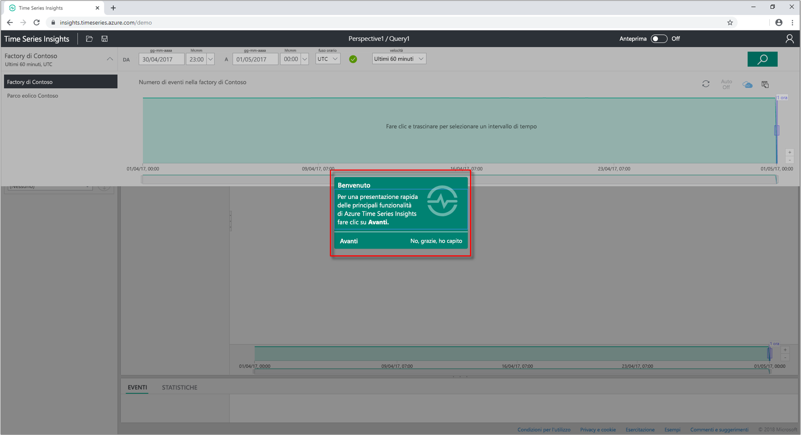
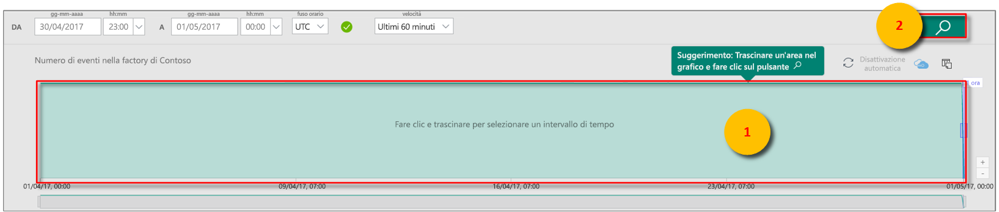
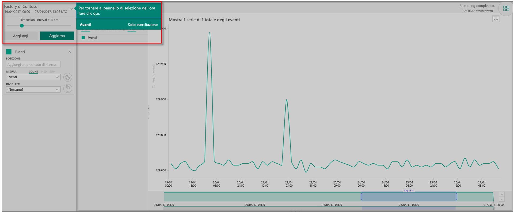
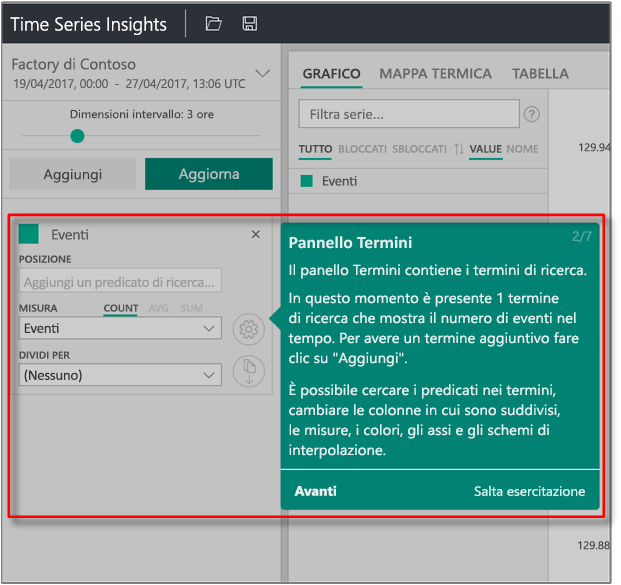
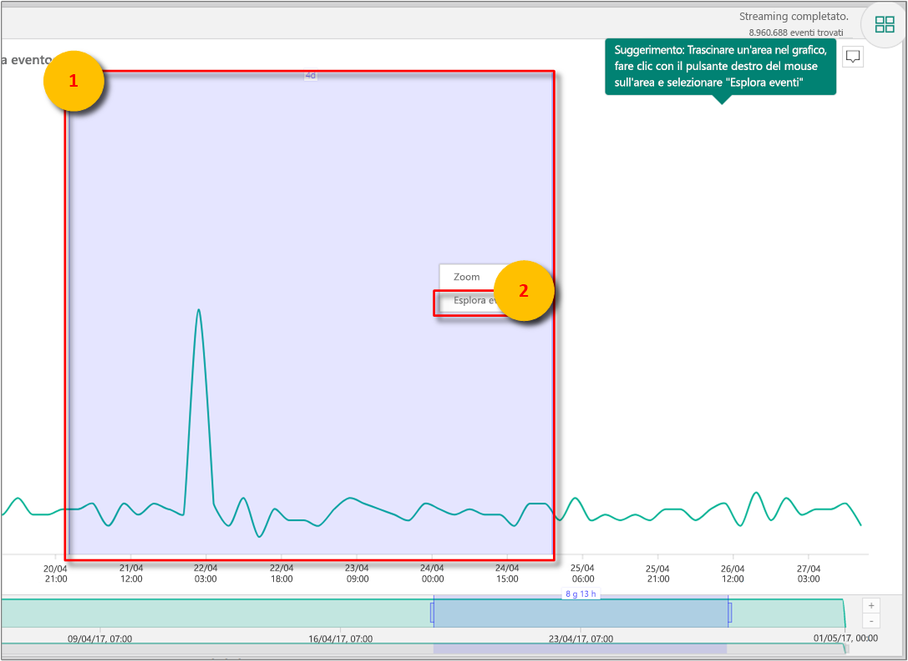
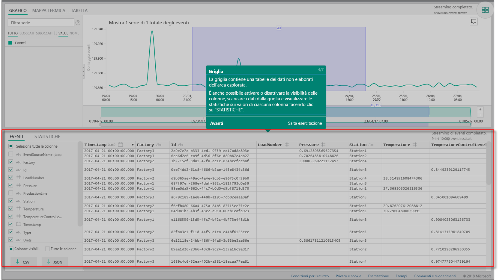
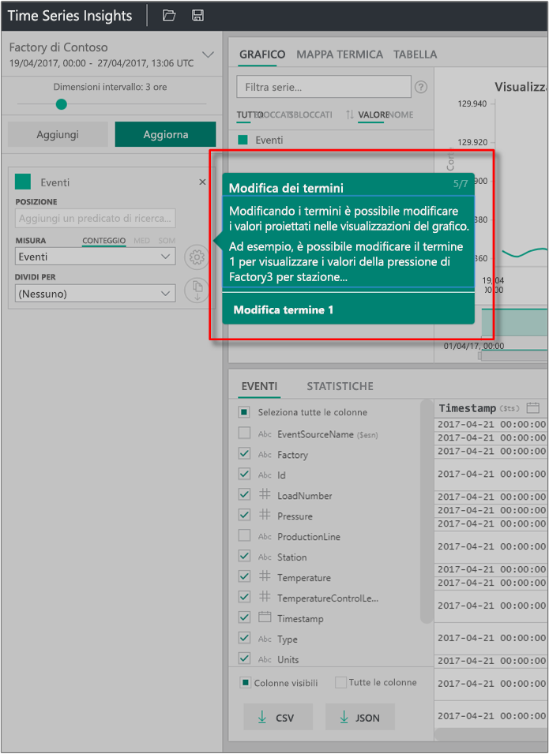
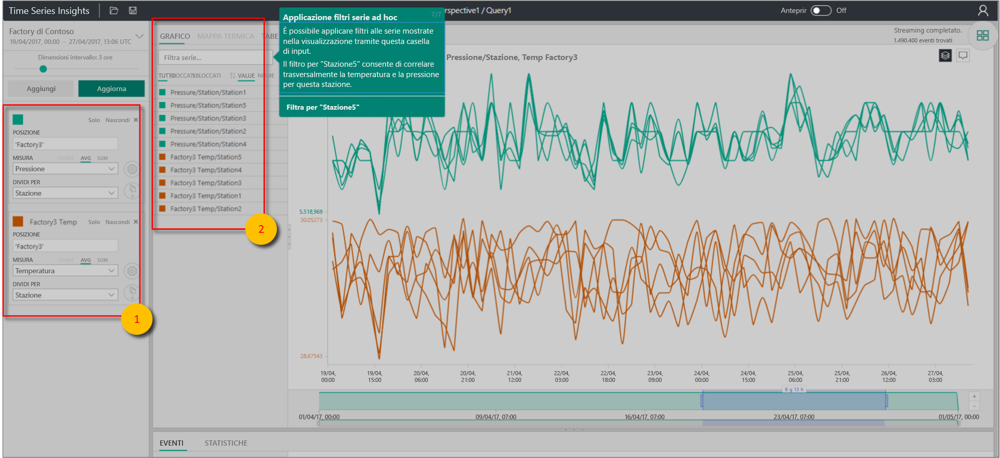

# Guida introduttiva: Esplorare Azure Time Series Insights

In questo argomento di avvio rapido sullo strumento di esplorazione di Azure Time Series Insights viene illustrato come iniziare a usare Time Series Insights in un ambiente demo gratuito. Verrà descritto come usare il Web browser per visualizzare grandi volumi di dati IoT e verranno presentate le principali funzionalità attualmente disponibili a livello generale.

Azure Time Series Insights è un servizio completamente gestito per analisi, archiviazione e visualizzazione, che semplifica l'esplorazione e l'analisi di miliardi di eventi IoT contemporaneamente. Offre una visualizzazione globale dei dati per poter convalidare rapidamente le soluzioni IoT ed evitare così costosi periodi di inattività per i dispositivi di importanza strategica. Azure Time Series Insights consente di individuare tendenze nascoste e anomalie, nonché di eseguire analisi della causa radice.

Per una maggiore flessibilità, è possibile aggiungere Azure Time Series Insights a un'applicazione preesistente mediante le potenti [API REST](./time-series-insights-update-tsq.md) e l'[SDK client](https://github.com/microsoft/tsiclient). È possibile usare le API per archiviare, eseguire query e utilizzare dati di serie temporali in un'applicazione client di propria scelta. È anche possibile usare l'SDK client per aggiungere componenti dell'interfaccia utente all'applicazione esistente.

Questo argomento di avvio rapido sullo strumento di esplorazione di Time Series Insights offre una presentazione guidata delle funzionalità attualmente disponibili a livello generale.

> [!IMPORTANT]
> Se non è già stato creato un account Azure, crearne [uno gratuito](https://azure.microsoft.com/free/?ref=microsoft.com&utm_source=microsoft.com&utm_medium=docs&utm_campaign=visualstudio).

## Preparare l'ambiente demo

1. Nel browser passare alla [demo della disponibilità generale](https://insights.timeseries.azure.com/demo).

1. Se viene richiesto, accedere allo strumento di esplorazione di Time Series Insights usando le credenziali dell'account Azure.

1. Viene visualizzata la pagina della demo introduttiva di Time Series Insights. Selezionare **Next** (Avanti) per iniziare la demo introduttiva.

   

## Esplorare l'ambiente demo

1. Viene visualizzato il **pannello di selezione di data e ora**. Usare questo pannello per selezionare un intervallo di tempo da visualizzare.

   

1. Selezionare un intervallo di tempo e trascinarlo nell'area, quindi selezionare **Search** (Cerca).

   

   In Time Series Insights viene visualizzato un grafico riferito all'intervallo di tempo specificato. È possibile eseguire varie azioni all'interno di grafico a linee, ad esempio filtrare, aggiungere, ordinare e distribuire con spaziatura.

   Per tornare al **pannello di selezione di data e ora**, selezionare la freccia verso il basso come illustrato nella figura seguente:

   

1. Selezionare **Add** (Aggiungi) nel **pannello Terms** (Termini) per aggiungere un nuovo termine di ricerca.

   

1. Nel grafico è possibile selezionare un'area, fare clic con il pulsante destro del mouse all'interno dell'area e scegliere **Explore Events** (Esplora eventi).

   

   Verrà visualizzata una griglia di dati non elaborati relativi all'area di riferimento.

   

## Selezionare e filtrare i dati

1. Modificare i termini per modificare i valori nel grafico. Aggiungere un altro termine per creare correlazioni incrociate tra tipi diversi di valori.

   

1. Lasciare vuota la casella **Filter series** (Filtra serie) per vedere tutti i termini di ricerca oppure immettere un termine di filtro nella casella **Filter series** per applicare un filtro improvvisato alle serie.

   

   Per l'esempio descritto in questa guida introduttiva immettere **Station5** per creare una correlazione incrociata tra la temperatura e la pressione della stazione specifica.

Dopo aver completato la guida introduttiva, è possibile usare il set di dati di esempio per creare visualizzazioni diverse.

## Pulire le risorse

Ora che è stata completata l'esercitazione, pulire le risorse create:

1. Nel [portale di Azure](https://portal.azure.com) selezionare **Tutte le risorse** nel menu a sinistra e individuare il gruppo di risorse di Azure Time Series Insights.
1. Per eliminare l'intero gruppo di risorse e tutte le risorse in esso contenute, selezionare **Elimina** oppure rimuovere ogni risorsa singolarmente.

## Passaggi successivi

A questo punto si è pronti a creare l'ambiente Time Series Insights vero e proprio:
> [!div class="nextstepaction"]
> [Pianificare l'ambiente Time Series Insights](time-series-insights-environment-planning.md)
