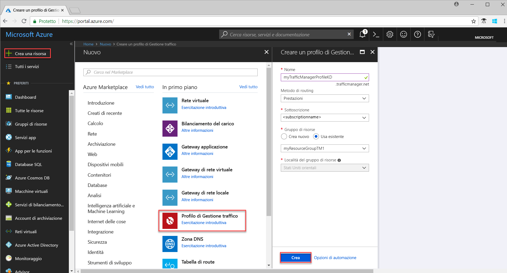
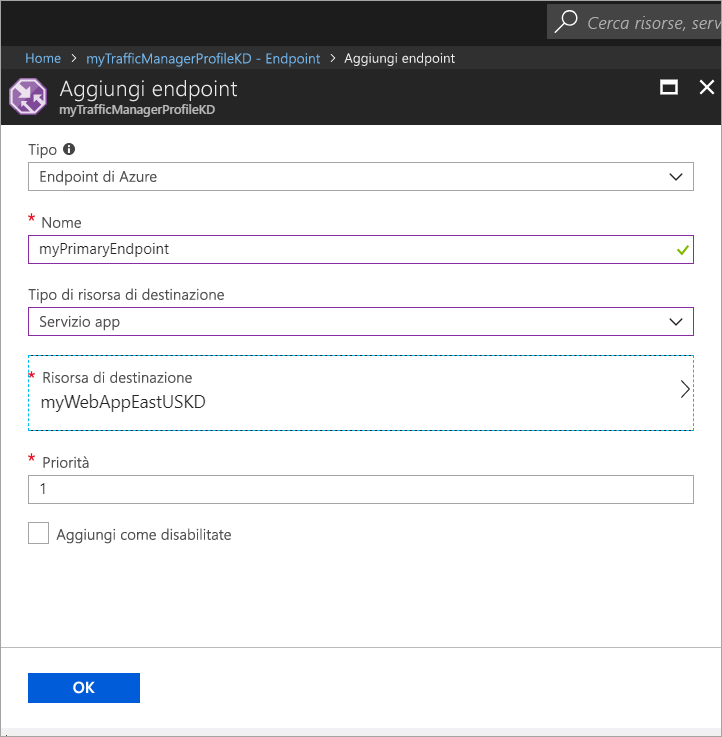

# Guida introduttiva: Creare un profilo di Gestione traffico per un'applicazione Web a disponibilità elevata

Questa guida introduttiva descrive come creare un profilo di Gestione traffico che fornisce disponibilità elevata per un'applicazione Web. 

Lo scenario descritto in questa guida introduttiva include due istanze di un'applicazione Web in esecuzione in aree di Azure diverse. Viene creato un profilo di Gestione traffico basato su [priorità degli endpoint](traffic-manager-routing-methods.md#priority), che consente di indirizzare il traffico utente al sito primario che esegue l'applicazione. Gestione traffico monitora continuamente l'applicazione Web e fornisce il failover automatico nel sito di backup quando il sito primario non è disponibile.

Se non si ha una sottoscrizione di Azure, creare un [account gratuito](https://azure.microsoft.com/free/?WT.mc_id=A261C142F) prima di iniziare.

## Accedere ad Azure 
Accedere al portale di Azure all'indirizzo https://portal.azure.com.

## Prerequisiti
Per questa guida introduttiva è necessario distribuire due istanze di un'applicazione Web in esecuzione in aree di Azure diverse (*Stati Uniti orientali* ed *Europa occidentale*). Le due istanze dell'applicazione Web fungono da endpoint primario e di backup per Gestione traffico.

1. In alto a sinistra nello schermo selezionare **Crea una risorsa** > **Web** > **App Web** > **Crea**.
2. In **App Web** immettere o selezionare le informazioni seguenti e immettere le impostazioni predefinite nei casi in cui non è specificato alcun valore:

     | Impostazione         | Valore     |
     | ---              | ---  |
     | NOME           | Immettere un nome univoco per l'app Web  |
     | Gruppo di risorse          | Selezionare **Nuovo** e quindi digitare *myResourceGroupTM1* |
     | Piano di servizio app/Località         | Selezionare **Nuovo**.  Nel piano di servizio app immettere *myAppServicePlanEastUS* e quindi selezionare **OK**. 
     |      Località  |   Stati Uniti orientali        |
    |||

3. Selezionare **Create**.
4. Quando l'app Web viene distribuita correttamente, viene creato un sito Web predefinito.
5. Ripetere i passaggi da 1 a 3 per creare un secondo sito Web in un'area di Azure diversa con le impostazioni seguenti:

     | Impostazione         | Valore     |
     | ---              | ---  |
     | NOME           | Immettere un nome univoco per l'app Web  |
     | Gruppo di risorse          | Selezionare **Nuovo** e quindi digitare *myResourceGroupTM2* |
     | Piano di servizio app/Località         | Selezionare **Nuovo**.  Nel piano di servizio app immettere *myAppServicePlanWestEurope* e quindi selezionare **OK**. 
     |      Località  |   Europa occidentale      |
    |||

## Creare un profilo di Gestione traffico
Creare un profilo di Gestione traffico che indirizza il traffico utente in base alla priorità degli endpoint.

1. In alto a sinistra nello schermo selezionare **Crea una risorsa** > **Rete** > **Profilo di Gestione traffico** > **Crea**.
2. In **Crea profilo di Gestione traffico** immettere o selezionare le informazioni seguenti, accettare le impostazioni predefinite per le impostazioni rimanenti e quindi selezionare **Crea**:
    
    | Impostazione                 | Valore                                              |
    | ---                     | ---                                                |
    | NOME                   | Questo nome deve essere univoco all'interno della zona trafficmanager.net e determina il nome DNS, **trafficmanager.net**, che viene usato per accedere al profilo di Gestione traffico.|
    | Metodo di routing          | Selezionare il metodo di routing **Priorità**.|
    | Sottoscrizione            | Selezionare la propria sottoscrizione.|
    | Gruppo di risorse          | Selezionare **Esistente** e quindi *myResourceGroupTM1*.|
    |Località |Questa impostazione indica la località del gruppo di risorse e non ha alcun impatto sul profilo di Gestione traffico che sarà distribuito a livello globale.|
    |||
    
    
   

## Aggiungere endpoint di Gestione traffico

Aggiungere il sito Web nell'area *Stati Uniti orientali* come endpoint primario per instradare tutto il traffico utente. Aggiungere il sito Web nell'area *Europa occidentale* come endpoint di backup. Quando l'endpoint primario non è disponibile, il traffico viene instradato automaticamente all'endpoint secondario.

1. Nella barra di ricerca del portale cercare il nome del profilo di Gestione traffico creato nella sezione precedente e selezionarlo nei risultati visualizzati.
2. In **Profilo di Gestione traffico**, nella sezione **Impostazioni**, fare clic su **Endpoint** e quindi su **Aggiungi**.
3. Immettere o selezionare le informazioni seguenti, accettare le impostazioni predefinite rimanenti e quindi scegliere **OK**:

    | Impostazione                 | Valore                                              |
    | ---                     | ---                                                |
    | type                    | Endpoint di Azure                                   |
    | NOME           | myPrimaryEndpoint                                        |
    | Tipo di risorsa di destinazione           | Servizio app                          |
    | Risorsa di destinazione          | **Scegliere un servizio app** per visualizzare l'elenco delle app Web nella stessa sottoscrizione. In **Risorsa** selezionare il servizio App che si vuole aggiungere come primo endpoint. |
    | Priorità               | Selezionare **1**. In questo modo tutto il traffico viene instradato a questo endpoint se è integro.    |
    
4. Ripetere i passaggi 2 e 3 per l'endpoint di App Web successivo. Assicurarsi di aggiungerlo con il valore di **Priorità** impostato su **2**.
5.  Una volta completata l'aggiunta di entrambi gli endpoint, essi vengono visualizzati in **Profilo di Gestione traffico** insieme al relativo stato di monitoraggio **Online**.

    

## Testare il profilo di Gestione traffico
In questa sezione si determina, prima di tutto, il nome di dominio del profilo di Gestione traffico e quindi si visualizza la modalità di failover di Gestione traffico nell'endpoint secondario quando l'endpoint primario non è disponibile.
### Determinare il nome DNS
1.  Nella barra di ricerca del portale cercare il nome del **Profilo di Gestione traffico** creato nella sezione precedente. Fare clic sul profilo di Gestione traffico nei risultati visualizzati.
2. Fare clic su **Panoramica**.
3. Il **Profilo di Gestione traffico** visualizza il nome DNS del profilo di Gestione traffico appena creato.
  
   

### Visualizzare Gestione traffico in azione

1. In un Web browser digitare il nome DNS del profilo di Gestione traffico per visualizzare il sito Web predefinito dell'app Web. Nello scenario di questa guida introduttiva tutte le richieste vengono instradate all'endpoint primario, impostato con **Priorità 1**.

2. Per visualizzare il failover di Gestione traffico in azione, disabilitare il sito primario come indicato di seguito:
    1. Nella pagina del profilo di Gestione traffico selezionare **Impostazioni**>**Endpoint**>*MyPrimaryEndpoint*.
    2. In *MyPrimaryEndpoint* selezionare **Disabilitato**. 
    3. Lo stato dell'endpoint primario *MyPrimaryEndpoint* viene ora indicato come **Disabilitato**.
3. Copiare il nome DNS del profilo di Gestione traffico del passaggio precedente per visualizzare correttamente il sito Web in un Web browser. Quando l'endpoint primario è disabilitato, il traffico utente viene instradato all'endpoint secondario.

## Pulire le risorse
Quando non sono più necessari, eliminare i gruppi di risorse, le applicazioni Web e tutte le risorse correlate. A tale scopo, selezionare i gruppi di risorse (*myResourceGroupTM1* e *myResourceGroupTM2*) e fare clic su **Elimina**.

## Passaggi successivi
In questa guida introduttiva è stato creato un profilo di Gestione traffico che consente di instradare il traffico utente per l'applicazione Web a disponibilità elevata. Per altre informazioni su come instradare il traffico, passare alle esercitazioni di Gestione traffico.

> [!div class="nextstepaction"]
> [Esercitazioni di Gestione traffico](tutorial-traffic-manager-improve-website-response.md)

