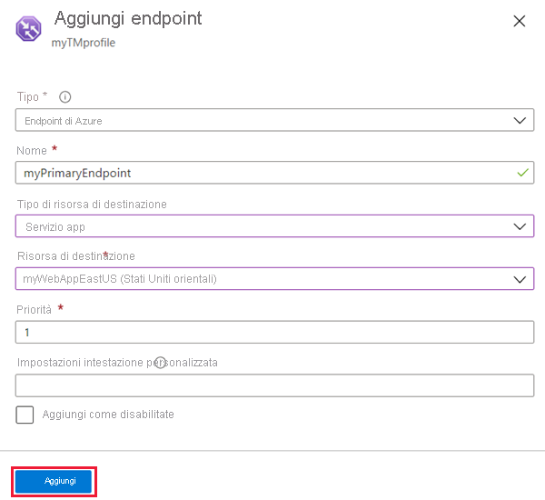
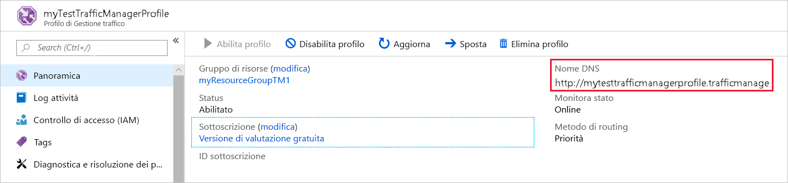
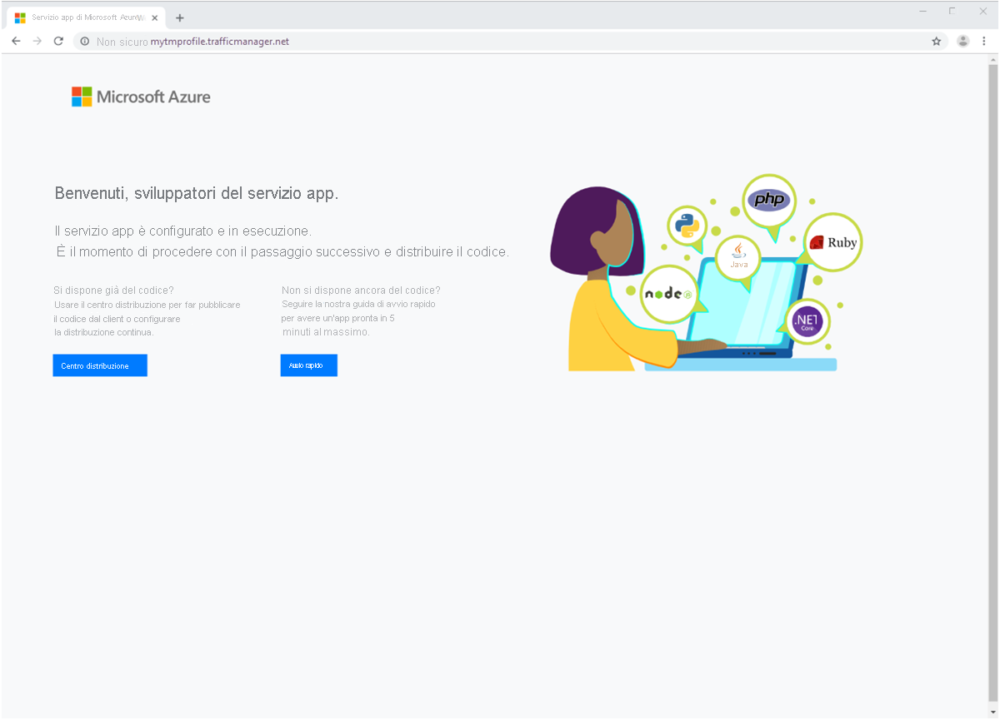

# Guida introduttiva: Creare un profilo di Gestione traffico usando il portale di Azure

Questo argomento di avvio rapido descrive come creare un profilo di Gestione traffico che fornisce disponibilità elevata per l'applicazione Web.

In questo argomento di avvio rapido verranno illustrate due istanze di un'applicazione Web. Ognuna di esse è in esecuzione in un'area di Azure diversa. Si creerà un profilo di Gestione traffico basato sulla [priorità degli endpoint](traffic-manager-routing-methods.md#priority). Il profilo indirizza il traffico utente al sito primario che esegue l'applicazione Web. Gestione traffico monitora continuamente l'applicazione Web. Se il sito primario non è disponibile, fornisce il failover automatico al sito di backup.

Se non si ha una sottoscrizione di Azure, creare ora un [account gratuito](https://azure.microsoft.com/free/?WT.mc_id=A261C142F).

## Accedere ad Azure

Accedere al [portale di Azure](https://portal.azure.com).

## Prerequisiti

Per questo avvio rapido, saranno necessarie due istanze di un'applicazione Web distribuita in due aree di Azure diverse (*Stati Uniti orientali* ed *Europa occidentale*). Ognuna verrà usata come endpoint primario e di failover per Gestione traffico.

1. In alto a sinistra nella schermata selezionare **Crea una risorsa** > **Web** > **App Web**.
2. In **App Web** immettere o selezionare queste impostazioni:

    | Impostazione | Valore |
    | ------- | ----- |
    | Nome app | Immettere un nome univoco per l'app Web.  |
    | Sottoscrizione | Selezionare la sottoscrizione a cui si vuole applicare l'app Web. |
    | Gruppo di risorse | Selezionare **Crea nuovo** e immettere *myResourceGroupTM1*. |
    | OS | Selezionare **Windows** come sistema operativo. |
    | Pubblica | Selezionare **Codice** come formato di pubblicazione. |

3. Selezionare **Piano di servizio app/Località**.
4. In **Piano di servizio app** selezionare **Crea nuovo**.
5. In **Nuovo piano di servizio app** immettere o selezionare queste impostazioni:

    | Impostazione | Valore |
    | ------- | ----- |
    | Piano di servizio app | Immettere *myAppServicePlanEastUS*. |
    | Località | Stati Uniti orientali |
    | Piano tariffario | S1 Standard |

6. Selezionare **OK**.

7. In **App Web** selezionare **Crea**. Quando l'app Web viene distribuita correttamente, crea un sito Web predefinito.

8. Per creare un secondo sito Web in un'area di Azure diversa, ripetere i passaggi da 1 a 7 con queste impostazioni:

    | Impostazione | Valore |
    | --------| ----- |
    | NOME | Immettere un nome univoco per l'app Web. |
    | Sottoscrizione | Selezionare la sottoscrizione a cui si vuole applicare l'app Web. |
    | Gruppo di risorse | Selezionare **Crea nuovo** e quindi immettere *myResourceGroupTM2*. |
    | OS | Selezionare **Windows** come sistema operativo. |
    | Pubblica | Selezionare **Codice** come formato di pubblicazione. |
    | Piano di servizio app/Località | Immettere *myAppServicePlanWestEurope*. |
    | Località | Europa occidentale |
    | Piano tariffario | S1 Standard |

## Creare un profilo di Gestione traffico

Creare un profilo di Gestione traffico che indirizza il traffico utente in base alla priorità degli endpoint.

1. In alto a sinistra nella schermata selezionare **Crea una risorsa** > **Rete** > **Profilo di Gestione traffico**.
2. In **Crea profilo di Gestione traffico** immettere o selezionare queste impostazioni:

    | Impostazione | Valore |
    | --------| ----- |
    | NOME | Immettere un nome univoco per il profilo di Gestione traffico.|
    | Metodo di routing | Selezionare **Priorità**.|
    | Sottoscrizione | Selezionare la sottoscrizione a cui si vuole applicare il profilo di Gestione traffico. |
    | Gruppo di risorse | Selezionare *myResourceGroupTM1*.|
    | Località |Questa impostazione si riferisce alla località del gruppo di risorse. Non ha alcun effetto sul profilo di Gestione traffico che verrà distribuito a livello globale.|

3. Selezionare **Create**.

## Aggiungere endpoint di Gestione traffico

Aggiungere il sito Web nell'area *Stati Uniti orientali* come endpoint primario per instradare tutto il traffico utente. Aggiungere il sito Web nell'area *Europa occidentale* come endpoint di failover. Quando l'endpoint primario non è disponibile, il traffico viene instradato automaticamente all'endpoint di failover.

1. Nella barra di ricerca del portale immettere il nome del profilo di Gestione traffico creato nella sezione precedente.
2. Selezionare il profilo dai risultati della ricerca.
3. In **Profilo di Gestione traffico** selezionare **Endpoint** e quindi **Aggiungi** nella sezione **Impostazioni**.
4. Immettere o selezionare queste impostazioni:

    | Impostazione | Valore |
    | ------- | ------|
    | Type | Selezionare **Endpoint Azure**. |
    | NOME | Immettere *myPrimaryEndpoint*. |
    | Tipo di risorsa di destinazione | Selezionare **Servizio app**. |
    | Risorsa di destinazione | Selezionare **Scegliere un servizio app** > **Stati Uniti orientali**. |
    | Priorità | Selezionare **1**. Tutto il traffico passa a questo endpoint quando è integro. |

    

5. Selezionare **OK**.
6. Per creare un endpoint di failover per la seconda area di Azure, ripetere i passaggi 3 e 4 con queste impostazioni:

    | Impostazione | Valore |
    | ------- | ------|
    | Type | Selezionare **Endpoint Azure**. |
    | NOME | Immettere *myFailoverEndpoint*. |
    | Tipo di risorsa di destinazione | Selezionare **Servizio app**. |
    | Risorsa di destinazione | Selezionare **Scegliere un servizio app** > **Europa occidentale**. |
    | Priorità | Selezionare **2**. Tutto il traffico passa a questo endpoint di failover, se l'endpoint primario non è integro. |

7. Selezionare **OK**.

I due endpoint, dopo essere stati aggiunti, vengono visualizzati in **Profilo di Gestione traffico**. Si noti che ora lo stato del monitoraggio è **Online**.

## Testare il profilo di Gestione traffico

In questa sezione, si controllerà il nome di dominio del profilo di Gestione traffico. Si configurerà anche l'endpoint primario come non disponibile. Si osserverà infine che l'app Web è ancora disponibile. Gestione traffico infatti invia il traffico all'endpoint di failover.

### Controllare il nome DNS

1. Nella barra di ricerca del portale cercare il nome del **Profilo di Gestione traffico** creato nella sezione precedente.
2. Selezionare il profilo di Gestione traffico. Viene visualizzata la **panoramica**.
3. Il **Profilo di Gestione traffico** visualizza il nome DNS del profilo di Gestione traffico appena creato.
  
   

### Visualizzare Gestione traffico in azione

1. In un Web browser immettere il nome DNS del profilo di Gestione traffico per visualizzare il sito Web predefinito dell'app Web.

    > [!NOTE]
    > Nello scenario di questo avvio rapido tutte le richieste vengono instradate all'endpoint primario, che è impostato su **Priorità 1**.

    

2. Per visualizzare il failover di Gestione traffico in azione, disabilitare il sito primario:
    1. Nella pagina Profilo di Gestione traffico, nella sezione **Panoramica** selezionare **myPrimaryEndpoint**.
    2. In *myPrimaryEndpoint* selezionare **Disabilitato** > **Salva**.
    3. Chiudere **myPrimaryEndpoint**. Si noti che lo stato è ora **Disabilitato**.
3. Copiare il nome DNS del profilo di Gestione traffico del passaggio precedente per visualizzare il sito Web in una nuova sessione del Web browser.
4. Verificare che l'app Web sia ancora disponibile.

L'endpoint primario non è disponibile, quindi si viene indirizzati all'endpoint di failover.

## Pulire le risorse

Al termine, eliminare i gruppi di risorse, le applicazioni Web e tutte le risorse correlate. A questo scopo, selezionare ogni singolo elemento dal dashboard e selezionare **Elimina** nella parte superiore di ogni pagina.

## Passaggi successivi

In questo argomento di avvio rapido è stato creato un profilo di Gestione traffico che consente di indirizzare il traffico utente per le applicazioni Web a disponibilità elevata. Per altre informazioni su come instradare il traffico, passare alle esercitazioni di Gestione traffico.

> [!div class="nextstepaction"]
> [Esercitazioni di Gestione traffico](tutorial-traffic-manager-improve-website-response.md)
