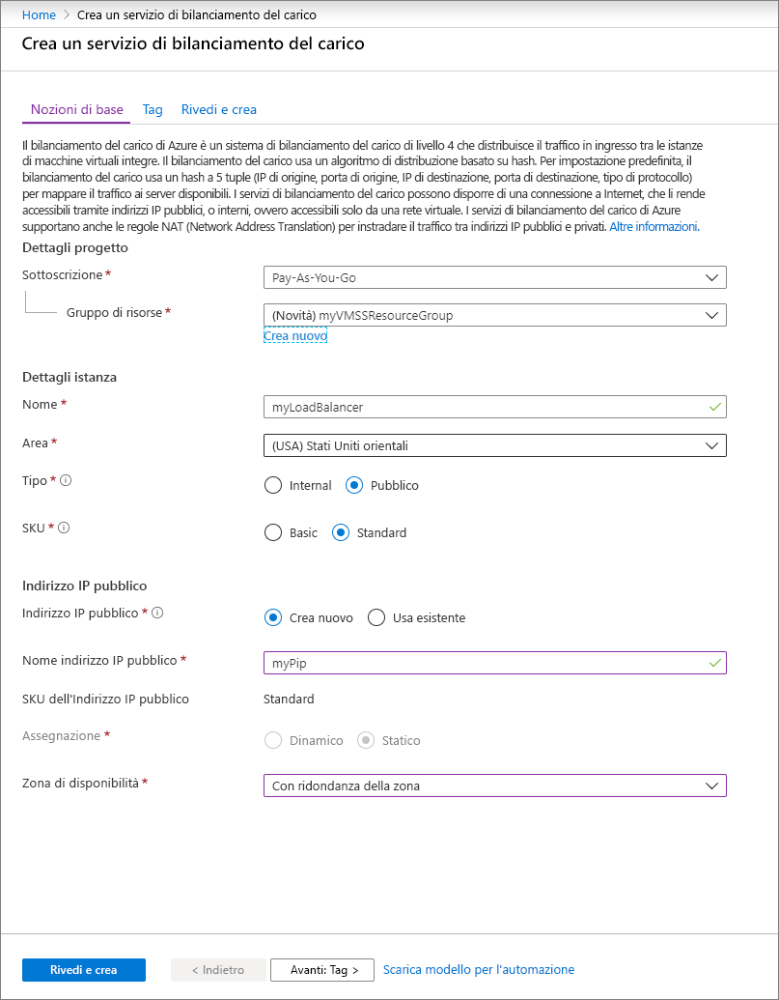
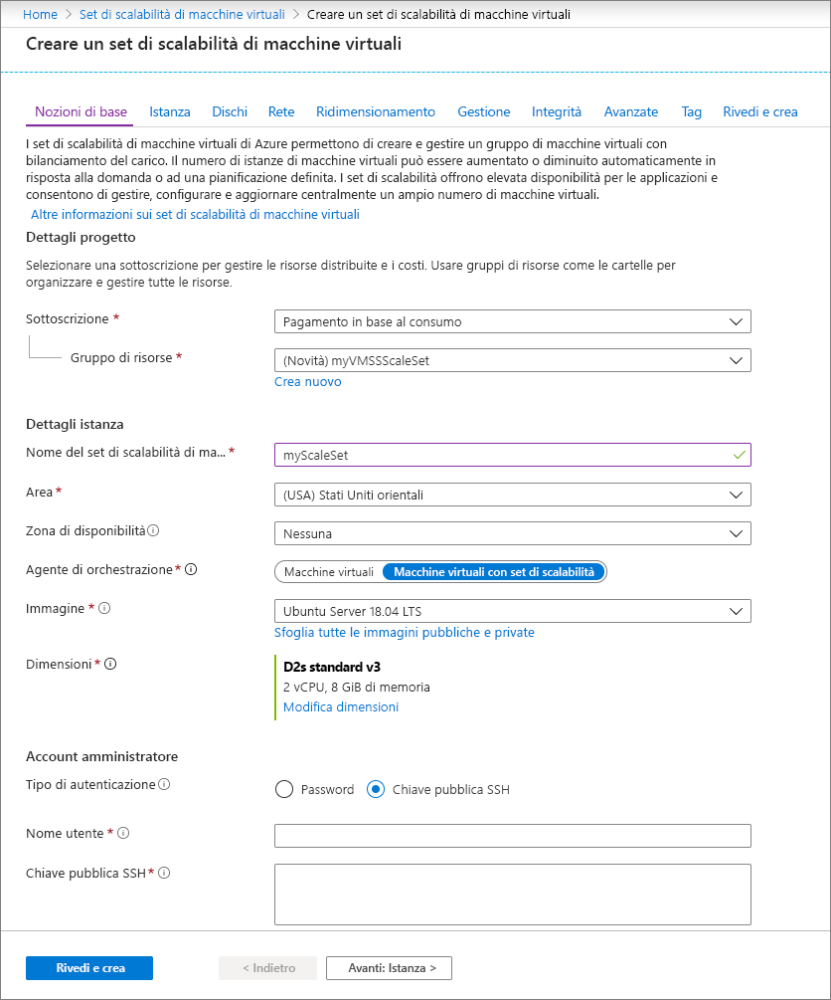

# Guida introduttiva: Creare un set di scalabilità di macchine virtuali nel portale di Azure

Un set di scalabilità di macchine virtuali consente di distribuire e gestire un set di macchine virtuali identiche con scalabilità automatica. È possibile ridimensionare manualmente il numero di VM nel set di scalabilità o definire regole di scalabilità automatica in base all'uso delle risorse, ad esempio la CPU, alla richiesta di memoria o al traffico di rete. Un servizio Azure Load Balancer distribuisce quindi il traffico alle istanze di macchina virtuale nel set di scalabilità. In questa guida introduttiva si crea un set di scalabilità di macchine virtuali nel portale di Azure.

Se non si ha una sottoscrizione di Azure, creare un [account gratuito](https://azure.microsoft.com/free/?WT.mc_id=A261C142F) prima di iniziare.

## Accedere ad Azure
Accedere al portale di Azure all'indirizzo https://portal.azure.com.

## Creare un servizio di bilanciamento del carico

Il servizio di [bilanciamento del carico](../load-balancer/load-balancer-overview.md) di Azure consente di distribuire il traffico in arrivo tra istanze integre delle macchine virtuali. 

Creare prima di tutto un servizio Load Balancer Basic pubblico usando il portale. Il nome e l'indirizzo IP pubblico specificati vengono configurati automaticamente come front-end del servizio di bilanciamento del carico.

1. Nella casella di ricerca digitare **bilanciamento del carico**. Nei risultati della ricerca di **Marketplace** selezionare **Load Balancer**.
1. Nella scheda **Informazioni di base** della pagina **Crea servizio di bilanciamento del carico** immettere o selezionare le informazioni seguenti:

    | Impostazione                 | Valore   |
    | ---| ---|
    | Subscription  | Selezionare la propria sottoscrizione.    |    
    | Resource group | Selezionare **Crea nuovo** e digitare *myVMSSResourceGroup* nella casella di testo.|
    | NOME           | *myLoadBalancer*         |
    | Region         | Selezionare **Stati Uniti orientali**.       |
    | Type          | Selezionare **Pubblica**.       |
    | SKU           | Selezionare **Standard**.       |
    | Indirizzo IP pubblico | Selezionare **Crea nuovo**. |
    | Nome dell'indirizzo IP pubblico  | *MyPip*   |
    | Assegnazione| statico |

1. Al termine, selezionare **Rivedi e crea**. 
1. Dopo la convalida selezionare **Crea**. 

## Creare un set di scalabilità di macchine virtuali
È possibile distribuire un set di scalabilità con un'immagine di Windows Server o di Linux, ad esempio RHEL, CentOS, Ubuntu o SLES.

1. Nella casella di ricerca digitare **Set di scalabilità**. Nei risultati di **Marketplace** selezionare **Set di scalabilità di macchine virtuali**. Verrà aperta la pagina **Crea un set di scalabilità di macchine virtuali**. 
1. Nella scheda **Nozioni di base**, sotto **Dettagli progetto**, verificare che sia selezionata la sottoscrizione corretta e quindi scegliere **Crea nuovo** gruppo di risorse. Digitare *myVMSSResourceGroup* per il nome e quindi selezionare **OK**. 
1. Digitare *myScaleSet* come nome del set di scalabilità.
1. In **Area** selezionare un'area vicina a quella in cui si risiede.
1. Lasciare invariato il valore predefinito **ScaleSet VMs** per **Orchestrator**.
1. Selezionare un'immagine del marketplace per **Immagine**. In questo esempio è stata scelta l'immagine *Ubuntu Server 18.04 LTS*.
1. Immettere il nome utente desiderato e selezionare il tipo di autenticazione preferito.
   - Il valore del campo **Password** deve avere una lunghezza di almeno 12 caratteri e soddisfare tre dei quattro requisiti di complessità seguenti: una lettera minuscola, una lettera maiuscola, un numero e un carattere speciale. Per altre informazioni, fare riferimento ai [requisiti relativi a nome utente e password](../virtual-machines/windows/faq.md#what-are-the-username-requirements-when-creating-a-vm).
   - Se si seleziona un'immagine del disco del sistema operativo Linux, è invece possibile scegliere **Chiave pubblica SSH**. Specificare solo la chiave pubblica, ad esempio *~/.ssh/id_rsa.pub*. Per [creare e usare chiavi SSH](../virtual-machines/linux/mac-create-ssh-keys.md), è possibile usare Azure Cloud Shell nel portale.
   
    

1. Selezionare **Avanti** per passare alle altre pagine. 
1. Lasciare invariate le impostazioni predefinite per le pagine **Istanza** e **Dischi**.
1. Nella pagina **Rete** selezionare **Sì** in **Bilanciamento del carico** per gestire le istanze del set di scalabilità tramite un servizio di bilanciamento del carico. 
1. In **Opzioni di bilanciamento del carico** selezionare **Azure Load Balancer**.
1. In **Selezionare un servizio di bilanciamento del carico** selezionare *myLoadBalancer* creato in precedenza.
1. In **Selezionare un pool back-end** selezionare **Crea nuovo**, digitare *MyBackendPool* e quindi selezionare **Crea**.
1. Al termine, selezionare **Rivedi e crea**. 
1. Dopo la convalida selezionare **Crea** per distribuire il set di scalabilità.

## Pulire le risorse
Quando il gruppo di risorse, il set di scalabilità e tutte le risorse correlate non sono più necessari, è possibile eliminarli. A questo scopo, selezionare il gruppo di risorse per il set di scalabilità e quindi fare clic su **Elimina**.

## Passaggi successivi
In questa guida introduttiva si è creato un set di scalabilità di base nel portale di Azure. Per altre informazioni, passare all'esercitazione su come creare e gestire i set di scalabilità di macchine virtuali di Azure.

> [!div class="nextstepaction"]
> [Creare e gestire i set di scalabilità di macchine virtuali di Azure](tutorial-create-and-manage-powershell.md)
