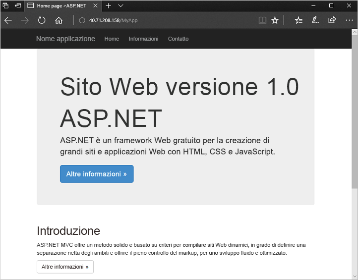

# <a name="create-a-windows-virtual-machine-scale-set-with-an-azure-template"></a>Creare un set di scalabilità di macchine virtuali Windows con un modello di Azure
Un set di scalabilità di macchine virtuali consente di distribuire e gestire un set di macchine virtuali identiche con scalabilità automatica. È possibile ridimensionare manualmente il numero di VM nel set di scalabilità o definire regole di scalabilità automatica in base all'utilizzo delle risorse, ad esempio la CPU, alla richiesta di memoria o al traffico di rete. In questo articolo introduttivo viene creato un set di scalabilità di macchine virtuali usando un modello di Azure Resource Manager. È anche possibile creare un set di scalabilità con l'[interfaccia della riga di comando di Azure 2.0](virtual-machine-scale-sets-create-cli.md), [Azure PowerShell](virtual-machine-scale-sets-create-powershell.md) oppure il [portale di Azure](virtual-machine-scale-sets-create-portal.md).

Se non si ha una sottoscrizione di Azure, creare un [account gratuito](https://azure.microsoft.com/free/?WT.mc_id=A261C142F) prima di iniziare.

[!INCLUDE [cloud-shell-powershell.md](../../includes/cloud-shell-powershell.md)]

Se si sceglie di installare e usare PowerShell in locale, per questa esercitazione è necessario il modulo Azure PowerShell versione 4.4.1 o successiva. Eseguire ` Get-Module -ListAvailable AzureRM` per trovare la versione. Se è necessario eseguire l'aggiornamento, vedere [Installare e configurare Azure PowerShell](/powershell/azure/install-azurerm-ps). Se si esegue PowerShell in locale, è anche necessario eseguire `Login-AzureRmAccount` per creare una connessione con Azure.


## <a name="define-a-scale-set-in-a-template"></a>Definire un set di scalabilità in un modello
I modelli di Azure Resource Manager consentono di distribuire gruppi di risorse correlate. I modelli sono scritti in JavaScript Object Notation (JSON) e definiscono l'intero ambiente dell'infrastruttura di Azure per l'applicazione. In un singolo modello è possibile creare il set di scalabilità di macchine virtuali, installare le applicazioni e configurare le regole di scalabilità automatica. Con l'uso di variabili e parametri, questo modello può essere riutilizzato per creare altri set di scalabilità o aggiornare i set esistenti. È possibile distribuire i modelli tramite il portale di Azure, l'interfaccia della riga di comando di Azure 2.0 o Azure PowerShell oppure dalle pipeline di integrazione continua/distribuzione continua (CI/CD).

Per altre informazioni sui modelli, vedere [Panoramica di Azure Resource Manager](https://docs.microsoft.com/azure/azure-resource-manager/resource-group-overview#template-deployment)

Un modello definisce la configurazione di ciascun tipo di risorsa. Un tipo di risorsa del set di scalabilità di macchine virtuali è simile a una singola VM. Le parti principali del tipo di risorsa del set di scalabilità di macchine virtuali sono le seguenti:

| Proprietà                     | Descrizione della proprietà                                  | Valore di esempio del modello                    |
|------------------------------|----------------------------------------------------------|-------------------------------------------|
| type                         | Tipo di risorsa di Azure da creare                            | Microsoft.Compute/virtualMachineScaleSets |
| name                         | Nome del set di scalabilità                                       | myScaleSet                                |
| location                     | Posizione in cui creare il set di scalabilità                     | Stati Uniti orientali                                   |
| sku.name                     | Dimensioni delle VM per ogni istanza del set di scalabilità                  | Standard_A1                               |
| sku.capacity                 | Numero di istanze di macchina virtuale da creare inizialmente           | 2                                         |
| upgradePolicy.mode           | Modalità di aggiornamento dell'istanza di macchina virtuale in caso di modifiche              | Automatico                                 |
| imageReference               | Piattaforma o immagine personalizzata da usare per le istanze delle macchine virtuali | Microsoft Windows Server 2016 Datacenter  |
| osProfile.computerNamePrefix | Prefisso del nome per ogni istanza di macchina virtuale                     | myvmss                                    |
| osProfile.adminUsername      | Nome utente di ogni istanza di macchina virtuale                        | azureuser                                 |
| osProfile.adminPassword      | Password di ogni istanza di macchina virtuale                        | P@ssw0rd!                                 |

 L'esempio seguente illustra la definizione delle risorse principali del set di scalabilità di macchine virtuali. Per personalizzare un modello di set di scalabilità, è possibile modificare le dimensioni delle macchine virtuali o la capacità iniziale oppure usare una piattaforma diversa o un'immagine personalizzata.

```json
{
  "type": "Microsoft.Compute/virtualMachineScaleSets",
  "name": "myScaleSet",
  "location": "East US",
  "apiVersion": "2017-12-01",
  "sku": {
    "name": "Standard_A1",
    "capacity": "2"
  },
  "properties": {
    "upgradePolicy": {
      "mode": "Automatic"
    },
    "virtualMachineProfile": {
      "storageProfile": {
        "osDisk": {
          "caching": "ReadWrite",
          "createOption": "FromImage"
        },
        "imageReference":  {
          "publisher": "MicrosoftWindowsServer",
          "offer": "WindowsServer",
          "sku": "2016-Datacenter",
          "version": "latest"
        }
      },
      "osProfile": {
        "computerNamePrefix": "myvmss",
        "adminUsername": "azureuser",
        "adminPassword": "P@ssw0rd!"
      }
    }
  }
}
```

 Per sintetizzare l'esempio, la configurazione della scheda di interfaccia di rete virtuale e componenti aggiuntivi quali il servizio di bilanciamento del carico non vengono mostrati. Un esempio completo di set di scalabilità è disponibile [alla fine dell'articolo](#deploy-the-template).


## <a name="install-an-application"></a>Installare un'applicazione
Quando si distribuisce un set di scalabilità, le estensioni di VM possono fornire attività di configurazione e automazione post-distribuzione, ad esempio l'installazione di un'app. Gli script possono essere scaricati dall'archiviazione di Azure o da GitHub oppure possono essere forniti al portale di Azure durante il runtime dell'estensione. Per applicare un'estensione al set di scalabilità, si aggiunge la sezione *extensionProfile* all'esempio di risorsa precedente. Il profilo di estensione definisce in genere le proprietà seguenti:

- Tipo di estensione
- Server di pubblicazione dell'estensione
- Versione dell'estensione
- Percorso degli script di configurazione o installazione
- Comandi da eseguire nelle istanze di macchina virtuale

Il modello di esempio [Applicazione ASP.NET in Windows](https://github.com/Azure/azure-quickstart-templates/tree/master/201-vmss-windows-webapp-dsc-autoscale) usa l'estensione DSC di PowerShell per installare un'app ASP.NET MVC eseguita in IIS. 

Viene scaricato uno script di installazione da GitHub, come definito in *url*. L'estensione esegue quindi *InstallIIS* dallo script *IISInstall.ps1*, come definito in *function* e *Script*. L'app ASP.NET viene fornita come pacchetto di distribuzione Web scaricato da GitHub, come definito in *WebDeployPackagePath*:

```json
"extensionProfile": {
  "extensions": [
    {
      "name": "Microsoft.Powershell.DSC",
      "properties": {
        "publisher": "Microsoft.Powershell",
        "type": "DSC",
        "typeHandlerVersion": "2.9",
        "autoUpgradeMinorVersion": true,
        "forceUpdateTag": "1.0",
        "settings": {
          "configuration": {
            "url": "https://raw.githubusercontent.com/Azure/azure-quickstart-templates/master/201-vmss-windows-webapp-dsc-autoscale/DSC/IISInstall.ps1.zip",
            "script": "IISInstall.ps1",
            "function": "InstallIIS"
          },
          "configurationArguments": {
            "nodeName": "localhost",
            "WebDeployPackagePath": "https://raw.githubusercontent.com/Azure/azure-quickstart-templates/master/201-vmss-windows-webapp-dsc-autoscale/WebDeploy/DefaultASPWebApp.v1.0.zip"
          }
        }
      }
    }
  ]
}
```

## <a name="deploy-the-template"></a>Distribuire il modello
È possibile distribuire il modello [Applicazione ASP.NET MVC in Windows](https://github.com/Azure/azure-quickstart-templates/tree/master/201-vmss-windows-webapp-dsc-autoscale) con il pulsante **Distribuisci in Azure** seguente. Questo pulsante apre il portale di Azure, carica il modello completo e richiede alcuni parametri quali il nome del set di scalabilità, il numero di istanze e le credenziali di amministratore.

[](https://portal.azure.com/#create/Microsoft.Template/uri/https%3A%2F%2Fraw.githubusercontent.com%2FAzure%2Fazure-quickstart-templates%2Fmaster%2F201-vmss-windows-webapp-dsc-autoscale%2Fazuredeploy.json)

È anche possibile usare Azure PowerShell per installare l'applicazione ASP.NET in Windows con [New-AzureRmResourceGroupDeployment](/powershell/module/azurerm.resources/new-azurermresourcegroupdeployment) come segue:

```azurepowershell-interactive
# Create a resource group
New-AzureRmResourceGroup -Name myResourceGroup -Location EastUS

# Deploy template into resource group
New-AzureRmResourceGroupDeployment `
    -ResourceGroupName myResourceGroup `
    -TemplateFile https://raw.githubusercontent.com/Azure/azure-quickstart-templates/master/201-vmss-windows-webapp-dsc-autoscale/azuredeploy.json

# Update the scale set and apply the extension
Update-AzureRmVmss `
    -ResourceGroupName myResourceGroup `
    -VmScaleSetName myVMSS `
    -VirtualMachineScaleSet $vmssConfig
```

Rispondere ai prompt per l'inserimento del nome del set di scalabilità e delle credenziali di amministratore per le istanze di macchina virtuale. Possono essere necessari 10-15 minuti per la creazione del set di scalabilità e l'applicazione dell'estensione per la configurazione dell'app.


## <a name="test-your-sample-application"></a>Testare l'applicazione di esempio
Per vedere l'app in azione, ottenere l'indirizzo IP pubblico del servizio di bilanciamento del carico con il comando [Get-AzureRmPublicIPAddress](/powershell/module/azurerm.network/get-azurermpublicipaddress) come segue:

```azurepowershell-interactive
Get-AzureRmPublicIpAddress -ResourceGroupName myResourceGroup | Select IpAddress
```

Immettere l'indirizzo IP pubblico del servizio di bilanciamento del carico in un Web browser nel formato *http://publicIpAddress/MyApp*. Il servizio di bilanciamento del carico distribuisce il traffico a una delle istanze di macchina virtuale, come illustrato nell'esempio seguente:




## <a name="clean-up-resources"></a>Pulire le risorse
Quando il gruppo di risorse, il set di scalabilità e tutte le risorse correlate non sono più necessari, è possibile usare il comando [Remove-AzureRmResourceGroup](/powershell/module/azurerm.resources/remove-azurermresourcegroup) per rimuoverli come segue:

```azurepowershell-interactive
Remove-AzureRmResourceGroup -Name myResourceGroup
```


## <a name="next-steps"></a>Passaggi successivi
In questo articolo introduttivo è stato creato un set di scalabilità Windows con un modello di Azure ed è stata usata l'estensione DSC di PowerShell per installare un'app ASP.NET di base nelle istanze di macchina virtuale. Per ottenere scalabilità e automazione maggiori, espandere il set di scalabilità con le procedure seguenti:

- [Distribuire l'applicazione nei set di scalabilità di macchine virtuali](virtual-machine-scale-sets-deploy-app.md)
- È possibile applicare la scalabilità automatica con l'[interfaccia della riga di comando di Azure](virtual-machine-scale-sets-autoscale-cli.md), [Azure PowerShell](virtual-machine-scale-sets-autoscale-powershell.md) o il [portale di Azure](virtual-machine-scale-sets-autoscale-portal.md)
- [Usare gli aggiornamenti automatici del sistema operativo per le istanze di macchina virtuale del set di scalabilità](virtual-machine-scale-sets-automatic-upgrade.md)
