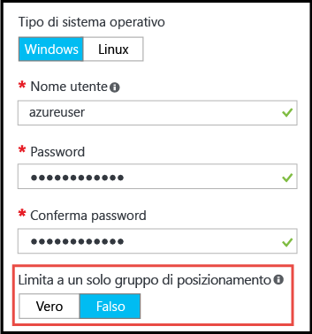

# <a name="working-with-large-virtual-machine-scale-sets"></a>Uso di set di scalabilità di macchine virtuali di grandi dimensioni
È ora possibile creare [set di scalabilità di macchine virtuali](./index.yml) di Azure con capacità fino a 1.000 VM. In questo documento è definito _set di scalabilità di macchine virtuali di grandi dimensioni_ un set di scalabilità ridimensionabile fino a oltre 100 VM. Tale funzionalità è impostata da una proprietà del set di scalabilità ( _singlePlacementGroup=False_ ). 

Nei set di scalabilità di grandi dimensioni, alcuni aspetti, come il bilanciamento del carico e i domini di errore, presentano un comportamento diverso rispetto ai set di scalabilità standard. Questo documento illustra le caratteristiche dei set di scalabilità di grandi dimensioni e offre informazioni utili per usarli correttamente nelle applicazioni. 

Un approccio comune per distribuire un'infrastruttura cloud su larga scala consiste nel creare un set di _unità di scala_ , ad esempio creando più set di scalabilità di macchine virtuali in più reti virtuali e account di archiviazione. Questo approccio offre una gestione più semplice rispetto alle VM singole e la presenza di più unità di scala è utile per numerose applicazioni, in particolare per quelle che richiedono altri componenti organizzabili in stack come più reti virtuali ed endpoint. Se l'applicazione richiede un singolo cluster di grandi dimensioni, tuttavia, può essere più semplice distribuire un singolo set di scalabilità con un massimo di 1.000 VM. Gli scenari di esempio includono distribuzioni centralizzate di Big Data o griglie di calcolo che richiedono una gestione semplice di un esteso pool di nodi di lavoro. In combinazione con i [dischi dati collegati](virtual-machine-scale-sets-attached-disks.md) dei set di scalabilità di macchine virtuali, i set di scalabilità di grandi dimensioni consentono di distribuire un'infrastruttura scalabile costituita da migliaia di vCPU e petabyte di spazio di archiviazione in un'unica operazione.

## <a name="placement-groups"></a>Gruppi di posizionamento 
La caratteristica distintiva di un set di scalabilità _di grandi dimensioni_ non è il numero di VM, ma il numero di _gruppi di posizionamento_ che contiene. Un gruppo di posizionamento è un costrutto simile a un set di disponibilità di Azure, con specifici domini di errore e di aggiornamento. Per impostazione predefinita, un set di scalabilità è costituito da un singolo gruppo di posizionamento con una dimensione massima di 100 VM. Se la proprietà del set di scalabilità denominata _singlePlacementGroup_ è impostata su _false_ , il set può essere costituito da più gruppi di posizionamento con un intervallo da 0 a 1.000 VM. Quando la proprietà è impostata sul valore predefinito _true_ , un set di scalabilità è costituito da un singolo gruppo di posizionamento, con un intervallo da 0 a 100 VM.

## <a name="checklist-for-using-large-scale-sets"></a>Elenco di controllo per l'uso di set di scalabilità di grandi dimensioni
Per stabilire se l'applicazione può usare in modo efficace set di scalabilità di grandi dimensioni, considerare i requisiti seguenti:

- Se si prevede di distribuire un numero elevato di macchine virtuali, potrebbe essere necessario aumentare i limiti di quota delle vCPU di calcolo. 
- I set di scalabilità creati da immagini di Azure Marketplace sono ridimensionabili fino a 1.000 VM.
- I set di scalabilità creati da immagini personalizzate (ossia immagini di macchine virtuali create e caricate dall'utente) sono attualmente ridimensionabili fino a 600 macchine virtuali.
- I set di scalabilità di grandi dimensioni richiedono Azure Managed Disks. Per i set di scalabilità non creati con Managed Disks sono necessari più account di archiviazione (uno ogni 20 VM). I set di scalabilità di grandi dimensioni sono progettati per usare esclusivamente Managed Disks, per ridurre il sovraccarico nella gestione dell'archiviazione ed evitare il rischio di raggiungere i limiti della sottoscrizione per gli account di archiviazione. 
- Large scale (SPG = false) non supporta la rete InfiniBand
- Il bilanciamento del carico di livello 4 con set di scalabilità costituiti da più gruppi di posizionamento richiede lo [SKU Standard di Azure Load Balancer](../load-balancer/load-balancer-overview.md). Lo SKU Standard di Load Balancer offre altri vantaggi, ad esempio la possibilità di bilanciare il carico tra più set di scalabilità. Lo SKU Standard richiede anche che al set di scalabilità sia associato un gruppo di sicurezza di rete. In caso contrario, i pool NAT non funzioneranno correttamente. Se è necessario usare lo SKU Basic di Azure Load Balancer, verificare che il set di scalabilità sia configurato per l'uso di un singolo gruppo di posizionamento, come da impostazione predefinita.
- Il bilanciamento del carico di livello 7 con il gateway applicazione di Azure è supportato per tutti i set di scalabilità.
- Un set di scalabilità è definito con una singola subnet. Verificare che lo spazio indirizzi della subnet sia sufficiente per tutte le VM necessarie. Per impostazione predefinita, un set di scalabilità effettua un provisioning eccessivo (ossia crea VM aggiuntive, per cui non vengono applicati addebiti, in fase di distribuzione o quando si aumenta il numero di istanze) per migliorare l'affidabilità e le prestazioni della distribuzione. Prevedere uno spazio indirizzi superiore del 20% rispetto al numero di VM a cui si intende eseguire il ridimensionamento.
- I domini di errore e di aggiornamento sono coerenti solo all'interno di un gruppo di posizionamento. Questa architettura non modifica la disponibilità generale di un set di scalabilità, perché le VM sono distribuite in modo uniforme su hardware fisico distinto. Se è necessario garantire che due VM risiedano in hardware diverso, tuttavia, verificare che si trovino in domini di errore diversi nello stesso gruppo di posizionamento. Vedere questo collegamento: [Opzioni di disponibilità](../virtual-machines/availability.md). 
- Il dominio di errore e l'ID del gruppo di posizionamento sono riportati nella _visualizzazione dell'istanza_ di una VM del set di scalabilità. La visualizzazione dell'istanza di una VM del set di scalabilità è disponibile in [Esplora risorse di Azure](https://resources.azure.com/).

## <a name="creating-a-large-scale-set"></a>Creazione di un set di scalabilità di grandi dimensioni
Quando si crea un set di scalabilità nel portale di Azure, è sufficiente specificare un *Numero di istanze* fino a 1.000. Se si tratta di un numero di istanze superiore a 100, *Abilita il ridimensionamento oltre 100 istanze* verrà impostato su *Sì* . Sarà quindi possibile ridimensionare il set di scalabilità su più gruppi di selezione host. 



È possibile creare un set di scalabilità di macchine virtuali di grandi dimensioni con il comando [az vmss create](https://github.com/Azure/azure-cli) dell' _interfaccia della riga di comando di Azure_ . Questo comando configura impostazioni predefinite intelligenti, ad esempio dimensioni di subnet basate sull'argomento _instance-count_ :

```azurecli
az group create -l southcentralus -n biginfra
az vmss create -g biginfra -n bigvmss --image ubuntults --instance-count 1000
```

Il comando _vmss create_ imposta valori di configurazione predefiniti se non vengono specificati dall'utente. Per visualizzare le opzioni che possono essere sostituite, provare il comando seguente:

```azurecli
az vmss create --help
```

Se si crea un set di scalabilità di grandi dimensioni componendo un modello di Azure Resource Manager, verificare che il modello crei un set di scalabilità basato su Azure Managed Disks. È possibile impostare la proprietà _singlePlacementGroup_ su _false_ nella sezione _properties_ della risorsa _Microsoft.Compute/virtualMachineScaleSets_ . Il frammento JSON seguente mostra l'inizio di un modello di set di scalabilità, con una capacità di 1.000 VM e l'impostazione _"singlePlacementGroup": false_ :

```json
{
  "type": "Microsoft.Compute/virtualMachineScaleSets",
  "location": "australiaeast",
  "name": "bigvmss",
  "sku": {
    "name": "Standard_DS1_v2",
    "tier": "Standard",
    "capacity": 1000
  },
  "properties": {
    "singlePlacementGroup": false,
    "upgradePolicy": {
      "mode": "Automatic"
    }
```

Per un esempio completo di un modello di set di scalabilità di grandi dimensioni, vedere [https://github.com/gbowerman/azure-myriad/blob/main/bigtest/bigbottle.json](https://github.com/gbowerman/azure-myriad/blob/main/bigtest/bigbottle.json).

## <a name="converting-an-existing-scale-set-to-span-multiple-placement-groups"></a>Conversione di un set di scalabilità esistente per includere più gruppi di posizionamento
Per consentire il ridimensionamento di un set di scalabilità di macchine virtuali esistente a più di 100 macchine virtuali, è necessario modificare la proprietà _singlePlacementGroup_ impostandola su _false_ nel modello di set di scalabilità. È possibile testare la modifica di questa proprietà con [Esplora risorse di Azure](https://resources.azure.com/). Trovare un set di scalabilità esistente, selezionare _Edit_ (Modifica) e modificare la proprietà _singlePlacementGroup_ . Se questa proprietà non è visualizzata, è possibile che si stia visualizzando il set di scalabilità con una versione precedente dell'API Microsoft.Compute.

> [!NOTE]
> È possibile modificare una set di scalabilità passando dal supporto di un singolo gruppo di posizionamento (comportamento predefinito) al supporto di più gruppi di posizionamento, ma non eseguire la conversione inversa. Di conseguenza, prima di effettuare la conversione è importante comprendere le proprietà dei set di scalabilità di grandi dimensioni.
