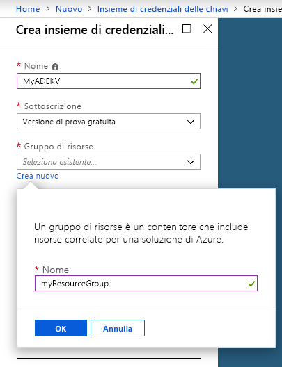
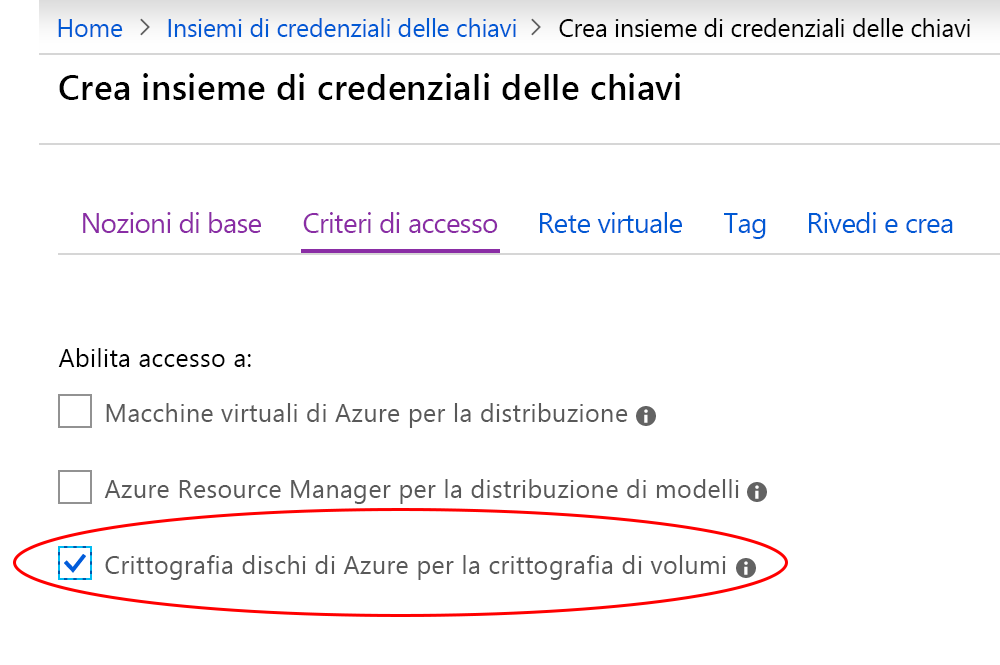
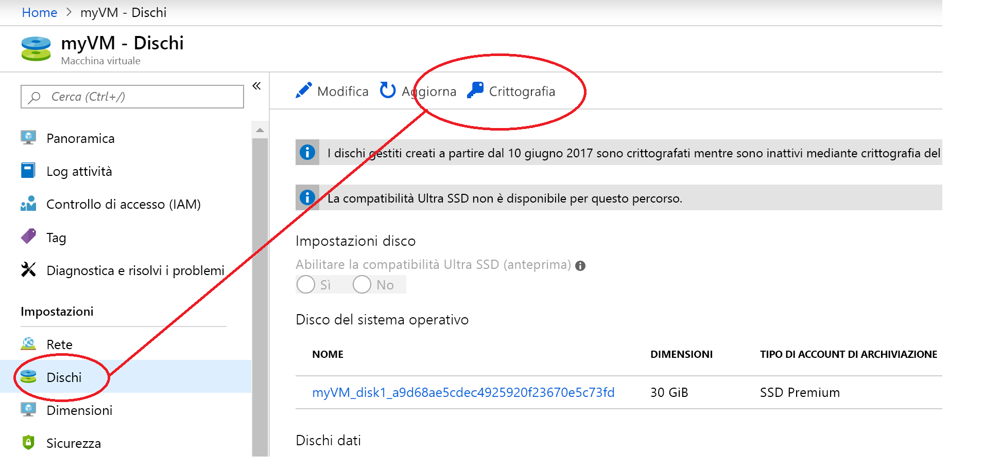
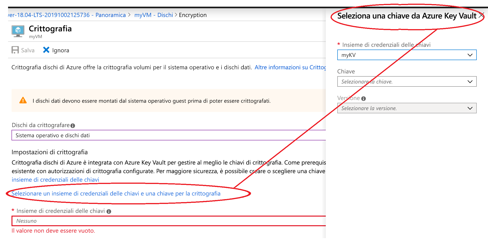

# Guida introduttiva: Creare e crittografare una macchina virtuale con il portale di Azure

È possibile creare macchine virtuali di Azure tramite il portale di Azure. Il portale di Azure è un'interfaccia utente basata su browser per creare le macchine virtuali e le risorse associate. Questo argomento di avvio rapido illustra come usare il portale di Azure per distribuire una macchina virtuale (VM) Linux che esegue Ubuntu 18.04 LTS, creare un insieme di credenziali delle chiavi per l'archiviazione delle chiavi di crittografia e crittografare la VM.

Se non si ha una sottoscrizione di Azure, creare un [account gratuito](https://azure.microsoft.com/free/?WT.mc_id=A261C142F) prima di iniziare.

## Accedere ad Azure

Accedere al [portale di Azure](https://portal.azure.com).

## Creare un insieme di credenziali delle chiavi

1. Selezionare l'opzione **Crea una risorsa** nell'angolo superiore sinistro del portale di Azure
1. Nella casella di ricerca immettere **Key Vault**.
1. Nell'elenco dei risultati scegliere **Key Vault**.
1. Nella sezione Key Vault selezionare **Crea**.
1. Nella schermata **Crea insieme di credenziali delle chiavi** scegliere un nome univoco per il nuovo insieme di credenziali delle chiavi.

    > [!Important]
    > Ogni insieme di credenziali delle chiavi deve avere un nome univoco. L'esempio seguente crea un insieme di credenziali delle chiavi denominato *myADEKV*, ma è necessario assegnare un nome diverso al proprio.

1. Selezionare una **Sottoscrizione**.
1.  In **Gruppo di risorse** selezionare **Crea nuovo**. Nella finestra popup digitare *myResourceGroup* come nome del gruppo di risorse e quindi scegliere **OK**. 

    

1. Nel menu a discesa **Località** scegliere **Stati Uniti orientali**.
1. Lasciare invariati i valori predefiniti delle altre opzioni.
1. Selezionare "Criteri di accesso", che apre una nuova schermata.
1. Selezionare la casella di controllo accanto a "Abilita l'accesso a Crittografia dischi di Azure per la crittografia dei volumi".

    

1. Nella parte inferiore della schermata Criteri di accesso fare clic su "Rivedi e crea".
1. Dopo aver completato la revisione, fare clic su "Crea".

## Creare una macchina virtuale

1. Scegliere **Crea una risorsa** nell'angolo in alto a sinistra del portale di Azure.

1. Nella pagina Nuovo, in Più comuni, selezionare **Ubuntu Server 18.04 LTS**.
1. Nella scheda **Informazioni di base**, in **Dettagli progetto**, verificare che sia selezionata la sottoscrizione corretta.
1. Per **Gruppo di risorse** selezionare il gruppo di risorse creato in precedenza durante la creazione dell'insieme di credenziali delle chiavi, ad esempio **myResourceGroup**
1. Per **Nome macchina virtuale** immettere *MyVM* e scegliere 
1. Per **Area** selezionare la stessa area usata in precedenza durante la creazione dell'insieme di credenziali delle chiavi, ad esempio **Stati Uniti orientali**.
1. Assicurarsi che l'opzione **Dimensioni** sia impostata su *D2s Standard v3*.
1. In **Account amministratore** selezionare **Password**. Immettere un nome utente e una password.
    
1. Selezionare la scheda "Gestione" e verificare di avere un account di archiviazione di diagnostica. Se non si ha tale account, selezionare "Crea nuovo", specificare il nome del nuovo account e fare clic su "OK" 
1. Fare clic su "Rivedi e crea".
1. Nella pagina **Crea macchina virtuale** è possibile visualizzare i dettagli sulla macchina virtuale che si sta creando. Quando si è pronti, selezionare **Crea**.

La distribuzione della macchina virtuale richiederà alcuni minuti. Al termine della distribuzione, passare alla sezione successiva.

## Crittografare la macchina virtuale

1. Una volta completata la distribuzione della VM, selezionare **Vai alla risorsa**.
1. Sulla barra laterale sinistra selezionare **Dischi**.
1. Nella schermata Dischi selezionare **Crittografia**. 

    

1. Nella schermata Crittografia, in **Disks to encrypt** (Dischi da crittografare) scegliere **Dischi dati e sistema operativo**.
1. In **Impostazioni di crittografia** fare clic su "Selezionare l'insieme di credenziali delle chiavi e la chiave per la crittografia".
1. Sulla barra laterale destra selezionare il nome dell'insieme di credenziali delle chiavi creato in precedenza come valore per **Insieme di credenziali delle chiavi**, quindi fare clic su **Seleziona**.

    
1. Nella parte superiore della schermata Crittografia fare clic su "Salva". Viene visualizzato un avviso popup che informa che la VM verrà riavviata. Fare clic su **Sì**.

## Pulire le risorse

Quando non serve più, è possibile eliminare il gruppo di risorse, la macchina virtuale e tutte le risorse correlate. A tale scopo, selezionare il gruppo di risorse per la macchina virtuale, selezionare Elimina e quindi confermare il nome del gruppo di risorse da eliminare.

## Passaggi successivi

In questo argomento di avvio rapido è stato creato un insieme di credenziali delle chiavi abilitato per le chiavi di crittografia, quindi è stata creata una macchina virtuale che è stata abilitata per la crittografia.  

> [!div class="nextstepaction"]
> [Informazioni su Crittografia dischi di Azure](disk-encryption-overview.md)
