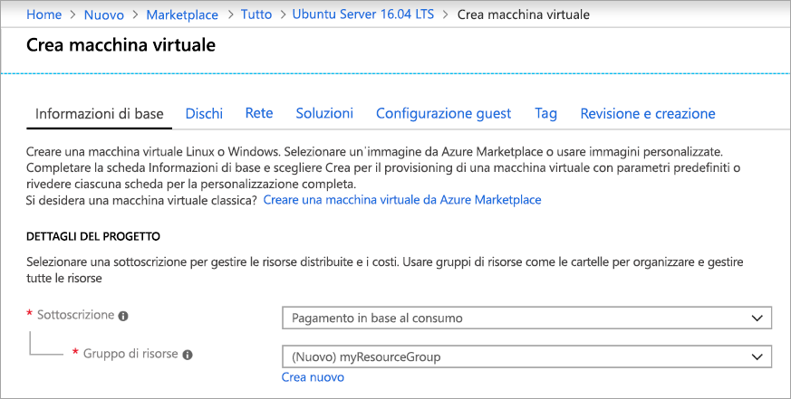
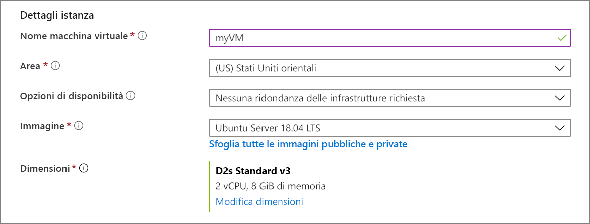
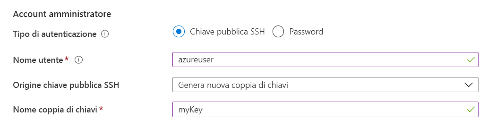
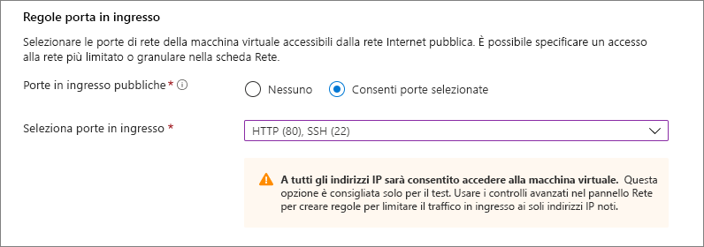

# <a name="quickstart-create-a-linux-virtual-machine-in-the-azure-portal"></a>Guida introduttiva: Creare una macchina virtuale Linux nel portale di Azure

È possibile creare macchine virtuali di Azure tramite il portale di Azure. Il portale di Azure è un'interfaccia utente basata su browser per la creazione di risorse di Azure. Questa guida di avvio rapido illustra come usare il portale di Azure per distribuire una macchina virtuale Linux che esegue Ubuntu 18.04 LTS. Per vedere la macchina virtuale in azione, si stabilisce anche una connessione SSH alla macchina virtuale e si installa il server Web NGINX.

Se non si ha una sottoscrizione di Azure, creare un [account gratuito](https://azure.microsoft.com/free/?WT.mc_id=A261C142F) prima di iniziare.

## <a name="create-ssh-key-pair"></a>Creare una coppia di chiavi SSH

Per completare questa guida introduttiva è necessaria una coppia di chiavi SSH. Se si ha già una coppia di chiavi SSH, ignorare questo passaggio.

Aprire una shell Bash e usare [ssh-keygen](https://www.ssh.com/ssh/keygen/) per creare una coppia di chiavi SSH. Se non si dispone di una shell Bash nel computer locale, è possibile usare [Azure Cloud Shell](https://shell.azure.com/bash).


1. Accedere al [portale di Azure](https://portal.azure.com).
1. Nel menu nella parte superiore della pagina selezionare l'icona `>_` per aprire Cloud Shell.
1. Assicurarsi che in alto a sinistra in Cloud Shell sia visualizzato **Bash**. Se è visualizzato PowerShell, usare l'elenco a discesa per selezionare **Bash** e scegliere **Conferma** per passare alla shell Bash.
1. Digitare `ssh-keygen -t rsa -b 2048` per creare la chiave SSH. 
1. Verrà richiesto di immettere un file in cui salvare la coppia di chiavi. Premere **INVIO** per salvare nel percorso predefinito, indicato tra parentesi quadre. 
1. Verrà chiesto di immettere una passphrase. È possibile digitare una passphrase per la chiave SSH o premere **INVIO** per continuare senza una passphrase.
1. Il comando `ssh-keygen` genera chiavi pubbliche e private con il nome predefinito `id_rsa` in `~/.ssh directory`. Il comando restituisce il percorso completo della chiave pubblica. Usare il percorso della chiave pubblica per visualizzarne il contenuto con `cat` digitando `cat ~/.ssh/id_rsa.pub`.
1. Copiare l'output di questo comando e salvarlo in un'altra posizione per usarlo più avanti in questo articolo. Si tratta della chiave pubblica che sarà necessaria durante la configurazione dell'account amministratore per accedere alla macchina virtuale.

## <a name="sign-in-to-azure"></a>Accedere ad Azure

Accedere al [portale di Azure](https://portal.azure.com), se questa operazione non è già stata eseguita.

## <a name="create-virtual-machine"></a>Crea macchina virtuale

1. Digitare **macchine virtuali** nella casella di ricerca.
1. In **Servizi** selezionare **Macchine virtuali**.
1. Nella pagina **Macchine virtuali** selezionare **Aggiungi**. Viene visualizzata la pagina **Creare una macchina virtuale**.
1. Nella scheda **Nozioni di base**, sotto **Dettagli progetto**, verificare che sia selezionata la sottoscrizione corretta e quindi scegliere **Crea nuovo** gruppo di risorse. Digitare *myResourceGroup* come nome.*. 

    

1. In **Dettagli istanza** digitare *myVM* nel campo **Nome macchina virtuale**, scegliere *Stati Uniti orientali* come valore per il campo **Area** e quindi scegliere *Ubuntu 18.04 LTS* per il campo **Immagine**. Lasciare invariate le altre impostazioni predefinite.

    

1. In **Account amministratore** selezionare **Chiave pubblica SSH**, digitare il nome utente e quindi incollare la chiave pubblica. Rimuovere gli eventuali spazi iniziali o finali nella chiave pubblica.

    

1. Sotto **Regole porta in ingresso** > **Porte in ingresso pubbliche**, scegliere **Consentire porte selezionate**, quindi selezionare **SSH (22)** e **HTTP (80)** dall'elenco a discesa. 

    

1. Lasciare invariate le impostazioni predefinite rimanenti, quindi selezionare il pulsante **Rivedi + Crea** nella parte inferiore della pagina.

1. Nella pagina **Crea macchina virtuale** è possibile visualizzare i dettagli sulla macchina virtuale che si sta creando. Quando si è pronti, selezionare **Crea**.

La distribuzione della macchina virtuale richiederà alcuni minuti. Al termine della distribuzione, passare alla sezione successiva.

    
## <a name="connect-to-virtual-machine"></a>Connettersi alla macchina virtuale

Creare una connessione SSH con la macchina virtuale.

1. Selezionare il pulsante **Connetti** nella pagina di panoramica per la macchina virtuale. 

    

2. Nella pagina **Connetti a macchina virtuale** mantenere le opzioni predefinite per la connessione tramite indirizzo IP sulla porta 22. In **Accedi con l'account locale della macchina virtuale** viene visualizzato un comando di connessione. Fare clic sul pulsante per copiare il comando. Di seguito è mostrato un esempio di comando di connessione SSH:

    ```bash
    ssh azureuser@10.111.12.123
    ```

3. Con la stessa shell Bash usata per creare la coppia di chiavi SSH (è possibile riaprire Cloud Shell selezionando di nuovo `>_` o passando a https://shell.azure.com/bash), incollare il comando di connessione SSH nella shell per creare una sessione SSH.

## <a name="install-web-server"></a>Installare il server Web

Per visualizzare la macchina virtuale in azione, installare il server Web NGINX. Dalla sessione SSH, aggiornare le origini dei pacchetti e quindi installare il pacchetto NGINX più recente.

```bash
sudo apt-get -y update
sudo apt-get -y install nginx
```

Al termine, digitare `exit` per uscire dalla sessione SSH.


## <a name="view-the-web-server-in-action"></a>Visualizzare il server Web in azione

Usare il Web browser che si preferisce per vedere la pagina iniziale di NGINX predefinita. Digitare l'indirizzo IP pubblico della macchina virtuale come indirizzo Web. L'indirizzo IP pubblico è reperibile nella pagina di panoramica della macchina virtuale o come parte della stringa di connessione SSH usata in precedenza.


## <a name="clean-up-resources"></a>Pulire le risorse

Quando non serve più, è possibile eliminare il gruppo di risorse, la macchina virtuale e tutte le risorse correlate. A tale scopo, selezionare il gruppo di risorse per la macchina virtuale, selezionare **Elimina** e quindi confermare il nome del gruppo di risorse da eliminare.

## <a name="next-steps"></a>Passaggi successivi

In questa guida introduttiva è stata distribuita una macchina virtuale semplice, sono stati creati un gruppo di sicurezza di rete e una regola ed è stato installato un server Web. Per altre informazioni sulle macchine virtuali di Azure, passare all'esercitazione per le VM di Linux.

> [!div class="nextstepaction"]
> [Esercitazioni per le macchine virtuali di Linux in Azure](./tutorial-manage-vm.md)
